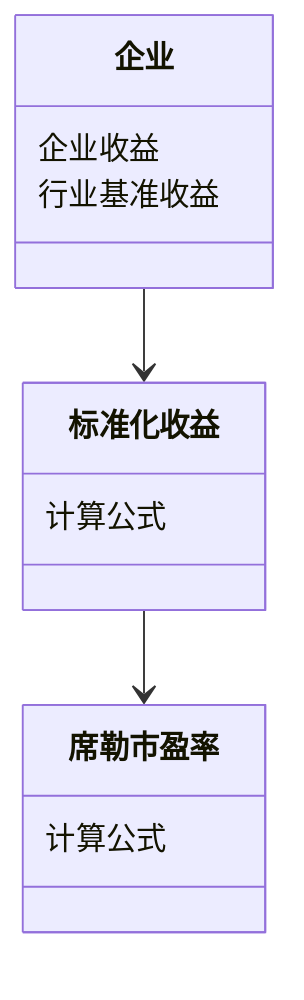

                 


# 席勒市盈率:从标准化收益角度衡量市场估值

## 关键词：席勒市盈率, 市场估值, 标准化收益, 市场分析, 估值模型

## 摘要：  
席勒市盈率是一种基于标准化收益的市场估值指标，通过调整传统市盈率的局限性，提供了更准确的市场估值方法。本文从标准化收益的概念出发，详细分析了席勒市盈率的理论基础、算法原理、系统架构设计以及实际项目中的应用，最后总结了最佳实践和未来研究方向。

---

# 第一部分: 席勒市盈率的背景与核心概念

## 第1章: 席勒市盈率的背景与问题背景

### 1.1 传统市盈率的局限性

#### 1.1.1 市盈率的基本概念  
市盈率（Price-to-Earnings Ratio, P/E Ratio）是衡量股票价值的重要指标，计算公式为：$$市盈率 = \frac{股票价格}{每股净利润}$$  
市盈率反映了投资者对股票的支付意愿，但其局限性在于未考虑企业收益的可持续性和可比性。

#### 1.1.2 传统市盈率的局限性  
传统市盈率的计算基于企业历史净利润，存在以下问题：  
1. **净利润的波动性**：企业净利润受到周期性因素影响，无法准确反映企业的长期价值。  
2. **可比性不足**：不同行业的企业净利润可能存在不可比性，影响横向比较。  
3. **未考虑未来收益**：市盈率仅反映过去的表现，未充分考虑企业的未来盈利能力。

#### 1.1.3 标准化收益衡量的必要性  
为了克服传统市盈率的局限性，引入标准化收益的概念。标准化收益是指将企业收益调整为可比的、稳定的指标，以便更准确地衡量市场估值。

### 1.2 市场估值的核心问题

#### 1.2.1 市场估值的基本概念  
市场估值是通过对企业的财务数据和市场表现进行分析，评估企业的内在价值。常用的估值指标包括市盈率、市净率等。

#### 1.2.2 传统市盈率的不足  
传统市盈率的不足之处在于：  
1. 未考虑企业的未来盈利能力。  
2. 未标准化的收益可能影响可比性。  
3. 无法准确反映市场的整体估值水平。

#### 1.2.3 标准化收益与市场估值的关系  
标准化收益通过调整企业收益，使其更符合市场估值的需求。席勒市盈率正是基于标准化收益的概念，提供了一种更准确的市场估值方法。

## 第2章: 席勒市盈率的核心概念

### 2.1 标准化收益的定义

#### 2.1.1 收益标准化的必要性  
标准化收益的定义是：将企业的收益调整为可比、稳定的指标，以便更准确地反映企业的价值。  

#### 2.1.2 标准化收益的计算方法  
标准化收益的计算公式为：  
$$标准化收益 = \frac{企业收益}{行业基准收益}$$  
其中，行业基准收益可以通过行业平均净利润率或行业平均收益水平确定。

#### 2.1.3 标准化收益与企业价值的关系  
标准化收益与企业价值呈正相关关系，即收益越高，企业价值越大。  

### 2.2 席勒市盈率的定义与特点

#### 2.2.1 席勒市盈率的定义  
席勒市盈率（Shiller P/E Ratio）是基于标准化收益的市场估值指标，计算公式为：  
$$席勒市盈率 = \frac{股票价格}{标准化收益}$$  

#### 2.2.2 席勒市盈率的核心要素  
1. **股票价格**：企业的市场价值。  
2. **标准化收益**：企业的调整后收益。  

#### 2.2.3 席勒市盈率与传统市盈率的对比  
| 对比维度 | 传统市盈率 | 席勒市盈率 |  
|----------|------------|------------|  
| 计算基础 | 净利润     | 标准化收益 |  
| 优势     | 简单易懂   | 更准确     |  
| 局限性   | 波动性大    | 计算复杂    |  

### 2.3 标准化收益与市场估值的关系

#### 2.3.1 标准化收益对市场估值的影响  
标准化收益直接影响席勒市盈率的计算，从而影响市场估值的准确性。  

#### 2.3.2 市场估值的核心驱动因素  
1. **企业收益**：企业的盈利能力是市场估值的核心驱动因素。  
2. **市场情绪**：投资者情绪会影响短期市场估值。  

#### 2.3.3 标准化收益的市场应用价值  
标准化收益的应用使市场估值更加准确，尤其是在行业比较和长期投资决策中具有重要意义。

---

## 第3章: 席勒市盈率的理论基础

### 3.1 收益标准化的数学模型

#### 3.1.1 收益标准化的基本公式  
标准化收益的计算公式为：  
$$标准化收益 = \frac{企业收益}{行业基准收益}$$  

#### 3.1.2 标准化收益的计算公式  
$$标准化收益 = \frac{企业收益}{行业平均收益}$$  

#### 3.1.3 标准化收益的数学性质  
标准化收益是一个无量纲的指标，其值越接近1，企业的收益越接近行业平均水平。  

### 3.2 席勒市盈率的数学推导

#### 3.2.1 席勒市盈率的公式推导  
席勒市盈率的计算公式为：  
$$席勒市盈率 = \frac{股票价格}{标准化收益}$$  
其中，标准化收益的计算公式为：  
$$标准化收益 = \frac{企业收益}{行业基准收益}$$  

#### 3.2.2 席勒市盈率的数学特性  
1. 席勒市盈率是一个无量纲的指标，其值越小，企业的市场估值越低。  
2. 席勒市盈率与股票价格呈正相关关系。  

#### 3.2.3 席勒市盈率与市场估值的关系  
席勒市盈率是市场估值的重要指标，其值越低，企业的市场估值越高。  

### 3.3 标准化收益与市场估值的对比分析

#### 3.3.1 标准化收益的对比分析  
| 对比维度 | 传统收益 | 标准化收益 |  
|----------|-----------|------------|  
| 计算基础 | 净利润     | 行业基准收益 |  
| 优势     | 简单易懂   | 更准确     |  
| 局限性   | 波动性大    | 计算复杂    |  

#### 3.3.2 市场估值的对比分析  
| 对比维度 | 传统市盈率 | 席勒市盈率 |  
|----------|------------|------------|  
| 计算基础 | 净利润     | 标准化收益 |  
| 优势     | 简单易懂   | 更准确     |  
| 局限性   | 波动性大    | 计算复杂    |  

---

## 第4章: 席勒市盈率的系统分析与架构设计

### 4.1 问题场景介绍

#### 4.1.1 问题场景描述  
假设我们有一个包含多个企业的数据集，需要计算企业的标准化收益和席勒市盈率，以评估企业的市场估值。  

#### 4.1.2 项目介绍  
本项目旨在通过计算席勒市盈率，提供更准确的市场估值方法。  

### 4.2 系统功能设计

#### 4.2.1 领域模型设计  


#### 4.2.2 系统架构设计  


### 4.3 系统架构设计

#### 4.3.1 系统架构设计  


#### 4.3.2 接口设计  
- 输入接口：企业收益、行业基准收益  
- 输出接口：标准化收益、席勒市盈率  

#### 4.3.3 交互设计  
```mermaid
sequenceDiagram
    actor 用户
    节点 系统
    用户 -> 系统: 输入企业收益
    用户 -> 系统: 输入行业基准收益
    系统 -> 标准化收益计算模块: 计算标准化收益
    标准化收益计算模块 -> 席勒市盈率计算模块: 计算席勒市盈率
    系统 -> 用户: 输出席勒市盈率
```

### 4.4 项目实战

#### 4.4.1 环境安装  
- 需要安装Python、numpy、pandas等库。  

#### 4.4.2 核心代码实现  
```python
import numpy as np
import pandas as pd

def calculate_standardized_yield(enterprise_yield, industry Benchmark_yield):
    return enterprise_yield / industry_Benchmark_yield

def calculate_shiller_pe_ratio(stock_price, standardized_yield):
    return stock_price / standardized_yield
```

#### 4.4.3 代码解读与分析  
1. `calculate_standardized_yield`函数：计算标准化收益。  
2. `calculate_shiller_pe_ratio`函数：计算席勒市盈率。  

#### 4.4.4 实际案例分析  
假设某企业收益为100，行业基准收益为80，股票价格为100。  
标准化收益为：100 / 80 = 1.25  
席勒市盈率为：100 / 1.25 = 80  

---

## 第5章: 席勒市盈率的最佳实践

### 5.1 最佳实践 Tips

#### 5.1.1 数据质量的重要性  
确保企业收益和行业基准收益的数据质量，以提高计算结果的准确性。  

#### 5.1.2 时间周期的选择  
建议选择较长的时间周期，以减少短期波动的影响。  

#### 5.1.3 行业基准的选择  
选择与企业业务模式相似的行业基准，以提高可比性。  

### 5.2 小结  
席勒市盈率是一种基于标准化收益的市场估值指标，通过调整传统市盈率的局限性，提供了更准确的市场估值方法。  

### 5.3 注意事项  
1. 数据来源的可靠性。  
2. 计算公式的适用性。  

### 5.4 拓展阅读  
1. 市场估值的其他指标，如市净率、市销率等。  
2. 标准化收益的其他应用领域。  

---

## 作者：AI天才研究院/AI Genius Institute & 禅与计算机程序设计艺术 /Zen And The Art of Computer Programming

