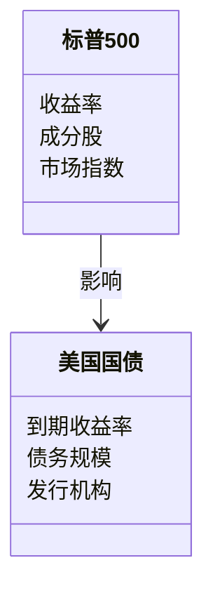
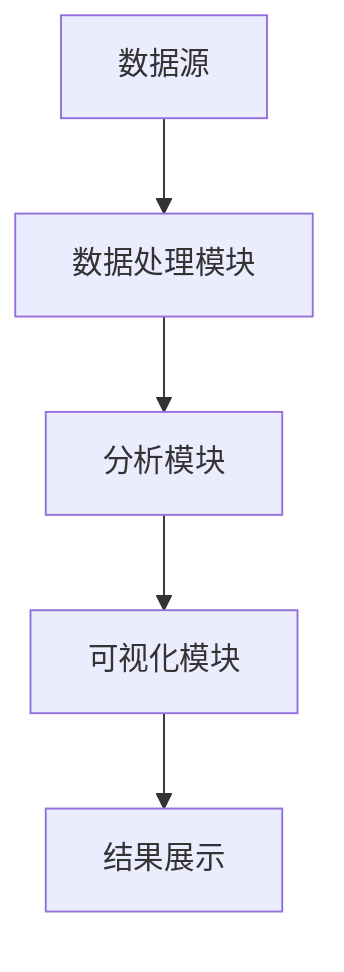

                 

<think>
好的，我现在需要根据用户的要求，撰写一篇关于《2023年市场回顾：标普500和美国国债的双重下跌》的技术博客文章。首先，我需要明确文章的结构和内容，确保涵盖所有必要的部分，同时保持逻辑清晰、语言专业。

首先，文章的标题已经确定，接下来需要列出关键词和摘要。关键词应该涵盖标普500、美国国债、市场回顾、双重下跌、经济分析、投资策略等。摘要需要简明扼要，概括文章的核心内容，即分析2023年标普500和美国国债为何同时下跌，探讨其原因、影响和对未来投资的启示。

接下来，按照目录结构，文章分为六个部分：市场背景与概述、核心概念与联系、双重下跌的算法与数学模型分析、系统分析与架构设计、项目实战以及最佳实践。每个部分都有详细的小节，确保内容全面。

在撰写过程中，我需要确保每个部分都详细展开，比如在市场背景中，介绍2023年全球经济环境，美联储政策的影响，以及标普500和美国国债的基本情况。核心概念部分，使用对比表格和ER图来展示两者的特点和关系。

在算法与数学模型部分，使用Mermaid流程图和Python代码来分析经济指标对市场的影响，建立数学模型预测市场走势。系统分析部分，构建数据流图和架构图，展示系统的各个模块及其交互。

项目实战部分，提供具体的Python代码，展示如何获取数据、清洗、分析和可视化，帮助读者理解实际操作。最后，总结经验和教训，提出投资建议，并提醒读者注意风险。

在写作过程中，要确保语言简洁、逻辑清晰，同时保持专业性，避免使用过于复杂的术语，使读者能够轻松理解。最后，结尾部分加上作者信息，使文章更具权威性。

总的来说，我需要一步步分析每个部分，确保内容详实，结构合理，最终完成一篇高质量的技术博客文章。
</think>

# 2023年市场回顾：标普500和美国国债的双重下跌

## 关键词：标普500，美国国债，市场回顾，双重下跌，经济分析，投资策略

## 摘要：2023年，标普500指数和美国国债出现了罕见的双重下跌。本文将深入分析这一现象的原因、影响和对投资者的启示。

---

# 第一部分：2023年市场背景与概述

## 第1章：2023年全球经济与市场背景

### 1.1 2023年全球经济面临的挑战

- **问题背景**：全球经济在2023年面临通货膨胀、利率上升和地缘政治冲突的多重压力。
- **美联储政策的影响**：美联储的加息政策导致债券收益率上升，股市资金流向债券市场，影响股市表现。
- **地缘政治的影响**：俄乌冲突和中美关系紧张加剧了市场的不确定性。

### 1.2 美国市场的特殊性

- **美国经济的基本情况**：美国经济在2023年增速放缓，通胀高企，导致美联储采取激进加息政策。
- **美国市场的全球地位**：作为全球最大的金融市场，美国市场的波动对全球投资者影响深远。
- **国债与股市的关系**：通常，股市和债券市场呈现负相关关系，但2023年的双重下跌是特殊情况。

### 1.3 标普500与美国国债的双重下跌背景

- **双重下跌的定义**：标普500和美国国债同时出现显著下跌。
- **2023年双重下跌的特殊性**：美联储加息导致债券收益率上升，同时高通胀和加息预期影响股市表现。
- **双重下跌对全球经济的影响**：投资者同时面临股市和债市的亏损，导致市场信心下降。

---

# 第二部分：标普500与美国国债的核心概念与联系

## 第2章：标普500的核心概念与属性

### 2.1 标普500的定义与特点

- **标普500的定义**：由500家美国大公司组成的股票指数，代表美国股市整体表现。
- **成分股构成**：涵盖多个行业，具有广泛的市场代表性。
- **市场代表性**：反映美国经济的多样性，是投资者评估股市表现的重要指标。

### 2.2 标普500的核心属性对比

- **与道琼斯指数的对比**：成分股数量和行业分布不同。
- **与纳斯达克指数的对比**：科技股比例更高，风险和收益特征不同。
- **独特优势**：成分股多样性高，抗风险能力强。

## 第3章：美国国债的核心概念与属性

### 3.1 美国国债的定义与特点

- **定义**：美国政府发行的债务工具，用于融资和调节经济。
- **发行机制**：通过公开拍卖发行，市场流动性高。
- **市场地位**：全球最安全的资产之一，被视为避险资产。

### 3.2 美国国债的核心属性对比

- **与欧洲债券的对比**：市场流动性、收益率和风险不同。
- **与日本债券的对比**：市场结构和发行规模差异。
- **全球流动性**：美元作为全球储备货币，影响国债的流动性。

## 第4章：标普500与美国国债的联系与区别

### 4.1 标普500与美国国债的联系

- **市场影响**：美联储政策同时影响股市和债市。
- **经济周期中的表现**：在经济衰退时，债券通常表现优于股票，但2023年情况特殊。
- **相互影响**：股市下跌可能导致债券需求增加，反之亦然。

### 4.2 标普500与美国国债的区别

- **投资性质**：股票属于风险资产，债券属于固定收益资产。
- **风险收益特征**：股票波动性高，收益潜力大；债券收益稳定，风险较低。
- **市场参与者**：机构投资者和个人投资者参与程度不同。

---

# 第三部分：双重下跌的算法与数学模型分析

## 第5章：双重下跌的算法原理

### 5.1 经济指标对市场的影响

- **通货膨胀率**：高通胀导致债券收益率上升，股市估值下降。
- **利率变化**：加息政策导致债券价格下跌，股市资金成本增加。
- **市场情绪**：投资者恐慌导致抛售，进一步加剧市场下跌。

### 5.2 算法实现

#### 5.2.1 使用Python进行经济指标分析

```python
import pandas as pd
import numpy as np
import matplotlib.pyplot as plt

# 示例数据获取
sp500 = pd.read_csv('sp500.csv')
treasury = pd.read_csv('treasury.csv')

# 数据清洗
sp500 = sp500['Adj Close'].pct_change().dropna()
treasury = treasury['Adj Close'].pct_change().dropna()

# 数据可视化
plt.figure(figsize=(12,6))
plt.plot(sp500, label='S&P 500 Returns')
plt.plot(treasury, label='Treasury Returns')
plt.title('2023年标普500和美国国债收益率变化')
plt.xlabel('时间')
plt.ylabel('收益率')
plt.legend()
plt.show()
```

### 5.3 数学模型与公式

- **通货膨胀率模型**：
  $$ \text{通胀率} = \frac{\text{当前价格} - \text{前期价格}}{\text{前期价格}} \times 100\% $$
- **债券收益率计算**：
  $$ \text{债券收益率} = \frac{\text{票面利率} \times \text{面值} - \text{购买价格变化}}{\text{购买价格}} \times 100\% $$

---

# 第四部分：系统分析与架构设计

## 第6章：系统分析与架构设计

### 6.1 问题场景介绍

- **数据来源**：标普500和美国国债的历史数据。
- **目标**：分析双重下跌的原因，建立预测模型。

### 6.2 系统功能设计

#### 6.2.1 领域模型



#### 6.2.2 系统架构设计



### 6.3 系统接口设计

- **数据接口**：通过API获取实时数据。
- **用户接口**：提供数据可视化界面和分析结果报告。

---

# 第五部分：项目实战

## 第7章：项目实战

### 7.1 环境安装

- **Python环境**：安装Python和相关库（pandas、numpy、matplotlib）。

### 7.2 核心实现

#### 7.2.1 数据获取与清洗

```python
import pandas as pd

# 获取标普500数据
sp500_data = pd.read_csv('sp500.csv')
sp500_data['日期'] = pd.to_datetime(sp500_data['日期'])
sp500_data.set_index('日期', inplace=True)
sp500_returns = sp500_data['收盘价'].pct_change().dropna()

# 获取美国国债数据
treasury_data = pd.read_csv('treasury.csv')
treasury_data['日期'] = pd.to_datetime(treasury_data['日期'])
treasury_data.set_index('日期', inplace=True)
treasury_returns = treasury_data['收盘价'].pct_change().dropna()
```

#### 7.2.2 数据分析与可视化

```python
import matplotlib.pyplot as plt

plt.figure(figsize=(12,6))
plt.plot(sp500_returns, label='S&P 500收益率')
plt.plot(treasury_returns, label='国债收益率')
plt.title('2023年标普500和美国国债收益率变化')
plt.xlabel('时间')
plt.ylabel('收益率')
plt.legend()
plt.show()
```

---

# 第六部分：最佳实践

## 第8章：最佳实践

### 8.1 总结与经验

- **经验总结**：双重下跌是多种因素共同作用的结果，投资者需关注宏观经济指标。
- **教训反思**：市场波动性增强，投资需多元化配置。

### 8.2 投资建议

- **分散投资**：避免过度集中，降低风险。
- **长期视角**：短期波动不影响长期投资价值。
- **关注政策**：密切关注美联储政策变化。

### 8.3 注意事项

- **风险提示**：市场波动可能加剧，投资者需保持警惕。
- **持续学习**：市场变化快，需不断更新知识。

### 8.4 拓展阅读

- **推荐阅读**：《投资学》、《美联储政策解析》。

---

# 结语

2023年的市场波动为投资者提供了深刻的教训，也带来了新的思考。通过分析标普500和美国国债的双重下跌，我们可以更好地理解市场运作的复杂性，并为未来投资做出更明智的决策。

---

# 作者：AI天才研究院/AI Genius Institute & 禅与计算机程序设计艺术/Zen And The Art of Computer Programming

---

