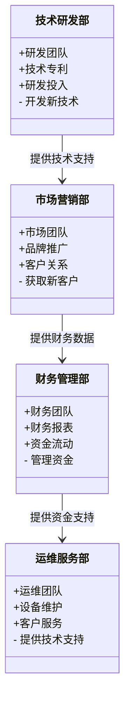
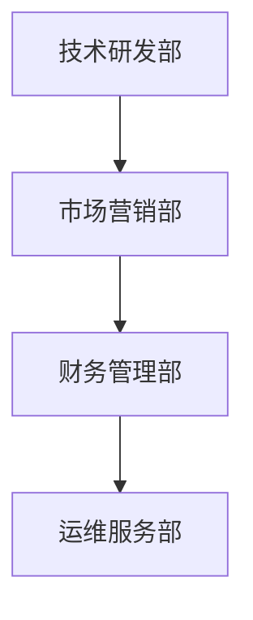
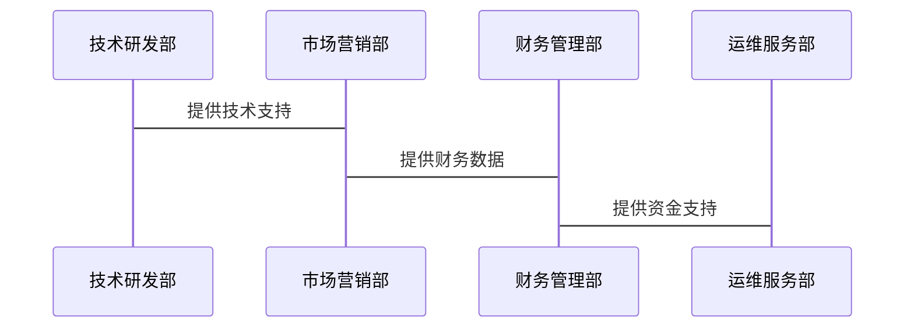

                 


# 废弃物管理技术公司的投资价值分析

## 关键词：废弃物管理，投资价值，技术分析，财务模型，投资策略

## 摘要：本文系统分析废弃物管理技术公司的投资价值，涵盖背景、技术、市场、财务等多个维度，构建分析框架，探讨估值方法，并通过案例分析提供投资策略和风险管理建议。

## 第一部分: 废弃物管理技术公司的背景与现状

### 第1章: 废弃物管理技术公司的背景与现状

#### 1.1 废弃物管理的背景与问题背景

##### 1.1.1 废弃物管理的现状与挑战

随着全球工业化和城市化的快速发展，废弃物产生量急剧增加，带来环境压力和资源浪费问题。传统填埋和焚烧方式存在环境污染和资源浪费，亟需技术创新。废弃物管理技术通过资源化利用，减少环境负担，提高资源效率，成为可持续发展的关键。

##### 1.1.2 废弃物管理技术的发展历程

废弃物管理技术从简单的填埋和焚烧发展到现代的分类回收、再生利用和智能处理。近年来，人工智能、物联网和大数据技术的应用推动了废弃物管理的智能化和高效化。

##### 1.1.3 废弃物管理技术与投资价值的关系

废弃物管理技术通过提高资源回收率和降低成本，直接影响公司的盈利能力。技术先进性和市场扩展能力是影响投资价值的重要因素。

#### 1.2 废弃物管理技术公司的定义与特点

##### 1.2.1 废弃物管理技术公司的定义

专注于废弃物处理、回收和资源化的企业，涵盖技术研发、设备制造和系统服务。

##### 1.2.2 废弃物管理技术的核心技术与模式

核心技术包括分类技术、回收技术、再生技术和智能处理技术。业务模式包括设备销售、服务订阅和技术授权。

##### 1.2.3 废弃物管理技术公司的市场定位与竞争优势

定位为环保科技企业，竞争优势在于技术创新、成本优势和市场扩展能力。

### 第2章: 废弃物管理技术公司的核心概念与联系

#### 2.1 废弃物管理技术的核心概念

##### 2.1.1 废弃物管理技术的定义与分类

定义：将废弃物转化为资源或无害物质的技术。分类：物理处理、化学处理、生物处理和智能处理。

##### 2.1.2 废弃物管理技术的核心原理与实现机制

通过分类、回收、加工和再利用，实现资源最大化利用。智能技术的应用提高了处理效率和资源利用率。

##### 2.1.3 废弃物管理技术的关键技术与创新点

关键技术包括AI识别、物联网监控和大数据分析。创新点在于智能化、高效化和资源化。

#### 2.2 废弃物管理技术与投资价值的联系

##### 2.2.1 废弃物管理技术对投资价值的影响

先进技术提升处理效率和资源回收率，增强公司的盈利能力。技术创新和市场扩展能力是投资价值的关键驱动因素。

##### 2.2.2 废弃物管理技术与投资回报的关系

高效技术降低处理成本，提升收益。市场需求增长和政策支持增加投资回报潜力。

##### 2.2.3 废弃物管理技术在投资决策中的作用

技术评估是投资决策的核心，影响公司的竞争优势和市场地位。

### 第3章: 废弃物管理技术公司的分析框架

#### 3.1 废弃物管理技术的分析维度

##### 3.1.1 技术层面的分析维度

技术先进性：处理效率和资源回收率。技术成熟度：商业化应用能力。技术扩展性：适应不同废弃物类型的能力。

##### 3.1.2 市场层面的分析维度

市场需求：行业规模和增长潜力。竞争格局：主要竞争者和市场占有率。政策环境：政府支持和环保法规。

##### 3.1.3 财务层面的分析维度

收入与成本：业务模式和成本结构。利润与现金流：盈利能力分析。资产与负债：财务健康状况。

#### 3.2 废弃物管理技术的分析流程

##### 3.2.1 分析目标的确定

明确分析目标，如评估技术可行性和市场潜力。

##### 3.2.2 数据收集与整理

收集技术参数、市场数据和财务数据，建立分析数据库。

##### 3.2.3 分析模型的构建与应用

构建技术评估模型和财务模型，评估公司价值。

##### 3.2.4 分析结果的验证与优化

通过实际案例验证模型准确性，不断优化分析框架。

### 第4章: 废弃物管理技术公司的财务分析与估值

#### 4.1 废弃物管理技术公司的财务分析

##### 4.1.1 收入与成本分析

收入来源：设备销售、服务订阅。成本结构：研发投入、设备制造和运维成本。

##### 4.1.2 利润与现金流分析

利润构成：销售收入减去成本和费用。现金流：经营活动、投资活动和筹资活动现金流。

##### 4.1.3 资产与负债分析

资产构成：流动资产和固定资产。负债情况：短期和长期负债。

#### 4.2 废弃物管理技术公司的估值方法

##### 4.2.1 市盈率法

$$ P/E = \frac{\text{股价}}{\text{每股收益}} $$

##### 4.2.2 市净率法

$$ P/B = \frac{\text{股价}}{\text{每股净资产}} $$

##### 4.2.3 现金流贴现法（DCF模型）

$$ V = \sum_{t=1}^{n} \frac{CF_t}{(1 + r)^t} + \frac{TV}{(1 + r)^n} $$

### 第5章: 废弃物管理技术公司的投资策略与风险管理

#### 5.1 废弃物管理技术公司的投资策略

##### 5.1.1 投资目标的确定

根据市场趋势和公司基本面，确定投资目标。

##### 5.1.2 投资组合的构建

分散投资，降低风险，平衡不同类型废弃物处理技术的投资比例。

##### 5.1.3 投资时机的选择

关注市场周期，选择低谷期进入，高位时退出。

#### 5.2 废弃物管理技术公司的风险管理

##### 5.2.1 风险识别与评估

识别技术风险、市场风险和财务风险。

##### 5.2.2 风险应对策略

技术风险：持续创新和研发投入。市场风险：多元化和战略联盟。财务风险：严格财务管理和风险对冲。

## 第二部分: 废弃物管理技术公司投资价值的系统分析与架构设计

### 第6章: 废弃物管理技术公司的系统分析

#### 6.1 问题场景介绍

描述废弃物管理技术公司的实际应用场景，如垃圾分类、资源回收等。

#### 6.2 系统功能设计

##### 6.2.1 领域模型设计

使用Mermaid绘制类图，展示公司内部各个部门和功能模块的关系。



#### 6.3 系统架构设计

##### 6.3.1 架构设计

使用Mermaid绘制系统架构图，展示公司内部的模块划分和数据流。



#### 6.4 系统接口设计

##### 6.4.1 系统接口设计

描述公司内部各模块之间的接口，如技术研发部向市场营销部提供技术支持。

#### 6.5 系统交互设计

##### 6.5.1 系统交互设计

使用Mermaid绘制序列图，展示公司内部的协作流程。



### 第7章: 废弃物管理技术公司的项目实战

#### 7.1 环境安装

##### 7.1.1 系统环境要求

安装Python 3.x，安装必要的库如numpy、pandas、scipy。

##### 7.1.2 安装步骤

1. 安装Python和pip。
2. 使用pip安装所需库。

#### 7.2 系统核心实现源代码

##### 7.2.1 核心算法实现

以下是DCF模型的Python实现：

```python
import numpy as np

def discounted_cash_flow(cash_flows, discount_rate, terminal_value):
    n = len(cash_flows)
    present_value = 0
    for t in range(n):
        present_value += cash_flows[t] / (1 + discount_rate) ** t
    present_value += terminal_value / (1 + discount_rate) ** n
    return present_value

# 示例数据
cash_flows = [100, 150, 200, 250]
discount_rate = 0.1
terminal_value = 500

value = discounted_cash_flow(cash_flows, discount_rate, terminal_value)
print(f"公司价值: {value}")
```

#### 7.3 代码应用解读与分析

##### 7.3.1 代码实现说明

该代码实现DCF模型，用于估算公司价值。通过计算未来现金流的现值，评估公司整体价值。

##### 7.3.2 代码结果分析

输出结果为公司价值，用于与市场价格比较，判断投资价值。

#### 7.4 实际案例分析和详细讲解剖析

##### 7.4.1 案例分析

以某废弃物管理技术公司为例，分析其财务数据和市场表现，应用DCF模型评估其投资价值。

#### 7.5 项目小结

总结项目实施过程中的关键点，如数据收集、模型选择和结果验证。

## 第三部分: 废弃物管理技术公司的投资策略与风险管理

### 第8章: 废弃物管理技术公司的投资策略

#### 8.1 投资目标的确定

##### 8.1.1 市场趋势分析

分析行业发展趋势，如政策支持和技术进步带来的增长潜力。

##### 8.1.2 公司基本面分析

评估公司的财务状况、技术实力和管理团队。

##### 8.1.3 投资风险评估

通过定量和定性分析，评估投资风险，包括市场、技术和财务风险。

#### 8.2 投资组合的构建

##### 8.2.1 多样化投资

在不同细分市场和公司间分散投资，降低风险。

##### 8.2.2 重点投资

根据市场前景和技术优势，集中投资于有潜力的公司。

### 第9章: 废弃物管理技术公司的风险管理

#### 9.1 风险识别与评估

##### 9.1.1 技术风险

评估公司的技术优势和潜在风险，如技术过时的风险。

##### 9.1.2 市场风险

分析市场需求变化和竞争情况，评估市场风险。

##### 9.1.3 财务风险

评估公司的财务健康状况，包括现金流和债务情况。

#### 9.2 风险应对策略

##### 9.2.1 技术风险应对

持续关注技术发展，保持研发投入，建立技术储备。

##### 9.2.2 市场风险应对

通过市场调研和战略调整，应对市场需求变化，建立战略联盟，降低市场风险。

##### 9.2.3 财务风险应对

优化财务结构，加强现金流管理，建立风险缓冲机制。

### 第10章: 废弃物管理技术公司的退出机制

#### 10.1 退出时机的选择

##### 10.1.1 价值高峰期退出

在公司价值达到峰值时退出，实现最大收益。

##### 10.1.2 市场周期性退出

根据市场周期，在低谷期退出，避免损失。

#### 10.2 退出方式的选择

##### 10.2.1 股权转让

将部分或全部股权出售给其他投资者或公司。

##### 10.2.2 股票上市

通过IPO实现退出，公开市场交易获得流动性。

##### 10.2.3 收购退出

通过被其他公司收购实现退出，获得一次性收益。

## 第四部分: 废弃物管理技术公司投资价值分析的最佳实践与总结

### 第11章: 废弃物管理技术公司投资价值分析的总结与展望

#### 11.1 投资价值分析的核心要点

技术先进性、市场潜力、财务健康和管理团队是关键因素。

#### 11.2 未来趋势与投资机会

智能化、高效化和资源化是未来发展方向，技术创新和政策支持带来投资机会。

### 第12章: 废弃物管理技术公司投资价值分析的最佳实践

#### 12.1 投资策略与风险管理

技术评估、市场分析和财务模型构建是核心。持续关注技术创新和市场需求，优化投资组合。

#### 12.2 投资实践中的注意事项

选择具有竞争优势的公司，注重长期投资，避免短期波动影响决策。

#### 12.3 拓展阅读与深入学习

建议阅读行业报告、学术论文和案例研究，持续更新知识库。

## 作者：AI天才研究院/AI Genius Institute & 禅与计算机程序设计艺术 /Zen And The Art of Computer Programming

---

以上是《废弃物管理技术公司的投资价值分析》的完整目录和部分章节内容。

