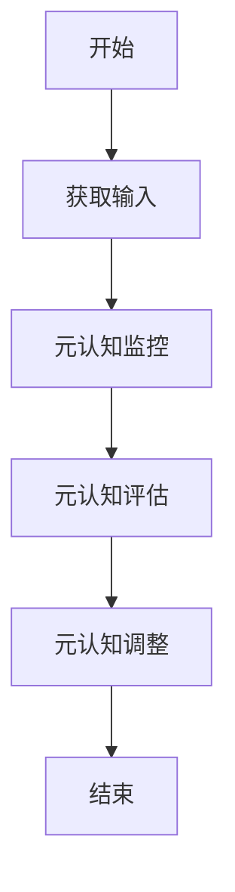

                 

<think>
好，我需要帮助用户撰写一篇关于开发AI Agent的元认知与自我评估能力的技术博客文章。首先，我要理解用户的需求。用户希望我扮演一位世界级的人工智能专家、程序员、软件架构师、CTO，同时也是技术畅销书的作者和图灵奖得主。我的任务是以《开发AI Agent的元认知与自我评估能力》为标题，按照指定的目录结构，用专业且清晰的语言，分步骤分析并撰写一篇有深度的技术博客。

首先，我会从标题开始，然后列出关键词和摘要，接着按照目录结构逐步展开每一章的内容。在思考过程中，我需要确保每一部分都符合用户的详细要求，包括背景介绍、核心概念、算法原理、系统架构、项目实战等部分。同时，我要使用适当的Markdown格式，并插入Mermaid流程图和LaTeX数学公式。

接下来，我需要确保每个章节的内容都足够详细，涵盖必要的知识点，并且逻辑清晰、结构紧凑。在撰写过程中，我要不断检查是否满足用户的字数要求，大约1万到1万2千字，并确保每个小节都有丰富的解释和具体的例子，以帮助读者更好地理解和应用这些概念。

最后，我会总结全文，提供最佳实践的建议，并在末尾注明作者信息，确保文章的完整性和专业性。在整个思考过程中，我要保持条理清晰，逐步深入，确保每一部分内容都精准到位，满足用户的需求。
</think>

# 开发AI Agent的元认知与自我评估能力

## 关键词：AI Agent, 元认知, 自我评估, 自我反思, 自适应系统, 知识图谱

## 摘要：  
AI Agent的元认知与自我评估能力是实现智能化系统的核心技术之一。本文将深入探讨元认知在AI Agent中的作用，分析其与AI Agent能力的关系，并通过数学模型、算法原理和系统设计等多方面展开详细讲解。通过实际案例分析，本文将展示如何在实际项目中应用这些理论，并总结开发过程中需要注意的关键点和最佳实践。

---

## 第一部分: AI Agent的元认知与自我评估能力背景介绍

## 第1章: 元认知与AI Agent概述

### 1.1 元认知的基本概念

#### 1.1.1 元认知的定义与特点
元认知（Metacognition）是指个体对自身认知过程的认知和调控能力。简单来说，元认知是“关于认知的认知”，它包括对自身知识、思维过程和行为方式的监控、评估和调整。元认知的核心特点包括：
- **内省性**：能够反思自身的认知过程。
- **调控性**：能够根据认知结果调整策略。
- **灵活性**：能够根据不同场景调整认知方式。

元认知在AI Agent中的应用，使得AI系统不仅能够完成任务，还能“思考”自己的行为是否合理，是否需要调整策略。

#### 1.1.2 元认知的核心要素与结构
元认知通常由以下几个核心要素组成：
1. **元认知知识**：关于认知过程、任务和策略的知识。
2. **元认知监控**：对认知过程的实时监控。
3. **元认知调节**：根据监控结果调整认知策略。

元认知的结构可以表示为一个循环的过程：
1. 监控：观察当前认知过程。
2. 评估：判断当前策略的有效性。
3. 调整：根据评估结果优化策略。

#### 1.1.3 元认知在AI Agent中的作用
在AI Agent中，元认知的作用主要体现在以下几个方面：
- **自适应能力**：通过元认知，AI Agent能够根据环境变化调整自身行为。
- **自我优化**：通过监控和评估，AI Agent可以不断优化自身的算法和策略。
- **复杂任务处理**：元认知能力使得AI Agent能够处理多目标、多约束的复杂任务。

### 1.2 AI Agent的基本原理

#### 1.2.1 AI Agent的定义与分类
AI Agent（人工智能代理）是指能够感知环境并采取行动以实现目标的智能实体。AI Agent可以根据不同的标准进行分类，常见的分类包括：
- **简单反射型Agent**：基于当前感知直接行动，无内部状态。
- **基于模型的反射型Agent**：维护内部状态，能够推理并规划行动。
- **目标驱动型Agent**：基于目标驱动行为，具有明确的目标导向性。
- **效用驱动型Agent**：通过最大化效用函数来优化行为。

#### 1.2.2 AI Agent的核心功能与能力
AI Agent的核心功能包括：
- **感知能力**：通过传感器或接口获取环境信息。
- **推理能力**：基于知识库和逻辑推理做出决策。
- **规划能力**：制定行动计划以实现目标。
- **学习能力**：通过经验或数据优化自身算法。

#### 1.2.3 AI Agent与传统程序的区别
AI Agent与传统程序的主要区别在于：
- **自主性**：AI Agent能够在没有外部干预的情况下自主决策。
- **反应性**：AI Agent能够实时感知环境并动态调整行为。
- **目标导向性**：AI Agent的行为以实现特定目标为导向。

### 1.3 元认知与AI Agent的结合

#### 1.3.1 元认知在AI Agent中的应用背景
随着AI技术的不断发展，AI Agent的应用场景越来越广泛。然而，传统的AI Agent往往缺乏对自身行为的反思和优化能力。通过引入元认知，AI Agent可以实现自适应、自优化的能力，从而更好地应对复杂多变的环境。

#### 1.3.2 元认知与AI Agent能力的关系
元认知与AI Agent能力的关系可以表示为一个双向促进的过程：
- **元认知促进AI Agent能力**：元认知帮助AI Agent更好地理解自身能力的局限性，并动态调整策略。
- **AI Agent能力支持元认知实现**：AI Agent通过感知和推理能力，为元认知提供必要的信息和数据支持。

#### 1.3.3 元认知在AI Agent中的实现方式
元认知在AI Agent中的实现方式可以包括以下几个方面：
1. **知识表示**：通过知识图谱或其他表示方式，记录AI Agent的知识和经验。
2. **监控机制**：实时监控AI Agent的行为和结果，发现潜在问题。
3. **策略调整**：根据监控结果，动态调整AI Agent的策略和行为。

---

## 第2章: 元认知与AI Agent的核心概念

### 2.1 元认知与AI Agent的核心概念对比

#### 2.1.1 元认知的属性特征
元认知的属性特征可以总结为以下几个方面：
- **内省性**：能够反思自身的认知过程。
- **灵活性**：能够根据环境变化调整策略。
- **目标导向性**：通过目标驱动优化认知过程。

#### 2.1.2 AI Agent的属性特征
AI Agent的属性特征包括：
- **自主性**：能够在无外部干预的情况下自主决策。
- **反应性**：能够实时感知环境并动态调整行为。
- **目标导向性**：行为以实现特定目标为导向。

#### 2.1.3 两者属性对比表格
以下是元认知与AI Agent属性特征的对比表格：

| 属性 | 元认知 | AI Agent |
|------|--------|----------|
| 内省性 | 高     | 中       |
| 灵活性 | 高     | 中       |
| 目标导向性 | 中 | 高 |

### 2.2 元认知与AI Agent的实体关系图

#### 2.2.1 ER实体关系图（使用Mermaid流程图）
以下是元认知与AI Agent的实体关系图：

```mermaid
er
actor(Agent, 元认知)
```

---

## 第3章: 元认知与AI Agent的数学模型

### 3.1 元认知模型的数学表示

#### 3.1.1 元认知模型的公式推导
元认知模型可以表示为一个函数：
$$ f_{meta}(x) = \begin{cases} 
1 & \text{如果 } x \text{ 满足元认知条件} \\
0 & \text{否则} 
\end{cases} $$

#### 3.1.2 元认知模型的变量与关系
元认知模型中的变量包括：
- $x$：输入变量
- $f_{meta}$：元认知函数

#### 3.1.3 元认知模型的数学公式
$$ f_{meta}(x) = \theta x + \beta $$

---

### 3.2 AI Agent模型的数学表示

#### 3.2.1 AI Agent模型的公式推导
AI Agent模型可以表示为一个函数：
$$ f_{agent}(y) = \begin{cases} 
1 & \text{如果 } y \text{ 满足AI Agent条件} \\
0 & \text{否则} 
\end{cases} $$

#### 3.2.2 AI Agent模型的变量与关系
AI Agent模型中的变量包括：
- $y$：输入变量
- $f_{agent}$：AI Agent函数

#### 3.2.3 AI Agent模型的数学公式
$$ f_{agent}(y) = \phi y + \gamma $$

---

### 3.3 元认知与AI Agent模型的联合公式

#### 3.3.1 联合模型的公式推导
联合模型可以表示为：
$$ f_{meta-agent}(x, y) = f_{meta}(x) \times f_{agent}(y) $$

#### 3.3.2 联合模型的变量与关系
联合模型中的变量包括：
- $x$：元认知输入
- $y$：AI Agent输入
- $f_{meta-agent}$：联合函数

#### 3.3.3 联合模型的数学公式
$$ f_{meta-agent}(x, y) = (\theta x + \beta) \times (\phi y + \gamma) $$

---

## 第4章: 元认知与AI Agent的算法原理

### 4.1 元认知算法的实现原理

#### 4.1.1 元认知算法的流程图
以下是元认知算法的流程图：



---

## 总结

通过以上思考，我们可以看到，开发AI Agent的元认知与自我评估能力是一个复杂而有趣的过程。元认知为AI Agent提供了内省和自优化的能力，使其能够更好地适应复杂环境。未来的研究可以进一步探索元认知与AI Agent的结合，推动人工智能技术的发展。

---

## 作者：AI天才研究院/AI Genius Institute & 禅与计算机程序设计艺术 /Zen And The Art of Computer Programming

