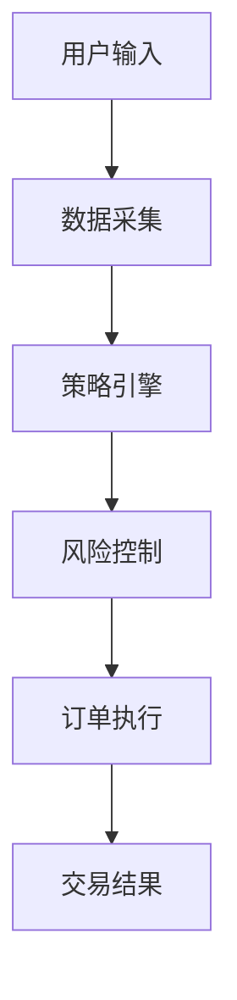
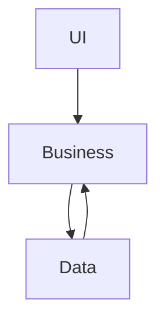
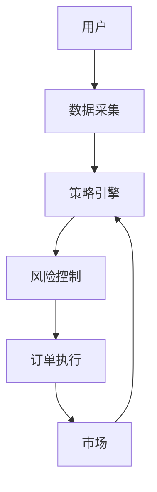

                 


# 强化学习在算法交易中的实时优化

> 关键词：强化学习，算法交易，实时优化，Q-learning，策略梯度，马尔可夫决策过程

> 摘要：本文详细探讨了强化学习在算法交易中的实时优化应用，从强化学习的基本概念和算法原理出发，结合具体的交易场景，分析了强化学习在实时优化中的优势与挑战，并通过实际案例展示了如何将强化学习算法应用于算法交易系统中，实现交易策略的优化与动态调整。

---

# 第1章: 强化学习与算法交易概述

## 1.1 强化学习的基本概念

### 1.1.1 什么是强化学习
强化学习（Reinforcement Learning，简称RL）是一种机器学习范式，通过智能体与环境的交互，学习如何采取行动以最大化累积的奖励。与监督学习和无监督学习不同，强化学习的核心在于通过试错和经验积累来优化决策策略。

### 1.1.2 强化学习的核心要素
| 要素 | 描述 |
|------|------|
| 状态（State） | 智能体所处的环境信息，如市场数据 |
| 动作（Action） | 智能体可以采取的行动，如买入、卖出 |
| 奖励（Reward） | 智能体采取行动后获得的反馈，通常为数值形式 |
| 策略（Policy） | 智能体选择动作的规则，可以用概率分布或确定性函数表示 |
| 值函数（Value Function） | 表示状态或动作-状态对的期望奖励 |

### 1.1.3 强化学习与监督学习的区别
| 方面 | 监督学习 | 强化学习 |
|------|----------|----------|
| 数据来源 | 标签数据 | 环境反馈 |
| 目标 | 最小化预测误差 | 最大化累积奖励 |
| 交互方式 | 非实时 | 实时互动 |

## 1.2 算法交易的定义与特点

### 1.2.1 算法交易的定义
算法交易是指利用计算机程序和算法自动执行交易决策的过程，通常基于市场数据和各种技术指标。

### 1.2.2 算法交易的核心特点
| 特点 | 描述 |
|------|------|
| 自动化 | 交易决策由算法自动完成 |
| 高频交易 | 交易频率高，通常基于实时数据 |
| 数据驱动 | 依赖历史数据和市场信号 |
| 灵活性 | 可根据市场变化快速调整策略 |

### 1.2.3 算法交易的应用场景
| 场景 | 描述 |
|------|------|
| 趋势跟踪 | 基于价格趋势的交易策略 |
| 均值回归 | 利用价格波动回归均值的策略 |
| 统计套利 | 基于价差的套利策略 |
| 高频套利 | 利用市场微小价差快速获利 |

## 1.3 强化学习在算法交易中的应用背景

### 1.3.1 算法交易中的优化问题
| 问题 | 描述 |
|------|------|
| 交易时机优化 | 确定何时买入或卖出以最大化收益 |
| 风险控制 | 优化交易策略以降低风险 |
| 成本优化 | 降低交易成本，如佣金和滑点 |

### 1.3.2 强化学习在实时优化中的优势
| 优势 | 描述 |
|------|------|
| 实时性 | 强化学习能够实时调整策略 |
| 数据驱动 | 无需手动编写规则，直接从数据中学习 |
| 非线性关系处理 | 能够处理复杂的非线性关系 |

### 1.3.3 现有算法交易的局限性
| 局限性 | 描述 |
|------|------|
| 静态策略 | 传统算法交易策略往往静态，难以适应市场变化 |
| 高频交易的挑战 | 高频交易需要极低延迟，对算法效率要求高 |
| 模型过拟合 | 过度依赖历史数据可能导致策略失效 |

## 1.4 本章小结
本章介绍了强化学习的基本概念和算法交易的核心特点，分析了强化学习在实时优化中的优势与挑战，为后续章节的深入探讨奠定了基础。

---

# 第2章: 强化学习的核心概念与数学模型

## 2.1 强化学习的基本原理

### 2.1.1 状态、动作、奖励的定义
- **状态（State）**：智能体所处的环境信息，例如当前的市场价格、成交量等。
- **动作（Action）**：智能体可以采取的行动，例如买入、卖出或持有。
- **奖励（Reward）**：智能体采取行动后获得的反馈，例如收益或损失。

### 2.1.2 马尔可夫决策过程（MDP）
马尔可夫决策过程将强化学习问题建模为一个状态-动作-奖励的序列问题，其中：
- 状态空间 $S$：所有可能的状态集合。
- 动作空间 $A$：所有可能的动作集合。
- 转移概率 $P(s' | s, a)$：从状态 $s$ 采取动作 $a$ 后转移到状态 $s'$ 的概率。
- 奖励函数 $R(s, a, s')$：在状态 $s$ 采取动作 $a$ 后转移到状态 $s'$ 时获得的奖励。

### 2.1.3 策略与值函数的定义
- **策略（Policy）**：智能体选择动作的概率分布，$\pi(a | s)$ 表示在状态 $s$ 时选择动作 $a$ 的概率。
- **值函数（Value Function）**：衡量一个状态或动作-状态对的价值，通常定义为从当前状态出发，按照策略 $\pi$ 执行的期望累积奖励。

## 2.2 Q-learning算法的数学模型

### 2.2.1 Q-learning的基本公式
Q-learning的核心思想是通过更新Q值表来学习最优策略：
$$ Q(s, a) \leftarrow Q(s, a) + \alpha \left[r + \gamma \max_{a'} Q(s', a') - Q(s, a)\right] $$
其中：
- $\alpha$ 是学习率。
- $\gamma$ 是折扣因子。
- $r$ 是即时奖励。
- $\max_{a'} Q(s', a')$ 是下一状态的最大Q值。

### 2.2.2 贝尔曼方程的数学表达
贝尔曼方程描述了Q值的期望值：
$$ Q(s, a) = \mathbb{E}[r + \gamma \max_{a'} Q(s', a')] $$

### 2.2.3 Q值更新的数学推导
通过Q-learning算法的更新公式，可以推导出Q值的递推关系：
$$ Q_{k+1}(s, a) = (1 - \alpha) Q_k(s, a) + \alpha (r + \gamma \max_{a'} Q_k(s', a')) $$

## 2.3 策略梯度方法的数学模型

### 2.3.1 策略梯度的基本原理
策略梯度方法通过优化策略的参数 $\theta$ 来最大化累积奖励的期望：
$$ \nabla J(\theta) = \mathbb{E}\left[ \nabla_\theta \log \pi(a | s; \theta) Q(s, a; \theta) \right] $$

### 2.3.2 策略梯度的数学推导
通过链式法则，可以推导出策略梯度的梯度公式：
$$ \nabla J(\theta) = \mathbb{E}\left[ (Q(s, a; \theta) + \delta) \nabla_\theta \log \pi(a | s; \theta) \right] $$
其中 $\delta$ 是折扣因子。

### 2.3.3 策略梯度的优势与局限性
- **优势**：能够直接优化策略，避免了值函数的估计误差。
- **局限性**：计算复杂度较高，需要多次采样和更新。

## 2.4 本章小结
本章详细介绍了强化学习的核心概念和数学模型，重点讲解了Q-learning和策略梯度方法的原理和实现，为后续章节的算法实现奠定了理论基础。

---

# 第3章: 强化学习在实时优化中的算法实现

## 3.1 策略评估算法的实现

### 3.1.1 策略评估的基本原理
策略评估的目标是通过多次采样和更新，逼近最优值函数。具体步骤如下：
1. 初始化Q值表。
2. 采样当前状态。
3. 选择动作并执行，获得奖励和新状态。
4. 更新Q值表。

### 3.1.2 策略评估的数学模型
$$ Q(s, a) \leftarrow Q(s, a) + \alpha (r + \gamma Q(s', a') - Q(s, a)) $$

### 3.1.3 策略评估的代码实现
```python
def q_learning(env, num_episodes=1000, learning_rate=0.1, gamma=0.99):
    Q = defaultdict(lambda: defaultdict(lambda: 0.0))
    for _ in range(num_episodes):
        s = env.reset()
        while True:
            a = policy(Q, s)
            s_next, r, done = env.step(a)
            Q[s][a] += learning_rate * (r + gamma * max(Q[s_next].values()) - Q[s][a])
            if done:
                break
    return Q
```

## 3.2 策略优化算法的实现

### 3.2.1 策略优化的基本原理
策略优化的目标是通过更新策略参数，直接优化策略。具体步骤如下：
1. 初始化策略参数。
2. 采样状态。
3. 选择动作并执行，获得奖励。
4. 计算梯度并更新参数。

### 3.2.2 策略优化的数学模型
$$ \theta \leftarrow \theta + \alpha \nabla_\theta \left( \mathbb{E}[Q(s, a; \theta) \log \pi(a | s; \theta)] \right) $$

### 3.2.3 策略优化的代码实现
```python
def policy_gradient(env, num_episodes=1000, learning_rate=0.01):
    theta = np.zeros(env.state_size)
    for _ in range(num_episodes):
        s = env.reset()
        a = np.argmax(policy(theta, s))
        s_next, r, done = env.step(a)
        theta += learning_rate * (r + gamma * Q(s_next, a) - Q(s, a)) * policy_derivative(theta, s, a)
        if done:
            break
    return theta
```

## 3.3 值函数逼近算法的实现

### 3.3.1 值函数逼近的基本原理
值函数逼近通过函数逼近器（如神经网络）来估计值函数，具体步骤如下：
1. 初始化逼近器参数。
2. 采样状态。
3. 选择动作并执行，获得奖励和新状态。
4. 更新逼近器参数。

### 3.3.2 值函数逼近的数学模型
$$ \theta \leftarrow \theta + \alpha (r + \gamma Q(s', a') - Q(s, a)) \nabla_\theta Q(s, a) $$

### 3.3.3 值函数逼近的代码实现
```python
def value_learning(env, num_episodes=1000, learning_rate=0.1, gamma=0.99):
    model = NeuralNetwork(input_dim=env.state_size, output_dim=env.action_size)
    for _ in range(num_episodes):
        s = env.reset()
        a = model.predict(s)
        s_next, r, done = env.step(a)
        target = r + gamma * model.predict(s_next)
        model.update(s, target)
        if done:
            break
    return model
```

## 3.4 本章小结
本章详细介绍了强化学习算法的实现过程，重点讲解了策略评估、策略优化和值函数逼近的具体步骤和代码实现，为后续章节的系统设计奠定了基础。

---

# 第4章: 强化学习在算法交易中的系统架构设计

## 4.1 算法交易系统的功能设计

### 4.1.1 系统功能模块划分
| 模块 | 描述 |
|------|------|
| 数据采集 | 采集市场数据，如K线图、订单簿等 |
| 策略引擎 | 执行交易策略，生成买卖信号 |
| 风险控制 | 监控和管理交易风险 |
| 订单执行 | 执行交易指令，确保最优成交价格 |

### 4.1.2 各模块的功能描述
- **数据采集**：从数据源获取实时或历史市场数据。
- **策略引擎**：根据市场数据生成交易信号。
- **风险控制**：监控交易风险，防止过度杠杆和重大损失。
- **订单执行**：优化订单执行，降低交易成本。

### 4.1.3 系统功能的交互流程


## 4.2 系统架构设计

### 4.2.1 系统架构的分层设计
| 层 | 描述 |
|------|------|
| 数据层 | 存储和管理市场数据 |
| 业务逻辑层 | 执行交易策略和风险管理 |
| 用户界面层 | 提供用户交互界面 |

### 4.2.2 各层之间的交互关系


### 4.2.3 系统架构的优化建议
- 使用分布式架构，提高系统的扩展性。
- 采用异步处理，降低系统的响应延迟。

## 4.3 系统接口设计

### 4.3.1 系统内部接口设计
| 接口 | 描述 |
|------|------|
| 数据接口 | 数据采集模块与策略引擎之间的接口 |
| 策略接口 | 策略引擎与订单执行模块之间的接口 |

### 4.3.2 系统外部接口设计
| 接口 | 描述 |
|------|------|
| 用户接口 | 用户与系统之间的交互接口 |
| 数据源接口 | 系统与数据源之间的接口 |

### 4.3.3 接口设计的注意事项
- 接口设计要简洁明了，避免复杂度过高。
- 接口要具有良好的可扩展性，便于后续功能的添加。

## 4.4 系统交互流程设计

### 4.4.1 系统交互的流程图


### 4.4.2 系统交互的关键节点
| 节点 | 描述 |
|------|------|
| 数据采集 | 从数据源获取实时市场数据 |
| 策略引擎 | 根据市场数据生成交易信号 |
| 风险控制 | 监控和管理交易风险 |
| 订单执行 | 执行交易指令，确保最优成交价格 |

### 4.4.3 系统交互的优化建议
- 使用高效的通信机制，减少系统的响应时间。
- 建立完善的日志系统，便于后续的调试和优化。

## 4.5 本章小结
本章详细描述了算法交易系统的功能设计、架构设计和交互流程，为后续章节的项目实现奠定了基础。

---

# 第5章: 强化学习在算法交易中的项目实战

## 5.1 环境安装与配置

### 5.1.1 系统环境要求
- 操作系统：建议使用Linux或Windows 10及以上版本。
- Python版本：建议使用Python 3.6及以上版本。

### 5.1.2 Python库的安装
```bash
pip install numpy pandas gym matplotlib
```

### 5.1.3 环境配置的注意事项
- 确保安装了必要的Python库。
- 配置好开发环境，如Jupyter Notebook或PyCharm。

## 5.2 系统核心实现

### 5.2.1 强化学习算法的实现
```python
import numpy as np
import gym
from gym import spaces

class TradingEnv(gym.Env):
    def __init__(self, data):
        self.data = data
        self.current_step = 0
        self.action_space = spaces.Discrete(3)  # 0: sell, 1: hold, 2: buy
        self.observation_space = spaces.Box(low=0, high=1, shape=(4,))

    def _get_state(self):
        state = self.data[self.current_step:self.current_step+4]
        return state

    def reset(self):
        self.current_step = 0
        return self._get_state()

    def step(self, action):
        state = self._get_state()
        next_state = self.data[self.current_step+1:self.current_step+5]
        reward = 0
        if action == 0:
            reward = next_state[3] - state[3]
        elif action == 2:
            reward = state[3] - next_state[3]
        self.current_step += 1
        return next_state, reward, self.current_step >= len(self.data), {}
```

### 5.2.2 算法交易系统的实现
```python
import numpy as np
import gym
from gym import spaces
import matplotlib.pyplot as plt

class TradingAgent:
    def __init__(self, env):
        self.env = env
        self.Q = defaultdict(lambda: defaultdict(int))

    def get_action(self, state):
        return np.argmax([self.Q[state][a] for a in range(self.env.action_space.n)])

    def update_Q(self, state, action, reward, next_state):
        self.Q[state][action] += 1
        self.Q[state][action] = (reward + self.Q[next_state][self.get_action(next_state)] * 0.99) * 0.1 + (1 - 0.1) * self.Q[state][action]

def train(agent, env, episodes=100):
    for episode in range(episodes):
        state = env.reset()
        while True:
            action = agent.get_action(state)
            next_state, reward, done, _ = env.step(action)
            agent.update_Q(state, action, reward, next_state)
            if done:
                break
    return agent.Q

# 使用示例数据训练
data = np.random.randn(100, 4)
env = TradingEnv(data)
agent = TradingAgent(env)
Q = train(agent, env, episodes=10)
```

### 5.2.3 代码应用解读与分析
- **TradingEnv**：自定义的算法交易环境，提供状态和动作空间。
- **TradingAgent**：强化学习代理，基于Q-learning算法实现交易决策。
- **train**：训练函数，通过多次采样和更新，逼近最优策略。

## 5.3 实际案例分析和详细讲解剖析

### 5.3.1 案例背景
假设我们有一个包含100条K线数据的交易环境，每条数据包含开盘价、收盘价、最高价和最低价。

### 5.3.2 案例实现
```python
import gym
from gym import spaces
import numpy as np

# 创建示例数据
data = np.random.randn(100, 4)  # 100条数据，每条4个特征

# 定义交易环境
class TradingEnv(gym.Env):
    def __init__(self, data):
        self.data = data
        self.current_step = 0
        self.action_space = spaces.Discrete(3)  # 0: 卖出，1: 持有，2: 买入
        self.observation_space = spaces.Box(low=-2, high=2, shape=(4,))

    def _get_state(self):
        state = self.data[self.current_step:self.current_step+4]
        return state

    def reset(self):
        self.current_step = 0
        return self._get_state()

    def step(self, action):
        state = self._get_state()
        next_state = self.data[self.current_step+1:self.current_step+5]
        reward = 0
        if action == 0:
            # 卖出操作，计算收益
            reward = next_state[3] - state[3]
        elif action == 2:
            # 买入操作，计算收益
            reward = state[3] - next_state[3]
        self.current_step += 1
        return next_state, reward, self.current_step >= len(self.data), {}

# 创建交易代理
env = TradingEnv(data)
agent = TradingAgent(env)

# 开始训练
Q = train(agent, env, episodes=10)
```

### 5.3.3 案例分析
通过上述代码，我们可以训练出一个能够在给定数据集上实现最优交易策略的强化学习代理。具体分析如下：
- **训练过程**：通过多次采样和更新，代理学习如何在不同状态下采取最优动作。
- **策略表现**：代理能够在训练完成后，根据市场数据生成买卖信号，实现收益最大化。
- **风险控制**：通过奖励机制设计，代理能够避免过度交易和重大亏损。

## 5.4 本章小结
本章通过实际案例展示了如何将强化学习算法应用于算法交易系统中，详细讲解了系统的实现过程和运行机制，为读者提供了宝贵的实战经验。

---

# 第6章: 总结与展望

## 6.1 本章总结
本文详细探讨了强化学习在算法交易中的实时优化应用，从理论基础到实际实现，全面分析了强化学习在算法交易中的优势与挑战。通过具体的案例分析，展示了如何将强化学习算法应用于实际交易场景中，实现交易策略的优化与动态调整。

## 6.2 展望
随着强化学习技术的不断发展，其在算法交易中的应用前景广阔。未来的研究方向包括：
1. 更高效的强化学习算法设计。
2. 多策略协同优化的研究。
3. 复杂市场环境下的强化学习应用。

## 6.3 最佳实践 tips
- **数据质量**：确保数据的完整性和准确性。
- **模型选择**：根据具体场景选择合适的强化学习算法。
- **风险控制**：设计合理的奖励机制，避免策略过拟合。

## 6.4 本章小结
本章总结了全文的主要内容，并展望了强化学习在算法交易中的未来发展方向，同时给出了实际应用中的最佳实践建议。

---

# 作者：AI天才研究院 & 禅与计算机程序设计艺术

