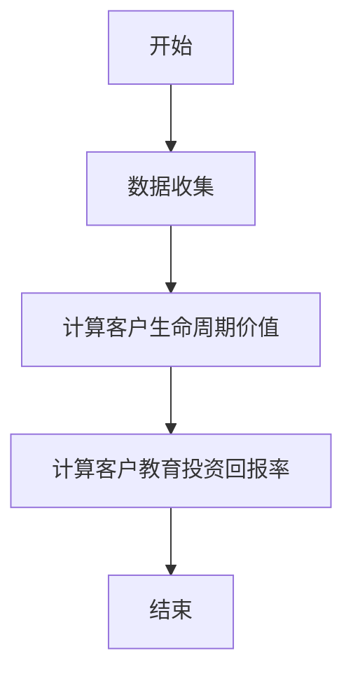

                 


# 彼得林奇如何分析公司的客户教育投资对品牌忠诚度的影响

## 关键词：彼得林奇，客户教育投资，品牌忠诚度，客户生命周期价值，客户关系管理

## 摘要：  
本文通过分析彼得·林奇的客户教育投资策略，探讨客户教育投资对品牌忠诚度的影响。通过详细分析客户教育投资的核心概念、算法原理、系统架构和实际案例，揭示客户教育投资在提升品牌忠诚度中的关键作用。本文还提供了客户教育投资的数学模型、系统设计和项目实战案例，帮助读者理解和应用客户教育投资的策略。

---

## 第一部分: 客户教育投资与品牌忠诚度的背景介绍

### 第1章: 客户教育投资的定义与重要性

#### 1.1 客户教育投资的定义
客户教育投资是指企业为提升客户对品牌、产品或服务的理解和认知而投入的资源，包括时间和资金。客户教育投资的核心要素包括知识传递、体验优化和信任建立。客户教育投资的边界在于其投入的资源和预期的回报，其外延涉及产品生命周期和客户关系管理。

#### 1.2 客户教育投资的重要性
客户教育投资在品牌建设中起着关键作用，通过提升客户对品牌的认知和产品价值，增强客户忠诚度。客户教育投资与客户忠诚度密切相关，通过优化客户体验和产品价值，客户教育投资能够显著影响企业的长期发展。

### 第2章: 品牌忠诚度的定义与影响因素

#### 2.1 品牌忠诚度的定义
品牌忠诚度是指客户在面对市场竞争时，持续选择某一品牌产品或服务的程度。品牌忠诚度的核心要素包括客户满意度、情感连接和品牌认知。品牌忠诚度的测量方法包括客户满意度调查、市场份额分析和客户保留率。

#### 2.2 品牌忠诚度的影响因素
客户体验、产品价值和品牌认知是影响品牌忠诚度的主要因素。客户体验通过服务质量、互动频率和反馈机制影响忠诚度；产品价值通过产品的功能、创新性和性价比影响忠诚度；品牌认知通过品牌知名度、品牌形象和品牌故事影响忠诚度。

---

## 第二部分: 客户教育投资对品牌忠诚度的核心概念与联系

### 第3章: 客户教育投资的核心概念原理

#### 3.1 客户教育投资的原理
客户教育投资的基本原理是通过传递品牌价值和产品知识，增强客户对品牌的理解和信任。客户教育投资的作用机制包括知识传递、情感连接和行为驱动。客户教育投资与品牌忠诚度的关系体现在客户教育投资能够提升客户的满意度和信任度，从而增强品牌忠诚度。

### 第4章: 客户教育投资与品牌忠诚度的属性特征对比

#### 4.1 客户教育投资的属性特征
客户教育投资的投入属性包括时间和资源的投入；回报属性包括客户满意度和忠诚度的提升；风险属性包括客户教育投资的不确定性和效果的波动性。

#### 4.2 品牌忠诚度的属性特征
品牌忠诚度的稳定性特征体现在客户在市场竞争中的持续选择；可测量性特征体现在通过数据收集和分析；可持续性特征体现在长期客户关系的建立和维护。

### 第5章: 客户教育投资与品牌忠诚度的ER实体关系图

```mermaid
er
actor: 客户教育投资
role: 品牌忠诚度
```

---

## 第三部分: 客户教育投资对品牌忠诚度的算法原理与系统分析

### 第6章: 客户教育投资的算法原理

#### 6.1 客户教育投资的数学模型
客户教育投资的数学模型包括客户生命周期价值（CLV）和客户教育投资回报率（ROI）的计算公式。CLV公式为：$$CLV = \frac{R - C}{1 - \delta}$$，其中R为客户的剩余价值，C为获取客户的成本，δ为贴现率。客户教育投资回报率（ROI）的公式为：$$ROI = \frac{增量收益}{客户教育投资}$$。

#### 6.2 客户教育投资的算法流程
客户教育投资的算法流程包括数据收集、模型计算和结果分析。流程图如下：



### 第7章: 客户教育投资与品牌忠诚度的系统架构设计

#### 7.1 系统功能设计
客户教育投资与品牌忠诚度的系统功能设计包括数据收集模块、分析模块和优化模块。数据收集模块负责收集客户数据和教育投资数据；分析模块负责计算客户生命周期价值和投资回报率；优化模块负责制定优化策略。

#### 7.2 系统架构设计
系统架构设计采用分层架构，包括数据层、业务逻辑层和用户界面层。数据层负责数据存储和管理；业务逻辑层负责数据处理和计算；用户界面层负责用户交互和结果展示。

### 第8章: 客户教育投资的项目实战

#### 8.1 环境配置
项目实战需要安装Python和相关库，如NumPy和Pandas。

#### 8.2 核心代码实现
客户教育投资的代码实现如下：

```python
import numpy as np
import pandas as pd

# 数据准备
customer_data = pd.read_csv('customer_data.csv')

# 计算客户生命周期价值
def calculate_clv(customers):
    R = customers['revenue'].mean()
    C = customers['acquisition_cost'].mean()
    delta = 0.05
    clv = (R - C) / (1 - delta)
    return clv

# 计算客户教育投资回报率
def calculate_roi(investment, revenue_growth):
    roi = (revenue_growth / investment) * 100
    return roi

# 示例计算
clv = calculate_clv(customer_data)
roi = calculate_roi(100000, 20000)
print(f"CLV: {clv:.2f}")
print(f"ROI: {roi:.2f}%")
```

#### 8.3 结果解读
通过计算，客户生命周期价值和投资回报率可以帮助企业评估客户教育投资的效果。例如，CLV为$120,000，ROI为20%，表明客户教育投资是有效的。

---

## 第四部分: 结论与最佳实践

### 第9章: 结论

客户教育投资是提升品牌忠诚度的重要手段。通过优化客户教育投资策略，企业可以提升客户满意度和忠诚度，增强市场竞争力。客户教育投资的数学模型和系统设计为企业的决策提供了有力支持。

### 第10章: 最佳实践 tips

1. **数据驱动**：通过数据收集和分析，制定科学的客户教育投资策略。
2. **客户为中心**：关注客户需求和体验，提升客户满意度和忠诚度。
3. **持续优化**：定期评估客户教育投资的效果，优化投资策略。

### 第11章: 项目小结

客户教育投资对品牌忠诚度的影响是长期且深远的。通过系统的分析和优化，企业可以最大化客户教育投资的价值，提升品牌忠诚度和市场竞争力。

---

## 作者：AI天才研究院/AI Genius Institute & 禅与计算机程序设计艺术 /Zen And The Art of Computer Programming

