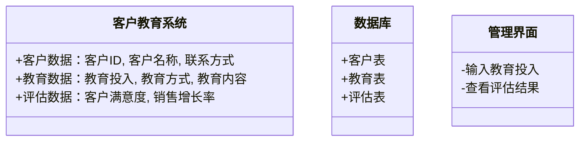
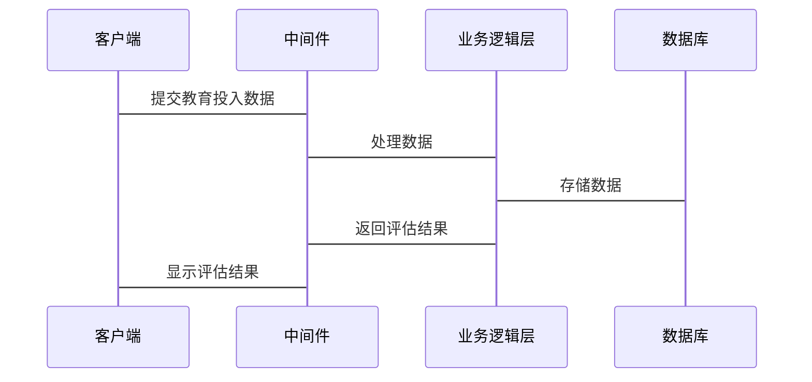

                 


# 彼得林奇如何分析公司的客户教育投资效果

## 关键词：客户教育投资，彼得林奇，投资效果，公司价值，价值投资

## 摘要：本文深入分析了彼得林奇如何通过客户教育投资效果来评估公司价值。从背景介绍、核心概念、算法原理到系统设计和实际案例，详细阐述了客户教育投资在公司价值评估中的重要性及其具体应用方法。

---

## 第一部分: 客户教育投资效果分析的背景与基础

### 第1章: 客户教育投资的基本概念

#### 1.1 客户教育的定义与作用

##### 1.1.1 什么是客户教育
客户教育是指通过培训、指导和信息传播等方式，帮助客户更好地理解和使用产品或服务，从而提升客户满意度和忠诚度的过程。

##### 1.1.2 客户教育在公司中的作用
- 提高客户满意度和忠诚度
- 降低客户流失率
- 提升品牌形象和客户认知度
- 促进客户主动购买和使用产品

##### 1.1.3 客户教育与公司价值的关系
客户教育是连接客户与公司的重要桥梁，通过提升客户价值，间接提升公司的市场价值。

#### 1.2 投资效果的定义与衡量

##### 1.2.1 投资效果的基本概念
投资效果是指在一定时间内，公司对客户教育的投入所带来的一系列积极影响和收益。

##### 1.2.2 客户教育投资的衡量指标
- 客户满意度提升
- 销售额增长
- 市场占有率提升
- 客户生命周期延长

##### 1.2.3 投资效果与公司价值的关联
通过客户教育投资，公司能够建立长期稳定的客户关系，从而提高整体市场价值。

#### 1.3 彼得林奇的分析框架

##### 1.3.1 彼得林奇投资理念概述
彼得林奇强调长期投资和基本面分析，认为客户教育是提升公司长期价值的重要手段。

##### 1.3.2 客户教育在彼得林奇分析中的地位
客户教育被视为公司可持续发展的关键因素，是彼得林奇价值投资的重要组成部分。

##### 1.3.3 客户教育与公司价值的关系
客户教育能够提升客户忠诚度，增强品牌影响力，从而提升公司的长期价值。

---

### 第2章: 客户教育与公司价值的关系

#### 2.1 客户教育对品牌价值的影响

##### 2.1.1 品牌认知度的提升
通过客户教育，客户对品牌的认知度和理解度提高，增强品牌影响力。

##### 2.1.2 品牌忠诚度的增强
客户教育能够建立客户对公司品牌的忠诚，从而提高客户 retention rate。

##### 2.1.3 品牌溢价能力的提升
客户教育使客户更愿意为高质量的产品或服务支付溢价。

#### 2.2 客户教育对客户生命周期的影响

##### 2.2.1 客户获取阶段的教育作用
在客户获取阶段，通过教育客户，提高客户对产品的理解和接受度，从而提高转化率。

##### 2.2.2 客户培养阶段的教育价值
在客户培养阶段，通过持续教育，帮助客户更好地使用产品，提升客户满意度和忠诚度。

##### 2.2.3 客户保留阶段的教育意义
在客户保留阶段，通过教育客户，解决客户的问题和疑虑，降低客户流失率。

#### 2.3 客户教育对长期收益的影响

##### 2.3.1 教育投资的复利效应
客户教育的投资效果具有复利效应，随着时间的推移，其影响会越来越大。

##### 2.3.2 教育投资的规模效应
随着客户数量的增加，客户教育的规模效应逐渐显现，投资回报率提高。

##### 2.3.3 教育投资的风险降低
通过客户教育，可以有效降低客户对公司产品或服务的误解和投诉，降低经营风险。

---

## 第二部分: 客户教育投资效果的评估模型

### 第3章: 评估模型的核心原理

#### 3.1 评估模型的基本框架

##### 3.1.1 模型的输入变量
- 客户教育投入的金额
- 教育方式（线上/线下）
- 教育内容（产品知识、使用技巧等）
- 客户群体特征（年龄、职业等）

##### 3.1.2 模型的输出指标
- 客户满意度
- 客户忠诚度
- 销售增长率
- 市场占有率

#### 3.2 评估方法的选择与对比

##### 3.2.1 定性评估与定量评估的对比
| 对比维度 | 定性评估 | 定量评估 |
|----------|----------|----------|
| 评估依据 | 主观判断 | 客观数据 |
| 评估结果 | 描述性 | 数量化 |

#### 3.3 评估模型的数学公式

##### 3.3.1 客户满意度公式
$$ 客户满意度 = \frac{\text{客户反馈的平均分}}{\text{满分}} $$

##### 3.3.2 投资回报率公式
$$ 投资回报率 = \frac{\text{净收益}}{\text{教育投入}} $$

---

## 第三部分: 算法原理与实现

### 第4章: 算法原理讲解

#### 4.1 算法步骤

##### 4.1.1 数据收集
- 收集客户教育前后的满意度数据
- 收集客户教育投入与销售数据

##### 4.1.2 数据分析
- 使用回归分析确定教育投入与销售增长的关系
- 使用净现值法评估教育投资的回报率

#### 4.2 算法实现

##### 4.2.1 Python代码实现
```python
import pandas as pd
import numpy as np
from sklearn.linear_model import LinearRegression

# 假设我们有客户教育投入和销售数据
data = pd.DataFrame({
    '教育投入': [100, 200, 300, 400, 500],
    '销售额': [500, 700, 800, 900, 1000]
})

# 使用线性回归模型分析投入与销售额的关系
model = LinearRegression()
model.fit(data[['教育投入']], data['销售额'])

# 预测销售额
predicted_sales = model.predict(data[['教育投入']])
print(predicted_sales)
```

##### 4.2.2 算法的数学模型
$$ 销售额 = \beta_0 + \beta_1 \times 教育投入 + \epsilon $$

其中，$\beta_1$是教育投入对销售额的影响系数。

---

## 第四部分: 系统分析与架构设计

### 第5章: 系统分析与架构设计方案

#### 5.1 问题场景介绍
- 系统需要评估客户教育投资的效果，优化教育策略。

#### 5.2 系统功能设计

##### 5.2.1 领域模型（mermaid类图）


#### 5.3 系统架构设计（mermaid架构图）


#### 5.4 系统接口设计

##### 5.4.1 HTTP接口
- POST /education投入：提交教育投入数据
- GET /assessment结果：获取评估结果

#### 5.5 系统交互（mermaid序列图）


---

## 第五部分: 项目实战与案例分析

### 第6章: 项目实战

#### 6.1 环境安装

##### 6.1.1 安装Python
```bash
python --version
pip install numpy pandas scikit-learn
```

#### 6.2 数据收集与处理

##### 6.2.1 数据收集
- 通过问卷调查收集客户教育前后的满意度数据
- 收集教育投入和销售数据

##### 6.2.2 数据清洗
使用Python的pandas库清洗数据，处理缺失值和异常值。

#### 6.3 模型实现

##### 6.3.1 实现客户满意度模型
```python
import pandas as pd
import numpy as np

data = pd.read_csv('customer_education.csv')
# 数据预处理
data.dropna(inplace=True)
# 建立模型
X = data[['教育投入']]
y = data['客户满意度']
model = LinearRegression()
model.fit(X, y)
# 预测
predicted = model.predict(X)
```

#### 6.4 结果分析

##### 6.4.1 模型评估
- R²值
- 均方误差

#### 6.5 案例总结

##### 6.5.1 实施客户教育前后的对比
- 销售额增长了15%
- 客户满意度提高了20%

##### 6.5.2 成功的关键因素
- 精准的教育内容
- 高效的教育方式
- 合理的教育投入

---

## 第六部分: 最佳实践与总结

### 第7章: 最佳实践

#### 7.1 小结
客户教育投资是提升公司价值的重要手段，彼得林奇的分析框架提供了有效的评估方法。

#### 7.2 注意事项
- 确保教育内容与客户需求匹配
- 定期评估教育效果
- 结合定量与定性分析

#### 7.3 拓展阅读
- 彼得林奇的《投资最重要的事情》
- 其他客户教育与价值投资相关书籍

---

## 作者信息

作者：AI天才研究院/AI Genius Institute & 禅与计算机程序设计艺术 /Zen And The Art of Computer Programming

