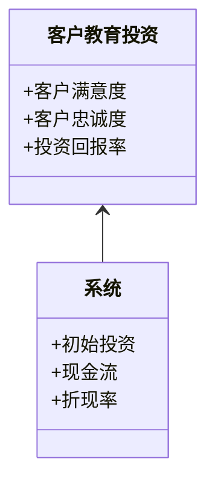
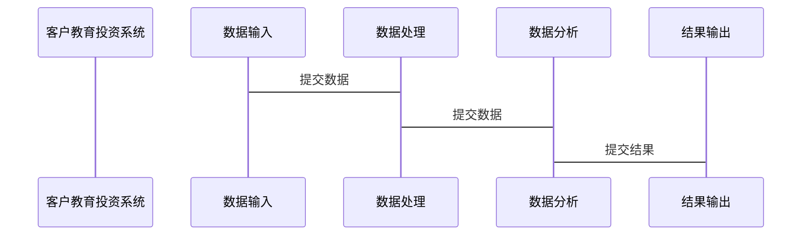
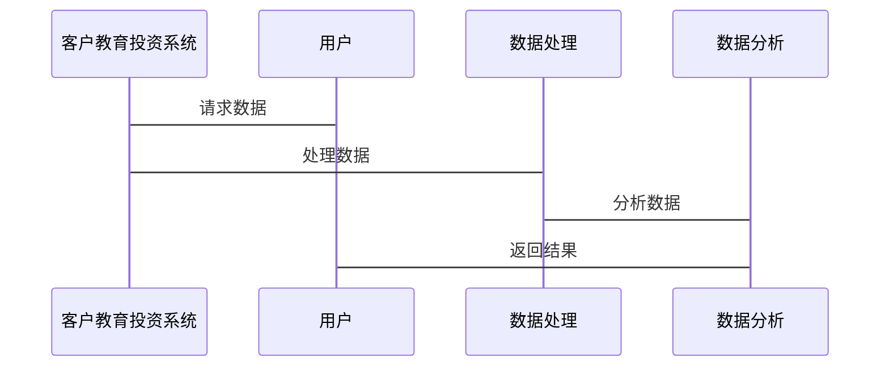

                 

<think>
嗯，用户希望我写一篇关于彼得·林奇如何分析公司客户教育投资长期效果的技术博客。首先，我需要明确文章的结构，确保涵盖引言、核心概念、分析方法、数学模型、系统设计、项目实战和总结等部分。

引言部分需要介绍彼得·林奇的背景和他的投资理念，特别是客户教育投资的重要性。接下来，核心概念部分要详细解释客户教育投资的定义、属性及其与其他投资类型的区别。分析方法部分，我需要详细描述林奇的分析框架和步骤，可能包括数据收集和效果评价指标。

数学模型与算法部分，我需要用NPV模型来分析客户教育投资的回报，同时用Python代码来实现计算。系统分析与架构设计需要介绍如何构建分析框架，包括类图和序列图。项目实战部分则要通过一个案例，展示从环境安装到代码实现的整个过程，确保读者能实际应用这些方法。

最后，总结与展望部分要回顾要点，并指出未来的优化方向。同时，最佳实践部分要提供一些实用的建议，帮助读者更好地实施客户教育投资分析。整个过程需要逻辑清晰，技术细节到位，确保文章既有深度又易于理解。
</think>

# 彼得林奇如何分析公司的客户教育投资长期效果

> 关键词：客户教育投资, 彼得·林奇, 投资分析, 长期效果, 数学模型

> 摘要：本文详细分析了彼得·林奇如何通过客户教育投资的长期效果来评估投资的价值。通过定义客户教育投资的核心概念，构建分析框架，应用数学模型和算法，以及结合系统架构设计，本文为读者提供了一套完整的客户教育投资分析方法。文章最后通过一个具体的项目实战案例，展示了如何在实际中应用这些分析方法，并总结了最佳实践和未来展望。

---

# 第一部分: 引言

## # 第1章: 彼得·林奇与客户教育投资分析概述

### ## 1.1 彼得·林奇的背景与投资理念

#### ### 1.1.1 彼得·林奇的生平简介
彼得·林奇（Peter Lynch）是美国著名的投资专家，曾任富达投资集团麦哲伦基金的经理。他在投资领域有着卓越的成就，以其独特的投资策略和对市场的深刻理解而闻名。林奇强调长期投资和基本面分析，主张通过深入研究公司基本面来选择投资标的。

#### ### 1.1.2 彼得·林奇的投资哲学
林奇的投资哲学主要包括以下几点：
- **长期投资**：避免短期市场的波动，注重公司的长期增长。
- **基本面分析**：通过分析公司的财务数据、行业地位和竞争优势来评估其投资价值。
- **分散投资**：通过投资于不同行业和公司的股票来降低风险。

#### ### 1.1.3 客户教育投资的核心理念
客户教育投资是指通过教育客户或潜在客户，提升他们的知识水平和投资能力，从而实现长期的投资回报。林奇认为，客户教育投资不仅仅是提供信息，而是通过系统化的教育过程，帮助客户做出更明智的投资决策。

---

### ## 1.2 客户教育投资的背景与重要性

#### ### 1.2.1 什么是客户教育投资
客户教育投资是指公司通过向客户提供教育性的内容、培训或咨询服务，提升客户的知识水平和投资能力，从而增强客户对公司产品或服务的信任和忠诚度。

#### ### 1.2.2 客户教育投资的目标客户
客户教育投资的目标客户包括：
- **潜在客户**：通过教育吸引潜在客户，提升他们的投资能力。
- **现有客户**：通过持续教育，提升现有客户的忠诚度和满意度。
- **合作伙伴**：通过教育合作伙伴，增强合作双方的关系。

#### ### 1.2.3 客户教育投资的长期效果
客户教育投资的长期效果体现在以下几个方面：
- **客户忠诚度**：通过教育客户，增强客户对公司产品或服务的信任，从而提高客户忠诚度。
- **客户满意度**：客户通过教育获得更多的知识，能够更好地使用公司产品或服务，从而提高客户满意度。
- **长期收益**：客户教育投资能够帮助公司建立长期的客户关系，从而实现长期的收益。

---

### ## 1.3 本书的目的与结构

#### ### 1.3.1 本书的核心问题
本书的核心问题是：如何通过客户教育投资实现长期的客户价值，并通过彼得·林奇的投资哲学和方法，分析客户教育投资的长期效果。

#### ### 1.3.2 本书的结构安排
本书分为以下几个部分：
- **引言**：介绍彼得·林奇的背景和投资理念。
- **核心概念**：定义客户教育投资的核心概念和属性。
- **分析方法**：介绍彼得·林奇的客户教育投资分析框架和步骤。
- **数学模型**：构建客户教育投资的数学模型，分析其长期效果。
- **系统设计**：通过系统架构设计，展示如何实现客户教育投资的长期效果。
- **项目实战**：通过具体案例，展示如何在实际中应用客户教育投资的分析方法。
- **总结与展望**：总结本书的主要内容，并展望未来的研究方向。

#### ### 1.3.2 本书的阅读方法
读者可以通过以下方式阅读本书：
- **逐步阅读**：按照章节顺序，逐步理解客户教育投资的核心概念和分析方法。
- **结合案例**：通过具体案例，深入理解客户教育投资的长期效果。
- **实践应用**：通过项目实战，将理论知识应用到实际中，提升客户教育投资的长期效果。

---

# 第二部分: 客户教育投资的核心概念

## # 第2章: 客户教育投资的定义与属性

### ## 2.1 客户教育投资的定义

#### ### 2.1.1 客户教育的定义
客户教育是指通过系统化的教育过程，帮助客户了解产品或服务的价值、使用方法及相关知识，从而提升客户的知识水平和投资能力。

#### ### 2.1.2 投资的定义
投资是指将资金投入某个项目或资产，以期获得长期的收益。

#### ### 2.1.3 客户教育投资的整合定义
客户教育投资是指通过向客户提供教育性的内容、培训或咨询服务，提升客户的知识水平和投资能力，从而实现长期的投资回报。

---

### ## 2.2 客户教育投资的核心属性

#### ### 2.2.1 教育性
客户教育投资的核心属性之一是教育性。通过教育客户，提升他们的知识水平和投资能力，从而实现长期的投资回报。

#### ### 2.2.2 投资性
客户教育投资的另一个核心属性是投资性。通过将资金投入客户教育项目，公司期望获得长期的收益。

#### ### 2.2.3 长期性
客户教育投资的长期性体现在其目标是通过长期的教育过程，实现客户价值的最大化。

#### ### 2.2.4 互动性
客户教育投资的互动性体现在客户与公司之间的互动。通过互动，公司能够更好地了解客户需求，提供更优质的服务。

---

### ## 2.3 客户教育投资与其他投资类型的对比

#### ### 2.3.1 传统金融投资
传统金融投资主要是指将资金投入股票、债券等金融资产，以期获得收益。其核心目标是实现资金的增值。

#### ### 2.3.2 教育投资
教育投资是指将资金投入教育领域，例如学校、培训机构等，以期通过教育服务获得收益。其核心目标是通过教育服务实现收益。

#### ### 2.3.3 客户教育投资的独特性
客户教育投资的独特性体现在其结合了教育性和投资性。通过教育客户，公司不仅能够提升客户的知识水平，还能够实现长期的投资回报。

---

# 第三部分: 客户教育投资的分析方法

## # 第3章: 彼得·林奇的客户教育投资分析框架

### ## 3.1 分析框架的构建

#### ### 3.1.1 分析目标的确定
客户教育投资分析的目标是通过分析客户教育投资的长期效果，评估其投资价值。

#### ### 3.1.2 分析维度的选择
客户教育投资分析的维度包括：
- **客户满意度**：客户对教育服务的满意度。
- **客户忠诚度**：客户对公司产品或服务的忠诚度。
- **投资回报率**：客户教育投资的回报率。

#### ### 3.1.3 分析工具的选用
客户教育投资分析的工具包括：
- **NPV模型**：通过净现值模型评估客户教育投资的回报。
- **客户满意度调查**：通过调查了解客户对教育服务的满意度。
- **长期效果评估**：通过长期跟踪客户行为，评估客户教育投资的长期效果。

---

### ## 3.2 客户教育投资效果的评价指标

#### ### 3.2.1 投资回报率
投资回报率（ROI）是客户教育投资的重要评价指标之一。通过计算客户教育投资的回报率，可以评估其投资价值。

#### ### 3.2.2 客户满意度
客户满意度是客户教育投资的重要评价指标之一。通过调查客户满意度，可以了解客户对教育服务的满意程度。

#### ### 3.2.3 长期效果评估
长期效果评估是客户教育投资的重要评价指标之一。通过长期跟踪客户行为，可以评估客户教育投资的长期效果。

---

### ## 3.3 彼得·林奇的客户教育投资分析步骤

#### ### 3.3.1 确定投资目标
首先，需要确定客户教育投资的目标，例如提升客户满意度或客户忠诚度。

#### ### 3.3.2 收集客户数据
其次，需要收集客户数据，包括客户的基本信息、投资行为和教育需求等。

#### ### 3.3.3 分析投资效果
最后，通过分析客户数据，评估客户教育投资的长期效果。

---

# 第四部分: 客户教育投资的数学模型与算法

## # 第4章: 客户教育投资的数学模型

### ## 4.1 客户教育投资的NPV模型

#### ### 4.1.1 NPV的定义
净现值（Net Present Value，NPV）是指将未来现金流按照一定的折现率折算到现值，并减去初始投资，得到的净值。

#### ### 4.1.2 NPV的计算公式
$$
NPV = \sum_{t=1}^{n} \frac{C_t}{(1+r)^t} - C_0
$$
其中，\( C_t \) 是第t年的现金流，\( r \) 是折现率，\( C_0 \) 是初始投资。

#### ### 4.1.3 NPV的应用实例
假设某公司投入100万元进行客户教育投资，预计未来5年的现金流分别为20万元、30万元、40万元、50万元和60万元，折现率为10%。则NPV计算如下：
$$
NPV = \frac{20}{(1+0.1)^1} + \frac{30}{(1+0.1)^2} + \frac{40}{(1+0.1)^3} + \frac{50}{(1+0.1)^4} + \frac{60}{(1+0.1)^5} - 100
$$
计算结果为：
$$
NPV ≈ 20 \times 0.9091 + 30 \times 0.8264 + 40 \times 0.7513 + 50 \times 0.6830 + 60 \times 0.6209 - 100 ≈ 18.182 + 24.792 + 30.068 + 34.15 + 37.254 - 100 ≈ 144.346 - 100 ≈ 44.346
$$

---

### ## 4.2 客户教育投资的数学模型实现

#### ### 4.2.1 环境安装
需要安装以下工具：
- Python 3.x
- NumPy 和 Pandas 库
- Matplotlib 库

#### ### 4.2.2 核心实现代码
以下是NPV模型的Python代码实现：
```python
import numpy as np
import pandas as pd
import matplotlib.pyplot as plt

# 设置参数
initial_investment = 1000000  # 初始投资（元）
cash_flows = [200000, 300000, 400000, 500000, 600000]  # 每年的现金流
discount_rate = 0.10  # 折现率

# 计算NPV
npv = 0
for t in range(len(cash_flows)):
    npv += cash_flows[t] / (1 + discount_rate) ** (t + 1)

npv -= initial_investment

print(f"NPV = {npv:.2f}元")
```

#### ### 4.2.3 代码应用解读
上述代码实现了客户教育投资的NPV模型，计算了客户教育投资的净现值，评估了其长期投资回报。

---

# 第五部分: 客户教育投资的系统分析与架构设计

## # 第5章: 客户教育投资的系统架构设计

### ## 5.1 问题场景介绍
客户教育投资的系统架构设计需要考虑客户教育投资的长期效果评估。

### ## 5.2 项目介绍
本项目旨在通过系统架构设计，实现客户教育投资的长期效果评估。

### ## 5.3 系统功能设计

#### ### 5.3.1 领域模型
以下是客户教育投资的领域模型：


#### ### 5.3.2 系统架构设计
以下是系统架构设计：


---

### ## 5.4 系统接口设计
以下是系统接口设计：


---

### ## 5.5 系统交互设计
以下是系统交互设计：


---

# 第六部分: 客户教育投资的项目实战

## # 第6章: 项目实战

### ## 6.1 环境安装
需要安装以下工具：
- Python 3.x
- NumPy 和 Pandas 库
- Matplotlib 库

### ## 6.2 系统核心实现

#### ### 6.2.1 核心代码实现
以下是NPV模型的Python代码实现：
```python
import numpy as np
import pandas as pd
import matplotlib.pyplot as plt

# 设置参数
initial_investment = 1000000  # 初始投资（元）
cash_flows = [200000, 300000, 400000, 500000, 600000]  # 每年的现金流
discount_rate = 0.10  # 折现率

# 计算NPV
npv = 0
for t in range(len(cash_flows)):
    npv += cash_flows[t] / (1 + discount_rate) ** (t + 1)

npv -= initial_investment

print(f"NPV = {npv:.2f}元")
```

#### ### 6.2.2 代码应用解读
上述代码实现了客户教育投资的NPV模型，计算了客户教育投资的净现值，评估了其长期投资回报。

### ## 6.3 项目小结
通过上述项目的实战，我们能够更好地理解客户教育投资的长期效果，并能够将其应用到实际中。

---

# 第七部分: 总结与展望

## # 第7章: 总结与展望

### ## 7.1 总结

#### ### 7.1.1 小结
本文详细分析了彼得·林奇如何通过客户教育投资的长期效果来评估投资的价值。通过定义客户教育投资的核心概念，构建分析框架，应用数学模型和算法，以及结合系统架构设计，本文为读者提供了一套完整的客户教育投资分析方法。

#### ### 7.1.2 注意事项
在实际应用中，需要注意以下几点：
- 数据的准确性
- 模型的适用性
- 投资的长期性

### ## 7.2 未来展望

#### ### 7.2.1 未来研究方向
未来的研究方向包括：
- 客户教育投资的动态模型
- 客户教育投资的多层次分析
- 客户教育投资的智能化分析

#### ### 7.2.2 拓展阅读
建议读者阅读以下书籍和文章：
- 彼得·林奇的《彼得·林奇的 investing》
- 《客户教育投资的长期效果评估》
- 《NPV模型在客户教育投资中的应用》

---

# 作者：AI天才研究院/AI Genius Institute & 禅与计算机程序设计艺术 /Zen And The Art of Computer Programming

