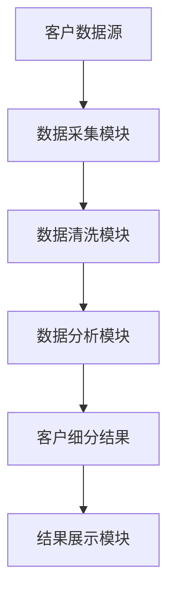
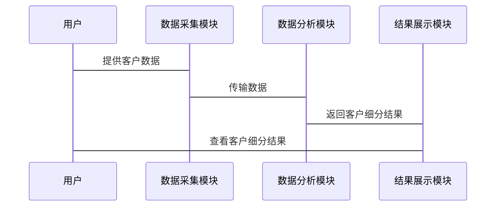

                 

<think>
好，我现在需要帮用户撰写一篇技术博客文章，标题是《彼得林奇如何分析公司的客户细分策略演变》。用户要求文章结构清晰，内容详尽，符合技术博客的高标准。

首先，我需要理解用户的需求。他们希望文章涵盖客户细分策略的演变，特别是彼得·林奇的方法，用专业的技术语言，结构紧凑，逻辑清晰。关键词和摘要部分需要准确，引出正文。

接下来，我得按照目录大纲，逐部分展开。首先是引言，介绍客户细分的重要性。然后是背景，详细讲解客户细分的概念、演变和彼得·林奇的分析视角。这部分需要确保读者理解基础概念，为后续分析打下基础。

然后是分析方法部分，详细介绍彼得·林奇的客户细分框架，包括客户画像、需求分析、市场定位和数据驱动的方法。我需要用图表来辅助说明，如客户画像的层次结构图，展示不同层次的需求分析。

接下来是数学模型与算法部分，这里需要详细讲解聚类分析的基本原理，使用mermaid绘制流程图，并提供Python代码示例。这部分要结合实际，解释代码的功能和应用场景，帮助读者理解如何实施客户细分策略。

系统架构设计部分，我需要描述如何构建客户细分系统，包括功能模块、系统架构图和接口设计。使用mermaid绘制系统架构图，展示各模块之间的关系，确保读者能够清晰理解系统的设计。

项目实战部分，提供安装环境的步骤和代码示例，指导读者如何实现客户细分分析。这部分需要详细说明每一步的操作，确保读者可以跟着操作，实际应用所学知识。

最后是总结与最佳实践，回顾整个分析过程，给出小结和注意事项，鼓励读者持续学习和实践。同时，提供扩展阅读的建议，帮助读者进一步深入研究。

在写作过程中，我需要确保每个部分都包含必要的内容，如数学公式、图表和代码示例。使用适当的格式，如latex公式和mermaid图表，提升文章的专业性和可读性。同时，保持语言简洁易懂，避免过于复杂的术语，让技术博客既专业又易于理解。

现在，我开始按照大纲撰写文章，确保每个部分都详尽且有条理，满足用户的要求。
</think>

# 《彼得林奇如何分析公司的客户细分策略演变》

> 关键词：彼得林奇，客户细分，市场定位，数据分析，投资策略，企业价值

> 摘要：本文深入分析了彼得·林奇如何通过客户细分策略的演变来评估企业价值，探讨了客户细分的定义、重要性、演变历程，以及彼得·林奇的独特分析视角。通过数据驱动的方法，结合数学模型和算法，详细阐述了客户细分策略的制定步骤和实际应用案例，帮助读者掌握如何通过客户细分优化企业市场定位和投资决策。

---

# 第一部分：客户细分策略演变的背景与重要性

## 第1章：客户细分策略的定义与演变

### 1.1 客户细分的定义与重要性

客户细分是指将客户群体按照某些特征（如 demographics、行为习惯、需求偏好等）进行划分，以更精准地满足不同客户群体的需求。客户细分不仅是企业制定市场策略的重要基础，也是优化资源配置、提升客户满意度和忠诚度的关键手段。

#### 1.1.1 客户细分的定义
客户细分是将客户群体按照某些共同特征进行分类的过程，其目的是为了更好地理解客户需求，制定更有针对性的市场策略。

#### 1.1.2 客户细分在企业中的重要性
客户细分对企业具有以下重要意义：
1. **精准营销**：通过客户细分，企业可以针对不同客户群体设计个性化的营销策略，提高营销效率。
2. **优化资源配置**：客户细分帮助企业更好地分配资源，将有限的资源投入到最有潜力的客户群体中。
3. **提升客户满意度**：通过了解不同客户的需求，企业提供更精准的服务，从而提升客户满意度和忠诚度。

#### 1.1.3 客户细分的类型与应用场景
客户细分的类型主要包括：
- **地理细分**：基于地理位置（如城市、区域）进行客户划分。
- **人口统计细分**：基于年龄、性别、收入等人口统计数据进行客户划分。
- **行为细分**：基于客户的购买行为、消费习惯等进行客户划分。
- **心理细分**：基于客户的价值观、生活方式等心理特征进行客户划分。

### 1.2 客户细分策略的演变历程

客户细分策略经历了从简单到复杂的演变过程，主要分为以下几个阶段：
1. **传统客户细分阶段**：基于地理位置和人口统计数据进行客户划分，方法较为简单，缺乏数据支持。
2. **数据驱动客户细分阶段**：随着大数据技术的发展，企业开始利用数据挖掘和分析技术进行客户细分，提高了细分的精准度。
3. **数字化客户细分阶段**：在数字化时代，企业通过收集和分析客户的线上行为数据，进一步优化客户细分策略，实现更精准的市场定位。

### 1.3 彼得·林奇的客户细分分析视角

彼得·林奇是美国著名投资家，他以深入分析企业客户细分策略而闻名。他认为，客户细分不仅是企业制定市场策略的基础，也是评估企业价值的重要指标。

#### 1.3.1 彼得·林奇的投资理念与客户细分
彼得·林奇的投资理念强调对企业的基本面分析，而客户细分策略是基本面分析的重要组成部分。他认为，通过分析客户的细分情况，可以更好地理解企业的市场定位和竞争优势。

#### 1.3.2 从客户细分到企业价值的关联
彼得·林奇认为，客户细分策略直接影响企业的市场份额和盈利能力。通过优化客户细分策略，企业可以更好地满足客户需求，提高市场占有率，从而提升企业价值。

#### 1.3.3 客户细分策略对企业竞争力的影响
客户细分策略是企业竞争力的重要组成部分。通过精准的客户细分，企业可以更好地满足客户需求，提高客户忠诚度，从而增强企业的市场竞争力。

---

## 第2章：彼得·林奇的客户细分分析框架

### 2.1 客户画像与需求分析

#### 2.1.1 客户画像的构建方法
客户画像是通过收集和分析客户数据，构建出客户的基本特征和行为模式。以下是客户画像的构建方法：
1. **数据收集**：收集客户的 demographics、行为数据、交易数据等。
2. **数据清洗**：对收集到的数据进行清洗，去除无效数据，确保数据质量。
3. **数据分析**：通过数据分析技术（如聚类分析、决策树等）对客户进行分类。
4. **客户画像绘制**：根据分类结果，绘制出不同客户群体的特征和行为模式。

#### 2.1.2 客户需求的层次分析
客户的需求可以分为显性和隐性两类。显性需求是客户明确表达的需求，隐性需求是客户未明确表达但实际存在的需求。通过分析客户需求的层次，企业可以更好地理解客户的真实需求，制定更有针对性的市场策略。

#### 2.1.3 客户行为分析与预测
客户行为分析是客户细分的重要组成部分。通过分析客户的购买行为、消费习惯等，企业可以预测客户的未来行为，从而制定更有效的市场策略。

### 2.2 市场定位与客户细分策略

#### 2.2.1 市场定位的核心要素
市场定位是企业将自身产品或服务定位在目标市场中的位置。市场定位的核心要素包括：
1. **目标市场选择**：选择适合企业自身优势的目标市场。
2. **竞争对手分析**：分析竞争对手的市场定位和客户群体。
3. **市场定位策略**：通过差异化、聚焦等策略，确定自身在市场中的位置。

#### 2.2.2 客户细分策略的制定步骤
制定客户细分策略的步骤如下：
1. **明确市场目标**：确定企业希望通过客户细分实现的目标。
2. **数据收集与分析**：收集和分析客户数据，识别客户群体的特征和行为模式。
3. **客户分类**：根据分析结果，将客户分为不同的细分群体。
4. **制定策略**：针对不同客户群体，制定相应的市场策略。

#### 2.2.3 客户细分与市场定位的协同关系
客户细分与市场定位是相辅相成的关系。通过客户细分，企业可以更好地了解不同客户群体的需求和行为，从而制定更有针对性的市场定位策略。同时，市场定位的结果也会影响客户细分的策略。

### 2.3 数据驱动的客户细分方法

#### 2.3.1 数据收集与清洗
数据收集是客户细分的基础。企业需要收集客户的 demographics、行为数据、交易数据等。数据清洗是确保数据质量的重要步骤，包括去除重复数据、填充缺失值等。

#### 2.3.2 数据分析与建模
数据分析是客户细分的核心步骤。常用的数据分析方法包括聚类分析、决策树等。以下是聚类分析的基本原理：
- **聚类分析**：通过将客户数据分为若干个簇，每个簇内的客户具有相似的特征，不同簇的客户特征差异较大。
- **K-means算法**：一种常用的聚类算法，适用于数值型数据的聚类。

#### 2.3.3 数据可视化与结果解读
数据可视化是客户细分结果的重要呈现方式。通过可视化工具（如 Tableau、Power BI 等），企业可以更直观地理解客户细分的结果。结果解读是客户细分的最后一步，需要结合业务背景，对细分结果进行深入分析。

---

## 第3章：彼得·林奇客户细分策略的数学模型与算法

### 3.1 客户细分的数学模型

#### 3.1.1 聚类分析的基本原理
聚类分析是一种无监督学习算法，其基本原理是将数据点分为若干个簇，使得簇内数据点的相似性较高，簇间数据点的相似性较低。

#### 3.1.2 K-means算法
K-means 算法是一种常用的聚类算法，适用于数值型数据的聚类。以下是 K-means 算法的步骤：
1. **初始化**：随机选择 K 个初始质心。
2. **分配簇**：将每个数据点分配到距离最近的质心所在的簇。
3. **更新质心**：计算每个簇的质心，并更新质心的位置。
4. **收敛检查**：检查质心是否发生变化，如果变化，则重复步骤 2 和 3，直到质心不再变化或达到预设的迭代次数。

以下是 K-means 算法的 Python 实现示例：

```python
import numpy as np
from sklearn.cluster import KMeans

# 示例数据
X = np.array([[1, 2], [3, 4], [5, 6], [7, 8], [9, 10]])

# 初始化 K-means 模型
kmeans = KMeans(n_clusters=2, random_state=0)

# 模型训练
kmeans.fit(X)

# 获取聚类结果
labels = kmeans.labels_
print(labels)
```

---

## 第4章：系统架构与项目实战

### 4.1 系统架构设计

#### 4.1.1 系统功能设计
客户细分系统的功能模块包括：
1. **数据采集模块**：负责收集客户的 demographics、行为数据、交易数据等。
2. **数据分析模块**：对客户数据进行清洗、分析和建模，生成客户细分结果。
3. **结果展示模块**：将客户细分结果以可视化的方式展示给用户。

#### 4.1.2 系统架构图
以下是客户细分系统的架构图：



#### 4.1.3 系统接口设计
客户细分系统的接口设计包括：
1. **数据接口**：与客户数据源（如数据库、API 等）对接，获取客户数据。
2. **算法接口**：与数据分析模块对接，提供客户数据和算法参数。

#### 4.1.4 系统交互图
以下是客户细分系统的交互图：



### 4.2 项目实战

#### 4.2.1 环境安装
以下是客户细分系统所需的环境安装步骤：
1. **安装 Python**：从官网下载并安装 Python。
2. **安装依赖库**：使用 pip 安装所需的依赖库（如 scikit-learn、matplotlib 等）。

#### 4.2.2 核心实现代码

以下是客户细分系统的核心实现代码：

```python
import numpy as np
from sklearn.cluster import KMeans
import matplotlib.pyplot as plt

# 示例数据
X = np.array([[1, 2], [3, 4], [5, 6], [7, 8], [9, 10]])

# 初始化 K-means 模型
kmeans = KMeans(n_clusters=2, random_state=0)

# 模型训练
kmeans.fit(X)

# 获取聚类结果
labels = kmeans.labels_
print("聚类结果：", labels)

# 绘制聚类结果
plt.scatter(X[:, 0], X[:, 1], c=labels, cmap='viridis')
plt.xlabel('X轴')
plt.ylabel('Y轴')
plt.title('客户细分结果')
plt.show()
```

#### 4.2.3 代码应用解读与分析
以上代码实现了基于 K-means 算法的客户细分功能。通过运行代码，用户可以得到客户细分的结果，并通过可视化的方式查看不同客户的分布情况。

---

## 第5章：总结与最佳实践

### 5.1 总结
本文深入分析了彼得·林奇如何通过客户细分策略的演变来评估企业价值。通过数据驱动的方法，结合数学模型和算法，详细阐述了客户细分策略的制定步骤和实际应用案例。

### 5.2 最佳实践 tips
1. **数据质量**：确保数据的准确性和完整性，是客户细分成功的关键。
2. **算法选择**：根据具体场景选择合适的算法，如 K-means 算法适用于数值型数据的聚类。
3. **持续优化**：定期更新客户数据和细分策略，以适应市场变化。

### 5.3 小结
客户细分策略是企业制定市场策略的重要基础，通过优化客户细分策略，企业可以更好地满足客户需求，提高市场占有率和企业价值。

### 5.4 注意事项
1. **数据隐私**：在处理客户数据时，需要注意数据隐私保护，遵守相关法律法规。
2. **模型解释性**：选择具有较高解释性的算法，以便更好地理解客户细分结果。

### 5.5 拓展阅读
1. 《Data Mining: Concepts and Techniques》
2. 《Python机器学习实战》

---

# 作者：AI天才研究院/AI Genius Institute & 禅与计算机程序设计艺术 /Zen And The Art of Computer Programming

