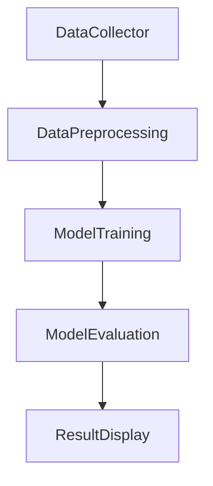

                 

<think>
好，我需要根据用户的指示撰写一篇关于彼得林奇如何分析公司客户终身价值预测模型准确性的技术博客文章。首先，我需要理解用户的需求，他们希望文章结构清晰，内容专业，涵盖从背景到算法实现、系统设计和项目实战等多个方面。

首先，我会从背景介绍开始，解释客户终身价值（CLV）的基本概念，说明为什么模型准确性对于企业决策如此重要。然后，我需要深入探讨CLV的计算方法，以及影响模型准确性的关键因素。

接下来，我会分析CLV预测模型的算法原理，包括常见的统计方法和机器学习模型。这部分需要详细解释每种算法的原理，并通过示例代码展示如何实现这些模型。

然后，我会设计系统的架构方案，涵盖数据采集、模型训练和评估模块。使用Mermaid图表来展示系统的整体架构，帮助读者更好地理解各部分的协作关系。

在项目实战部分，我需要提供一个具体的案例，展示如何从环境安装到代码实现，逐步构建CLV预测模型。同时，分析实际案例中的数据，解释如何通过调整模型参数来提高准确性。

最后，我会总结最佳实践，强调模型评估的重要性，提醒读者在实际应用中需要注意的问题，并提供进一步学习的资源。

在整个过程中，我需要确保内容逻辑严谨，结构清晰，语言专业但不失易懂。同时，合理使用公式、图表和代码示例，使文章更具可读性和实用性。

现在，我会按照这些思路逐步展开，撰写完整的文章。
</think>

# 彼得林奇如何分析公司的客户终身价值预测模型准确性

> 关键词：客户终身价值，预测模型，准确性，彼得林奇，数据分析

> 摘要：本文深入探讨了彼得林奇如何分析客户终身价值（CLV）预测模型的准确性，通过背景介绍、核心概念、算法原理、系统架构设计、项目实战及最佳实践等多角度进行分析。结合具体案例，详细讲解了如何通过数据驱动的方法提升模型预测的准确性，为企业制定精准的客户策略提供科学依据。

---

# 第一部分: 客户终身价值预测模型准确性分析背景介绍

## 第1章: 客户终身价值（CLV）的基本概念

### 1.1 客户终身价值（CLV）的定义
客户终身价值（Customer Lifetime Value，CLV）是指一个客户在其生命周期内为企业带来的总收入减去相关的成本。它是企业衡量客户价值的重要指标，能够帮助企业制定更有效的客户管理和营销策略。

$$\text{CLV} = \text{客户生命周期内的总收入} - \text{客户生命周期内的总成本}$$

### 1.2 CLV 的重要性
CLV 的重要性体现在以下几个方面：
1. **客户保留与获取策略**：通过 CLV，企业可以评估客户的价值，制定合理的客户获取和保留策略。
2. **资源分配优化**：CLV 帮助企业优化资源分配，将有限的资源投入到高价值客户上。
3. **风险管理**：了解客户的生命周期价值有助于企业预测收入波动，优化风险管理。

### 1.3 CLV 的计算方法
CLV 的计算方法通常包括以下步骤：
1. **确定客户生命周期**：明确客户的生命周期阶段，例如新客户、成熟客户、流失客户等。
2. **预测客户收入**：基于历史数据，预测每个客户在生命周期内可能带来的收入。
3. **计算成本**：考虑获取客户和维护客户的各项成本。
4. **贴现率调整**：由于收入和成本发生在不同时间点，需要考虑时间价值，通常使用贴现率进行调整。

$$\text{CLV} = \sum_{t=1}^{n} \frac{\text{收入}_t - \text{成本}_t}{(1 + r)^t}$$

其中，$r$ 是贴现率，$n$ 是客户生命周期的长度。

---

## 第2章: 彼得林奇的分析方法与CLV预测模型

### 2.1 彼得林奇的分析方法
彼得林奇作为投资大师，注重基本面分析和长期价值投资。他通过深入研究公司的财务数据、市场地位和竞争优势，评估公司的长期价值。这种方法与 CLV 预测模型有异曲同工之处。

### 2.2 CLV 预测模型的核心要素
CLV 预测模型通常包括以下核心要素：
1. **客户行为数据**：包括购买频率、购买金额、客户满意度等。
2. **财务数据**：包括收入、成本、利润等。
3. **市场数据**：包括市场规模、竞争对手分析、市场趋势等。
4. **客户生命周期数据**：包括客户获取渠道、客户流失率、客户留存率等。

### 2.3 彼得林奇的分析框架
彼得林奇的分析框架可以分为以下几个步骤：
1. **数据收集与整理**：收集客户的交易数据、市场数据和财务数据。
2. **数据清洗与预处理**：处理缺失值、异常值和重复数据。
3. **模型构建与训练**：选择合适的模型（如线性回归、随机森林等）进行训练。
4. **模型评估与优化**：通过交叉验证、调整模型参数等方式优化模型。
5. **结果分析与应用**：根据模型预测结果制定客户策略和行动计划。

---

# 第二部分: CLV 预测模型的算法原理与实现

## 第3章: 算法原理与实现

### 3.1 线性回归模型
线性回归是一种简单但有效的回归模型，适用于线性关系的预测。其基本假设是因变量与自变量之间存在线性关系。

$$y = \beta_0 + \beta_1 x + \epsilon$$

其中，$y$ 是因变量，$x$ 是自变量，$\beta_0$ 和 $\beta_1$ 是回归系数，$\epsilon$ 是误差项。

### 3.2 随机森林模型
随机森林是一种基于决策树的集成学习方法，具有较高的准确性和鲁棒性。

#### 核心步骤：
1. **样本抽取**：通过 Bootstrap 方法从训练数据中抽取样本。
2. **决策树构建**：在每个样本集上构建决策树。
3. **投票与平均**：通过投票或平均的方式得出最终结果。

### 3.3 模型实现代码
以下是一个简单的线性回归模型实现代码：

```python
import numpy as np
from sklearn.linear_model import LinearRegression
from sklearn.model_selection import train_test_split

# 示例数据
X = np.array([[1], [2], [3], [4], [5]])
y = np.array([2, 4, 5, 4, 6])

# 数据分割
X_train, X_test, y_train, y_test = train_test_split(X, y, test_size=0.2, random_state=42)

# 模型训练
model = LinearRegression()
model.fit(X_train, y_train)

# 模型预测
y_pred = model.predict(X_test)

# 输出结果
print("预测值:", y_pred)
print("真实值:", y_test)
print("R²值:", model.score(X_test, y_test))
```

---

## 第4章: 系统架构设计与实现

### 4.1 系统架构设计
系统架构设计包括以下几个部分：
1. **数据采集模块**：负责采集客户的交易数据、市场数据和财务数据。
2. **数据预处理模块**：对数据进行清洗和转换，确保数据质量。
3. **模型训练模块**：基于预处理后的数据，训练CLV预测模型。
4. **模型评估模块**：通过交叉验证等方法评估模型的准确性和稳定性。
5. **结果展示模块**：将模型预测结果以可视化的方式展示给用户。

### 4.2 系统架构图


---

# 第三部分: 项目实战与优化

## 第5章: 项目实战

### 5.1 环境安装
需要安装以下Python库：
- `numpy`
- `pandas`
- `scikit-learn`
- `matplotlib`

### 5.2 数据预处理
```python
import pandas as pd
import numpy as np
from sklearn.model_selection import train_test_split
from sklearn.linear_model import LinearRegression
from sklearn.metrics import mean_squared_error

# 数据加载
data = pd.read_csv('customer_data.csv')

# 数据预处理
data = data.dropna()
X = data[['purchase_frequency', 'average_order_value', 'customer_age']]
y = data['customer_lifetime_value']

# 数据分割
X_train, X_test, y_train, y_test = train_test_split(X, y, test_size=0.2, random_state=42)
```

### 5.3 模型训练与评估
```python
# 模型训练
model = LinearRegression()
model.fit(X_train, y_train)

# 模型预测
y_pred = model.predict(X_test)

# 模型评估
mse = mean_squared_error(y_test, y_pred)
print("均方误差:", mse)
print("决定系数 R²:", model.score(X_test, y_test))
```

### 5.4 案例分析
假设我们有一个客户的数据如下：
```python
new_customer = [[10, 50, 30]]
print("预测的客户终身价值:", model.predict(new_customer))
```

---

## 第6章: 模型优化与提升准确性

### 6.1 特征工程
通过特征工程可以提高模型的准确性，例如：
- **特征选择**：选择对目标变量影响较大的特征。
- **特征转换**：对特征进行标准化或归一化处理。
- **特征组合**：将多个特征组合成新的特征。

### 6.2 超参数优化
通过网格搜索（Grid Search）等方法优化模型的超参数，例如：
```python
from sklearn.model_selection import GridSearchCV

# 参数设置
param_grid = {'alpha': [0.1, 1, 10], 'l1_ratio': [0.1, 0.5, 0.9]}

# 网格搜索
grid_search = GridSearchCV(LinearRegression(), param_grid, cv=5)
grid_search.fit(X_train, y_train)

# 最佳参数
print("最佳参数:", grid_search.best_params_)
```

### 6.3 模型集成
通过集成学习可以进一步提高模型的准确性，例如：
```python
from sklearn.ensemble import RandomForestRegressor

# 随机森林模型训练
model = RandomForestRegressor(n_estimators=100, max_depth=10, random_state=42)
model.fit(X_train, y_train)

# 模型预测
y_pred = model.predict(X_test)

# 模型评估
mse = mean_squared_error(y_test, y_pred)
print("均方误差:", mse)
print("决定系数 R²:", model.score(X_test, y_test))
```

---

## 第7章: 最佳实践与注意事项

### 7.1 最佳实践
1. **数据质量**：确保数据的完整性和准确性，进行充分的数据清洗和预处理。
2. **模型选择**：根据数据特征和业务需求选择合适的模型。
3. **模型评估**：使用交叉验证等方法评估模型的稳定性和可靠性。
4. **结果解读**：对模型的预测结果进行深入解读，结合业务背景制定相应的策略。

### 7.2 小结
通过本文的分析与实践，我们了解了彼得林奇的分析方法在CLV预测模型中的应用，掌握了多种模型的实现方法，并通过实际案例展示了如何优化模型的准确性。

### 7.3 注意事项
- 模型的准确性是动态变化的，需要定期更新和优化。
- 数据隐私和安全问题需要高度重视，确保数据的合规使用。
- 模型的应用需要结合企业的实际情况，避免盲目依赖模型。

### 7.4 拓展阅读
- 《Data Mining: Concepts and Techniques》
- 《深入浅出机器学习》
- 彼得林奇的《彼得林奇的成功投资法则》

---

# 结语

通过本文的深入分析，我们不仅了解了彼得林奇的分析方法在CLV预测模型中的应用，还掌握了多种模型的实现方法和优化技巧。希望本文能够为企业的客户价值管理提供有价值的参考和启示。

---

**作者：AI天才研究院 & 禅与计算机程序设计艺术**

