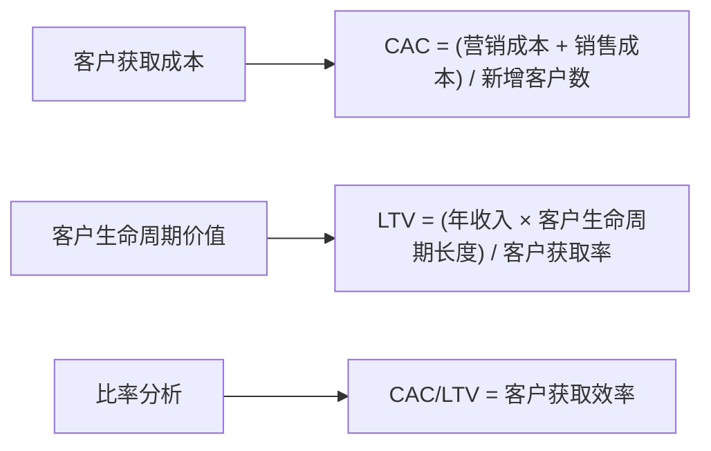
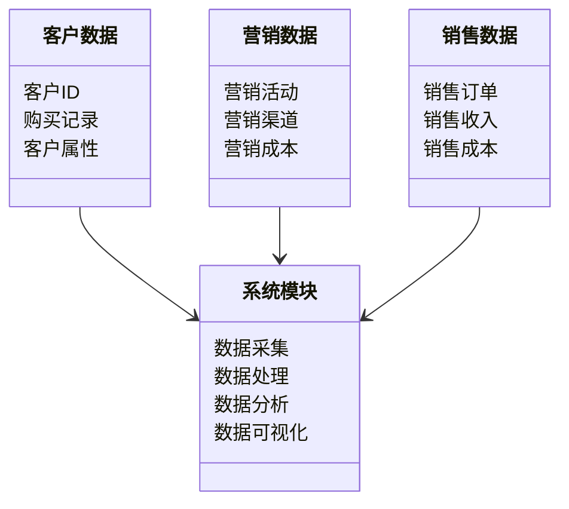
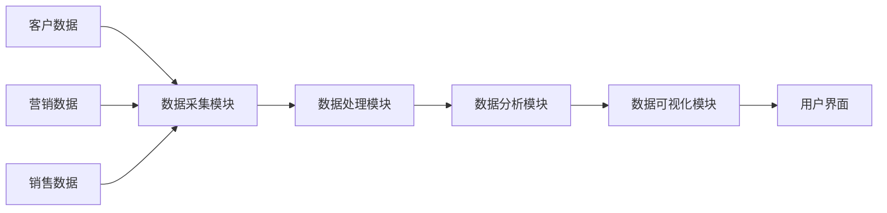
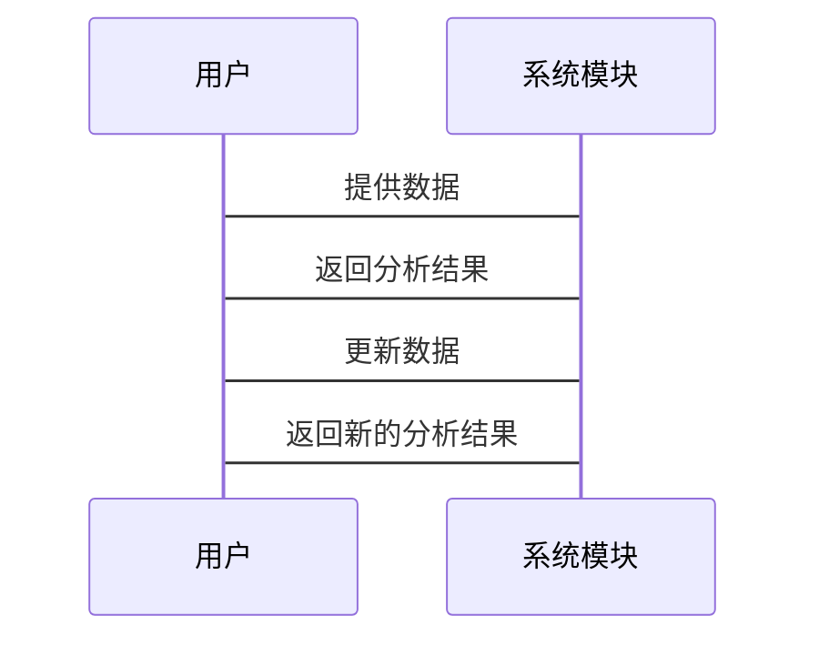

                 


# 彼得林奇如何分析公司的客户获取成本与终身价值比率

> 关键词：彼得·林奇，客户获取成本，终身价值，投资分析，比率分析，CAC，LTV

> 摘要：本文详细探讨了彼得·林奇如何分析公司的客户获取成本（CAC）与客户生命周期价值（LTV）的比率，从概念、计算、系统分析到实战案例，系统地阐述了如何通过CAC和LTV的比率来评估客户的盈利能力，优化投资决策，帮助企业在竞争激烈的市场中实现可持续增长。

---

## 第一部分：背景介绍

### 第1章：引言

#### 1.1 本书的目的与重要性
在当今竞争激烈的商业环境中，企业需要高效地获取和保留客户，以实现可持续增长。彼得·林奇作为投资界的传奇人物，提出了许多独到的见解，其中之一便是通过分析客户获取成本（CAC）与客户生命周期价值（LTV）的比率，来评估客户的盈利能力。本文将深入探讨这一主题，结合理论与实践，为企业和投资者提供实用的指导。

#### 1.2 彼得·林奇与投资分析的简介
彼得·林奇是全球著名投资专家，以其对企业的深刻洞察和投资策略闻名。他认为，企业的价值不仅在于其当前的财务表现，还在于其未来的盈利能力。通过分析客户的获取成本和终身价值，林奇能够识别出那些具有持续盈利能力的企业，从而做出明智的投资决策。

#### 1.3 客户获取成本与终身价值比率的核心概念
客户获取成本（CAC）是指企业吸引新客户所花费的所有成本，包括营销费用、销售费用等。客户生命周期价值（LTV）则是指客户在其生命周期内为企业带来的总收入减去成本后的净收益。通过分析CAC和LTV的比率，企业可以评估客户获取策略的效率，并优化资源配置。

---

## 第二部分：核心概念与联系

### 第2章：客户获取成本（CAC）与终身价值（LTV）的核心概念

#### 2.1 核心概念原理
客户获取成本（CAC）的计算公式如下：
$$CAC = \frac{\text{营销成本} + \text{销售成本}}{\text{新增客户数}}$$

客户生命周期价值（LTV）的计算公式如下：
$$LTV = \frac{\text{年收入} \times \text{客户生命周期长度}}{\text{客户获取率}}$$

CAC和LTV的比率（CAC/LTV）用于衡量客户获取的效率。理想的比率通常在1:3到1:5之间，这意味着每花费1元获取客户，企业在未来能够赚取3到5元的利润。

#### 2.2 概念属性特征对比
以下是CAC和LTV的属性对比：

| 属性         | 客户获取成本（CAC）                | 客户生命周期价值（LTV）               |
|--------------|-----------------------------------|------------------------------------|
| 定义         | 获取客户的总成本                 | 客户在生命周期内为企业带来的净收益 |
| 计算公式     | $$CAC = \frac{\text{营销成本} + \text{销售成本}}{\text{新增客户数}}$$ | $$LTV = \frac{\text{年收入} \times \text{客户生命周期长度}}{\text{客户获取率}}$$ |
| 目标         | 最小化获取成本                   | 最大化客户贡献价值                   |
| 影响因素     | 营销预算、销售团队效率           | 客户购买频率、平均订单价值、客户保留率 |

#### 2.3 ER实体关系图
以下是CAC和LTV的核心要素关系图：



---

## 第三部分：算法原理讲解

### 第3章：CAC与LTV的算法原理

#### 3.1 算法原理
CAC和LTV的计算过程可以通过以下步骤进行：

1. **数据收集**：收集企业的营销成本、销售成本、新增客户数、年收入、客户生命周期长度和客户获取率。
2. **计算CAC**：使用公式$$CAC = \frac{\text{营销成本} + \text{销售成本}}{\text{新增客户数}}$$计算客户获取成本。
3. **计算LTV**：使用公式$$LTV = \frac{\text{年收入} \times \text{客户生命周期长度}}{\text{客户获取率}}$$计算客户生命周期价值。
4. **计算比率**：使用公式$$\text{比率} = \frac{CAC}{LTV}$$分析客户获取的效率。

#### 3.2 代码实现
以下是计算CAC和LTV的Python代码示例：

```python
# 定义输入参数
marketing_cost = 100000  # 营销成本（元）
sales_cost = 50000       # 销售成本（元）
new_customers = 1000     # 新增客户数
annual_revenue = 500000  # 年收入（元）
customer_lifetime = 5     # 客户生命周期长度（年）
customer_acquisition_rate = 0.02  # 客户获取率

# 计算CAC
cac = (marketing_cost + sales_cost) / new_customers
print(f"CAC = {cac:.2f}元/客户")

# 计算LTV
ltv = (annual_revenue * customer_lifetime) / (1 / customer_acquisition_rate)
print(f"LTV = {ltv:.2f}元/客户")

# 计算比率
ratio = cac / ltv
print(f"CAC/LTV 比率 = {ratio:.2f}")
```

#### 3.3 案例分析
假设某公司今年的营销成本为10万元，销售成本为5万元，新增客户数为1000人，年收入为50万元，客户生命周期长度为5年，客户获取率为2%。根据上述代码，计算结果如下：

- CAC = 150元/客户
- LTV = 5,000,000元/客户
- 比率 = 0.03，即1:33.33

这表明该公司的客户获取成本远低于客户生命周期价值，客户获取效率较高。

---

## 第四部分：系统分析与架构设计方案

### 第4章：系统分析与架构设计

#### 4.1 问题场景介绍
企业需要实时监控客户获取成本和终身价值，以便优化市场策略和投资决策。为此，我们需要构建一个客户价值分析系统，包括数据采集、处理、分析和可视化模块。

#### 4.2 系统功能设计
以下是系统功能设计的领域模型：



#### 4.3 系统架构设计
以下是系统架构设计图：



#### 4.4 系统接口设计
系统接口设计包括数据采集接口、数据分析接口和数据可视化接口。每个接口都需要定义输入和输出格式，以确保数据的准确传输和处理。

#### 4.5 系统交互设计
以下是用户与系统的交互流程：



---

## 第五部分：项目实战

### 第5章：项目实战

#### 5.1 环境配置
项目需要以下环境：

- Python 3.8+
- 数据库（MySQL 或 PostgreSQL）
- 数据可视化库（Matplotlib、Seaborn）
- 开发工具（PyCharm、VS Code）

#### 5.2 核心实现
以下是核心实现代码：

```python
import pandas as pd
import matplotlib.pyplot as plt

# 数据加载
data = pd.read_csv('customer_data.csv')

# 计算CAC
cac = (data['营销成本'] + data['销售成本']) / data['新增客户数']

# 计算LTV
ltv = (data['年收入'] * data['客户生命周期长度']) / (1 / data['客户获取率'])

# 可视化
plt.figure(figsize=(10, 6))
plt.plot(data['客户ID'], cac, 'r-', label='CAC')
plt.plot(data['客户ID'], ltv, 'b-', label='LTV')
plt.xlabel('客户ID')
plt.ylabel('价值')
plt.legend()
plt.show()
```

#### 5.3 案例分析
以某SaaS公司为例，分析其CAC和LTV：

- 数据来源：客户数据.csv
- 数据处理：计算每个客户的CAC和LTV。
- 数据可视化：绘制CAC和LTV的趋势图，识别异常值和趋势变化。

---

## 第六部分：总结与展望

### 第6章：总结与展望

#### 6.1 总结
通过分析CAC和LTV的比率，企业可以优化客户获取策略，提高客户生命周期价值，从而实现可持续增长。彼得·林奇的方法为企业提供了宝贵的指导，帮助投资者和企业在竞争激烈的市场中脱颖而出。

#### 6.2 未来展望
未来，随着大数据和人工智能技术的发展，CAC和LTV的分析将更加精准和实时。企业可以通过预测分析和机器学习算法，进一步优化客户价值管理，提升投资回报率。

---

## 附录

### A.1 扩展阅读
- 彼得·林奇的《股票投资成功学》
- 《客户价值管理：理论与实践》

### A.2 工具与资源
- 数据可视化工具：Tableau、Power BI
- 数据分析库：Pandas、NumPy
- 开发框架：Django、Flask

---

作者：AI天才研究院/AI Genius Institute & 禅与计算机程序设计艺术/Zen And The Art of Computer Programming

