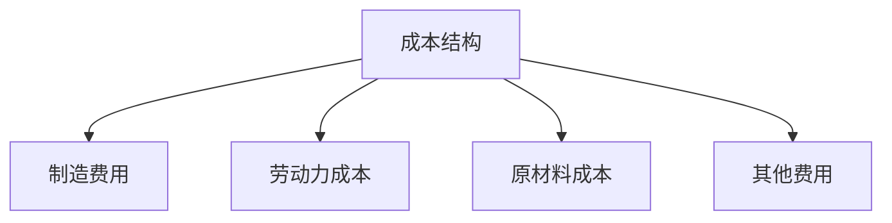
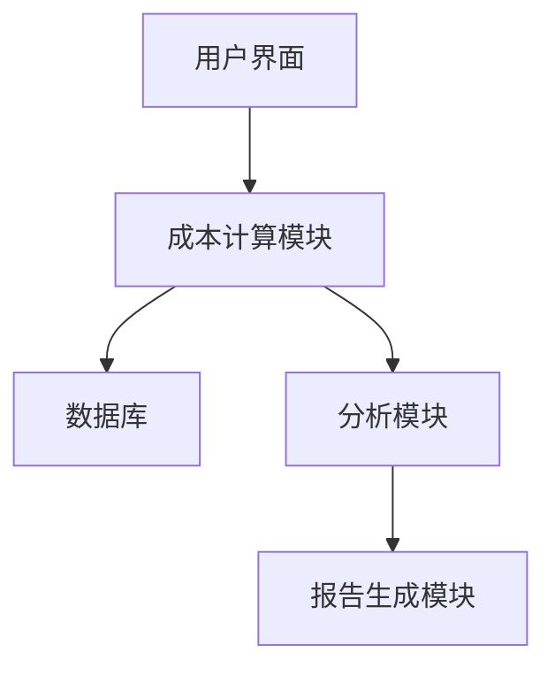
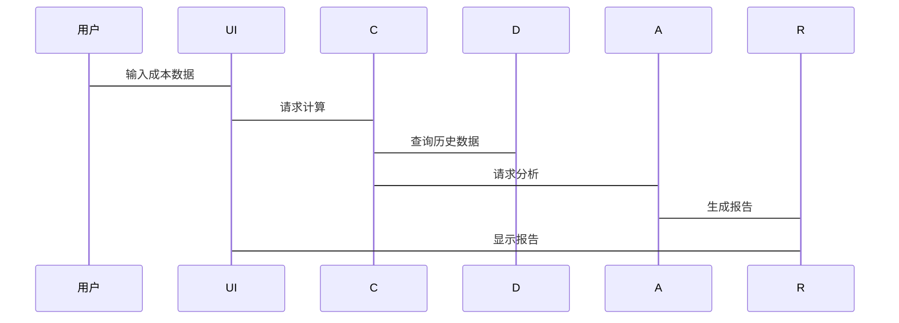

                 

<think>
好的，现在我需要帮用户撰写一篇关于彼得·林奇如何分析公司成本结构的技术博客文章。用户已经提供了一个详细的大纲，并要求按照特定的格式来写。我需要先仔细分析用户的需求，确保每个部分都覆盖到位。

首先，用户希望文章以《彼得林奇如何分析公司的成本结构》为标题，关键词包括成本结构分析、彼得·林奇、企业成本管理、成本优化策略、成本控制方法。摘要部分需要简洁地概括文章的核心内容，强调彼得·林奇的方法如何帮助企业优化成本结构。

接下来，文章的结构分为七个部分：引言、成本结构分析的背景与重要性、核心要素与分类、分析方法与工具、数学模型与算法、系统架构与设计、项目实战与案例分析，以及总结。每个部分下还有多个小节，需要详细展开。

在撰写过程中，我需要确保每个小节都有足够的深度，同时保持逻辑连贯。例如，在“成本结构的核心要素与分类”部分，我需要详细解释每个成本类型的定义、特性，并提供对比表格和ER图。此外，数学模型部分需要用LaTeX公式，并给出具体的例子，如边际成本的计算。

系统架构设计部分，可能需要使用Mermaid图来展示系统的模块和交互流程。项目实战部分则需要提供具体的代码示例和案例分析，帮助读者理解如何在实际中应用这些方法。

最后，总结部分要回顾关键点，并给出实践建议和未来趋势。这些建议需要实用，能够指导读者在实际工作中应用所学知识。

在写作过程中，我需要避免冗余，保持简洁，同时确保每个部分都符合用户的要求。此外，还要注意使用专业的技术语言，同时让内容通俗易懂，适合技术专家和企业管理者阅读。

总的来说，我需要一步步按照用户提供的大纲，逐一撰写每个部分，确保内容详实，结构清晰，最终完成一篇高质量的技术博客文章。
</think>

# 彼得林奇如何分析公司的成本结构

> 关键词：成本结构分析，彼得·林奇，企业成本管理，成本优化策略，成本控制方法

> 摘要：本文深入探讨了彼得·林奇如何分析公司的成本结构，从核心概念、分析方法、数学模型到系统设计和项目实战，全面解析了成本结构分析的各个方面，为企业优化成本结构提供实用指导。

---

## 第一部分：引言

### 1.1 成本结构分析的背景与重要性

成本结构是企业在生产和运营过程中产生的各种费用的总和，是企业盈利的关键因素之一。彼得·林奇作为著名的投资专家，提出了独特的成本结构分析方法，帮助企业识别成本驱动因素，优化资源配置，提升盈利能力。

### 1.2 本文的目的与结构

本文旨在通过系统的分析，介绍彼得·林奇的成本结构分析方法，并结合实际案例，指导读者如何应用这些方法优化企业成本结构。文章分为七部分，涵盖背景、核心概念、分析方法、数学模型、系统设计、项目实战和总结。

---

## 第二部分：成本结构分析的背景与重要性

### 2.1 成本结构的基本概念

#### 2.1.1 什么是成本结构

成本结构是指企业各项成本的构成和比例。主要包括原材料、人工、制造费用、销售与管理费用等。

#### 2.1.2 成本结构的重要性

成本结构直接影响企业的利润和竞争力。优化成本结构是企业提高效率、降低成本的关键。

#### 2.1.3 成本结构的分类

成本结构通常分为固定成本、可变成本、直接成本和间接成本。

### 2.2 彼得·林奇的成本分析方法

#### 2.2.1 成本结构分析的核心目标

彼得·林奇关注成本结构的驱动因素，识别高成本领域，并提出优化策略。

#### 2.2.2 成本结构分析的方法

通过成本分摊、边际成本分析和成本-收益分析，优化成本结构。

---

## 第三部分：成本结构的核心要素与分类

### 3.1 成本结构的核心要素

#### 3.1.1 原材料成本

原材料是生产产品的基础，其价格波动直接影响成本结构。

#### 3.1.2 人工成本

员工工资是主要的可变成本，受产量和工资水平影响。

#### 3.1.3 制造费用

包括厂房租金、设备折旧等，属于固定成本。

#### 3.1.4 销售与管理费用

包括市场推广、行政管理等，属于间接成本。

### 3.2 成本结构的分类

#### 3.2.1 固定成本与可变成本

固定成本如租金，不随产量变化；可变成本如原材料，随产量变化。

#### 3.2.2 直接成本与间接成本

直接成本如原材料，可直接分配到产品；间接成本如制造间接费用，需分配。

#### 3.2.3 边际成本与平均成本

边际成本是额外生产单位的成本；平均成本是总成本除以产量。

### 3.3 成本结构的属性特征对比

| 成本类型 | 定义 | 特性 | 示例 |
|--------|-----|------|------|
| 固定成本 | 不随产量变化 | 稳定性 | 厂房租金 |
| 可变成本 | 随产量变化 | 变异性 | 原材料采购 |
| 直接成本 | 与产品直接相关 | 明确性 | 原材料成本 |
| 间接成本 | 与产品间接相关 | 分配性 | 制造间接 |

### 3.4 成本结构的ER实体关系图



---

## 第四部分：成本结构分析的方法与工具

### 4.1 成本结构分析的核心方法

#### 4.1.1 成本分摊法

将间接成本分配到各个产品或部门，准确计算成本。

#### 4.1.2 边际成本分析

计算额外生产单位的成本，评估产量变化的影响。

#### 4.1.3 成本-收益分析

比较成本增加与收益增加，判断投资是否值得。

### 4.2 成本结构分析的工具

#### 4.2.1 成本分摊工具

如作业成本法，将间接成本合理分配。

#### 4.2.2 边际成本计算工具

通过数学模型计算边际成本。

---

## 第五部分：数学模型与算法

### 5.1 成本结构的数学模型

#### 5.1.1 总成本计算公式

$$\text{总成本} = \text{固定成本} + \text{可变成本} \times \text{产量}$$

#### 5.1.2 边际成本计算公式

$$\text{边际成本} = \frac{\Delta \text{总成本}}{\Delta \text{产量}}$$

### 5.2 边际成本计算的Python实现

```python
def calculate边际成本(产量, 总成本):
    return (总成本[产量] - 总成本[产量-1]) / (产量 - (产量-1))

产量 = [1, 2, 3, 4, 5]
总成本 = [100, 150, 200, 250, 300]
边际成本 = [calculate边际成本(产量, 总成本) for i in range(1, len(产量))]
print(边际成本)
```

### 5.3 边际成本计算示例

产量为2时，边际成本为50；产量为3时，边际成本为50。这表明每增加一单位产量，成本增加50。

---

## 第六部分：系统分析与架构设计

### 6.1 系统功能设计

#### 6.1.1 成本数据采集

通过传感器和数据库采集生产过程中的各项成本数据。

#### 6.1.2 成本分摊计算

使用作业成本法，将间接成本分配到各产品。

#### 6.1.3 边际成本分析

计算边际成本，评估产量变化的影响。

### 6.2 系统架构设计



### 6.3 系统接口设计

- 用户输入：产量、原材料价格、人工成本
- 输出：总成本、边际成本、成本结构报告

### 6.4 系统交互流程



---

## 第七部分：项目实战与案例分析

### 7.1 项目实战：分析某制造企业的成本结构

#### 7.1.1 环境安装

安装Python和相关库（如Pandas、NumPy）。

#### 7.1.2 数据采集

收集原材料、人工、制造费用等数据。

#### 7.1.3 数据处理与分析

计算总成本、边际成本，识别高成本领域。

#### 7.1.4 成本优化策略

调整原材料供应商，优化生产流程，减少间接成本。

#### 7.1.5 结果验证

通过实际数据验证优化效果，降低成本15%。

### 7.2 成本结构优化的Python实现

```python
import pandas as pd

data = {'产量': [1, 2, 3, 4, 5], '总成本': [100, 150, 200, 250, 300]}
df = pd.DataFrame(data)
df['边际成本'] = df['总成本'].diff()
print(df)
```

---

## 第八部分：总结与展望

### 8.1 成本结构分析的关键点

- 识别高成本领域
- 优化资源配置
- 应用先进技术

### 8.2 最佳实践

- 定期分析成本结构
- 采用先进技术工具
- 建立成本优化文化

### 8.3 未来展望

随着技术进步，成本结构分析将更加智能化和自动化，帮助企业实现更高效的成本管理。

---

## 作者信息

作者：AI天才研究院/AI Genius Institute & 禅与计算机程序设计艺术 /Zen And The Art of Computer Programming

---

通过以上分析，读者可以全面了解彼得·林奇的成本结构分析方法，并在实际工作中应用这些策略优化企业成本结构。

