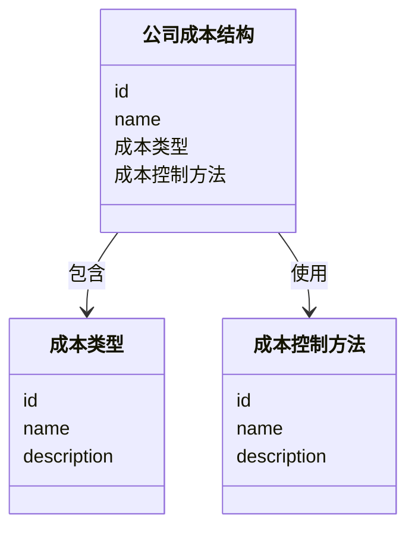
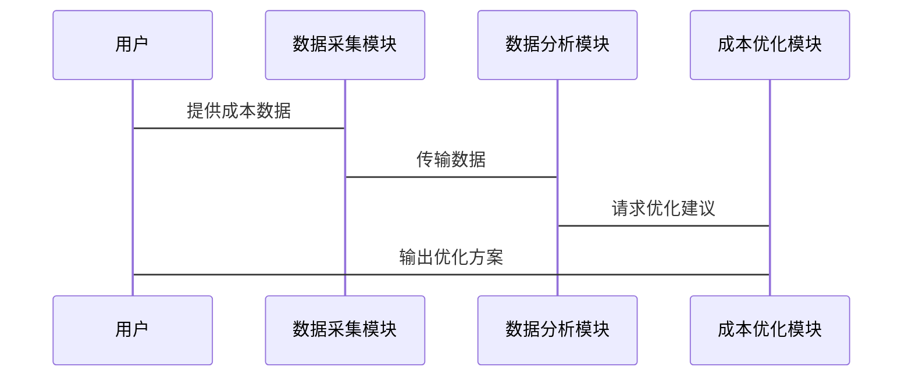

                 


# 彼得林奇如何分析公司的成本结构优化能力

> 关键词：成本结构优化，彼得林奇，企业成本分析，成本控制，竞争力分析

> 摘要：本文将详细介绍彼得·林奇如何通过分析公司的成本结构来评估其优化能力，进而判断企业的投资价值。我们将从成本结构优化的背景与核心概念出发，逐步深入探讨其算法原理、系统架构设计、项目实战以及最佳实践，帮助读者全面掌握成本结构优化的理论与应用。

---

## 第一部分: 成本结构优化的背景与核心概念

### 第1章: 成本结构优化的重要性

#### 1.1 什么是成本结构
##### 1.1.1 成本结构的定义
成本结构是指企业在生产或运营过程中所涉及的各种成本的构成方式。通常包括固定成本（如租金、 salaries）和变动成本（如原材料、运输费用）。

##### 1.1.2 成本结构的组成要素
- **固定成本**：与产量无关的成本，如厂房租金、设备折旧。
- **变动成本**：与产量直接相关的成本，如原材料采购、直接人工。
- **混合成本**：部分固定、部分变动的成本，如 utilities（水电气等）。

##### 1.1.3 成本结构与企业利润的关系
企业的利润 = 收入 - 成本。优化成本结构可以提高利润率，增强企业的盈利能力。

---

#### 1.2 成本结构优化的必要性
##### 1.2.1 优化成本结构对企业竞争力的影响
优化成本结构可以帮助企业降低单位产品成本，提高价格竞争力，从而在市场中占据优势。

##### 1.2.2 成本结构优化与企业盈利能力的关系
通过优化成本结构，企业可以减少浪费，提高资源利用率，从而增加净利润。

##### 1.2.3 成本结构优化在行业中的应用案例
- 案例1：某制造企业通过优化供应链管理，降低了原材料成本。
- 案例2：某零售企业通过数据分析优化库存管理，降低了库存成本。

---

#### 1.3 彼得林奇的成本结构分析方法
##### 1.3.1 彼得林奇的分析框架
彼得林奇通过分析企业的成本结构，判断其是否具备长期竞争优势。他重点关注企业的成本控制能力、成本动因以及成本结构的可持续性。

##### 1.3.2 成本结构优化的核心要素
- 成本类型
- 成本动因
- 成本控制方法

##### 1.3.3 成本结构优化的边界与外延
成本结构优化不仅关注内部成本，还包括外部供应链、合作伙伴的成本分担。

---

### 第2章: 成本结构优化的核心概念与联系

#### 2.1 成本结构优化的核心原理
##### 2.1.1 成本结构优化的理论基础
成本结构优化的理论基础包括成本会计学、管理学和经济学原理。

##### 2.1.2 成本结构优化的关键因素
- 成本动因
- 资源利用率
- 技术创新

#### 2.2 成本结构优化的核心要素对比
##### 2.2.1 成本类型对比分析
| 成本类型 | 特点 | 优化建议 |
|----------|------|----------|
| 固定成本 | 与产量无关 | 通过规模效应摊薄成本 |
| 变动成本 | 与产量相关 | 优化采购价格、提高效率 |

##### 2.2.2 成本控制方法对比
| 方法 | 优缺点 |
|------|--------|
| 传统成本控制 | 简单易行，但缺乏灵活性 |
| 现代成本控制 | 精细化管理，但需要较高的技术支持 |

##### 2.2.3 成本结构优化的优劣势分析
- 优势：提高企业利润率，增强竞争力。
- 劣势：需要投入时间和资源，可能面临短期成本增加的风险。

---

#### 2.3 成本结构优化的ER实体关系图

```mermaid
erDiagram
    company_cost_structure {
        id
        name
        cost_type
        cost_control_method
    }
    cost_type {
        id
        name
        description
    }
    cost_control_method {
        id
        name
        description
    }
    company_cost_structure --|{n} cost_type : 包含
    company_cost_structure --|{n} cost_control_method : 使用
```

---

## 第3章: 成本结构优化的算法原理与数学模型

### 3.1 成本结构优化的算法原理
#### 3.1.1 线性回归模型在成本结构优化中的应用
线性回归模型可以用于预测成本，帮助企业优化成本结构。

#### 3.1.2 成本结构优化的算法步骤
1. 数据收集：收集企业的成本数据。
2. 数据清洗：处理缺失值、异常值。
3. 模型训练：使用线性回归模型训练数据。
4. 模型评估：评估模型的准确性。
5. 成本预测：基于模型预测未来成本。

#### 3.1.3 算法的优缺点分析
- 优点：简单易行，适用于线性关系。
- 缺点：不适用于非线性关系，需要大量数据支持。

---

### 3.2 成本结构优化的数学模型

#### 3.2.1 线性回归模型
$$ y = a + bx $$

其中：
- \( y \)：预测成本
- \( a \)：截距
- \( b \)：斜率
- \( x \)：自变量（如产量）

#### 3.2.2 成本动因分析
$$ \text{总成本} = \text{固定成本} + (\text{单位变动成本} \times \text{产量}) $$

---

### 3.3 成本结构优化的Python代码实现

```python
import pandas as pd
from sklearn.linear_model import LinearRegression
from sklearn.metrics import mean_squared_error

# 数据准备
data = {
    '产量': [100, 200, 300, 400, 500],
    '成本': [1000, 1200, 1400, 1600, 1800]
}
df = pd.DataFrame(data)

# 模型训练
model = LinearRegression()
model.fit(df[['产量']], df['成本'])

# 模型预测
predictions = model.predict(df[['产量']])

# 模型评估
mse = mean_squared_error(df['成本'], predictions)
print(f'均方误差: {mse}')
print(f'斜率: {model.coef_[0]}')
print(f'截距: {model.intercept_}')
```

---

### 3.4 本章小结
本章详细介绍了成本结构优化的算法原理与数学模型，重点讲解了线性回归模型的应用，并通过Python代码实现了模型的训练与预测。

---

## 第4章: 成本结构优化的系统分析与架构设计

### 4.1 系统功能设计
#### 4.1.1 领域模型


#### 4.1.2 系统架构设计


#### 4.1.3 系统接口设计
- 数据输入接口：接收成本数据
- 数据输出接口：输出优化建议

#### 4.1.4 系统交互设计


---

## 第5章: 成本结构优化的项目实战

### 5.1 环境安装
- 安装Python、Pandas、Scikit-learn等工具。

### 5.2 核心代码实现
```python
import pandas as pd
from sklearn.linear_model import LinearRegression

# 数据准备
data = {
    '产量': [100, 200, 300, 400, 500],
    '成本': [1000, 1200, 1400, 1600, 1800]
}
df = pd.DataFrame(data)

# 模型训练
model = LinearRegression()
model.fit(df[['产量']], df['成本'])

# 成本预测
print(f'预测成本：{model.predict([[600]])}')
```

### 5.3 案例分析
以某制造企业为例，分析其成本结构优化过程，并给出优化建议。

---

## 第6章: 成本结构优化的最佳实践

### 6.1 小结
通过分析成本结构，优化成本动因，选择合适的成本控制方法，可以显著降低企业成本。

### 6.2 注意事项
- 注重数据的准确性
- 考虑企业的实际情况
- 长期与短期成本优化相结合

### 6.3 拓展阅读
推荐书籍：《彼得·林奇的投资策略》

---

## 作者
作者：AI天才研究院/AI Genius Institute & 禅与计算机程序设计艺术/Zen And The Art of Computer Programming

