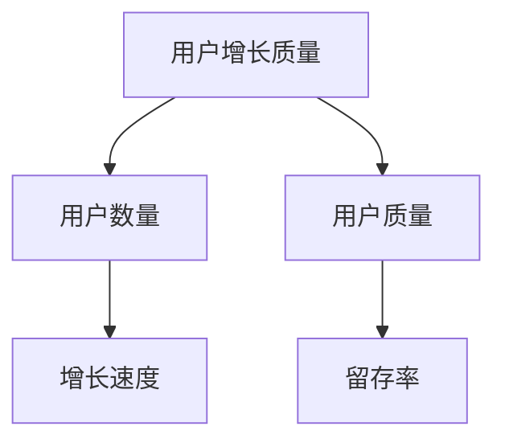
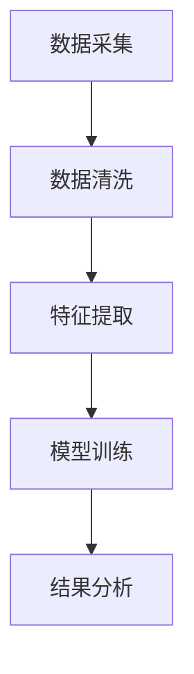
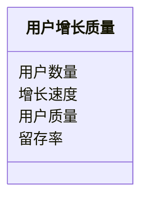
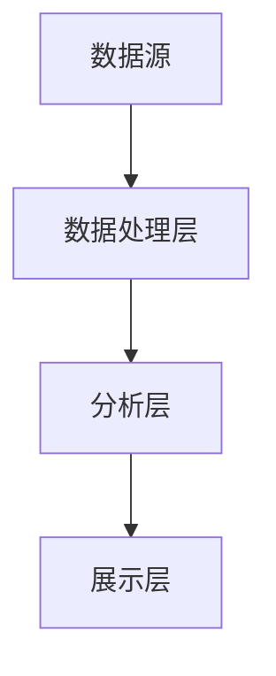

                 


# 彼得·林奇如何分析公司的用户增长质量

---

## 关键词：
- 彼得·林奇
- 用户增长质量
- 投资分析
- 用户留存率
- 用户生命周期

---

## 摘要：
本文将深入探讨彼得·林奇如何分析公司的用户增长质量。通过分析用户增长质量的核心概念、评估方法、影响因素及其与企业价值的关系，结合数学模型和实际案例，帮助投资者和企业管理者更好地理解如何通过用户增长质量来评估公司的长期价值。文章还将介绍用户增长质量的分析工具和最佳实践，为读者提供全面的指导。

---

# 第一部分：用户增长质量的背景与概念

## 第1章：用户增长质量的核心概念

### 1.1 用户增长质量的定义与背景

#### 1.1.1 什么是用户增长质量
用户增长质量是指公司在一定时间内新增用户的数量与其质量的综合表现。高质量的用户不仅数量多，而且具有较高的活跃度、留存率和生命周期价值（CLV）。彼得·林奇认为，用户增长质量是评估公司长期价值的重要指标，因为它直接关系到公司的收入增长和盈利能力。

#### 1.1.2 用户增长质量的重要性
用户增长质量是公司可持续发展的关键。高质量的用户能够为公司带来长期的收入和利润，而低质量的用户可能会增加获客成本并降低整体收益。彼得·林奇强调，投资时应关注用户增长质量，而非单纯追求用户数量。

#### 1.1.3 彼得·林奇与用户增长质量的关系
彼得·林奇作为著名的投资专家，注重从用户增长质量的角度分析公司的潜力。他认为，用户增长质量反映了公司的产品吸引力、市场定位和运营能力。通过分析用户增长质量，投资者可以更好地判断公司的长期价值。

---

### 1.2 用户增长质量的核心要素

#### 1.2.1 用户数量与增长速度
用户数量是用户增长质量的重要组成部分，但单纯的用户数量并不足以衡量质量。彼得·林奇认为，增长速度应与行业平均水平进行比较，以判断公司的增长是否具有可持续性。

#### 1.2.2 用户质量与活跃度
用户质量是指用户的行为特征，如活跃度和参与度。活跃的用户更有可能为公司创造收入，而低活跃度的用户则可能增加成本。彼得·林奇建议，投资者应关注用户的活跃率和留存率，以评估用户质量。

#### 1.2.3 用户留存率与生命周期
用户留存率是衡量用户质量的关键指标。彼得·林奇认为，高留存率的用户通常具有更高的生命周期价值，能够为公司带来持续的收入。通过分析用户的生命周期，投资者可以更好地评估公司的长期增长潜力。

---

### 1.3 用户增长质量的边界与外延

#### 1.3.1 用户增长质量的边界条件
用户增长质量的分析应基于合理的边界条件，例如时间周期、行业特点和公司发展阶段。彼得·林奇强调，投资者应根据具体情况调整分析方法，避免盲目比较。

#### 1.3.2 用户增长质量与其他指标的关系
用户增长质量与收入增长率、利润 margins、客户获取成本（CAC）等指标密切相关。通过综合分析这些指标，投资者可以更全面地评估公司的增长潜力。

#### 1.3.3 用户增长质量的长期与短期影响
用户增长质量对公司的长期和短期表现都有重要影响。短期内，高质量的用户能够快速带来收入；长期来看，持续的用户增长质量是公司持续增长的核心动力。

---

## 第2章：用户增长质量的核心概念与联系

### 2.1 用户增长质量的核心原理

#### 2.1.1 用户增长质量的数学模型
用户增长质量可以通过以下公式进行量化：
$$ \text{用户增长质量} = \frac{\text{新增用户数} \times \text{用户留存率}}{\text{时间周期}} $$

#### 2.1.2 用户增长质量的因果关系
用户增长质量是由多种因素共同作用的结果，例如产品特性、市场定位、营销策略等。彼得·林奇认为，投资者应深入分析这些因素之间的因果关系，以判断用户增长质量的可持续性。

#### 2.1.3 用户增长质量的动态平衡
用户增长质量的分析需要动态平衡短期和长期目标。彼得·林奇强调，投资者应关注用户增长质量的长期趋势，而非短期波动。

---

### 2.2 用户增长质量的核心属性特征对比

#### 2.2.1 用户增长质量的属性特征
| 属性 | 特征 |
|------|------|
| 用户数量 | 增长速度与行业基准对比 |
| 用户质量 | 活跃率和留存率 |
| 用户生命周期 | 生命周期价值（CLV） |

#### 2.2.2 用户增长质量与其他指标的对比
| 指标 | 区别 | 关系 |
|------|------|------|
| 用户增长质量 | 用户数量与质量的综合表现 | 核心驱动因素 |
| 用户留存率 | 用户留存情况 | 关键质量指标 |
| 用户活跃度 | 用户参与程度 | 质量评估的重要维度 |

#### 2.2.3 用户增长质量的可视化表现


---

## 第3章：用户增长质量的分析方法

### 3.1 用户增长质量的算法原理

#### 3.1.1 用户增长质量的算法流程图


#### 3.1.2 用户增长质量的数学模型与公式
用户增长质量的计算公式：
$$ \text{用户增长质量} = \frac{\text{新增用户数} \times \text{用户留存率}}{\text{时间周期}} $$

---

### 3.2 用户增长质量的系统分析与架构设计方案

#### 3.2.1 系统功能设计（领域模型）


#### 3.2.2 系统架构设计


---

## 第4章：用户增长质量的项目实战

### 4.1 环境安装与数据准备
- 数据采集工具：Google Analytics、Mixpanel
- 数据清洗工具：Python（Pandas、NumPy）

### 4.2 核心代码实现
```python
import pandas as pd
import numpy as np

# 示例数据
data = {
    '新增用户数': [1000, 1200, 1500],
    '留存率': [0.8, 0.75, 0.9],
    '时间周期': ['月', '月', '月']
}

df = pd.DataFrame(data)

# 计算用户增长质量
df['用户增长质量'] = (df['新增用户数'] * df['留存率']) / df['时间周期'].apply(lambda x: 1 if x == '月' else 0)

print(df)
```

### 4.3 案例分析与结果解读
以一家互联网公司为例，分析其用户增长质量：
- 新增用户数：1500
- 留存率：0.9
- 时间周期：月
- 用户增长质量：$$ \frac{1500 \times 0.9}{1} = 1350 $$

---

## 第5章：用户增长质量的总结与最佳实践

### 5.1 总结
用户增长质量是评估公司长期价值的重要指标。彼得·林奇通过分析用户增长质量，帮助投资者识别具有潜力的公司。本文通过理论、方法和案例的结合，为读者提供了全面的指导。

### 5.2 最佳实践
- 定期分析用户的留存率和活跃度
- 结合行业基准评估增长质量
- 关注用户的生命周期价值

### 5.3 注意事项
- 避免仅关注用户数量
- 确保数据的准确性和完整性
- 考虑公司的具体业务场景

### 5.4 未来趋势
随着数字化转型的深入，用户增长质量的重要性将更加凸显。彼得·林奇认为，未来投资者将更加依赖数据分析工具和技术，以更精准地评估用户增长质量。

---

## 作者：AI天才研究院/AI Genius Institute & 禅与计算机程序设计艺术 /Zen And The Art of Computer Programming

---

**温馨提示：**
如需进一步的技术支持或内容优化，请随时联系我们。我们期待为您的项目提供更深入的洞察与指导！

