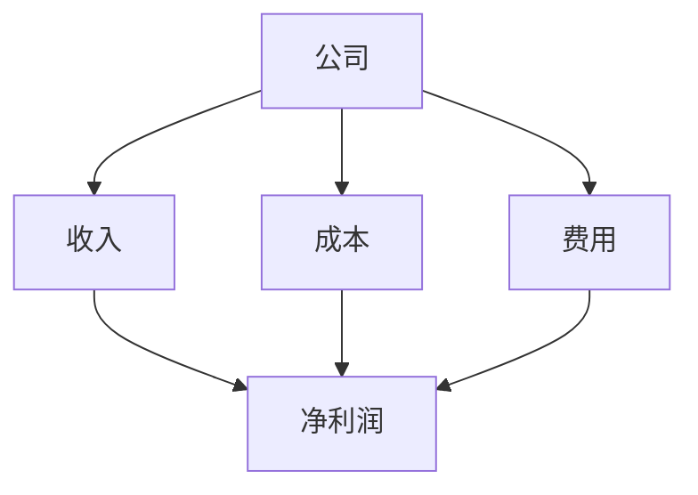
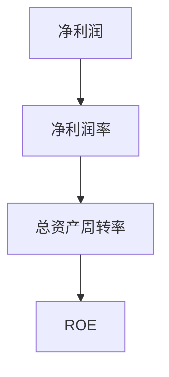
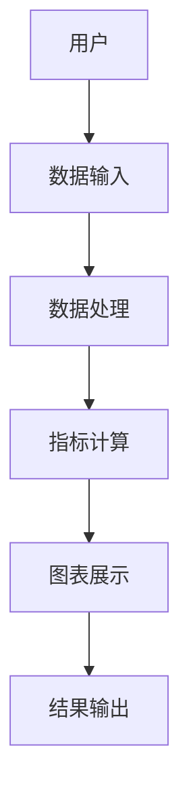

                 

<think>
好，用户希望我以彼得·林奇分析公司盈利能力为主题，撰写一篇结构清晰、内容丰富的技术博客。首先，我需要理解彼得·林奇的投资方法，特别是他如何分析公司的盈利能力。他强调长期投资和选择优秀公司，这可能涉及到一些具体的指标，如净利润、毛利率和ROE。

接下来，我需要确定文章的结构。用户提供的目录包括背景介绍、核心概念、算法原理、系统分析、项目实战和最佳实践。我得确保每个部分都有足够的细节，比如在算法原理部分，可能需要解释杜邦分析法，并用mermaid流程图展示。

我还需要考虑用户的使用场景，可能是一个技术博客，读者可能是程序员或CTO，他们对技术分析和投资感兴趣。因此，文章需要专业但易懂，结合技术术语和投资策略。

用户希望用技术语言，所以我会用数学公式和图表来解释概念。例如，用latex公式展示ROE，用mermaid图展示分析框架。同时，项目实战部分需要实际案例，如分析苹果或亚马逊，展示如何应用这些方法。

最后，我需要确保文章结尾有作者信息，并添加相关关键词和摘要。整体结构要逻辑清晰，每个章节内容丰富，满足读者的学习和应用需求。
</think>

# 彼得林奇如何分析公司的盈利能力

## 关键词：彼得·林奇，盈利能力，投资分析，杜邦分析法，ROE，净利润率

## 摘要：  
本文将详细介绍彼得·林奇如何分析公司的盈利能力。通过解析他的投资理念、分析框架和具体方法，帮助读者理解如何从财务数据中挖掘公司盈利能力的关键指标。文章将从盈利能力的核心概念、数学模型、算法原理、系统架构到实际案例进行详细阐述，并结合代码实现和图表分析，帮助读者掌握彼得·林奇的分析方法。

---

## 第一部分: 背景介绍与核心概念

### 第1章: 投资的基本概念与盈利能力的重要性

#### 1.1 投资的基本概念  
投资是指将资金投入某个项目或企业，以期获得未来收益的行为。投资的核心目标是通过资产配置和价值挖掘，实现财富的保值与增值。  

#### 1.2 彼得·林奇的投资理念  
彼得·林奇是美国著名投资经理人，被誉为“共同基金先生”。他的投资理念主要包括以下几点：  
1. **长期投资**：林奇认为，成功的投资需要耐心，长期持有优质资产才能获得超额收益。  
2. **价值投资**：他注重分析公司的基本面，寻找那些被市场低估的优质企业。  
3. **分散投资**：林奇主张通过分散投资降低风险，避免将所有资金投入单一资产。  

#### 1.3 盈利能力的重要性  
盈利能力是衡量一家公司财务健康状况的核心指标。通过分析盈利能力，投资者可以判断公司的经营效率、成本控制能力和市场竞争力。  

---

### 第2章: 彼得·林奇的盈利能力分析方法  

#### 2.1 林奇的分析框架  
林奇的盈利能力分析框架可以分为以下几个步骤：  
1. **行业分析**：了解公司的行业地位，判断行业周期性。  
2. **财务数据解读**：通过分析公司财报中的净利润、毛利率等指标，评估公司的盈利能力。  
3. **竞争优势分析**：研究公司的核心竞争力，判断其是否具备长期盈利的潜力。  

#### 2.2 林奇的核心投资理念  
1. **净利润分析**：林奇认为，净利润是衡量公司盈利能力的核心指标，因为它反映了公司扣除所有成本和费用后的最终收益。  
2. **毛利率分析**：毛利率反映了公司在产品销售中的定价能力和成本控制能力。  
3. **ROE分析**：净资产收益率（ROE）是衡量公司使用股东资金效率的重要指标，ROE越高，公司的盈利能力越强。  

---

## 第二部分: 核心概念与联系  

### 第3章: 盈利能力分析的核心概念  

#### 3.1 盈利能力的数学模型  

##### 净利润公式  
$$ \text{净利润} = \text{收入} - \text{成本} - \text{费用} $$  

##### 毛利率公式  
$$ \text{毛利率} = \frac{\text{收入} - \text{成本}}{\text{收入}} $$  

##### 净资产收益率（ROE）公式  
$$ \text{ROE} = \frac{\text{净利润}}{\text{净资产}} $$  

#### 3.2 盈利能力分析的维度对比  

##### 净利润与毛利率的对比分析  
| 指标   | 定义                          | 作用                          |  
|--------|------------------------------|-------------------------------|  
| 净利润 | 收入扣除成本和费用后的利润  | 反映公司整体盈利能力          |  
| 毛利率 | 收入扣除成本后的利润率      | 反映公司产品定价和成本控制能力 |  

##### ROE与ROA的对比分析  
| 指标   | 定义                          | 作用                          |  
|--------|------------------------------|-------------------------------|  
| ROE    | 净利润与净资产的比率          | 反映公司使用股东资金的效率    |  
| ROA    | 净利润与总资产的比率          | 反映公司资产的使用效率        |  

#### 3.3 盈利能力分析的ER实体关系图  


---

## 第三部分: 算法原理讲解  

### 第4章: 盈利能力分析的算法原理  

#### 4.1 杜邦分析法  
杜邦分析法是一种常用的财务分析方法，通过分解ROE，帮助投资者更好地理解公司的盈利来源。  

##### 杜邦分析法的步骤  
1. 计算净利润率：$$ \text{净利润率} = \frac{\text{净利润}}{\text{收入}} $$  
2. 计算总资产周转率：$$ \text{总资产周转率} = \frac{\text{收入}}{\text{总资产}} $$  
3. 计算ROE：$$ \text{ROE} = \text{净利润率} \times \text{总资产周转率} \times \text{杠杆比率} $$  

##### 杜邦分析法的mermaid流程图  


#### 4.2 净利润分析算法  
净利润分析算法通过计算净利润，评估公司整体盈利能力。  

##### 净利润分析算法的代码实现  
```python
def calculate_net_profit(income, cost, expenses):
    return income - cost - expenses
```

#### 4.3 毛利率分析算法  
毛利率分析算法通过计算毛利率，评估公司产品定价和成本控制能力。  

##### 毛利率分析算法的代码实现  
```python
def calculate_gross_margin(income, cost):
    return (income - cost) / income
```

---

## 第四部分: 系统分析与架构设计  

### 第5章: 盈利能力分析的系统架构  

#### 5.1 问题场景介绍  
假设我们正在开发一个投资分析系统，需要对公司的盈利能力进行自动化分析。  

#### 5.2 系统功能设计  
系统功能包括：  
1. 数据输入与处理  
2. 盈利能力指标计算  
3. 图表可视化  

#### 5.3 系统架构设计  


---

## 第五部分: 项目实战  

### 第6章: 盈利能力分析的项目实战  

#### 6.1 环境安装  
需要安装Python和相关库（如pandas、matplotlib）。  

#### 6.2 系统核心实现源代码  
```python
import pandas as pd
import matplotlib.pyplot as plt

def calculate_roe(net_profit, equity):
    return net_profit / equity

def main():
    # 输入数据
    net_profit = 1000000
    equity = 5000000
    roe = calculate_roe(net_profit, equity)
    print(f"ROE: {roe:.2f}%")
    
    # 图表展示
    plt.figure(figsize=(10, 6))
    plt.bar(['ROE'], [roe*100], label='ROE (%)')
    plt.title(' profitability Analysis')
    plt.legend()
    plt.show()

if __name__ == "__main__":
    main()
```

#### 6.3 代码应用解读与分析  
上述代码计算了ROE，并通过柱状图展示了结果。ROE越高，说明公司的净资产收益率越高，盈利能力越强。  

#### 6.4 实际案例分析  
以苹果公司为例，假设净利润为100亿美元，净资产为500亿美元，计算ROE为20%。这表明苹果公司每投入1美元净资产，可以产生0.2美元的净利润。  

---

## 第六部分: 最佳实践与小结  

### 第7章: 最佳实践与小结  

#### 7.1 投资的注意事项  
1. **长期投资**：避免短期波动的干扰，耐心持有优质资产。  
2. **分散投资**：通过分散投资降低风险。  
3. **持续学习**：不断提升自己的财务分析能力。  

#### 7.2 盈利能力分析的注意事项  
1. **数据的准确性**：确保财务数据的来源可靠。  
2. **行业差异**：不同行业的盈利能力指标可能有不同的标准。  
3. **动态分析**：结合历史数据和未来预期进行分析。  

#### 7.3 项目小结  
通过本文的介绍，读者可以掌握彼得·林奇的盈利能力分析方法，并通过实际案例和代码实现，加深对相关概念的理解。  

---

## 作者：AI天才研究院/AI Genius Institute & 禅与计算机程序设计艺术 /Zen And The Art of Computer Programming

