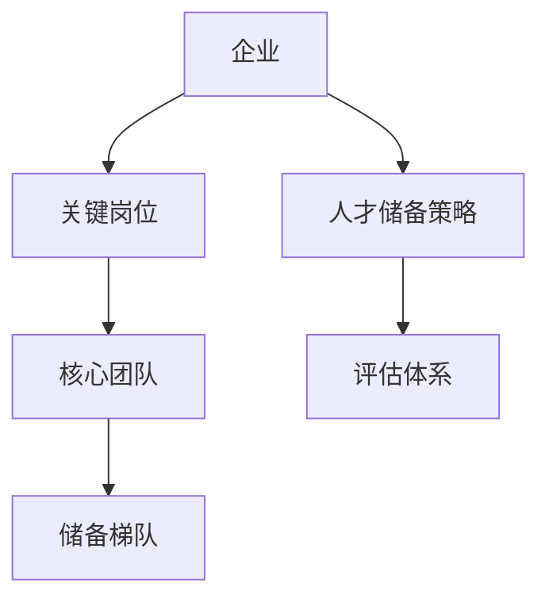
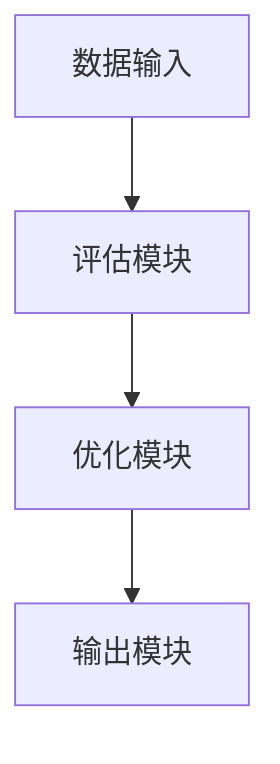

                 


# 彼得林奇如何看待公司的人才储备策略

## 关键词：人才储备策略，彼得·林奇，投资理念，企业战略，系统设计

## 摘要：  
彼得·林奇作为世界著名投资家，其投资理念和方法论不仅在金融领域取得了巨大成功，也为公司的人才储备策略提供了深刻的启示。本文将从背景介绍、核心概念、评估体系、系统分析与架构设计、项目实战等多个维度，详细探讨彼得·林奇的人才储备策略，为读者提供全面而深入的分析。通过本文，读者可以理解人才储备在企业战略中的重要性，掌握如何构建和优化人才储备体系，并通过实际案例分析，学习如何将彼得·林奇的投资理念应用于公司的人才管理实践中。

---

## 第1章: 人才储备策略的背景介绍

### 1.1 人才储备的重要性

#### 1.1.1 企业发展的基石：人才储备  
企业的核心竞争力不仅取决于技术创新和资本运作，更取决于人才的储备与培养。人才是企业发展的第一资源，是企业创新和发展的根本动力。在快速变化的商业环境中，企业需要建立完善的人才储备策略，以应对未来可能出现的挑战和机遇。

#### 1.1.2 人才储备与企业竞争力的关系  
人才储备是企业竞争力的核心要素之一。优秀的人才储备能够确保企业在关键时刻拥有足够的资源来应对市场变化、技术革新和竞争压力。特别是在高技术行业，人才储备的质量和数量直接决定了企业的技术创新能力和市场竞争力。

#### 1.1.3 人才储备在企业战略中的地位  
在企业战略中，人才储备不仅是人力资源管理的一部分，更是企业长期发展的关键战略。通过科学的人才储备策略，企业可以确保在关键岗位上拥有高素质的后备人才，从而提升企业的整体竞争力。

### 1.2 彼得·林奇的投资理念与人才储备

#### 1.2.1 彼得·林奇的投资哲学概述  
彼得·林奇是美国著名投资家，以其独特的投资理念和长期的投资业绩而闻名。他认为，投资的本质是寻找那些具有持续竞争优势的企业，并长期持有这些企业的股票。他的投资哲学强调对企业基本面的深入分析，以及对管理层能力的信任。

#### 1.2.2 投资理念与人才储备的联系  
尽管彼得·林奇的投资理念主要应用于金融领域，但其核心思想——选择优秀的企业并长期支持其发展——可以类比于人才储备策略。优秀的人才是企业的“优质资产”，企业需要通过科学的储备策略，选择和培养那些具有潜力和能力的员工，并为其提供长期发展的机会。

#### 1.2.3 彼得·林奇对人才储备的独特见解  
彼得·林奇认为，投资的关键在于找到那些具有持续增长潜力的企业。同样，在人才储备方面，企业需要关注那些具有长期发展潜力的员工，并为其提供成长的机会。通过建立科学的人才储备体系，企业可以确保在关键岗位上拥有高素质的后备人才，从而实现企业的长期发展。

### 1.3 人才储备策略的核心要素

#### 1.3.1 人才储备的定义与范围  
人才储备是指企业在当前岗位之外，储备一定数量的高素质人才，以应对未来可能出现的人才需求。这种储备不仅包括关键岗位的后备人才，还包括企业未来发展的潜在人才。

#### 1.3.2 人才储备的边界与外延  
人才储备的边界主要取决于企业的战略目标和组织结构。从外延上看，人才储备不仅包括内部培养的后备人才，还包括外部招聘的优秀人才。企业需要根据自身的发展需求，制定相应的人才储备策略。

#### 1.3.3 人才储备的核心要素组成  
人才储备的核心要素包括：  
1. **目标岗位**：明确哪些岗位需要储备人才。  
2. **人才标准**：确定储备人才的能力、经验和素质要求。  
3. **储备方式**：通过内部培养、外部招聘或其他方式储备人才。  
4. **培养机制**：建立科学的培养体系，帮助储备人才提升能力。  
5. **评估机制**：定期评估储备人才的能力和潜力，确保其符合企业需求。

---

## 第2章: 人才储备策略的核心概念与联系

### 2.1 核心概念原理

#### 2.1.1 人才储备的系统性分析  
人才储备是一个系统性工程，需要从企业的整体战略出发，结合组织结构、岗位需求和人才特点，制定科学的储备策略。通过系统性分析，企业可以确保人才储备的有效性和可持续性。

#### 2.1.2 人才储备的关键驱动因素  
人才储备的关键驱动因素包括：  
1. **企业战略**：企业的长期发展目标决定了人才储备的重点。  
2. **组织结构**：企业的组织结构影响人才储备的需求和方式。  
3. **岗位需求**：不同岗位对人才的要求不同，需要针对性地进行储备。  
4. **人才特点**：储备人才的能力、经验和潜力是影响储备策略的重要因素。

#### 2.1.3 人才储备与企业发展的动态关系  
人才储备与企业发展是动态的关系。随着企业的成长和变化，人才储备的需求也会不断调整。企业需要根据自身的发展阶段和战略目标，动态优化人才储备策略。

### 2.2 核心概念属性特征对比

#### 2.2.1 关键岗位与非关键岗位的对比  
| 属性 | 关键岗位 | 非关键岗位 |
|------|----------|------------|
| 定义 | 对企业战略目标有重要影响的岗位 | 对企业战略目标影响较小的岗位 |
| 人才要求 | 高素质、高潜力 | 基本素质要求 |
| 储备需求 | 高 | 低 |

#### 2.2.2 核心团队与储备梯队的特征差异  
| 属性 | 核心团队 | 储备梯队 |
|------|----------|------------|
| 定义 | 企业战略的核心成员 | 未来可能晋升到核心团队的人才 |
| 人数 | 少 | 多 |
| 能力 | 高 | 中高 |
| 晋升路径 | 明确 | 潜在 |

#### 2.2.3 人才储备的短期与长期目标对比  
| 属性 | 短期目标 | 长期目标 |
|------|----------|------------|
| 时间跨度 | 短期内满足岗位需求 | 长期内提升企业整体竞争力 |
| 目标 | 解决当前人才缺口 | 培养高素质后备人才 |
| 方法 | 快速招聘 | 长期培养 |

### 2.3 ER实体关系图



---

## 第3章: 人才储备策略的评估体系

### 3.1 评估标准与指标

#### 3.1.1 人才储备的定量评估指标  
1. **储备人才数量**：储备人才的数量是否满足企业需求。  
2. **储备人才质量**：储备人才的能力、经验和潜力是否符合企业要求。  
3. **储备人才分布**：储备人才在不同岗位和部门的分布是否合理。  
4. **储备人才流动性**：储备人才的流失率和晋升率是否合理。  

#### 3.1.2 人才储备的定性评估标准  
1. **储备人才的能力匹配度**：储备人才的能力是否与目标岗位匹配。  
2. **储备人才的发展潜力**：储备人才是否具有长期发展的潜力。  
3. **储备人才的忠诚度**：储备人才是否愿意长期为企业服务。  

#### 3.1.3 评估指标的权重分配  
| 指标 | 权重 |
|------|------|
| 储备人才数量 | 30% |
| 储备人才质量 | 40% |
| 储备人才分布 | 20% |
| 储备人才流动性 | 10% |

### 3.2 评估流程与工具

#### 3.2.1 人才储备评估的基本流程  
1. **明确评估目标**：确定人才储备评估的具体目标和范围。  
2. **收集评估数据**：通过问卷调查、面试等方式收集储备人才的相关数据。  
3. **分析评估数据**：根据收集到的数据，分析储备人才的能力、潜力和分布情况。  
4. **制定优化方案**：根据评估结果，制定人才储备优化方案。  
5. **实施优化方案**：将优化方案付诸实施，并持续监控评估效果。  

#### 3.2.2 常用的评估工具与方法  
1. **能力评估工具**：如胜任力模型、技能评估表等。  
2. **潜力评估工具**：如职业测评、绩效考核等。  
3. **分布评估工具**：如岗位需求分析、部门人才分布图等。  

#### 3.2.3 评估结果的分析与应用  
评估结果的分析与应用是人才储备策略优化的关键。企业需要根据评估结果，识别储备人才的不足之处，并制定相应的改进措施。例如，如果储备人才的质量不符合要求，企业可以加强内部培养或调整招聘策略。

---

## 第4章: 人才储备策略的系统分析与架构设计

### 4.1 问题场景介绍

#### 4.1.1 人才储备的常见问题  
1. **储备人才数量不足**：企业可能因为招聘困难或培养周期长，导致储备人才数量不足。  
2. **储备人才质量不高**：储备人才的能力和潜力可能无法满足目标岗位的要求。  
3. **储备人才流动性高**：储备人才可能因为职业发展不明确或待遇问题而流失。  

#### 4.1.2 人才储备策略的优化方向  
1. **优化储备结构**：根据企业需求，合理分配储备人才的数量和质量。  
2. **加强内部培养**：通过内部培养计划，提升储备人才的能力和潜力。  
3. **建立激励机制**：通过激励机制，增强储备人才的忠诚度和积极性。  

#### 4.1.3 系统设计的目标与范围  
系统设计的目标是建立一个科学的人才储备评估体系，帮助企业优化人才储备策略。系统设计的范围包括：  
1. **数据收集与处理**：收集储备人才的相关数据，并进行整理和分析。  
2. **评估模型构建**：根据评估标准，构建人才储备评估模型。  
3. **优化方案制定**：根据评估结果，制定人才储备优化方案。  

### 4.2 系统架构设计

#### 4.2.1 系统功能设计  
1. **数据输入模块**：用于输入储备人才的相关数据。  
2. **评估模块**：根据输入的数据，进行人才储备评估。  
3. **优化模块**：根据评估结果，制定人才储备优化方案。  
4. **输出模块**：输出评估结果和优化方案。  

#### 4.2.2 系统架构图



#### 4.2.3 系统交互流程  
1. 用户输入储备人才的相关数据。  
2. 系统对输入数据进行处理，并进行人才储备评估。  
3. 系统根据评估结果，生成优化方案。  
4. 系统输出评估结果和优化方案。  

### 4.3 接口与交互设计

#### 4.3.1 系统接口设计  
1. **数据接口**：系统需要与企业的人力资源管理系统对接，获取储备人才的相关数据。  
2. **用户接口**：系统需要提供友好的用户界面，方便用户输入数据和查看评估结果。  

#### 4.3.2 系统交互流程  
1. 用户登录系统，输入储备人才的相关数据。  
2. 系统对输入数据进行处理，并进行人才储备评估。  
3. 系统根据评估结果，生成优化方案。  
4. 系统输出评估结果和优化方案。  

#### 4.3.3 交互图


---

## 第5章: 人才储备策略的项目实战

### 5.1 环境安装与配置

#### 5.1.1 开发环境的搭建  
1. **操作系统**：建议使用Windows 10或macOS 10.15及以上版本。  
2. **开发工具**：推荐使用PyCharm或VS Code作为开发工具。  
3. **编程语言**：主要使用Python进行开发。  

#### 5.1.2 工具安装与配置  
1. **Python安装**：需要安装Python 3.8或更高版本。  
2. **依赖库安装**：需要安装以下依赖库：`pandas`, `numpy`, `matplotlib`, `scikit-learn`。  
   ```bash
   pip install pandas numpy matplotlib scikit-learn
   ```

#### 5.1.3 数据准备与处理  
1. **数据收集**：收集储备人才的相关数据，包括能力、经验、潜力等指标。  
2. **数据清洗**：对收集到的数据进行清洗，去除无效数据和异常值。  
3. **数据预处理**：对数据进行标准化或归一化处理，确保数据适合评估模型。  

### 5.2 核心代码实现

#### 5.2.1 人才储备评估系统代码  
```python
import pandas as pd
from sklearn.metrics import accuracy_score
from sklearn.tree import DecisionTreeClassifier

# 数据加载
data = pd.read_csv('储备人才数据.csv')

# 数据预处理
X = data.drop('储备人才标签', axis=1)
y = data['储备人才标签']

# 模型训练
model = DecisionTreeClassifier()
model.fit(X, y)

# 模型预测
y_pred = model.predict(X)

# 模型评估
print('准确率:', accuracy_score(y, y_pred))
```

#### 5.2.2 关键岗位匹配算法实现  
```python
def 岗位匹配算法(储备人才数据, 目标岗位要求):
    matched = []
    for talent in 储备人才数据:
        if talent['能力'] >= 目标岗位要求['能力'] and talent['经验'] >= 目标岗位要求['经验']:
            matched.append(talent)
    return matched

# 示例使用
储备人才数据 = [
    {'姓名': '张三', '能力': 0.8, '经验': 5},
    {'姓名': '李四', '能力': 0.7, '经验': 3},
    {'姓名': '王五', '能力': 0.9, '经验': 4}
]

目标岗位要求 = {'能力': 0.8, '经验': 4}

匹配结果 = 岗位匹配算法(储备人才数据, 目标岗位要求)
print('匹配结果:', 匹配结果)
```

#### 5.2.3 储备梯队优化代码  
```python
import numpy as np

def 优化算法(储备梯队数据, 优化目标):
    # 确定优化目标的权重
    权重 = np.array([0.5, 0.3, 0.2])
    # 计算优化得分
    优化得分 = np.dot(储备梯队数据, 权重)
    # 确定优化顺序
    优化顺序 = np.argsort(优化得分)
    return 优化顺序

# 示例使用
储备梯队数据 = np.array([
    [0.8, 0.7, 0.6],
    [0.7, 0.8, 0.5],
    [0.9, 0.6, 0.7]
])

优化目标 = '潜力'

优化顺序 = 优化算法(储备梯队数据, 优化目标)
print('优化顺序:', 优化顺序)
```

### 5.3 案例分析与详细解读

#### 5.3.1 案例背景介绍  
某高科技企业计划优化其人才储备策略，确保在关键岗位上有足够的后备人才。企业目前拥有一支核心团队，但储备梯队的质量和数量均存在不足。企业希望通过科学的评估和优化，提升储备人才的整体素质和能力。

#### 5.3.2 案例分析与解读  
1. **数据收集**：企业收集了储备人才的能力、经验、潜力等数据。  
2. **数据预处理**：对数据进行清洗和标准化处理。  
3. **模型训练**：使用决策树模型对储备人才进行分类评估。  
4. **岗位匹配**：根据目标岗位的要求，匹配符合条件的储备人才。  
5. **优化方案**：根据评估结果，制定储备梯队的优化方案。  

#### 5.3.3 案例总结与启示  
通过案例分析，企业可以发现储备人才在能力和经验上的不足，并通过优化算法，确定储备梯队的优化顺序。这不仅提高了储备人才的整体素质，还为企业未来的发展提供了有力支持。

---

## 第6章: 最佳实践与小结

### 6.1 彼得·林奇的管理智慧

#### 6.1.1 投资理念对人才储备的启示  
彼得·林奇的投资理念强调长期投资和选择优质资产。同样，企业在人才储备方面也需要选择那些具有长期发展潜力的员工，并为其提供长期发展的机会。

#### 6.1.2 林奇的管理哲学  
彼得·林奇认为，管理的核心是信任和激励。企业需要信任员工的能力，并为其提供足够的资源和支持，以帮助其成长。

### 6.2 实践中的注意事项

#### 6.2.1 人才储备的动态调整  
企业需要根据自身的发展需求，动态调整人才储备策略。特别是在市场环境变化和企业战略调整时，储备策略也需要相应优化。

#### 6.2.2 储备人才的激励机制  
企业需要建立有效的激励机制，增强储备人才的忠诚度和积极性。通过合理的薪酬、晋升机会和职业发展规划，可以有效提升储备人才的满意度和忠诚度。

### 6.3 未来趋势与展望

#### 6.3.1 人才储备的数字化转型  
随着技术的进步，人才储备的数字化转型将成为未来的重要趋势。企业可以通过大数据和人工智能技术，提升人才储备的科学性和精准度。

#### 6.3.2 人才储备的全球化发展  
在全球化背景下，企业的人才储备也需要具备国际化视野。通过在全球范围内招聘和培养人才，企业可以更好地应对全球化挑战。

### 6.4 小结

彼得·林奇的人才储备策略为我们提供了重要的启示。通过科学的评估体系和系统化的储备策略，企业可以有效提升人才储备的质量和数量。同时，企业需要根据自身的需求和市场环境，动态优化储备策略，并通过数字化技术提升储备管理的效率和精准度。

---

## 作者：AI天才研究院/AI Genius Institute & 禅与计算机程序设计艺术 /Zen And The Art of Computer Programming

