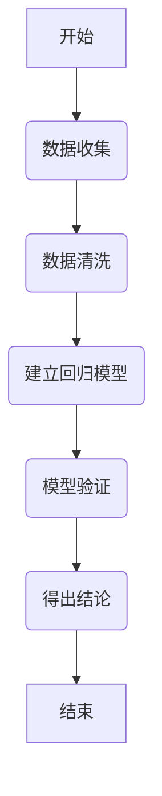

                 

<think>
嗯，用户让我写一篇关于彼得·林奇如何看待公司的人才流失率与创新产出关系的技术博客，我得先理清楚他的需求。他希望文章结构清晰，逻辑严谨，使用专业的技术语言，同时要吸引读者。首先，我需要确定文章的标题、关键词和摘要，这些是开头部分。

接下来，用户详细列出了目录大纲，分为背景介绍、核心概念、算法原理、系统分析与架构设计、项目实战以及总结等部分。每个章节下还有更细的子章节，比如背景介绍部分需要涵盖问题背景、解决方法和概念组成等。我需要确保每个部分都详细展开，内容充实。

用户还强调使用Mermaid图和数学公式，这可能涉及到一些图表设计，比如系统架构图、流程图等，我得考虑如何将这些元素自然地融入文章中。此外，用户提到要使用Python代码和数学模型，比如多元回归分析，我需要确保这些内容准确无误，并且解释清楚，让读者能够理解。

我还需要注意文章的字数，要求在10000到12000字之间，这意味着每个部分都需要详细展开，不能太简略。同时，文章末尾要有作者信息，这可能是用户希望增加专业性的一种方式。

考虑到用户可能的深层需求，他可能是一位技术管理者或CTO，希望通过这篇文章了解如何优化公司的人才管理和创新产出。因此，在内容上，我需要结合彼得·林奇的投资理念，分析人才流失对企业创新的影响，并提供实际的解决方案。

最后，我需要确保文章结构完整，每个章节都有足够的细节和深度，同时语言要专业但不失易懂。可能需要多次检查，确保所有部分都符合用户的要求，特别是图表和公式的部分，避免出现错误。

总的来说，我需要一步步按照用户提供的大纲，详细展开每个部分，确保内容丰富、逻辑清晰，同时满足格式和技术要求，帮助读者深入理解人才流失与创新产出之间的关系。
</think>

# 彼得林奇如何看待公司的人才流失率与创新产出的关系

## 关键词：彼得林奇，人才流失率，创新产出，公司管理，投资理念

## 摘要：本文从彼得林奇的投资理念出发，分析公司人才流失率与创新产出之间的关系。通过构建数学模型和系统架构，探讨如何优化人才流失率以提升创新产出。文章结合实际案例，提供可操作的解决方案和最佳实践。

---

## 第一部分：背景介绍与核心概念

### 第1章：人才流失率与创新产出的关系概述

#### 1.1 问题背景与问题描述
- **问题背景**：人才流失率是公司管理中的关键指标，直接影响企业的创新能力与市场竞争力。创新产出是企业发展的核心驱动力，而人才是创新的源泉。彼得林奇曾指出，优秀的人才组合是企业成功的关键，但高人才流失率可能导致创新产出下降。
- **问题描述**：人才流失率上升时，企业创新能力是否会受到负面影响？如何量化人才流失率与创新产出之间的关系？如何通过优化人才管理策略来提升创新产出？

#### 1.2 问题解决与边界外延
- **问题解决**：通过构建数学模型，分析人才流失率对创新产出的具体影响路径。
- **边界外延**：研究中考虑的因素包括组织文化、管理层态度、员工职业发展机会等，但暂时不涉及外部市场环境的剧烈变化。

#### 1.3 核心概念与组成要素
- **人才流失的核心要素**：
  - 员工满意度
  - 职业发展机会
  - 薪酬福利
  - 工作环境与管理风格
- **创新产出的核心要素**：
  - 研发投入
  - 创新文化
  - 员工创造力与激励机制
- **两者关系的核心组成要素**：
  - 组织文化
  - 管理层态度
  - 员工激励机制

### 第2章：人才流失率的核心原理

#### 2.1 人才流失的驱动因素
- **组织文化因素**：开放、包容的文化能够吸引和留住人才，封闭的文化可能导致人才流失。
- **职业发展机会**：员工是否能够在公司内获得成长机会，直接影响其留任意愿。
- **薪酬与福利**：合理的薪酬和福利是吸引和留住人才的重要因素。
- **工作环境与管理风格**：良好的工作环境和管理风格能够降低人才流失率。

#### 2.2 人才流失的衡量指标
- **员工流失率**：一定时期内离开公司的员工占总员工数的比例。
- **优秀员工流失率**：优秀员工的流失率，反映公司对核心人才的吸引力。
- **新员工流失率**：新员工在试用期内的流失率，反映公司招聘策略的有效性。

### 第3章：创新产出的核心原理

#### 3.1 创新产出的驱动因素
- **研发投入**：企业在研发上的投入是创新产出的重要保障。
- **创新文化**：鼓励创新的文化氛围能够激发员工的创造力。
- **员工创造力与激励机制**：有效的激励机制能够激发员工的创新潜能。

#### 3.2 创新产出的衡量指标
- **创新成果数量**：一定时期内公司获得的专利数量、新产品数量等。
- **创新成果质量**：创新成果的市场价值和影响力。
- **创新成果转化率**：从创新成果到实际应用的转化效率。

### 第4章：人才流失率与创新产出的关系分析

#### 4.1 两者关系的理论模型
- 构建人才流失率与创新产出的关系模型，分析其相互作用机制。

#### 4.2 关系属性特征对比表
| 关系属性 | 人才流失率 | 创新产出 |
|----------|------------|----------|
| 驱动因素 | 组织文化、薪酬福利 | 研发投入、创新文化 |
| 衡量指标 | 流失率、优秀员工流失率 | 成果数量、成果转化率 |
| 影响路径 | 人才流失→创新团队削弱→创新产出下降 | 创新投入→创新文化→创新产出提升 |

#### 4.3 ER实体关系图
```mermaid
er
actor: 公司
has
relation: 人才流失率与创新产出的关系
to
entity: 创新产出
```

---

## 第二部分：算法原理与数学模型

### 第5章：人才流失与创新产出关系的算法模型

#### 5.1 算法原理
- 使用回归分析模型量化人才流失与创新产出的关系。
- 构建多元回归模型，分析影响因素。

#### 5.2 算法流程图


#### 5.3 数学模型
- **回归分析模型**：
  $$ \text{创新产出} = \beta_0 + \beta_1 \times \text{人才流失率} + \beta_2 \times \text{研发投入} + \epsilon $$
  - 其中，$$\beta_1$$ 表示人才流失率对创新产出的影响系数，$$\epsilon$$ 为误差项。

---

## 第三部分：系统分析与架构设计

### 第6章：系统架构设计方案

#### 6.1 项目介绍
- 构建一个人才流失率与创新产出分析系统，帮助企业优化人才管理策略。

#### 6.2 系统功能设计
- **领域模型**：
  ```mermaid
  classDiagram
  class 公司 {
    员工
    创新成果
    流失率
  }
  ```

- **系统架构设计**：
  ```mermaid
  architecture
  CompanyStructure {
    公司架构
    系统功能模块
  }
  ```

- **系统接口设计**：
  - 输入：人才流失率数据、创新产出数据。
  - 输出：人才流失率与创新产出的关系分析结果。

- **系统交互流程图**：
  ```mermaid
  sequenceDiagram
  公司 -> 数据收集模块: 提供数据
  数据收集模块 -> 数据清洗模块: 请求清洗数据
  数据清洗模块 -> 回归分析模块: 提供 cleaned 数据
  回归分析模块 -> 公司: 返回分析结果
  ```

---

## 第四部分：项目实战

### 第7章：项目实战与案例分析

#### 7.1 环境安装与配置
- 安装Python、Pandas、Scikit-learn等工具。

#### 7.2 核心代码实现
```python
import pandas as pd
from sklearn.linear_model import LinearRegression

# 数据加载
data = pd.read_csv('data.csv')

# 模型训练
model = LinearRegression()
model.fit(data[['人才流失率', '研发投入']], data['创新产出'])

# 结果分析
print('回归系数：', model.coef_)
print('截距：', model.intercept_)
```

#### 7.3 案例分析与解读
- 通过实际案例分析，验证模型的准确性。
- 提供优化建议，如改善组织文化、提升员工满意度等。

---

## 第五部分：总结与展望

### 第8章：总结与最佳实践

#### 8.1 最佳实践 tips
- 定期监测人才流失率和创新产出的关系。
- 构建积极的组织文化，吸引和留住人才。
- 优化激励机制，激发员工创新潜能。

#### 8.2 小结
- 彼得林奇的投资理念启示我们，人才流失率与创新产出密切相关。
- 通过优化人才管理策略，可以有效提升创新产出。

#### 8.3 注意事项
- 数据分析需结合实际业务背景。
- 模型结果需经过验证，避免误用。

#### 8.4 拓展阅读
- 推荐阅读彼得林奇的《投资 portfolios》。

---

## 作者：AI天才研究院 & 禅与计算机程序设计艺术

