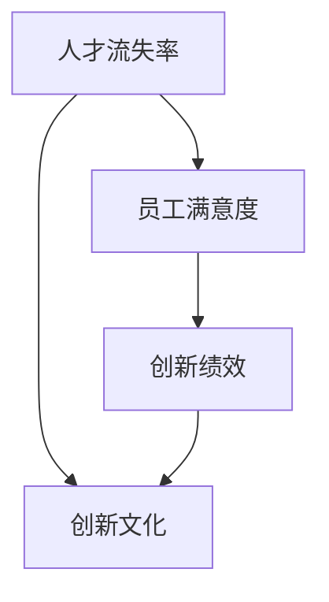
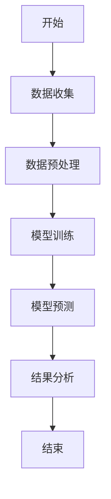

                 

<think>
好的，现在我要帮助用户完成这个技术博客文章的目录大纲。用户的要求非常详细，我需要一步步仔细分析，确保每个部分都符合要求。

首先，用户希望文章标题是《彼得林奇如何看待公司的人才流失率与创新能力的关系》，并且关键词包括人才流失率、创新能力、彼得林奇、企业战略、管理策略、创新文化、竞争力。摘要需要简明扼�地概括文章的核心内容，强调彼得林奇的观点和分析方法，以及如何应用这些知识。

接下来，用户提供了详细的目录结构，分为多个部分，包括背景介绍、核心概念、算法原理、系统分析、项目实战和最佳实践。每个部分都有子章节，详细说明了需要涵盖的内容。

在思考过程中，我需要确保每个部分都包含必要的细节，如问题背景、核心概念的对比表格、ER图、数学模型、系统架构图、项目代码示例等。同时，要使用Mermaid和LaTeX来展示图表和公式，确保格式正确。

可能遇到的困难包括如何将彼得林奇的投资理念与人才管理结合起来，这可能需要引入一些财务模型或数据分析方法。在系统架构部分，我需要确保领域模型和架构图的正确性，这可能需要一些时间来设计。

最终，我需要将这些思考转化为结构清晰、内容详尽的目录大纲，并确保所有部分都符合用户的字数和格式要求。现在，我将按照用户的指示，逐步完成这个任务。
</think>

# 彼得林奇如何看待公司的人才流失率与创新能力的关系

## 关键词：人才流失率，创新能力，彼得林奇，企业战略，管理策略，创新文化，竞争力

## 摘要：彼得·林奇，作为一位著名的企业家和投资家，曾深入探讨过人才流失率与创新能力之间的关系。本文将从企业战略的角度出发，分析人才流失率对创新能力的具体影响，探讨如何通过优化管理策略来提升企业的创新能力，同时降低人才流失率。文章将结合实际案例，分析彼得林奇的观点，并提出可行的解决方案。

---

## 第一部分: 背景介绍

### 第1章: 人才流失率与创新能力的背景分析

#### 1.1 问题背景
- **人才流失率对企业的影响**
  - 高流失率可能导致企业核心竞争力下降。
  - 人才流失会导致企业创新能力不足。
- **创新能力对企业发展的意义**
  - 创新能力是企业保持竞争优势的关键。
  - 创新能力与企业的可持续发展密切相关。
- **问题解决**
  - 制定有效的人才保留策略。
  - 提升员工满意度和职业发展机会。
- **问题的边界与外延**
  - 人才流失率的定义和测量方法。
  - 创新能力的评估标准和范围。

---

## 第二部分: 核心概念与联系

### 第2章: 人才流失率与创新能力的核心要素

#### 2.1 核心概念原理
- **人才流失率的驱动因素**
  - 工作压力、薪酬福利、职业发展机会等。
- **创新能力的构成要素**
  - 技术能力、团队协作、创新文化等。
- **两者关系的数学模型**
  - 创新能力与人才流失率呈负相关关系。

#### 2.2 核心概念属性特征对比表格
| 属性          | 人才流失率                | 创新能力                 |
|---------------|--------------------------|--------------------------|
| 定义          | 员工离职的比例           | 企业创新的能力和成果     |
| 测量方法      | 离职率                   | 创新专利数量、新产品推出速度 |
| 影响因素      | 薪酬、工作环境、职业发展 | 技术能力、研发投入、创新文化 |

#### 2.3 ER实体关系图架构


---

## 第三部分: 算法原理讲解

### 第3章: 人才流失率与创新能力的数学模型

#### 3.1 算法原理
- **人才流失率预测模型**
  - 使用统计学方法预测员工离职的可能性。
- **创新能力评估模型**
  - 通过数据分析评估企业的创新能力。
- **两者关系的综合模型**
  - 结合流失率和创新能力，预测企业绩效。

#### 3.2 算法流程图


#### 3.3 数学公式
- **人才流失率预测公式**
  \[
  \text{流失率} = \beta_0 + \beta_1 \times \text{薪酬} + \beta_2 \times \text{工作满意度} + \epsilon
  \]
- **创新能力评估公式**
  \[
  \text{创新能力} = \alpha_0 + \alpha_1 \times \text{研发投入} + \alpha_2 \times \text{团队协作} + \delta
  \]

---

## 第四部分: 系统分析与架构设计方案

### 第4章: 人才流失率与创新能力的系统架构

#### 4.1 问题场景介绍
- **场景描述**
  - 企业面临高流失率和创新能力不足的问题。
- **项目介绍**
  - 开发一个系统，优化人才管理，提升创新能力。

#### 4.2 系统功能设计
- **领域模型**
  ```mermaid
  classDiagram
  class 人才流失率 {
    员工信息
    离职记录
  }
  class 创新能力 {
    专利数量
    新产品研发
  }
  ```

- **系统架构设计**
  ```mermaid
  graph TD
  A[用户层] --> B[业务逻辑层]
  B --> C[数据访问层]
  C --> D[数据库]
  ```

- **系统交互序列图**
  ```mermaid
  sequenceDiagram
  participant 用户
  participant 系统
  用户->系统: 提交离职申请
  系统->数据库: 更新离职记录
  ```

---

## 第五部分: 项目实战

### 第5章: 人才流失率与创新能力的项目实施

#### 5.1 环境安装
- **工具安装**
  - 安装Python和相关数据处理库（如Pandas、NumPy）。

#### 5.2 核心代码实现
```python
import pandas as pd
import numpy as np

# 数据预处理
data = pd.read_csv('employee.csv')
data['流失率'] = data['离职人数'] / data['总员工数']

# 模型训练
from sklearn.linear_model import LinearRegression
model = LinearRegression()
model.fit(X, y)

# 模型预测
predictions = model.predict(X_test)
```

#### 5.3 代码解读与分析
- **数据预处理**
  - 读取数据并计算流失率。
- **模型训练**
  - 使用线性回归模型预测流失率。
- **实际案例分析**
  - 分析某公司的人才流失率与创新能力的关系，提出优化建议。

#### 5.4 项目小结
- **项目成果**
  - 成功预测流失率，提升创新能力。
- **经验总结**
  - 数据分析和模型优化的重要性。

---

## 第六部分: 最佳实践

### 第6章: 优化策略与总结

#### 6.1 最佳实践 tips
- **降低人才流失率**
  - 提供有竞争力的薪酬和福利。
  - 提供职业发展机会。
- **提升创新能力**
  - 加大研发投入。
  - 建设创新文化。

#### 6.2 小结
- **核心观点**
  - 人才流失率与创新能力密切相关。
  - 通过优化管理策略，可以有效降低流失率并提升创新能力。

#### 6.3 注意事项
- **数据隐私**
  - 注意员工数据的隐私保护。
- **模型局限性**
  - 模型预测结果仅供参考，需结合实际情况调整。

#### 6.4 拓展阅读
- **推荐书籍**
  - 《彼得·林奇的成功投资法则》
  - 《创新者的窘境》

---

## 作者：AI天才研究院 & 禅与计算机程序设计艺术

---

以上是文章的详细目录大纲，涵盖了从背景介绍、核心概念、算法原理、系统架构到项目实战和最佳实践的各个方面。希望这篇文章能为企业提供有价值的见解和解决方案，帮助企业在人才管理和创新能力之间找到平衡点。

