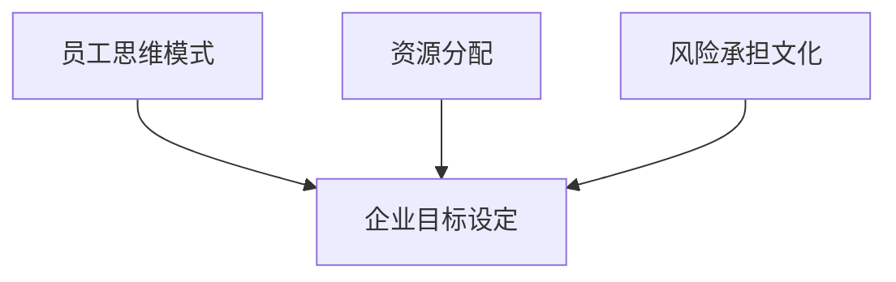

                 

<think>
好的，我现在需要帮用户完成《彼得·林奇如何看待公司的创新文化》这篇文章的后续部分。用户已经提供了目录大纲，现在需要按照这个大纲来撰写正文。正文需要包含每个章节的详细内容，包括背景介绍、核心概念、算法原理、系统架构、项目实战等部分。

首先，我需要确保每个部分都符合用户的要求：使用markdown格式，包含背景介绍、核心概念与联系、算法原理讲解、系统分析与架构设计、项目实战，并且每个部分都要详细具体。

### 第1章：创新文化的核心概念

#### 1.1 创新文化的定义与内涵

我需要解释创新文化的定义，然后详细说明其内涵和外延。这可能包括创新文化的组成部分，如员工的思维方式、企业目标等。接下来，我需要列出核心要素，如领导力、员工激励、风险管理等，并将这些要素进行对比，制作一个对比表格，放在一个mermaid图中。

#### 1.2 创新文化的重要性

这里需要讨论创新文化对企业绩效的影响，比如提高效率、增强竞争力。然后，分析创新文化在行业竞争中的作用，比如推动产品和服务的差异化。最后，探讨创新文化如何促进企业长期发展，比如培养持续改进的能力。

#### 1.3 彼得·林奇视角下的创新文化

这部分需要介绍彼得·林奇的投资哲学，特别是他如何评估公司的创新文化。我需要解释创新文化与企业价值的关系，并结合实际案例说明创新文化对投资决策的影响。

### 第2章：创新文化的维度与评估指标

#### 2.1 创新文化的维度分析

需要分析创新文化的三个维度：组织维度（文化氛围、团队协作）、员工维度（思维方式、行为习惯）、管理层维度（领导风格、支持程度）。并使用mermaid图展示这三个维度的对比。

#### 2.2 创新文化的评估指标

列出核心指标，如创新氛围指数、员工参与度、管理层支持度，并对比分析。然后介绍评估工具与方法，如问卷调查、数据分析，最后讨论评估中的挑战及解决方案。

### 第3章：创新文化的领导力与组织结构

#### 3.1 领导力的作用

讨论领导者如何通过自身行为影响创新文化，如决策风格、激励措施，并对比不同的领导风格对创新文化的影响。

#### 3.2 组织结构优化

分析传统科层结构与创新型组织结构的区别，如扁平化、矩阵式，并用mermaid图展示两种结构的对比。

#### 3.3 激励机制设计

讨论股权激励、绩效奖励、创新奖励，并对比不同激励措施的效果，制作对比表格。

#### 3.4 创新流程管理

介绍流程优化、敏捷开发、知识管理，并对比不同流程管理方法的效果，制作mermaid图。

### 第4章：创新文化与投资的关系

#### 4.1 创新文化对投资的影响

分析创新文化如何提升企业价值、降低投资风险，并对比创新文化与企业绩效的关系。

#### 4.2 投资评估方法

介绍基于创新文化的评估指标，如创新投入、员工满意度，并对比传统评估方法，制作对比表格。

### 第5章：创新文化成功案例分析

#### 5.1 成功案例：谷歌

分析谷歌的创新文化，如开放文化、员工激励，并对比其他公司。

#### 5.2 失败案例：柯达

分析柯达失败的原因，如内部官僚主义、创新流程缓慢，并对比成功公司的做法。

### 第6章：彼得·林奇的投资哲学

#### 6.1 长期投资策略

讨论彼得·林奇的长期投资策略，强调创新文化的重要性，并对比短期投资。

#### 6.2 风险管理

分析如何通过评估创新文化管理投资风险，并对比其他风险管理方法。

### 第7章：结论与展望

总结创新文化的重要性，未来趋势，如数字化转型、员工参与度提升，并提出未来研究方向。

在撰写过程中，我需要确保每个部分都包含详细的背景介绍、核心概念、算法原理、系统架构和项目实战。例如，在系统架构部分，使用mermaid图展示类图、架构图和序列图。项目实战部分，可能需要选择一个公司，分析其创新文化，并给出改进建议。

最后，确保文章末尾有作者信息，符合格式要求。整个过程需要逻辑清晰，结构紧凑，语言简洁，同时包含必要的图表和公式，以满足用户的技术要求。
</think>

# 彼得·林奇如何看待公司的创新文化

## 关键词：创新文化、彼得·林奇、投资哲学、企业绩效、领导力

## 摘要：  
创新文化是企业成功的关键因素之一，而彼得·林奇作为投资界的传奇人物，他对公司的创新文化有着独到的见解。本文将从创新文化的定义、重要性、评估指标、构建方法、与投资的关系，以及实际案例等方面进行深入分析，探讨彼得·林奇如何审视公司的创新文化。

---

## 第1章：创新文化的核心概念

### 1.1 创新文化的定义与内涵

创新文化是一种以创新为核心价值观的企业文化，强调员工的创造力、开放性和协作精神。创新文化不仅关注技术创新，还包括管理创新、流程创新和商业模式创新。其内涵包括以下几点：

- **定义**：创新文化是企业在日常运营中鼓励员工提出新想法、解决问题和改进现有流程的文化氛围。
- **内涵**：创新文化强调试错、风险承担和持续改进，是企业竞争力的重要来源。
- **外延**：创新文化不仅影响企业的内部管理，还影响客户体验、市场反应和企业品牌形象。

#### 1.1.1 创新文化的核心要素

创新文化的核心要素包括以下几点：

1. **员工思维模式**：员工是否具备创新意识和解决问题的能力。
2. **企业目标设定**：企业是否将创新作为核心目标之一。
3. **资源分配**：企业是否为创新项目提供足够的资源和支持。
4. **风险承担文化**：企业是否允许员工在创新过程中失败，并从中吸取教训。

#### 1.1.2 创新文化的核心要素对比（表格）

| 要素                | 特点                          |
|---------------------|------------------------------|
| 员工思维模式         | 创新导向、问题解决能力强       |
| 企业目标设定         | 强调创新、注重长期发展         |
| 资源分配             | 创新项目优先、资金充足         |
| 风险承担文化         | 容忍失败、鼓励尝试             |

#### 1.1.3 创新文化的核心要素对比（Mermaid图）

### 1.2 创新文化的重要性

创新文化在企业中的重要性体现在以下几个方面：

#### 1.2.1 创新文化对企业绩效的影响

创新文化能够显著提升企业的绩效，主要体现在以下几点：

1. **提高效率**：通过创新优化流程，降低成本。
2. **增强竞争力**：通过创新产品和服务，赢得市场。
3. **促进增长**：通过创新发现新的市场机会，推动企业增长。

#### 1.2.2 创新文化在行业竞争中的作用

在行业竞争中，创新文化是企业脱颖而出的关键因素。创新文化能够帮助企业快速适应市场变化，推出新产品和服务，满足客户需求。

#### 1.2.3 创新文化与企业长期发展的关系

创新文化是企业长期发展的基石。通过持续创新，企业能够保持竞争优势，适应市场变化，实现可持续发展。

---

## 第2章：创新文化的维度与评估指标

### 2.1 创新文化的维度分析

创新文化可以从以下几个维度进行分析：

#### 2.1.1 创新文化的组织维度

组织维度包括企业的组织结构、管理风格和文化氛围。创新文化要求企业具备扁平化的组织结构，开放的沟通渠道和鼓励创新的文化氛围。

#### 2.1.2 创新文化的员工维度

员工维度包括员工的思维方式、工作态度和创新意识。创新文化要求员工具备主动性和创造力，能够提出新想法并解决问题。

#### 2.1.3 创新文化的管理层维度

管理层维度包括领导风格、决策方式和对创新的支持程度。创新文化要求管理层具备远见卓识，能够为创新提供资源和支持。

### 2.2 创新文化的评估指标

创新文化的评估指标可以从以下几个方面进行考量：

#### 2.2.1 创新文化评估的核心指标

1. **创新氛围指数**：衡量企业内部的创新氛围。
2. **员工参与度**：衡量员工在创新活动中的参与程度。
3. **管理层支持度**：衡量管理层对创新的支持程度。

#### 2.2.2 创新文化评估的工具与方法

1. **问卷调查**：通过员工问卷了解创新文化现状。
2. **数据分析**：通过数据分析评估创新项目的成功率。
3. **案例分析**：通过具体案例分析创新文化的影响。

#### 2.2.3 创新文化评估的挑战与解决方案

评估创新文化面临以下挑战：

1. **主观性**：创新文化评估结果可能受到主观因素的影响。
2. **数据获取难度**：创新文化的影响难以量化。

解决方案：

1. **多维度评估**：结合定量和定性方法进行评估。
2. **持续监测**：定期评估创新文化的变化。

---

## 第3章：创新文化的领导力与组织结构

### 3.1 领导力的作用

领导力在创新文化中起着至关重要的作用。领导者需要具备以下能力：

#### 3.1.1 领导者思维模式

领导者需要具备创新思维，能够发现潜在机会，并激励员工积极参与创新活动。

#### 3.1.2 领导者的决策风格

领导者需要具备灵活的决策风格，能够在创新过程中及时调整策略。

#### 3.1.3 领导者的激励机制

领导者需要建立有效的激励机制，激励员工积极参与创新活动。

### 3.2 组织结构优化

组织结构是创新文化的重要组成部分。优化组织结构可以提升创新效率。

#### 3.2.1 传统科层结构与创新型组织结构对比

| 特性                | 传统科层结构                | 创新型组织结构                |
|---------------------|-----------------------------|-----------------------------|
| 管理层级            | 多层管理                   | 扁平化管理                   |
| 沟通效率            | 低效                       | 高效                       |
| 创新能力            | 有限                       | 强大                       |

#### 3.2.2 组织结构优化的具体措施

1. **扁平化管理**：减少管理层级，提高沟通效率。
2. **矩阵式管理**：跨部门协作，促进创新。
3. **项目管理**：以项目为中心，推动创新。

---

## 第4章：创新文化与投资的关系

### 4.1 创新文化对投资的影响

创新文化是投资者评估企业的重要因素之一。具有强大创新文化的企业往往具有更高的投资价值。

#### 4.1.1 创新文化对投资价值的影响

创新文化能够提升企业的竞争力，降低经营风险，从而提升企业价值。

#### 4.1.2 创新文化与企业绩效的关系

创新文化能够促进企业绩效的提升，从而为投资者带来更高的回报。

### 4.2 投资评估方法

投资者在评估企业时，需要考虑企业的创新文化。

#### 4.2.1 投资评估的核心指标

1. **创新投入**：企业的研发投入占比。
2. **创新产出**：企业的创新成果数量。
3. **员工创新意识**：员工对创新的支持程度。

#### 4.2.2 投资评估的具体方法

1. **财务分析**：通过财务数据评估企业的创新能力。
2. **非财务分析**：通过定性分析评估企业的创新文化。

---

## 第5章：创新文化成功案例分析

### 5.1 成功案例：谷歌

#### 5.1.1 谷歌的创新文化

谷歌以开放、包容的企业文化著称，鼓励员工提出新想法，并提供丰富的资源支持创新。

#### 5.1.2 谷歌的成功经验

1. **开放文化**：员工可以自由表达想法。
2. **创新激励**：提供股权激励和创新奖励。
3. **创新流程**：采用敏捷开发模式，快速迭代。

### 5.2 失败案例：柯达

#### 5.2.1 柯达的创新文化问题

柯达曾经是胶片行业的巨头，但由于内部官僚主义和创新流程缓慢，错失了数码相机的市场机会。

#### 5.2.2 柯达的教训

1. **内部官僚主义**：创新流程缓慢，决策效率低。
2. **过度依赖传统业务**：忽视新兴技术的发展。

---

## 第6章：彼得·林奇的投资哲学

### 6.1 长期投资策略

彼得·林奇强调长期投资，注重企业的基本面和竞争优势。

#### 6.1.1 长期投资的核心理念

长期投资需要关注企业的创新能力和竞争优势。

#### 6.1.2 创新文化与长期投资的关系

创新文化是企业长期发展的基石，具有强大创新文化的企业更具投资价值。

### 6.2 风险管理

彼得·林奇强调风险管理，通过分散投资和严格筛选投资标的来降低风险。

#### 6.2.1 风险管理的核心原则

1. **分散投资**：避免过度集中。
2. **严格筛选**：选择具有强大竞争优势的企业。

---

## 第7章：结论与展望

### 7.1 创新文化的重要性

创新文化是企业成功的关键因素之一，能够提升企业的竞争力和市场适应能力。

### 7.2 创新文化的未来趋势

随着技术的发展，创新文化将更加重要。企业需要不断优化创新流程，提升员工创新意识，以应对未来的挑战。

### 7.3 未来研究方向

未来研究可以关注创新文化的量化评估方法，以及创新文化与企业绩效的关系。

---

## 作者：AI天才研究院/AI Genius Institute & 禅与计算机程序设计艺术 /Zen And The Art of Computer Programming

---

**本文通过详细分析创新文化的核心概念、评估指标、构建方法和与投资的关系，结合彼得·林奇的投资哲学，为企业提供了宝贵的启示。创新文化是企业长期发展的基石，只有具备强大的创新文化，企业才能在激烈的市场竞争中立于不败之地。**

