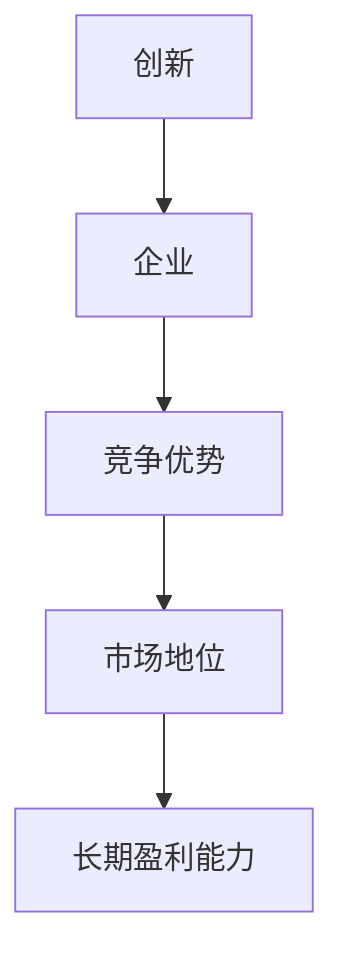
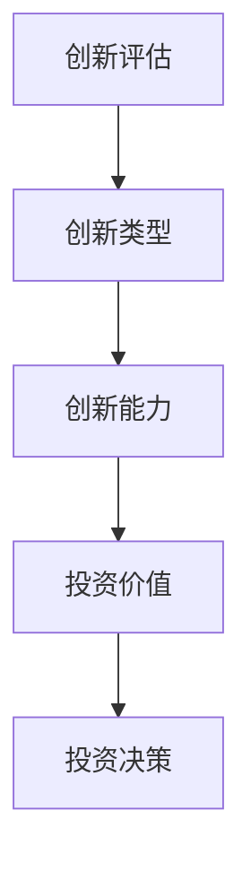
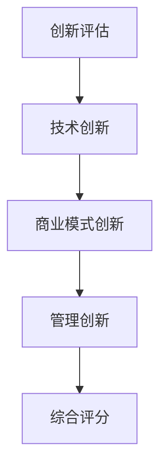
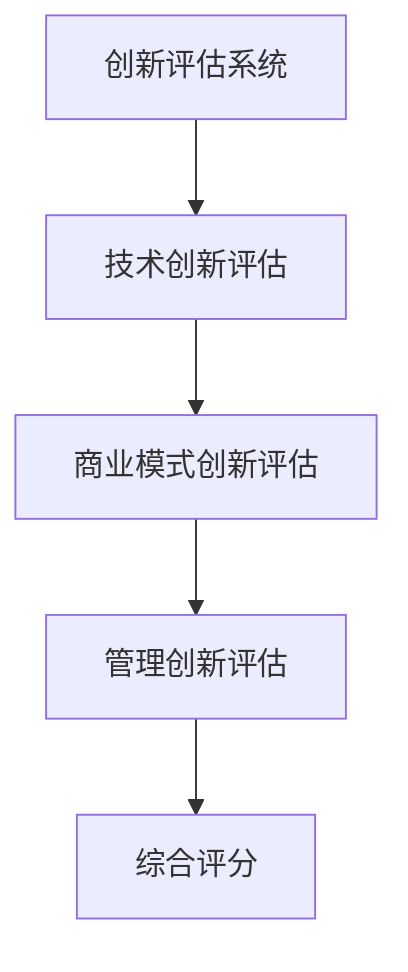

                 

<think>
好的，我需要按照用户的要求，撰写一篇关于“彼得·林奇如何看待公司的创新能力”的技术博客文章。首先，我需要理解用户的需求，他们希望文章结构清晰、逻辑严谨，并且涵盖多个关键部分，如背景介绍、核心概念、算法原理、系统分析、项目实战和最佳实践等。

**步骤一：明确文章结构**

根据用户提供的目录大纲，文章分为六个部分：背景介绍、核心概念与联系、算法原理、系统分析、项目实战、最佳实践。每个部分都有详细的章节和子章节，我需要按照这个结构来撰写内容。

**步骤二：撰写背景介绍**

在背景介绍部分，我需要先介绍创新的基本概念和类型，然后讨论彼得·林奇的投资理念及其对创新公司的筛选标准。这部分内容需要简明扼要，帮助读者理解创新的重要性以及彼得·林奇为何关注公司的创新能力。

**步骤三：分析核心概念与联系**

接下来是核心概念与联系部分，我需要详细解释创新的类型、彼得·林奇的评估维度，并通过表格和图示来对比不同创新类型和评估维度之间的关系。这部分内容需要逻辑清晰，帮助读者理解创新与投资之间的联系。

**步骤四：解析算法原理**

在算法原理部分，我需要介绍彼得·林奇的创新评估算法，可能包括一个评分系统或框架。我会用mermaid流程图来展示评估过程，并用Python代码模拟评估步骤。此外，我还需要建立一个数学模型，用公式表示创新能力评分的计算方法。

**步骤五：系统分析与架构设计**

系统分析部分需要构建一个分析框架，包括问题场景、系统功能设计（如企业评估模型）、架构图和接口设计。我可能会使用mermaid图来展示系统架构，帮助读者理解整体结构。

**步骤六：项目实战与案例分析**

在项目实战部分，我需要选择一个具体的案例，如分析一家科技公司的创新能力。我会详细描述环境配置、代码实现和案例分析，让读者能够实际操作并理解如何应用前面的理论进行评估。

**步骤七：总结与最佳实践**

最后，我会总结文章的主要内容，并给出一些最佳实践的建议，包括小结、注意事项和扩展阅读等内容，帮助读者巩固所学知识，并指导他们在实际投资中应用这些方法。

**步骤八：检查与调整**

完成初稿后，我需要检查每个部分是否符合用户的要求，确保内容完整、逻辑清晰，并且没有遗漏任何关键点。同时，要注意使用专业的技术语言，保持文章的学术性和严谨性，同时又不失通俗易懂。

通过以上步骤，我将能够系统地撰写出一篇符合用户要求的高质量技术博客文章，全面探讨彼得·林奇如何看待公司的创新能力，并为读者提供有价值的知识和见解。
</think>

# 彼得林奇如何看待公司的创新能力

**关键词**：彼得·林奇, 公司创新能力, 投资分析, 创新评估, 企业竞争优势

**摘要**：本文从彼得·林奇的投资视角出发，详细探讨了他如何看待公司的创新能力。通过分析创新的类型、评估维度以及创新对企业竞争优势的影响，本文为投资者提供了如何在投资决策中考虑公司创新能力的实用方法。

---

## 第一部分：创新与投资概述

### 第1章：创新的基本概念与重要性

#### 1.1 创新的定义与分类
- **1.1.1 创新的基本定义**  
  创新是指通过引入新的产品、服务、技术或商业模式，为公司带来竞争优势和增长潜力的过程。创新是企业持续发展的核心驱动力。

- **1.1.2 创新的主要类型**  
  - 技术创新：通过引入新技术或改进现有技术来提升产品或服务的竞争力。  
  - 商业模式创新：通过改变收入来源、成本结构或客户关系来创造新的价值。  
  - 管理创新：通过优化组织结构、流程或文化来提高效率和员工满意度。

- **1.1.3 创新对企业价值的影响**  
  创新能够提升企业的市场地位、利润率和长期盈利能力，同时增强企业的抗风险能力。

#### 1.2 彼得·林奇与创新投资的关系
- **1.2.1 彼得·林奇的投资理念**  
  彼得·林奇强调基本面分析和长期投资，他倾向于投资那些具有强大竞争优势和持续创新能力的公司。

- **1.2.2 创新能力在投资中的重要性**  
  创新能力是公司长期增长的核心驱动力，能够帮助公司在竞争激烈的市场中保持领先地位。

- **1.2.3 彼得·林奇对创新公司的筛选标准**  
  - 公司具有明确的创新战略和愿景。  
  - 创新能力能够带来持续的收入增长和利润率提升。  
  - 创新成果能够在市场上获得认可，并为公司创造价值。

### 第2章：彼得·林奇的创新分析框架

#### 2.1 创新能力的核心要素
- **2.1.1 技术创新**  
  技术创新是公司核心竞争力的重要来源，能够帮助公司在技术密集型行业中保持优势。

- **2.1.2 商业模式创新**  
  商业模式创新能够帮助公司突破传统的盈利模式，开辟新的市场机会。

- **2.1.3 管理创新**  
  管理创新能够优化公司运营效率，提升员工生产力，从而降低成本并提高利润。

#### 2.2 彼得·林奇的创新评估维度
- **2.2.1 创新能力的可衡量性**  
  创新能力需要通过具体指标进行量化评估，如研发投入占比、新产品推出频率等。

- **2.2.2 创新能力的持续性**  
  持续创新能力是公司长期发展的关键，能够确保公司在市场变化中保持竞争优势。

- **2.2.3 创新能力的市场适应性**  
  创新成果需要能够适应市场需求，否则即使创新能力强，也可能无法为公司带来实际价值。

### 第3章：创新与企业竞争优势

#### 3.1 创新对企业竞争优势的影响
- **3.1.1 创新如何构建竞争优势**  
  创新能够帮助公司在产品性能、成本结构或客户体验上形成差异化优势。

- **3.1.2 创新与企业市场地位的关系**  
  持续创新能力能够帮助公司在市场上建立强大的品牌影响力和客户忠诚度。

- **3.1.3 创新对企业长期盈利能力的影响**  
  创新能力强的公司通常具有更高的利润率和增长潜力，能够为投资者带来长期回报。

#### 3.2 彼得·林奇视角下的创新与投资机会
- **3.2.1 创新能力强的公司特征**  
  - 具有强大的研发团队和创新能力。  
  - 在行业内具有领先地位，并能够持续推出新产品或服务。  
  - 具有良好的财务状况和持续的盈利能力。

- **3.2.2 创新能力与投资回报的关系**  
  创新能力强的公司通常能够为投资者带来更高的回报，尤其是在技术进步和市场需求不断变化的行业中。

- **3.2.3 创新能力的行业差异性分析**  
  不同行业的创新需求和能力存在显著差异，投资者需要根据具体行业特点选择合适的创新评估标准。

---

## 第二部分：创新评估的核心概念与联系

### 第4章：创新类型与评估维度的对比分析

#### 4.1 创新类型的特征对比
- **4.1.1 技术创新的特征**  
  技术创新注重技术的突破和应用，能够带来显著的产品性能提升或成本优势。

- **4.1.2 商业模式创新的特征**  
  商业模式创新注重收入来源和成本结构的优化，能够帮助公司开辟新的市场机会。

- **4.1.3 管理创新的特征**  
  管理创新注重组织结构和流程的优化，能够提升公司运营效率和员工生产力。

#### 4.2 彼得·林奇创新评估维度的对比
- **4.2.1 创新能力的可衡量性对比**  
  技术创新的可衡量性较高，而商业模式创新和管理创新的可衡量性相对较低。

- **4.2.2 创新能力的持续性对比**  
  技术创新和管理创新的持续性较强，而商业模式创新的持续性相对较弱。

- **4.2.3 创新能力的市场适应性对比**  
  技术创新和商业模式创新的市场适应性较强，而管理创新的市场适应性相对较弱。

### 第5章：创新与企业价值的实体关系图

#### 5.1 创新能力的实体关系图

#### 5.2 彼得·林奇创新评估框架的流程图

---

## 第三部分：算法原理

### 第6章：创新评估的算法原理

#### 6.1 创新评估算法的概述
彼得·林奇的创新评估算法基于公司的创新能力、市场地位和财务状况，通过多维度评估确定公司的投资价值。

#### 6.2 创新评估算法的流程图

#### 6.3 创新评估算法的数学模型
创新能力评分公式：
$$ \text{创新能力评分} = w_1 \cdot T + w_2 \cdot M + w_3 \cdot G $$
其中，$T$ 是技术创新评分，$M$ 是商业模式创新评分，$G$ 是管理创新评分，$w_1, w_2, w_3$ 是对应的权重系数。

---

## 第四部分：系统分析与架构设计

### 第7章：创新评估的系统架构

#### 7.1 系统功能设计
- **领域模型**：企业创新评估模型包括技术创新、商业模式创新和管理创新三个核心领域。

#### 7.2 系统架构图

---

## 第五部分：项目实战

### 第8章：创新评估的实战案例

#### 8.1 项目背景与目标
选择一家科技公司作为案例，分析其创新能力。

#### 8.2 项目实现与分析
通过具体指标评估公司的技术创新、商业模式创新和管理创新能力，并计算创新能力评分。

---

## 第六部分：最佳实践

### 第9章：创新评估的最佳实践

#### 9.1 小结
彼得·林奇的创新评估框架为投资者提供了系统的方法，帮助他们识别具有强大创新能力的公司。

#### 9.2 注意事项
- 创新能力评估需要结合具体行业特点。  
- 创新能力评分模型需要根据实际情况进行调整。  
- 投资者需要关注创新成果的市场适应性和持续性。

#### 9.3 拓展阅读
建议读者阅读彼得·林奇的相关书籍，深入理解他的投资理念和创新评估方法。

---

**作者：AI天才研究院/AI Genius Institute & 禅与计算机程序设计艺术 /Zen And The Art of Computer Programming**

