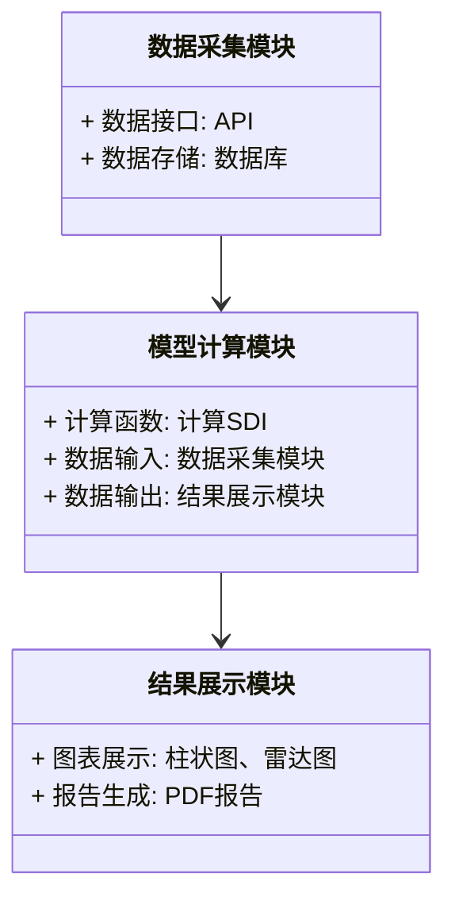
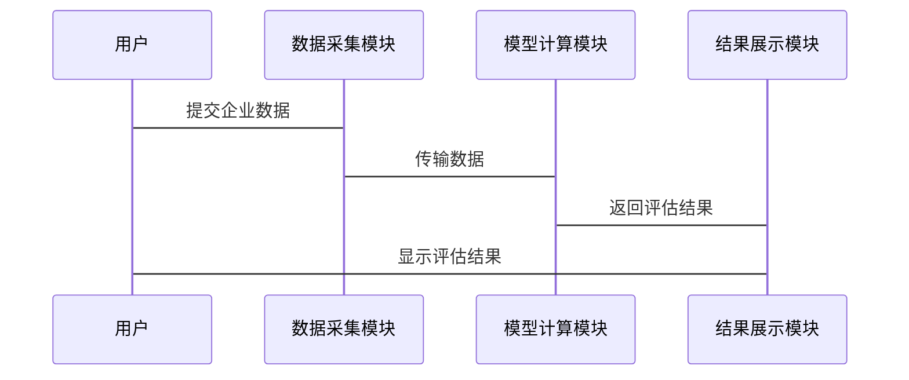

                 


# 彼得·林奇如何看待公司的可持续发展

## 关键词：可持续发展，彼得·林奇，投资，企业治理，ESG，长期价值

## 摘要：  
彼得·林奇作为投资界的传奇人物，他的投资哲学和方法论对企业的可持续发展有着独到的见解。本文从可持续发展的背景、核心概念、评估模型、系统架构设计到实际案例分析，详细探讨了彼得·林奇如何看待公司的可持续发展。通过分析企业的财务指标、ESG指标、治理结构等多维度因素，结合系统化的方法论和实际项目案例，本文旨在为企业和投资者提供一套科学的可持续发展评估体系，以实现长期价值和投资回报的双重目标。

---

# 第一部分: 可持续发展的背景与定义

## 第1章: 可持续发展的核心概念

### 1.1 可持续发展的定义与背景

#### 1.1.1 可持续发展的起源与发展  
可持续发展（Sustainability）的概念起源于20世纪70年代的环境运动，最初关注于环境问题，逐渐扩展到社会、经济和治理等多方面。随着全球化的推进，企业对可持续发展的重视程度不断提高，这不仅关乎企业的社会责任，也与企业的长期生存和发展密切相关。

#### 1.1.2 可持续发展的核心要素  
可持续发展通常包括以下三个核心要素：  
1. **环境（Environmental）**：企业在经营过程中减少对环境的负面影响，例如减少碳排放、节约资源等。  
2. **社会（Social）**：企业关注员工权益、社区发展、劳工标准等社会问题，注重企业的社会责任。  
3. **治理（Governance）**：企业内部治理结构的透明性、合规性以及管理层的道德水平，确保企业长期稳定发展。

#### 1.1.3 可持续发展与企业关系的演变  
随着社会对企业责任的关注度提升，可持续发展从最初的环境保护扩展到企业治理、社会责任等多个维度。企业的可持续发展能力不仅影响其品牌形象，还直接影响投资者的决策。

---

### 1.2 企业的可持续发展框架

#### 1.2.1 企业可持续发展的多维度分析  
企业的可持续发展需要从财务、环境、社会和治理（ESG）等多个维度进行分析。通过多维度的评估，能够全面了解企业的综合表现，为投资者提供更全面的信息。

#### 1.2.2 可持续发展的关键绩效指标（KPI）  
以下是衡量企业可持续发展能力的关键指标：  
- **环境指标**：单位产品碳排放、能源消耗效率、废弃物处理率等。  
- **社会指标**：员工满意度、社区参与度、员工培训投入等。  
- **治理指标**：董事会结构、高管薪酬与绩效挂钩程度、公司透明度等。  

#### 1.2.3 企业治理与可持续发展的关系  
企业治理是可持续发展的核心，良好的治理结构能够确保企业战略的实施、风险管理的有效性以及利益相关者的权益保护。彼得·林奇非常重视企业治理，他认为管理层的道德和能力是企业长期成功的关键。

---

## 第2章: 彼得·林奇的投资视角

### 2.1 彼得·林奇的投资哲学

#### 2.1.1 林奇的投资理念概述  
彼得·林奇以其独特的投资哲学闻名，他主张长期投资，关注企业的基本面，尤其是企业的财务健康状况和管理层能力。他认为，投资的本质是寻找那些能够持续创造价值的企业。

#### 2.1.2 林奇对企业的长期价值关注  
林奇认为，企业的长期价值不仅仅体现在财务指标上，还体现在企业的创新能力、市场地位和可持续发展能力。他强调，只有那些能够在行业中长期保持竞争优势的企业，才能为投资者带来超额回报。

#### 2.1.3 林奇对管理层能力的重视  
林奇非常关注企业的管理层，他认为，管理层的决策能力和道德水平直接影响企业的长期发展。他倾向于投资那些由有能力且诚实的管理层领导的企业。

---

### 2.2 林奇对可持续发展的看法

#### 2.2.1 可持续发展对企业长期价值的影响  
林奇认为，企业的可持续发展能力是其长期价值的重要组成部分。一个企业在环境保护、社会责任和治理结构上的表现，能够反映出其是否具备长期发展的潜力。

#### 2.2.2 林奇对ESG投资的见解  
林奇是ESG投资的倡导者之一。他认为，ESG指标能够帮助企业识别那些在环境、社会和治理方面表现不佳的企业，从而降低投资风险。他特别强调，企业治理是ESG投资的核心，因为良好的治理结构能够确保企业的透明性和长期稳定性。

#### 2.2.3 林奇对行业趋势的判断  
林奇认为，可持续发展不仅是企业社会责任的体现，更是行业趋势的风向标。随着社会对环保、社会责任和治理的关注度提高，那些在这些方面表现优异的企业将更具竞争优势。

---

# 第二部分: 可持续发展评估的核心概念

## 第3章: 可持续发展的关键指标分析

### 3.1 财务指标与可持续发展

#### 3.1.1 财务健康状况对可持续发展的影响  
企业的财务健康状况是其可持续发展的重要基础。健康的财务状况能够为企业提供足够的资金支持，确保企业在面对市场波动时的稳定性。例如，低负债率和高现金流的企业更具抗风险能力。

#### 3.1.2 资产负债表分析与可持续发展  
通过分析资产负债表，可以了解企业的资产结构、负债水平以及所有者权益。健康的资产负债表能够反映出企业的财务健康状况，为可持续发展提供保障。

#### 3.1.3 利润表分析与可持续发展  
利润表反映了企业的收入和利润情况。稳定的收入来源和较高的利润率是企业可持续发展的重要指标。通过分析利润表，可以评估企业的盈利能力和发展潜力。

---

### 3.2 非财务指标与可持续发展

#### 3.2.1 ESG指标的定义与分类  
ESG指标是衡量企业可持续发展能力的重要工具，包括环境、社会和治理三个维度。  
- **环境（E）**：碳排放、能源消耗、环保合规性等。  
- **社会（S）**：员工权益、社会责任、社区参与等。  
- **治理（G）**：董事会结构、高管薪酬、公司透明度等。

#### 3.2.2 社会责任指标的评估  
社会责任指标是衡量企业社会贡献的重要标准。例如，企业是否积极参与公益活动、是否关注员工福利等。

#### 3.2.3 治理结构对可持续发展的影响  
良好的治理结构能够确保企业的透明性和合规性，减少管理风险。例如，独立的董事会和有效的内部控制机制是企业治理的重要组成部分。

---

## 第4章: 可持续发展评估的核心模型

### 4.1 可持续发展评估模型的构建

#### 4.1.1 模型构建的基本思路  
可持续发展评估模型需要综合考虑企业的财务、环境、社会和治理四个维度。通过权重分配和综合评估，得出企业的可持续发展指数。

#### 4.1.2 数据收集与处理方法  
数据收集是模型构建的关键步骤。需要收集企业的财务数据、ESG指标以及其他相关数据。数据处理时，需要进行标准化和归一化处理，以确保不同指标之间的可比性。

#### 4.1.3 模型的验证与优化  
通过实际数据验证模型的准确性，并根据验证结果进行优化。例如，可以通过回归分析等方法，调整指标的权重，使模型更加准确。

---

### 4.2 可持续发展评估模型的数学公式

#### 4.2.1 综合评估指数的计算公式  
可持续发展指数（SDI）的计算公式如下：  
$$SDI = \sum_{i=1}^{n} (w_i \times s_i)$$  
其中，$w_i$ 是第$i$个指标的权重，$s_i$ 是第$i$个指标的评分。

#### 4.2.2 指标权重的确定方法  
指标权重的确定可以通过专家评分法或层次分析法（AHP）等方法进行。例如，可以邀请行业专家对各个指标的重要性进行评分，然后计算权重。

#### 4.2.3 模型的适用性分析  
模型的适用性需要根据企业的实际情况进行调整。例如，对于不同行业的企业，权重可能有所不同。

---

# 第三部分: 可持续发展评估的系统分析与架构设计

## 第5章: 可持续发展评估的系统分析

### 5.1 问题场景介绍

#### 5.1.1 企业可持续发展评估的挑战  
企业在进行可持续发展评估时，通常面临数据获取难、评估标准不统一、模型复杂等问题。此外，不同利益相关者对评估的要求也有所不同。

#### 5.1.2 投资者视角下的评估需求  
投资者需要通过可持续发展评估，识别出那些在环境、社会和治理方面表现优异的企业，以降低投资风险并获得超额回报。

#### 5.1.3 系统化评估的必要性  
通过系统化评估，可以将复杂的评估过程标准化，提高评估的效率和准确性。同时，系统化评估还可以帮助企业持续监控自身的可持续发展表现。

---

### 5.2 项目介绍

#### 5.2.1 项目目标与范围  
本项目旨在构建一个可持续发展评估系统，帮助企业和投资者全面评估企业的可持续发展能力。项目范围包括数据采集、模型构建、结果展示等多个方面。

#### 5.2.2 项目团队与分工  
项目团队包括数据分析师、软件开发人员、行业专家和项目经理。数据分析师负责数据处理和模型构建，软件开发人员负责系统开发，行业专家提供业务指导，项目经理负责项目管理。

#### 5.2.3 项目实施计划  
项目实施计划分为需求分析、数据采集、模型构建、系统开发和测试优化五个阶段。

---

## 第6章: 可持续发展评估的系统架构设计

### 6.1 系统功能设计

#### 6.1.1 数据采集模块  
数据采集模块负责收集企业的财务数据、ESG指标以及其他相关数据。数据来源包括企业财报、第三方评级机构数据等。

#### 6.1.2 模型计算模块  
模型计算模块根据收集到的数据，运行可持续发展评估模型，计算出企业的可持续发展指数。

#### 6.1.3 结果展示模块  
结果展示模块以图表和报告的形式，展示企业的可持续发展表现。用户可以通过可视化界面，查看企业的各项指标评分和综合评分。

---

### 6.2 系统架构设计

#### 6.2.1 系统功能模块的 Mermaid 类图  


#### 6.2.2 系统架构的 Mermaid 架构图  


---

## 第7章: 可持续发展评估的系统接口设计

### 7.1 系统接口设计

#### 7.1.1 数据接口  
数据接口用于与其他系统的数据交互，例如与企业财报系统、第三方评级机构的数据接口对接。

#### 7.1.2 用户接口  
用户接口是系统与用户的交互界面，包括数据输入界面、评估结果展示界面等。

---

### 7.2 系统交互的 Mermaid 序列图  



---

# 第四部分: 项目实战

## 第8章: 项目实战分析

### 8.1 环境安装与配置

#### 8.1.1 安装 Python 环境  
需要安装Python 3.8或更高版本，并安装以下库：Pandas、NumPy、Scikit-learn、Matplotlib。

#### 8.1.2 数据采集工具配置  
使用requests库和BeautifulSoup库进行网页数据抓取，或通过API接口获取企业数据。

---

### 8.2 系统核心实现源代码

#### 8.2.1 数据处理代码  
```python
import pandas as pd
import numpy as np

# 数据加载
data = pd.read_csv('sustainability_data.csv')

# 数据清洗
data.dropna(inplace=True)
data = data[~data['revenue'].isin([0])]  # 去除收入为零的行
```

#### 8.2.2 模型计算代码  
```python
from sklearn.preprocessing import StandardScaler
from sklearn.metrics import accuracy_score

# 数据标准化
scaler = StandardScaler()
scaled_data = scaler.fit_transform(data)

# 计算可持续发展指数
def compute_sdi(scaled_data):
    sdi = np.mean(scaled_data, axis=1)
    return sdi

sdi = compute_sdi(scaled_data)
```

#### 8.2.3 结果展示代码  
```python
import matplotlib.pyplot as plt

# 绘制柱状图
plt.bar(range(len(sdi)), sdi, alpha=0.8, color='blue')
plt.title('Sustainability Development Index')
plt.xlabel('Company Index')
plt.ylabel('SDI Score')
plt.show()
```

---

### 8.3 代码应用解读与分析

#### 8.3.1 数据处理解读  
数据处理阶段主要对数据进行清洗和标准化处理，确保数据的准确性和可比性。

#### 8.3.2 模型计算解读  
通过标准化后的数据，计算出每个企业的可持续发展指数，反映了企业在多个维度上的综合表现。

#### 8.3.3 结果展示解读  
柱状图直观地展示了企业的可持续发展指数，帮助用户快速识别表现优异和表现不佳的企业。

---

### 8.4 实际案例分析

#### 8.4.1 案例选择  
以苹果公司为例，分析其可持续发展表现。

#### 8.4.2 数据收集与分析  
收集苹果公司的财务数据和ESG指标，计算其可持续发展指数。

#### 8.4.3 结果分析  
通过分析结果，识别苹果公司在可持续发展方面的优势和不足，为企业提供改进建议。

---

## 第9章: 项目小结

### 9.1 项目总结

#### 9.1.1 项目目标的实现  
通过本项目，我们成功构建了一个可持续发展评估系统，能够帮助企业和投资者全面评估企业的可持续发展能力。

#### 9.1.2 项目成果  
项目成果包括一套完整的评估模型、一个功能完善的评估系统以及详细的分析报告。

---

### 9.2 项目经验与教训

#### 9.2.1 项目经验  
在项目实施过程中，我们积累了丰富的数据处理和系统开发经验，特别是对复杂模型的优化和实现。

#### 9.2.2 项目教训  
在数据采集和模型优化过程中，我们遇到了一些挑战，例如数据不完整和模型准确性不足的问题。通过不断调整和优化，我们最终解决了这些问题。

---

# 第五部分: 最佳实践与小结

## 第10章: 最佳实践

### 10.1 可持续发展评估中的最佳实践

#### 10.1.1 投资策略  
投资者应优先选择那些在ESG指标上表现优异的企业，同时关注企业的财务健康状况。

#### 10.1.2 风险控制  
通过建立完善的风险评估体系，识别和规避那些在可持续发展方面表现不佳的企业。

---

## 第11章: 小结

### 11.1 本文总结

#### 11.1.1 核心内容回顾  
本文从可持续发展的背景、核心概念、评估模型、系统架构设计到实际案例分析，全面探讨了彼得·林奇如何看待公司的可持续发展。

#### 11.1.2 未来展望  
随着社会对可持续发展的关注不断增加，企业的可持续发展能力将越来越成为投资者的重要考量因素。未来，我们需要进一步优化评估模型，提高评估的准确性和实用性。

---

# 作者：AI天才研究院 & 禅与计算机程序设计艺术

