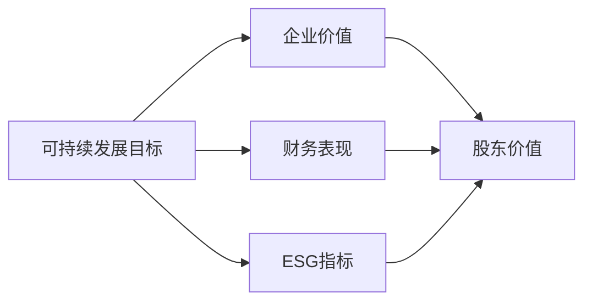

                 


# 彼得林奇如何看待公司的可持续发展目标与财务表现的关系

## 关键词：彼得·林奇, 可持续发展目标, 财务表现, 投资策略, ESG, 企业价值

## 摘要：  
本文探讨了彼得·林奇对可持续发展目标与财务表现之间关系的看法，分析了可持续发展目标对企业财务表现的潜在影响，并结合彼得·林奇的投资哲学，提出了如何将可持续发展目标纳入投资决策的具体方法。文章从背景介绍、核心概念、分析框架、投资策略、案例分析和实践指南等多个维度展开，结合具体的算法和系统架构设计，为投资者提供了全面的指导。

---

## 第一章: 可持续发展目标与财务表现的背景介绍

### 1.1 可持续发展的定义与内涵  
可持续发展是指在满足当前需求的同时，不损害未来 generations 满足其需求的能力。它涵盖了经济、社会和环境三个方面，具体包括：  
- **经济可持续性**：确保企业长期盈利能力。  
- **社会可持续性**：关注员工福利、社区发展和人权保护。  
- **环境可持续性**：减少资源消耗和环境污染。  

### 1.2 财务表现的核心要素  
财务表现是企业经营成果的直接反映，主要指标包括净利润、营业收入、资产负债率和ROE（净资产收益率）。这些指标共同构成了企业财务健康度的评估体系。  

### 1.3 可持续发展目标与财务表现的关系  
- **正向关系**：可持续发展有助于提升品牌价值、降低风险，从而改善财务表现。  
- **负向关系**：过度投入可持续发展可能导致短期财务压力。  

---

## 第二章: 可持续发展目标与财务表现的核心概念与联系

### 2.1 ESG指标与财务表现的关系  
ESG（环境、社会、治理）指标是衡量企业可持续发展能力的重要工具。通过对比不同企业的ESG评分和财务表现，可以发现：  
- **高ESG评分**：通常与较高的股东价值和品牌溢价能力相关。  
- **低ESG评分**：可能导致声誉损失和融资成本上升。  

### 2.2 可持续发展目标与财务表现的核心要素对比  

| **核心要素** | **可持续发展** | **财务表现** |  
|--------------|----------------|---------------|  
| **目标**     | 长期价值创造   | 短期与长期收益 |  
| **指标**     | ESG评分        | 净利润、ROE    |  
| **影响因素** | 环境政策、社会责任 | 资产负债表、利润表 |  

### 2.3 核心概念之间的关系图  



---

## 第三章: 可持续发展目标与财务表现的分析框架

### 3.1 可持续发展目标对财务表现的影响路径  

1. **通过成本优化影响利润**  
   - 环境合规成本降低。  
   - 社会责任履行减少法律风险。  

2. **通过收入提升影响财务表现**  
   - 可持续产品溢价能力。  
   - 品牌忠诚度提升带来的市场份额扩大。  

### 3.2 彼得·林奇视角下的分析框架  

1. **彼得·林奇的投资哲学**  
   - 专注于基本面分析。  
   - 注重企业的长期价值创造能力。  

2. **可持续发展目标在彼得·林奇框架中的应用**  
   - 将ESG指标作为投资决策的重要参考。  
   - 重点关注那些在可持续发展方面表现优异且财务健康的企业。  

---

## 第四章: 可持续发展目标与财务表现的系统分析

### 4.1 系统分析与架构设计  

1. **项目介绍**  
   - 本系统旨在通过ESG指标和财务数据的结合，评估企业的可持续发展能力对财务表现的影响。  

2. **系统功能设计**  
   - 数据清洗与预处理。  
   - ESG指标计算与评分。  
   - 财务表现评估与对比分析。  

3. **系统架构设计**  


---

## 第五章: 可持续发展目标与财务表现的项目实战

### 5.1 项目实战环境与数据准备  

1. **环境安装**  
   - 安装Python和相关库（如pandas、numpy）。  

2. **数据准备**  
   - 下载企业ESG数据和财务数据。  

### 5.2 核心代码实现  

```python
import pandas as pd
import numpy as np

# 数据清洗
def data_cleaning(df):
    df.dropna(inplace=True)
    df['ESG_Score'] = df['ESG_Score'].astype(int)
    return df

# ESG指标计算
def calculate_esg_scores(data):
    # 假设数据为已经清洗好的DataFrame
    esg_scores = data['ESG_Score'].apply(lambda x: x if x >=0 else 0)
    return esg_scores.mean()

# 财务表现评估
def assess_financial_performance(data, esg_scores):
    performance = data['NetProfit'].apply(lambda x: x * (esg_scores / 100))
    return performance.mean()

# 示例代码
data = pd.read_csv('company_data.csv')
clean_data = data_cleaning(data)
esg_score = calculate_esg_scores(clean_data)
financial_performance = assess_financial_performance(clean_data, esg_score)
print(f"ESG平均得分：{esg_score}\n财务表现评估：{financial_performance}")
```

### 5.3 案例分析与结果解读  

1. **案例分析**  
   - 选取某企业进行分析，计算其ESG得分和财务表现。  

2. **结果解读**  
   - 高ESG得分通常对应较高的股东价值。  

---

## 第六章: 可持续发展目标与财务表现的最佳实践与小结

### 6.1 彼得·林奇观点总结  

1. **投资策略**  
   - 优先考虑在可持续发展方面表现优异的企业。  
   - 结合ESG指标和财务数据进行综合评估。  

2. **长期与短期的平衡**  
   - 可持续发展投资需要耐心，短期波动不影响长期价值。  

### 6.2 投资策略与实践建议  

1. **投资组合优化**  
   - 将ESG指标作为筛选标准之一。  

2. **风险控制**  
   - 通过多元化投资降低单一风险。  

### 6.3 小结  

可持续发展目标与财务表现密切相关，企业通过实现可持续发展目标可以提升长期价值。投资者应将ESG指标纳入决策框架，关注企业的长期发展潜力。

---

## 作者：AI天才研究院/AI Genius Institute & 禅与计算机程序设计艺术 /Zen And The Art of Computer Programming

