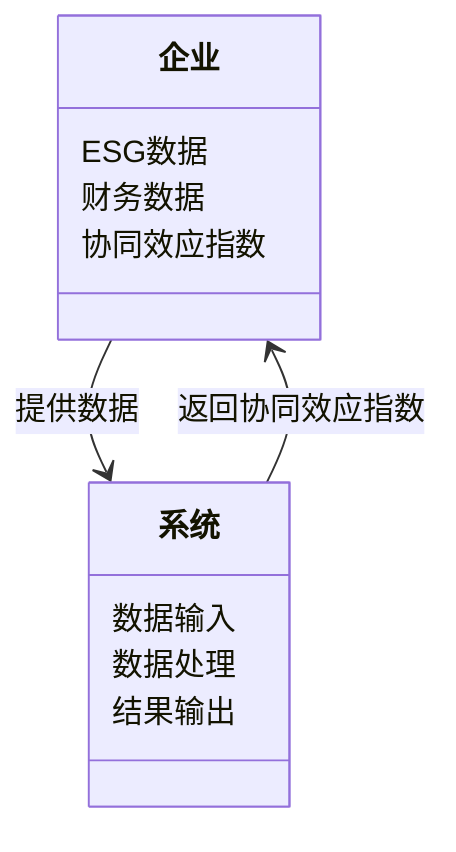
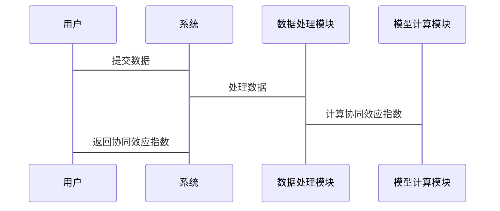

                 


# 彼得林奇如何看待公司的可持续发展目标与财务表现的协同效应

> 关键词：彼得林奇，可持续发展目标，财务表现，协同效应，ESG投资，投资策略

> 摘要：本文深入探讨了彼得·林奇的投资理念，分析了可持续发展目标与财务表现之间的协同效应，并结合实际案例，阐述了如何通过ESG投资策略实现可持续发展与财务回报的双赢。文章还提供了系统的算法模型和数学公式，帮助读者更好地理解和应用这些概念。

---

## # 引言

在当今全球经济环境下，可持续发展已成为企业和社会的核心议题。彼得·林奇作为全球著名的投资专家，他的投资理念不仅关注财务回报，还强调企业社会责任和长期价值创造。本文将从彼得·林奇的视角出发，探讨可持续发展目标与财务表现之间的协同效应，分析其对投资决策的启示，并结合实际案例提供可行的策略。

---

## # 第一部分：背景介绍

### # 第1章：可持续发展目标与财务表现的协同效应概述

#### ## 1.1 可持续发展与财务表现的协同关系

- **可持续发展的定义与核心要素**  
  可持续发展是指在满足当前需求的同时，不损害后代满足其需求的能力。其核心要素包括环境（Environmental）、社会（Social）和治理（Governance），即ESG。

- **财务表现的核心指标与影响因素**  
  财务表现通常包括净利润、ROE、现金流等指标。企业通过优化ESG表现，可以提升市场形象，降低风险，从而改善财务表现。

- **协同效应的定义与表现形式**  
  协同效应指两个或多个目标在实现过程中相互促进，产生1+1>2的效果。在可持续发展与财务表现中，协同效应体现在企业通过ESG实践提升财务表现，同时实现可持续发展目标。

#### ## 1.2 彼得·林奇的投资理念与可持续发展

- **彼得·林奇的投资哲学概述**  
  彼得·林奇强调长期投资、基本面分析和风险管理。他认为，优秀的企业不仅要有盈利能力，还要具备良好的治理结构和社会责任。

- **可持续发展在投资中的重要性**  
  林奇认为，企业的可持续发展能力是长期投资价值的基石。企业通过优化ESG表现，可以增强抗风险能力，提升投资吸引力。

- **协同效应在投资决策中的作用**  
  协同效应帮助投资者识别那些在可持续发展和财务表现之间取得平衡的企业，这些企业具有长期增长潜力。

#### ## 1.3 ESG投资的基本概念与发展趋势

- **ESG的定义与内涵**  
  ESG分别代表环境、社会和治理三个维度，是评估企业可持续发展能力的重要指标。

- **ESG投资的发展历程**  
  ESG投资从早期的道德投资逐渐演变为一种主流投资策略，尤其在近年来，随着环境问题和社会责任的重视，ESG投资规模快速增长。

- **协同效应在ESG投资中的应用**  
  投资者通过评估企业的ESG表现，识别那些在可持续发展和财务表现之间具有协同效应的企业，从而实现投资回报与社会责任的双赢。

---

## # 第二部分：核心概念与联系

### # 第2章：可持续发展目标与财务表现协同效应的核心要素

#### ## 2.1 协同效应的定义与特征

- **协同效应的定义**  
  协同效应是指两个或多个目标在实现过程中相互促进，产生超出单独追求目标的综合效果。

- **协同效应的特征**  
  协同效应具有动态性、系统性和长期性。企业需要在短期和长期目标之间找到平衡点，才能实现可持续发展与财务表现的双赢。

#### ## 2.2 可持续发展目标与财务表现的关联性分析

- **可持续发展目标对财务表现的影响路径**  
  企业通过优化环境表现，降低资源消耗，减少环境风险，从而提升财务表现。同时，良好的社会和治理表现可以提升企业声誉，吸引优秀人才，增强市场竞争力。

- **财务表现对可持续发展目标的反向影响**  
  企业通过财务表现的提升，可以获得更多的资金支持和投资机会，从而进一步推动可持续发展目标的实现。

- **协同效应的动态平衡机制**  
  企业在追求可持续发展目标的同时，需要确保财务表现的稳定性和增长性，通过动态调整战略，实现协同效应的最大化。

#### ## 2.3 协同效应的实现机制与关键因素

- **实现机制**  
  企业需要从战略规划、组织架构、资源配置等多个方面入手，构建可持续发展与财务表现协同的机制。

- **关键影响因素分析**  
  包括企业领导层的重视、员工的参与度、外部政策环境、市场需求等。

- **实现协同效应的策略选择**  
  企业可以通过制定长期战略、优化资源配置、加强内部管理、提升透明度等措施，实现可持续发展目标与财务表现的协同。

---

## # 第三部分：算法原理与数学模型

### # 第3章：协同效应的量化评估方法

#### ## 3.1 协同效应的数学模型构建

- **模型构建的基本思路**  
  通过构建一个多目标优化模型，量化可持续发展和财务表现之间的协同效应。

- **模型的变量选择与假设**  
  变量包括ESG得分、财务指标（如净利润、ROE）、协同效应指数等。假设企业在追求可持续发展目标的同时，也在优化财务表现。

- **模型的构建步骤**  
  1. 收集企业的ESG数据和财务数据；  
  2. 计算各维度的协同效应指数；  
  3. 通过回归分析或优化算法，量化协同效应。

#### ## 3.2 协同效应的数学公式与模型

- **数学公式**  
  协同效应指数（SEI）可以表示为：  
  $$ SEI = \alpha \cdot ESG + \beta \cdot Financials $$  
  其中，$\alpha$ 和 $\beta$ 是权重系数，根据具体情况进行调整。

- **模型的实现步骤**  
  1. 数据预处理：清洗和标准化数据；  
  2. 计算各维度得分；  
  3. 构建协同效应指数模型；  
  4. 通过实际案例验证模型的有效性。

#### ## 3.3 协同效应的案例分析与应用

- **案例分析**  
  以某科技公司为例，计算其ESG得分和财务表现，评估协同效应指数。

- **实际应用**  
  投资者可以通过协同效应指数，选择具有高协同效应的企业进行投资，从而实现财务回报与社会责任的双重目标。

---

## # 第四部分：系统分析与架构设计

### # 第4章：系统分析与架构设计方案

#### ## 4.1 问题场景介绍

- **问题场景**  
  企业需要在追求可持续发展目标的同时，优化财务表现，实现协同效应。

- **项目介绍**  
  开发一个协同效应评估系统，帮助企业量化可持续发展与财务表现之间的协同效应。

#### ## 4.2 系统功能设计

- **领域模型设计**  
  使用Mermaid类图展示系统的实体和关系。



- **系统架构设计**  
  使用Mermaid架构图展示系统的整体架构。


- **系统接口设计**  
  使用Mermaid序列图展示系统交互流程。



---

## # 第五部分：项目实战

### # 第5章：项目实战与案例分析

#### ## 5.1 项目背景与目标

- **项目背景**  
  某科技公司希望通过优化ESG表现，提升财务表现，实现可持续发展目标。

- **项目目标**  
  构建协同效应评估系统，量化可持续发展与财务表现的协同效应。

#### ## 5.2 项目实施步骤

- **环境安装**  
  安装Python、数据分析库（如Pandas、NumPy）和可视化工具（如Matplotlib、Seaborn）。

- **系统核心实现源代码**

```python
import pandas as pd
import numpy as np

# 数据预处理
def preprocess(data):
    data = data.dropna()
    data = (data - data.min()) / (data.max() - data.min())
    return data

# 协同效应指数计算
def calculate_sei(esg_scores, financial_scores):
    alpha = 0.5
    beta = 0.5
    sei = alpha * np.mean(esg_scores) + beta * np.mean(financial_scores)
    return sei

# 数据读取与处理
data = pd.read_csv('input.csv')
esg_data = data[['E', 'S', 'G']]
financial_data = data[['net_profit', 'ro

