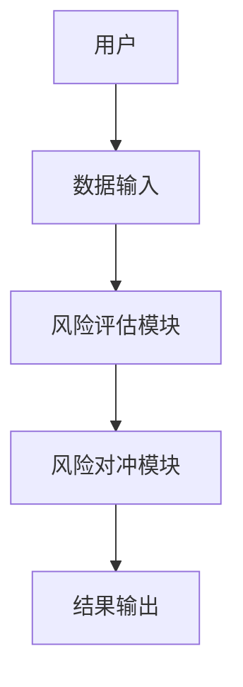

                 


# 彼得·林奇如何看待公司的国际化风险

> 关键词：彼得·林奇，国际化风险，风险管理，投资策略，企业全球化

> 摘要：本文深入探讨了彼得·林奇在评估公司国际化风险时的视角和策略。通过分析国际化风险的核心要素、系统性分析框架以及应对措施，结合具体案例和系统设计，为读者提供了全面的理解和实用的应对方法。

---

## 引言

### 1.1 什么是国际化风险

#### 1.1.1 国际化风险的定义
国际化风险是指企业在跨国经营过程中，由于政治、经济、法律、文化等多方面因素的不确定性，导致的财务损失、战略失败或声誉受损等风险。这些风险可能来自外部环境的变化，也可能源于企业内部的管理问题。

#### 1.1.2 国际化风险的分类
国际化风险可以分为以下几类：
- **政治风险**：包括政策变化、政局不稳等。
- **经济风险**：包括汇率波动、通货膨胀等。
- **法律风险**：包括税收政策、劳动法等。
- **市场风险**：包括市场需求波动、竞争加剧等。
- **运营风险**：包括物流、供应链中断等。

#### 1.1.3 国际化风险的影响
国际化风险的影响可以是多方面的，包括企业利润下降、投资回报减少、品牌形象受损等。这些风险不仅影响企业的短期运营，还可能影响企业的长期发展。

### 1.2 彼得·林奇的投资哲学

#### 1.2.1 彼得·林奇的投资理念
彼得·林奇是美国著名的投资专家，他主张长期投资和价值投资。他认为，投资者应该选择那些具有持续增长潜力的企业，并且在市场低迷时买入，在市场高涨时卖出。

#### 1.2.2 彼得·林奇的选股策略
林奇的选股策略注重企业的基本面分析，包括企业的财务状况、盈利能力、管理团队等。他认为，选择那些具有竞争优势和良好管理的企业是投资成功的关键。

#### 1.2.3 彼得·林奇的风险管理方法
林奇强调风险管理的重要性，他认为投资者应该分散投资，避免将所有资金投入到单一市场或行业。此外，他还建议投资者定期评估投资组合，并根据市场变化进行调整。

---

## 第2章：国际化风险的背景与现状

### 2.1 全球化与国际化的趋势

#### 2.1.1 全球化的历史发展
全球化是一个长期的过程，经历了从早期的贸易自由化到现代的跨国公司扩张。随着信息技术的发展，全球化的速度进一步加快。

#### 2.1.2 当前国际化的现状
当前，国际化已经渗透到各个行业，包括科技、金融、制造等。跨国公司的数量不断增加，国际贸易额也在持续增长。

#### 2.1.3 国际化带来的机遇与挑战
国际化为公司带来了新的市场和增长机会，但也带来了复杂的风险，如政治风险、经济风险等。

### 2.2 国际化风险的典型案例

#### 2.2.1 国际化失败的案例分析
许多公司在国际化过程中失败，例如某些公司由于未能适应当地市场而被淘汰。

#### 2.2.2 国际化成功的经验分享
一些公司通过深入研究当地市场、建立本地团队等策略，成功实现了国际化。

#### 2.2.3 国际化风险的教训总结
失败的案例表明，国际化风险需要高度重视，企业需要制定详细的市场进入策略和风险管理计划。

---

## 第3章：国际化风险的核心概念与分析

### 3.1 政治风险

#### 3.1.1 政治风险的定义
政治风险是指由于政府政策变化或政局不稳导致的企业损失风险。

#### 3.1.2 政治风险的来源
政治风险的来源包括政策变化、政府干预、政局动荡等。

#### 3.1.3 政治风险的评估方法
评估政治风险的方法包括分析当地政府的稳定性、政策变化的可能性以及国际关系的紧张程度。

### 3.2 经济风险

#### 3.2.1 经济风险的定义
经济风险是指由于经济波动或经济政策变化导致的企业损失风险。

#### 3.2.2 经济风险的来源
经济风险的来源包括通货膨胀、经济衰退、汇率波动等。

#### 3.2.3 经济风险的评估方法
评估经济风险的方法包括分析宏观经济指标、行业发展趋势以及企业的财务状况。

### 3.3 市场风险

#### 3.3.1 市场风险的定义
市场风险是指由于市场需求变化或竞争加剧导致的企业损失风险。

#### 3.3.2 市场风险的来源
市场风险的来源包括消费者偏好变化、市场进入壁垒、竞争对手策略等。

#### 3.3.3 市场风险的评估方法
评估市场风险的方法包括市场调研、竞争对手分析以及消费者行为分析。

---

## 第4章：国际化风险的系统性分析

### 4.1 国际化风险的系统性框架

#### 4.1.1 风险识别
风险识别是国际化风险管理的第一步，包括识别所有可能的风险来源。

#### 4.1.2 风险评估
风险评估是根据风险的严重性和可能性对风险进行排序。

#### 4.1.3 风险应对
根据风险评估结果，制定相应的应对策略，包括风险规避、风险转移等。

### 4.2 国际化风险的多层次分析

#### 4.2.1 宏观层面
从宏观层面分析，包括国际政治环境、全球经济形势等。

#### 4.2.2 中观层面
从中观层面分析，包括行业发展趋势、市场需求变化等。

#### 4.2.3 微观层面
从微观层面分析，包括企业自身的财务状况、管理能力等。

### 4.3 国际化风险的动态变化

#### 4.3.1 风险的周期性
国际化风险具有周期性，随着全球经济的波动而变化。

#### 4.3.2 风险的地域性
不同地区的政治、经济环境不同，导致国际化风险的地域性差异。

#### 4.3.3 风险的行业性
不同行业的国际化风险也不同，例如高科技行业与传统制造行业的风险差异较大。

---

## 第5章：彼得·林奇的风险管理策略

### 5.1 彼得·林奇的风险管理原则

#### 5.1.1 风险控制的重要性
林奇认为，风险管理是投资成功的关键，投资者必须高度重视风险控制。

#### 5.1.2 风险分散的策略
林奇建议投资者通过分散投资来降低风险，避免将所有资金投入到单一市场或行业。

#### 5.1.3 风险评估的方法
林奇强调定期评估投资组合，并根据市场变化进行调整。

### 5.2 彼得·林奇的国际化投资策略

#### 5.2.1 选择性国际化
林奇主张选择那些具有竞争优势和良好管理的国际化企业进行投资。

#### 5.2.2 市场进入策略
林奇建议企业在进入国际市场时，应充分研究当地市场，并制定详细的市场进入计划。

#### 5.2.3 风险对冲方法
林奇推荐使用金融工具（如期货、期权）来对冲国际化投资中的风险。

---

## 第6章：国际化风险的应对措施

### 6.1 风险规避

#### 6.1.1 风险规避的定义
风险规避是指通过避免某些投资或业务活动来降低风险。

#### 6.1.2 风险规避的策略
例如，企业可以通过限制进入高风险市场来规避政治风险。

### 6.2 风险分散

#### 6.2.1 风险分散的定义
风险分散是指通过投资于不同市场或行业来降低风险。

#### 6.2.2 风险分散的策略
例如，企业可以将投资分散到多个国家或地区，以降低单一市场的风险。

### 6.3 风险对冲

#### 6.3.1 风险对冲的定义
风险对冲是指通过使用金融工具来抵消投资组合中的风险。

#### 6.3.2 风险对冲的策略
例如，企业可以使用外汇期货来对冲汇率波动的风险。

---

## 第7章：项目实战

### 7.1 环境安装

#### 7.1.1 系统需求
需要安装Python、Pandas、Matplotlib等库。

#### 7.1.2 数据准备
收集相关国家的经济、政治数据。

### 7.2 系统核心实现源代码

#### 7.2.1 风险评估模型
```python
import pandas as pd
import numpy as np

def risk_assessment(country_data):
    # 风险评估模型
    risks = []
    for country in country_data:
        political_risk = country['political_risk']
        economic_risk = country['economic_risk']
        market_risk = country['market_risk']
        total_risk = political_risk + economic_risk + market_risk
        risks.append(total_risk)
    return risks

# 示例数据
country_data = [
    {'country': 'A', 'political_risk': 0.3, 'economic_risk': 0.2, 'market_risk': 0.1},
    {'country': 'B', 'political_risk': 0.5, 'economic_risk': 0.3, 'market_risk': 0.2},
]

# 计算风险
risks = risk_assessment(country_data)
print(risks)
```

#### 7.2.2 风险对冲策略
```python
import matplotlib.pyplot as plt

def visualize_risk_assessment(risks, labels):
    plt.bar(labels, risks)
    plt.title('Risk Assessment Visualization')
    plt.xlabel('Country')
    plt.ylabel('Risk Level')
    plt.show()

labels = [country['country'] for country in country_data]
risks = risk_assessment(country_data)
visualize_risk_assessment(risks, labels)
```

---

## 第8章：系统分析与架构设计

### 8.1 系统功能设计

#### 8.1.1 风险评估模块
- 输入：国家经济、政治数据
- 输出：风险评估结果

#### 8.1.2 风险对冲模块
- 输入：风险评估结果
- 输出：对冲策略建议

### 8.2 系统架构设计

#### 8.2.1 系统架构图


---

## 第9章：注意事项与未来展望

### 9.1 注意事项
- 在实际操作中，风险评估模型需要根据具体情况调整。
- 风险对冲策略需要结合企业的实际情况制定。

### 9.2 未来展望
未来的研究可以进一步探索人工智能在风险评估中的应用，以及如何通过大数据技术提高风险预测的准确性。

---

## 附录

### 附录A：术语表
- 风险评估：通过分析可能的风险来源及其影响，制定相应的应对策略。

### 附录B：数据表格
```python
import pandas as pd
data = {
    '国家': ['A', 'B'],
    '政治风险': [0.3, 0.5],
    '经济风险': [0.2, 0.3],
    '市场风险': [0.1, 0.2]
}
df = pd.DataFrame(data)
print(df)
```

---

## 作者

作者：AI天才研究院/AI Genius Institute & 禅与计算机程序设计艺术/Zen And The Art of Computer Programming

---

通过以上内容，我们详细探讨了彼得·林奇如何看待公司的国际化风险，并结合实际案例和系统设计，为读者提供了全面的理解和实用的应对方法。

