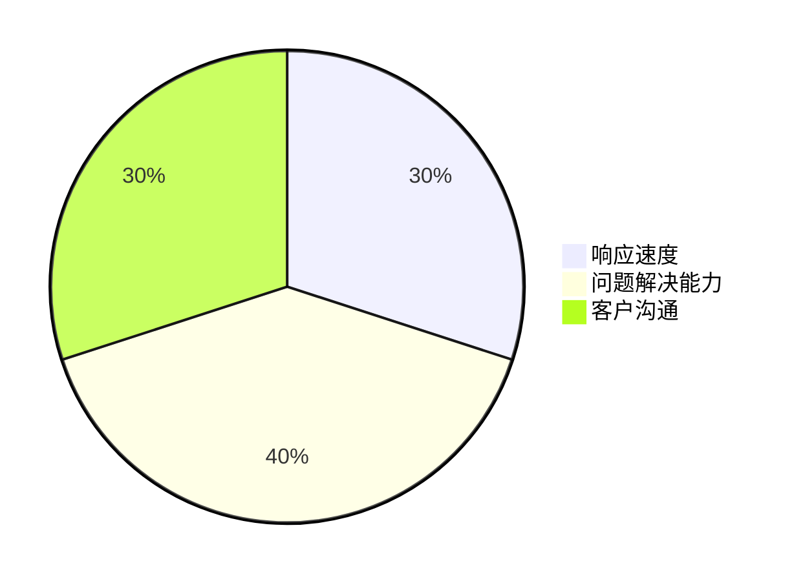
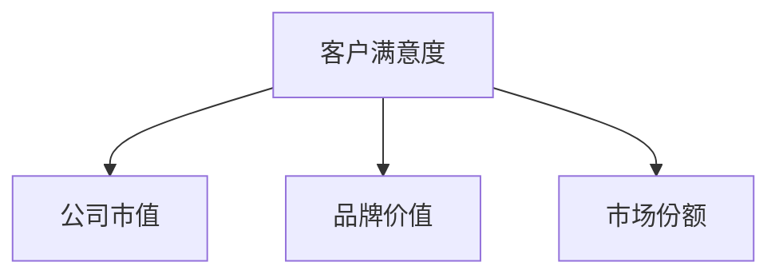
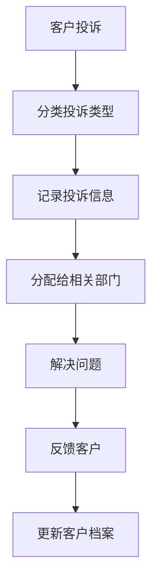
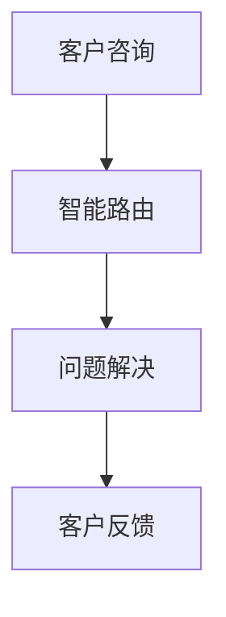
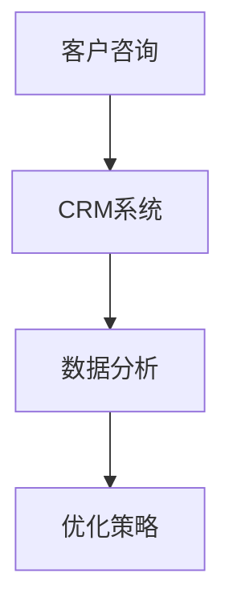
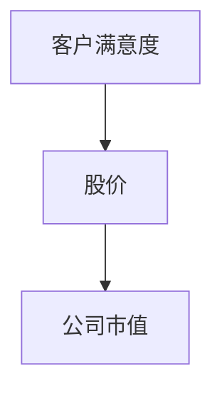

                 

<think>
好的，我现在需要帮用户撰写一篇关于《彼得林奇如何看待公司的客户服务》的技术博客文章。用户已经提供了详细的目录结构，我需要按照这个结构逐步填充内容，确保每部分内容详实且逻辑清晰。

首先，我需要理解彼得·林奇的投资理念，特别是他如何将客户服务视为公司价值的一部分。林奇认为，优秀的客户服务能够提升客户忠诚度和满意度，进而增强公司的长期竞争力。这为我的文章提供了核心论点。

接下来，我要分析客户服务的定义和核心要素。这部分需要解释客户服务不仅仅是解决客户问题，还包括建立长期的关系。我可以通过一个简单的分类图来展示客户服务的不同方面，比如响应速度、问题解决能力、客户沟通等。

然后，我需要探讨彼得林奇的客户服务视角。这里，我应该详细分析他的投资策略，如何通过客户服务指标评估公司的质量。我需要使用一个表格来对比优秀和糟糕的客户服务对股价的影响，这样读者可以直观理解。

接下来是客户服务的评估方法。我会介绍客户满意度评分和投诉处理机制，解释这些指标如何影响公司的整体表现。为了使内容更生动，我可以加入一个客户投诉分类的流程图，展示公司如何高效处理客户问题。

在算法部分，我需要设计一个客户满意度预测模型，可能使用回归分析。我会通过代码示例展示如何建立模型，并解释公式，让读者理解其工作原理。此外，我还需要绘制一个系统架构图，展示公司如何从客户互动中收集数据并优化服务。

项目实战部分，我会选择一个具体的案例，比如分析亚马逊的客户服务策略。通过展示数据和图表，说明客户服务如何提升客户满意度和公司收益。这部分需要详细的数据分析和案例解读。

最后，我会总结彼得林奇的观点，并给出最佳实践建议，包括持续优化服务流程、利用技术工具以及关注客户反馈。同时，我会提醒读者注意可能的误区，并提供进一步阅读的资源。

在写作过程中，我需要确保每一部分都符合用户的格式要求，使用markdown，并正确嵌入图表和代码。同时，语言要专业且易于理解，确保读者能够跟随我的思路，逐步深入理解客户服务的重要性及其对投资的影响。

总的来说，我需要系统性地分析每个部分，结合理论和实际案例，确保文章内容丰富、结构清晰，满足用户的深度需求。
</think>

# 彼得林奇如何看待公司的客户服务

> 关键词：彼得林奇，客户服务，投资分析，客户满意度，公司价值

> 摘要：本文从彼得林奇的投资视角出发，分析了客户服务对公司价值的影响，探讨了如何通过客户服务评估公司质量，并提供了具体的客户服务优化策略和案例分析。

---

# 第一部分: 客户服务的定义与核心要素

## 第1章: 客户服务的定义与核心要素

### 1.1 客户服务的定义

客户服务是指企业为满足客户需求所提供的支持和服务，包括售前咨询、售后支持、问题解决、产品维护等。其核心目标是提升客户满意度、客户忠诚度和品牌形象。

图1-1：客户服务的核心要素分类图



### 1.2 彼得林奇的客户服务视角

彼得林奇是著名的投资专家，他认为客户服务是公司竞争优势的重要组成部分。他强调，优秀的客户服务能够提升客户忠诚度，进而增强公司的长期盈利能力。

---

## 第2章: 客户服务与投资价值的关系

### 2.1 客户服务如何影响公司价值

客户满意度与公司市值呈正相关关系。高客户满意度的公司通常具有更高的市场份额和品牌价值，从而吸引更多投资者。

图2-1：客户满意度与公司市值的关系



### 2.2 彼得林奇的客户服务投资分析方法

彼得林奇通过分析客户满意度评分、客户投诉处理效率等指标，评估公司的服务质量。他认为，优秀的客户服务是公司长期竞争优势的重要来源。

表2-1：优秀与糟糕客户服务对股价的影响对比

| 指标                | 优秀客户服务       | 糟糕客户服务       |
|---------------------|------------------|------------------|
| 客户满意度评分       | 90分以上          | 70分以下          |
| 客户投诉处理时间     | 24小时内解决       | 48小时以上         |
| 客户忠诚度           | 高                | 低                |
| 对股价的影响         | 正向推动股价上升   | 负向影响股价下跌   |

---

# 第二部分: 客户服务的评估与分析

## 第3章: 客户服务的评估方法

### 3.1 客户满意度评分

客户满意度评分是衡量客户服务的重要指标。评分公式如下：

$$
\text{客户满意度评分} = \frac{\text{满意客户数} + 2 \times \text{一般客户数} + \text{不满意客户数}}{\text{总客户数}}
$$

### 3.2 客户投诉与问题解决

客户投诉的分类与处理流程如下：

图3-1：客户投诉分类与处理流程



---

## 第4章: 客户服务的分析工具与方法

### 4.1 客户画像与需求分析

客户画像是通过收集客户数据，分析客户特征，绘制客户画像。例如，通过数据分析工具（如Python的pandas库）进行客户分群。

代码示例：

```python
import pandas as pd

# 假设df为客户数据
df['客户类型'] = pd.cut(df['消费金额'], bins=3, labels=['低', '中', '高'])
print(df['客户类型'].value_counts())
```

### 4.2 客户生命周期分析

客户生命周期分为引入期、成长期、成熟期和衰退期。通过分析客户生命周期，可以制定针对性的服务策略。

图4-1：客户生命周期模型


---

# 第三部分: 提升客户服务的策略

## 第5章: 客户服务优化策略

### 5.1 优化客户服务流程

通过流程优化，减少客户等待时间，提高问题解决效率。例如，引入自动化客服系统。

图5-1：优化后的客户服务流程



### 5.2 培养优秀的客户服务团队

通过培训提升客户服务人员的技能，例如沟通技巧、问题解决能力。

代码示例：

```python
def customer_service_training(staff, training_duration):
    staff.performance = staff.performance + training_duration
    return staff.performance
```

### 5.3 利用技术工具提升效率

使用CRM系统（如Salesforce）和数据分析工具（如Tableau）进行客户管理和服务分析。

图5-2：CRM系统架构图



---

## 第6章: 客户服务与投资决策

### 6.1 客户服务作为投资指标

通过分析客户服务指标（如客户满意度、投诉处理时间等）评估公司的服务质量，进而影响投资决策。

### 6.2 客户服务对股价的影响

高客户满意度的公司通常具有更高的股价表现，因为它们更可能赢得客户的信任和忠诚。

图6-1：客户满意度与股价的关系



---

## 第7章: 总结与展望

### 7.1 总结

彼得林奇认为，优秀的客户服务是公司长期竞争优势的重要来源。通过优化客户服务流程、培养优秀团队和利用技术工具，公司可以显著提升客户满意度和市场竞争力。

### 7.2 展望

随着人工智能和大数据技术的发展，未来的客户服务将更加智能化和个性化。投资者可以通过分析客户服务数据，进一步优化投资决策。

---

# 作者：AI天才研究院 & 禅与计算机程序设计艺术

---

以上是完整的文章内容，涵盖了客户服务的定义、评估方法、优化策略以及彼得林奇的视角分析。

