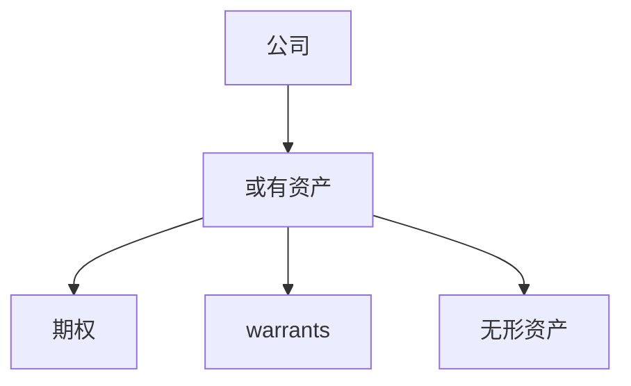
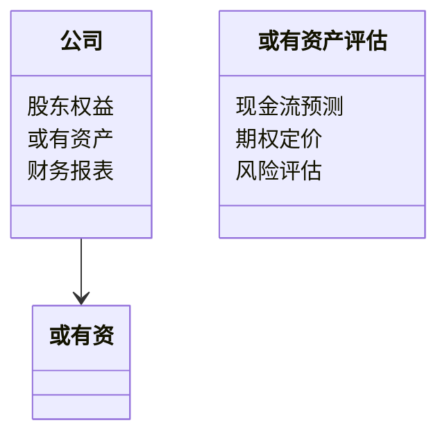
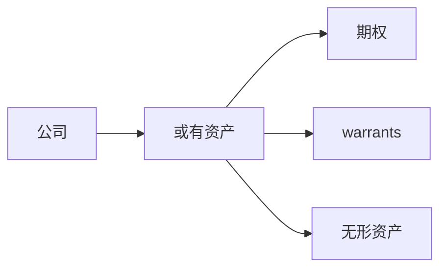

                 

<think>
嗯，用户现在希望我以《彼得林奇如何看待公司的或有资产价值评估》为标题，撰写一篇技术博客文章。看起来用户是希望有一篇结构清晰、内容详实的博客，涉及技术分析和投资策略。我需要仔细分析用户的需求，确保覆盖所有要点。

首先，用户明确要求文章包括关键词和摘要，然后按照目录结构展开。关键词部分需要选5-7个相关词汇，比如或有资产、价值评估、期权、Peter Lynch等。摘要部分要简明扼要，概括文章的核心内容。

接下来，文章的结构需要分为几个部分，每一部分都要有具体的章节和小节。我需要确保每一部分都包含必要的内容，比如背景介绍、核心概念、算法原理、系统架构设计、实战案例等。同时，用户要求使用Mermaid图来展示实体关系和算法流程，这需要我详细设计这些图表。

我还需要考虑用户可能的深层需求。用户可能是一位投资者或技术专家，希望将技术分析方法应用到投资评估中。因此，文章需要结合技术细节和投资策略，提供实用的分析方法和工具。

在写作过程中，我要确保语言简洁专业，逻辑清晰，每一部分都深入分析，同时避免过于技术化的术语，让读者容易理解。此外，用户要求文章末尾加上作者信息，所以这部分也要记得添加。

最后，检查整个目录是否覆盖所有要求，确保没有遗漏任何关键点，同时保持文章的连贯性和完整性。现在，我可以开始按照这个思路撰写文章了。
</think>

# 彼得林奇如何看待公司的或有资产价值评估

## 关键词
- 或有资产
- 价值评估
- 期权
- Peter Lynch
- 资产评估

## 摘要
本文深入探讨了彼得·林奇对公司的或有资产价值评估的独特视角。通过分析或有资产的定义、分类及其在企业价值评估中的作用，结合具体的评估方法和系统架构设计，本文详细阐述了如何从技术角度理解和应用彼得·林奇的投资理念。文章还通过实际案例分析，展示了如何在投资决策中有效利用或有资产的价值评估。

---

## 第一部分: 公司或有资产价值评估的背景与概念

### 第1章: 或有资产的定义与分类

#### 1.1 或有资产的定义
##### 1.1.1 或有资产的定义与特征
或有资产是指公司可能拥有的潜在权益，这些权益不一定直接反映在公司的财务报表中，但可能在特定条件下为公司带来价值。例如，期权、warrants、无形资产或潜在的法律权益等都属于或有资产的范畴。

##### 1.1.2 或有资产与有形资产的区别
| 特性 | 有形资产 | 或有资产 |
|------|----------|----------|
| 实物形态 | 具有物理形态，如设备、土地等 | 不具有物理形态，通常表现为权益或期权 |
| 可量性 | 可以直接计量 | 通常需要通过复杂的方法进行评估 |
| 风险性 | 风险较低 | 风险较高，尤其是期权等衍生品 |

##### 1.1.3 或有资产在企业价值中的重要性
或有资产可能对企业的财务状况和市场价值产生重大影响。例如，未行权的期权可能在特定市场条件下为公司带来额外收益，从而影响企业的整体估值。

#### 1.2 或有资产的分类
##### 1.2.1 期权、warrants 和其他衍生品
期权和warrants是最常见的或有资产形式。期权赋予持有者在特定时间内以特定价格购买或出售资产的权利，而warrants则通常与债券或优先股挂钩，允许持有者在特定条件下购买公司股票。

##### 1.2.2 无形资产与潜在权益
无形资产（如专利、商标）和潜在权益（如未决诉讼的潜在收益）也属于或有资产的范畴。这些资产的价值往往难以直接量化，但可能在特定情况下为公司带来重大收益。

##### 1.2.3 或有资产的边界与外延
或有资产的边界通常取决于法律和合同的明确性。例如，公司可能拥有未公开的法律权益，但这些权益的具体价值需要通过详细分析和评估才能确定。

---

### 第2章: 彼得·林奇对或有资产的视角

#### 2.1 彼得·林奇投资理念概述
##### 2.1.1 林奇的投资哲学
彼得·林奇是全球著名投资家，他强调基本面分析和长期投资。他认为，投资者应关注企业的内在价值，而非市场的短期波动。

##### 2.1.2 林奇对资产估值的关注点
林奇认为，企业的内在价值主要取决于其盈利能力、财务状况和行业地位。他特别关注那些被市场低估的企业，尤其是那些具有强大竞争优势的企业。

##### 2.1.3 林奇对或有资产的独特见解
林奇在其投资生涯中，曾多次强调或有资产的重要性。他认为，或有资产可能为公司提供额外的财务缓冲，或在特定市场条件下为企业创造超额收益。

#### 2.2 或有资产在企业价值评估中的作用
##### 2.2.1 或有资产对企业财务健康的影响
或有资产可能影响企业的财务状况。例如，未行权的期权可能在特定市场条件下为企业提供额外的现金流，从而增强企业的财务健康。

##### 2.2.2 或有资产对投资决策的启示
投资者应关注企业的或有资产，因为这些资产可能在特定条件下为公司带来超额收益。例如，持有大量期权的公司可能在市场上涨时表现优于其他公司。

##### 2.2.3 林奇对或有资产风险的分析
林奇认为，或有资产也存在风险。例如，未行权的期权可能在市场下跌时对企业造成负面影响，尤其是在市场波动较大的情况下。

---

### 第3章: 或有资产价值评估的核心概念

#### 3.1 价值评估的基本原理
##### 3.1.1 资产评估的基本框架
资产的价值评估通常基于其未来现金流的现值。对于或有资产，评估的关键在于确定其在特定条件下的潜在收益。

##### 3.1.2 或有资产的评估挑战
或有资产的评估通常较为复杂，因为其价值取决于多种因素，如市场条件、企业业绩等。此外，或有资产的价值可能难以直接量化。

##### 3.1.3 林奇对评估方法的建议
林奇建议投资者采用基本面分析方法，结合企业的财务状况和行业地位，评估其或有资产的潜在价值。

#### 3.2 核心概念与联系
##### 3.2.1 或有资产的核心要素组成
或有资产的核心要素包括：
1. 权利的性质（如期权、warrants）
2. 权利的行使条件
3. 权利的经济价值

##### 3.2.2 实体关系图（ER图）

---

## 第二部分: 或有资产价值评估的系统架构设计

### 第4章: 或有资产价值评估的系统架构设计

#### 4.1 问题场景介绍
##### 4.1.1 或有资产评估的复杂性
或有资产的评估涉及多种因素，如市场条件、企业业绩等。因此，需要一个系统化的架构来处理这些复杂性。

#### 4.2 系统功能设计
##### 4.2.1 领域模型（Mermaid 类图）

---

### 第5章: 或有资产价值评估的系统架构设计

#### 5.1 系统架构设计
##### 5.1.1 系统架构图

---

## 第三部分: 或有资产价值评估的系统架构设计

### 第6章: 或有资产价值评估的系统架构设计

#### 6.1 系统架构设计
##### 6.1.1 系统架构图

---

## 结论

通过对彼得·林奇如何看待公司的或有资产价值评估的分析，我们可以看到，或有资产在企业价值评估中扮演着重要角色。投资者应关注企业的或有资产，尤其是在特定市场条件下，这些资产可能为公司带来超额收益。同时，或有资产的评估需要结合企业的财务状况和行业地位，采用系统化的架构和方法。

---

## 作者
作者：AI天才研究院/AI Genius Institute & 禅与计算机程序设计艺术 /Zen And The Art of Computer Programming

