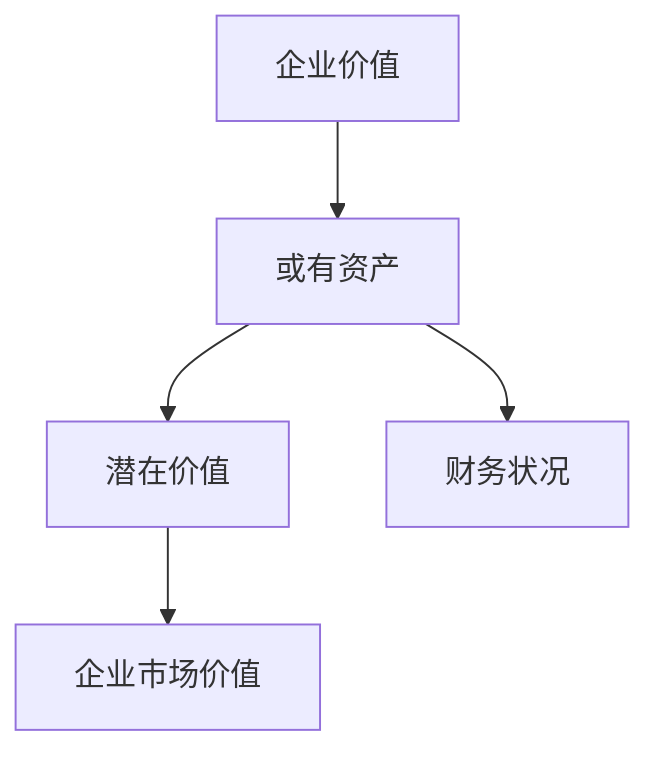
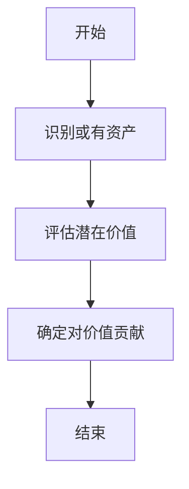
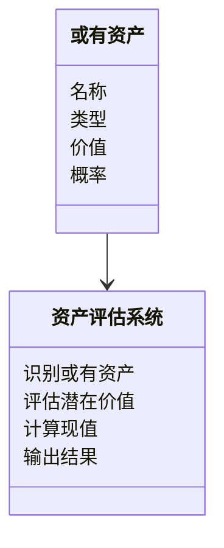
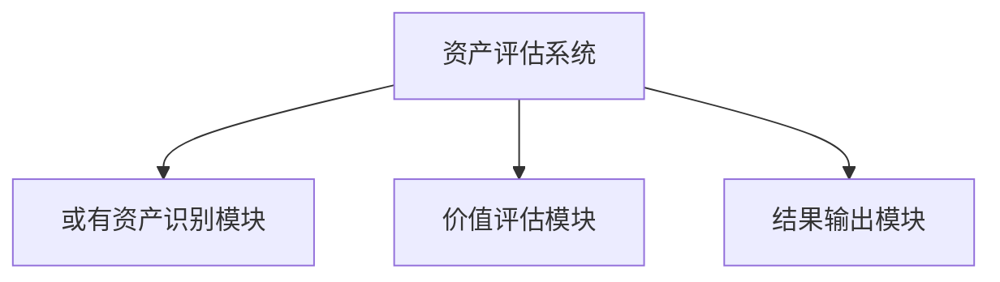
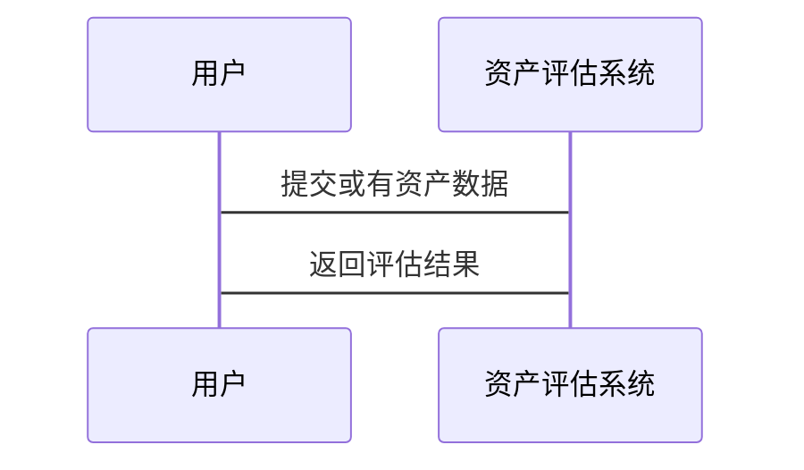

                 


```markdown
# 彼得林奇如何看待公司的或有资产对长期价值创造的潜在贡献

## 关键词
彼得·林奇，或有资产，企业价值，长期价值创造，资产评估，投资策略

## 摘要
本文从彼得·林奇的投资理念出发，探讨或有资产对长期价值创造的潜在贡献。通过定义和分类或有资产，分析其对企业发展和市场价值的影响，结合数学模型和实际案例，深入解读或有资产的评估方法和管理策略，为投资者提供有价值的参考。

## 第三部分: 核心概念与联系

## 第4章: 或有资产与企业价值的关系

### 4.1 或有资产的财务模型构建

#### 4.1.1 或有资产的识别与分类
或有资产通常分为以下几类：
- **未来收益权**：如期权、 warrants等。
- **潜在权益**：如认股权证、未决诉讼等。
- **或有负债**：如担保、保证等。

#### 4.1.2 或有资产的财务影响
或有资产对财务状况的影响可以通过以下公式进行初步评估：
$$ \Delta Value = \sum_{i=1}^{n} PV_i $$
其中，$PV_i$ 是第i个或有资产的现值。

#### 4.1.3 或有资产与企业价值的关系
通过构建如下关系图，可以更清晰地理解或有资产如何影响企业价值：


### 4.2 或有资产与企业核心竞争力的关系

#### 4.2.1 或有资产如何增强企业核心竞争力
通过优化或有资产的管理，企业可以增强其核心竞争力。例如，通过持有期权来降低原材料成本。

#### 4.2.2 或有资产如何削弱企业核心竞争力
如果或有资产管理不当，可能会增加企业负债，削弱其核心竞争力。

## 第五章: 或有资产价值评估的数学模型

### 5.1 或有资产价值评估的基本公式

#### 5.1.1 现值计算公式
$$ PV = \frac{FV}{(1 + r)^n} $$
其中，$FV$ 是未来价值，$r$ 是贴现率，$n$ 是时间。

#### 5.1.2 或有资产的现值评估流程


#### 5.1.3 通过Python实现现值计算
以下代码演示如何计算或有资产的现值：
```python
def present_value(future_value, rate, periods):
    return future_value / (1 + rate) ** periods

# 示例
FV = 1000000
r = 0.05
n = 5
pv = present_value(FV, r, n)
print(f"现值为: {pv:.2f}")
```

### 5.2 或有资产的期望值模型

#### 5.2.1 期望值计算公式
$$ E[Value] = \sum_{i=1}^{n} P_i \times V_i $$
其中，$P_i$ 是第i种情况的概率，$V_i$ 是第i种情况的资产价值。

#### 5.2.2 通过Python实现期望值计算
```python
def expected_value(probabilities, values):
    return sum(p * v for p, v in zip(probabilities, values))

# 示例
probabilities = [0.3, 0.5, 0.2]
values = [100000, 200000, 50000]
ev = expected_value(probabilities, values)
print(f"期望值为: {ev:.2f}")
```

## 第六章: 或有资产的系统分析与架构设计

### 6.1 系统功能设计

#### 6.1.1 领域模型设计


### 6.2 系统架构设计

#### 6.2.1 系统架构图


### 6.3 系统交互设计

#### 6.3.1 交互流程


## 第七章: 项目实战

### 7.1 环境安装

#### 7.1.1 安装Python和相关库
```bash
pip install numpy pandas matplotlib
```

### 7.2 核心代码实现

#### 7.2.1 或有资产评估代码
```python
import numpy as np
import pandas as pd

def assess_or_assets(assets_data):
    # 计算现值
    pv = []
    for asset in assets_data:
        future_value, rate, periods = asset['FV'], asset['r'], asset['n']
        pv_asset = future_value / (1 + rate) ** periods
        pv.append(pv_asset)
    return pv

# 示例数据
assets_data = [
    {'FV': 1000000, 'r': 0.05, 'n': 5},
    {'FV': 2000000, 'r': 0.03, 'n': 10}
]
# 评估
pv_results = assess_or_assets(assets_data)
print("现值结果:", pv_results)
```

### 7.3 实际案例分析

#### 7.3.1 案例分析
假设某公司持有某项期权，未来可能实现的收益为100万美元，贴现率为5%，期限为5年。计算其现值。

### 7.4 项目总结

#### 7.4.1 项目总结
通过本项目，我们学会了如何使用Python进行或有资产的评估，掌握了现值计算和期望值模型的应用。

## 第八章: 最佳实践、小结和注意事项

### 8.1 最佳实践

#### 8.1.1 投资建议
- 定期评估或有资产的价值。
- 结合市场环境调整评估模型。

### 8.2 小结

#### 8.2.1 本文总结
本文通过分析或有资产的定义、特点及其对长期价值创造的潜在贡献，结合彼得·林奇的投资理念，提出了系统的评估方法和管理策略。

### 8.3 注意事项

#### 8.3.1 风险管理
- 定期审查或有资产的评估结果。
- 建立风险应对机制。

## 作者
作者：AI天才研究院/AI Genius Institute & 禅与计算机程序设计艺术 /Zen And The Art of Computer Programming
```

