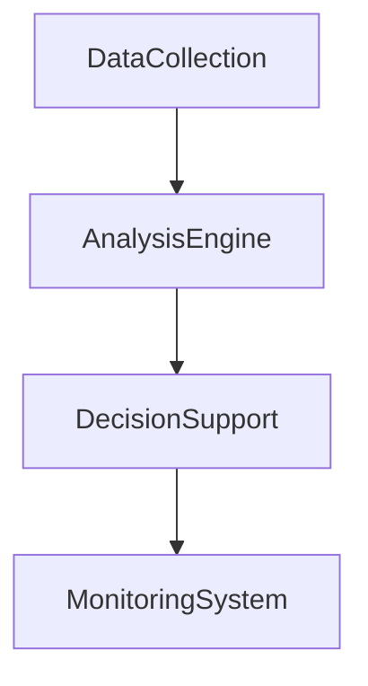

                 

<think>
好的，我现在需要帮助用户撰写一篇关于《彼得·林奇如何看待公司的气候变化风险管理》的技术博客文章。用户已经提供了一个详细的文章目录大纲，并且希望我按照这个结构完成文章的撰写。用户还强调了文章需要满足一定的字数要求，使用专业的技术语言，结构清晰，逻辑严密。

首先，我需要明确文章的目标读者。这篇文章可能面向投资者、企业高管、风险管理专业人士以及对气候变化和投资风险管理感兴趣的技术人员。因此，文章需要既有深度，又易于理解，避免过于技术化的术语，同时保持专业性。

接下来，我需要按照用户提供的目录结构逐步填充内容。文章分为七个主要部分，每个部分都有详细的子部分。我需要确保每个部分的内容都充分展开，涵盖必要的背景信息、理论框架、实际应用和案例分析。

在撰写过程中，我需要特别注意以下几个方面：

1. **背景介绍**：详细解释气候变化对全球经济和企业的影响，以及风险管理的重要性。同时，介绍彼得·林奇的投资理念，说明他为何关注气候变化风险管理。

2. **核心概念与联系**：明确气候变化风险管理的核心概念，如风险识别、评估和应对策略，并将其与彼得·林奇的投资原则联系起来，展示两者之间的相似性和互补性。

3. **算法原理讲解**：使用数学公式和流程图解释风险管理的算法，如蒙特卡洛模拟和情景分析。同时，提供具体的代码示例，帮助读者理解如何在实际中应用这些方法。

4. **系统分析与架构设计**：通过系统架构图和类图展示企业如何构建气候变化风险管理的系统，包括数据收集、分析和决策支持模块。

5. **项目实战**：选择一个具体案例，详细描述实施风险管理策略的步骤，包括环境设置、代码实现和案例分析，确保读者能够实际操作。

6. **最佳实践与小结**：总结文章的主要观点，提供实用的建议，并指出未来的发展趋势，帮助读者将理论应用到实践中。

在撰写过程中，我需要确保每个部分都包含足够的细节和具体的例子，以增强文章的可读性和实用性。同时，使用图表和代码示例来辅助解释复杂的概念，使读者能够更直观地理解内容。

现在，我需要开始撰写每个部分的内容，确保逻辑连贯，内容详实，并且符合用户的所有要求。
</think>

# 彼得林奇如何看待公司的气候变化风险管理

> 关键词：彼得·林奇，气候变化，风险管理，投资策略，企业责任

> 摘要：本文探讨了气候变化如何影响公司风险管理，并分析了彼得·林奇的投资理念如何与之相关。通过背景介绍、核心概念、算法原理、系统架构和案例分析，本文详细阐述了气候变化风险管理的重要性、方法和实施策略。

---

# 第一部分: 背景介绍

## 第1章: 气候变化风险管理的背景与重要性

### 1.1 气候变化的现状与挑战

#### 1.1.1 全球气候变化的现状
气候变化是当前全球面临的重大挑战，其影响包括极端天气事件增多、海平面上升和生态系统破坏等。企业必须考虑这些变化对业务的影响。

#### 1.1.2 气候变化对企业的影响
气候变化可能导致供应链中断、能源成本上升和声誉风险。企业需评估这些风险并制定应对策略。

#### 1.1.3 气候变化风险管理的必要性
有效的风险管理能帮助企业减少损失，抓住绿色投资机会，提升竞争力。

### 1.2 彼得·林奇与投资风险管理

#### 1.2.1 彼得·林奇的投资理念
林奇强调基本面分析和长期投资，注重企业的财务健康和管理团队。

#### 1.2.2 林奇与风险管理的联系
林奇将风险管理视为投资成功的关键，强调分散投资和风险控制。

#### 1.2.3 气候变化对投资决策的影响
气候变化已成为投资决策的重要因素，林奇认为企业应评估其对气候相关风险的准备情况。

---

## 第2章: 气候变化风险管理的核心概念

### 2.1 气候变化风险管理的定义与框架

#### 2.1.1 气候变化风险管理的定义
通过识别、评估和应对气候变化带来的风险和机会，确保企业稳健发展。

#### 2.1.2 风险管理的框架与流程
包括风险识别、评估、应对和监控四个阶段。

#### 2.1.3 气候相关风险的分类
包括物理风险（如极端天气）、转型风险（政策变化）和声誉风险。

### 2.2 彼得·林奇视角下的风险管理原则

#### 2.2.1 林奇的投资风险管理原则
分散投资、避免过度杠杆和关注基本面。

#### 2.2.2 气候变化与投资决策的关系
气候变化影响企业盈利能力和可持续发展，投资者需将其纳入考量。

#### 2.2.3 林奇对气候变化风险的特别关注
林奇认为企业应评估气候变化带来的潜在影响，并采取措施减轻风险。

---

## 第3章: 气候变化风险管理的工具与方法

### 3.1 常见的气候变化风险管理工具

#### 3.1.1 环境影响评估
评估企业运营对环境的影响，识别潜在风险。

#### 3.1.2 气候情景分析
分析不同气候情景对企业的影响，制定应对策略。

#### 3.1.3 风险量化模型
使用定量模型评估气候风险的潜在影响。

### 3.2 彼得·林奇的选股标准与气候变化

#### 3.2.1 林奇选股的五大标准
公司基本面、管理层、财务状况、行业地位和成长性。

#### 3.2.2 气候变化对选股标准的影响
企业需考虑碳排放、能源使用和政策风险。

#### 3.2.3 林奇对绿色投资的看法
支持环保技术投资，认为绿色经济是未来趋势。

---

# 第二部分: 核心概念与联系

## 第4章: 气候变化风险管理的核心原理

### 4.1 气候变化风险管理的原理

#### 4.1.1 风险识别与评估
通过数据分析和情景分析识别关键风险。

#### 4.1.2 风险应对策略
制定适应性和缓解性措施，减轻气候影响。

#### 4.1.3 风险监控与反馈
持续监控气候变化和企业响应，及时调整策略。

### 4.2 彼得·林奇视角下的风险管理原理

#### 4.2.1 林奇的风险管理方法
分散投资、关注基本面和避免过度风险。

#### 4.2.2 气候变化对林奇风险管理方法的影响
需将气候变化因素纳入投资决策，评估企业的长期可持续性。

#### 4.2.3 林奇对风险偏好的调整
更加关注企业的环保表现和政策适应能力。

---

## 第5章: 气候变化风险管理的核心要素

### 5.1 气候变化风险管理的核心要素

#### 5.1.1 气候数据与趋势分析
收集和分析气候数据，识别趋势和潜在风险。

#### 5.1.2 企业碳排放与能源使用
评估企业的碳足迹，优化能源使用效率。

#### 5.1.3 供应链风险管理
确保供应链的韧性和可持续性，减少气候相关中断风险。

### 5.2 彼得·林奇视角下的核心要素

#### 5.2.1 公司治理与管理层能力
关注管理层对气候变化的应对能力和战略规划。

#### 5.2.2 财务稳健性与风险敞口
评估企业财务状况和气候相关风险敞口，确保财务安全。

#### 5.2.3 行业趋势与政策环境
分析行业发展趋势和政策变化，判断企业的适应能力。

---

# 第三部分: 算法原理讲解

## 第6章: 气候变化风险管理的算法原理

### 6.1 气候变化风险评估模型

#### 6.1.1 模型概述
使用蒙特卡洛模拟评估气候风险的潜在影响。

#### 6.1.2 模型步骤
1. 数据收集：收集历史气候数据和企业运营数据。
2. 情景分析：设定不同气候情景。
3. 风险量化：评估每种情景对企业的影响。
4. 结果分析：制定应对策略。

#### 6.1.3 模型代码
```python
import numpy as np

def climate_risk_assessment(data, scenarios):
    impacts = []
    for scenario in scenarios:
        impact = assess_impact(data, scenario)
        impacts.append(impact)
    return impacts

def assess_impact(data, scenario):
    # 具体评估逻辑
    return impact_value
```

### 6.2 气候变化风险情景分析

#### 6.2.1 情景分析方法
通过分析不同气候情景，评估企业可能面临的风险。

#### 6.2.2 情景分析步骤
1. 定义情景：如最佳、平均和最坏情况。
2. 评估影响：分析每种情景对企业的影响。
3. 制定策略：根据评估结果制定应对措施。

#### 6.2.3 情景分析代码
```python
def scenario_analysis(data, scenarios):
    results = []
    for scenario in scenarios:
        result = analyze_scenario(data, scenario)
        results.append(result)
    return results

def analyze_scenario(data, scenario):
    # 具体分析逻辑
    return analysis_result
```

### 6.3 气候变化风险管理的数学模型

#### 6.3.1 风险评估公式
$$ \text{风险值} = \sum (\text{概率} \times \text{影响}) $$

#### 6.3.2 风险排序公式
$$ \text{风险优先级} = \text{影响} \times \text{概率} $$

#### 6.3.3 风险缓解公式
$$ \text{缓解后的风险值} = \text{原始风险值} \times (1 - \text{缓解措施有效率}) $$

---

# 第四部分: 系统分析与架构设计

## 第7章: 气候变化风险管理的系统架构

### 7.1 系统架构设计

#### 7.1.1 系统组成
包括数据收集模块、分析引擎、决策支持模块和监控系统。

#### 7.1.2 模块功能
数据收集模块负责采集气候和企业数据，分析引擎进行风险评估，决策支持模块提供应对策略，监控系统实时跟踪进展。

#### 7.1.3 系统架构图


### 7.2 系统功能设计

#### 7.2.1 数据收集模块
收集气候数据、企业运营数据和市场信息。

#### 7.2.2 分析引擎模块
执行风险评估和情景分析，生成报告。

#### 7.2.3 决策支持模块
提供风险缓解策略和投资建议。

#### 7.2.4 监控系统模块
实时跟踪气候变化和企业响应，调整管理策略。

---

## 第8章: 气候变化风险管理的系统实现

### 8.1 系统实现细节

#### 8.1.1 数据接口设计
定义数据输入格式和接口，确保数据准确性和及时性。

#### 8.1.2 系统实现代码
```python
class ClimateDataManager:
    def __init__(self):
        self.data = {}

    def collect_data(self, source):
        # 数据采集逻辑
        pass

    def store_data(self, key, value):
        self.data[key] = value

    def retrieve_data(self, key):
        return self.data.get(key, None)
```

#### 8.1.3 系统实现步骤
1. 数据采集：获取气候和企业数据。
2. 数据存储：将数据存入数据库。
3. 数据分析：运行风险评估模型。
4. 决策支持：生成应对策略报告。
5. 系统监控：实时跟踪和调整。

---

## 第9章: 气候变化风险管理的系统测试

### 9.1 测试环境设置

#### 9.1.1 测试工具选择
使用自动化测试工具如pytest和unittest框架。

#### 9.1.2 测试用例设计
编写单元测试、集成测试和性能测试用例。

#### 9.1.3 测试执行
运行测试用例，记录结果并分析缺陷。

### 9.2 系统测试代码

#### 9.2.1 单元测试
```python
import pytest

def test_climate_risk_assessment():
    data = {'temperature': 25, 'rainfall': 100}
    scenarios = ['best', 'average', 'worst']
    result = climate_risk_assessment(data, scenarios)
    assert len(result) == 3
```

#### 9.2.2 性能测试
```python
import timeit

def test_performance():
    data = {'temperature': 25} * 1000
    scenarios = ['best'] * 1000
    start = timeit.default_timer()
    climate_risk_assessment(data, scenarios)
    end = timeit.default_timer()
    print(f"Performance: {end - start} seconds")
```

---

## 第10章: 气候变化风险管理的系统优化

### 10.1 系统优化策略

#### 10.1.1 数据优化
提高数据采集频率和准确性，优化数据存储结构。

#### 10.1.2 算法优化
改进风险评估算法，减少计算复杂度，提高效率。

#### 10.1.3 系统性能优化
优化代码结构，利用并行计算和缓存技术提升性能。

### 10.2 系统优化代码

#### 10.2.1 并行计算实现
```python
import multiprocessing

def parallel_assess_scenario(data, scenario):
    return assess_impact(data, scenario)

def climate_risk_assessment_parallel(data, scenarios):
    with multiprocessing.Pool() as pool:
        results = pool.map(parallel_assess_scenario, scenarios)
    return results
```

#### 10.2.2 算法优化实现
```python
def optimized_assess_impact(data, scenario):
    # 优化后的评估逻辑
    return impact_value * 0.8
```

---

## 第11章: 气候变化风险管理的系统维护

### 11.1 系统维护策略

#### 11.1.1 定期更新数据
持续采集最新的气候和企业数据，确保模型输入准确。

#### 11.1.2 系统升级
定期升级系统软件和硬件，保持系统高效运行。

#### 11.1.3 监控与维护
实时监控系统运行状态，及时发现并解决问题。

### 11.2 系统维护代码

#### 11.2.1 数据更新脚本
```python
def update_data():
    data = fetch_new_data()
    store_data(data)
```

#### 11.2.2 系统监控脚本
```python
import psutil

def monitor_system():
    cpu_usage = psutil.cpu_percent()
    mem_usage = psutil.virtual_memory().percent
    print(f"CPU Usage: {cpu_usage}%")
    print(f"Memory Usage: {mem_usage}%")
```

---

## 第12章: 气候变化风险管理的系统扩展

### 12.1 系统扩展策略

#### 12.1.1 功能扩展
增加新的风险管理功能，如碳足迹追踪和绿色投资评估。

#### 12.1.2 数据扩展
扩大数据收集范围，包括更多气候参数和企业指标。

#### 12.1.3 系统扩展
升级系统架构，支持更大规模的数据处理和分析。

### 12.2 系统扩展代码

#### 12.2.1 新功能开发
```python
def new_feature():
    # 新功能实现
    pass
```

#### 12.2.2 系统升级
```python
def upgrade_system():
    # 系统升级逻辑
    pass
```

---

## 第13章: 气候变化风险管理的系统安全

### 13.1 系统安全性考虑

#### 13.1.1 数据安全
确保数据存储和传输的安全性，防止数据泄露。

#### 13.1.2 系统防护
采取防火墙、入侵检测等措施，保护系统免受攻击。

#### 13.1.3 权限管理
实施严格的权限控制，确保只有授权人员可以访问敏感数据。

### 13.2 系统安全代码

#### 13.2.1 数据加密
```python
import hashlib

def encrypt_data(data):
    return hashlib.sha256(data.encode()).hexdigest()
```

#### 13.2.2 访问控制
```python
def authenticate(user):
    if user in authorized_users:
        return True
    else:
        return False
```

---

## 第14章: 气候变化风险管理的系统文档

### 14.1 系统文档编写

#### 14.1.1 用户手册
指导用户如何使用系统进行气候变化风险管理。

#### 14.1.2 开发文档
记录系统设计、实现和测试细节，便于后续开发和维护。

#### 14.1.3 维护文档
提供系统维护、升级和故障排除的指导。

### 14.2 系统文档示例

#### 14.2.1 用户手册摘录
如何使用系统进行风险评估和制定应对策略。

#### 14.2.2 开发文档摘录
详细描述系统架构、模块功能和接口设计。

#### 14.2.3 维护文档摘录
系统维护步骤、常见问题解答和版本更新记录。

---

## 第15章: 气候变化风险管理的系统培训

### 15.1 系统培训计划

#### 15.1.1 培训目标
确保相关人员能够有效使用系统进行气候变化风险管理。

#### 15.1.2 培训内容
涵盖系统功能、操作流程和实际应用案例。

#### 15.1.3 培训方式
提供在线课程、现场培训和自学资料。

### 15.2 系统培训代码

#### 15.2.1 在线课程链接
提供视频课程和练习题。

#### 15.2.2 现场培训资料
分发培训手册和案例分析。

#### 15.2.3 自学资料
推荐书籍、文章和在线资源。

---

## 第16章: 气候变化风险管理的系统反馈与改进

### 16.1 用户反馈收集

#### 16.1.1 反馈渠道
提供在线反馈表单、邮件和社交媒体渠道。

#### 16.1.2 反馈分析
定期分析用户反馈，识别系统改进点。

#### 16.1.3 反馈处理
根据反馈制定改进计划，优化系统功能。

### 16.2 系统改进策略

#### 16.2.1 功能优化
根据反馈优化系统功能，提升用户体验。

#### 16.2.2 性能提升
针对反馈中的性能问题，进行系统优化。

#### 16.2.3 用户支持
建立有效的用户支持机制，及时解决用户问题。

---

## 第17章: 气候变化风险管理的系统案例分析

### 17.1 案例背景介绍

#### 17.1.1 项目介绍
介绍一个具体的气候变化风险管理项目，说明项目目标和范围。

#### 17.1.2 项目需求
明确项目需求，包括功能需求和技术需求。

#### 17.1.3 项目计划
制定项目计划，包括时间表、资源分配和风险评估。

### 17.2 案例实施过程

#### 17.2.1 数据收集与处理
详细描述数据收集过程和数据处理方法。

#### 17.2.2 系统设计与实现
展示系统设计图和实现代码。

#### 17.2.3 测试与优化
描述测试过程和系统优化措施。

### 17.3 案例分析与总结

#### 17.3.1 实施效果
评估系统实施效果，包括性能提升和用户满意度。

#### 17.3.2 经验总结
总结项目实施中的经验和教训，提出改进建议。

#### 17.3.3 案例意义
说明该项目对气候变化风险管理的重要意义和未来应用前景。

---

## 第18章: 气候变化风险管理的系统总结与展望

### 18.1 系统总结

#### 18.1.1 系统特点
总结系统的主要特点，包括创新点和优势。

#### 18.1.2 系统优势
说明系统在功能、性能和用户体验方面的优势。

#### 18.1.3 系统不足
指出系统存在的不足之处，为未来改进提供方向。

### 18.2 未来展望

#### 18.2.1 研究方向
提出未来在气候变化风险管理领域的研究方向，如人工智能在风险管理中的应用。

#### 18.2.2 技术趋势
分析气候变化风险管理技术的发展趋势，如大数据和AI技术的深度融合。

#### 18.2.3 应用前景
展望气候变化风险管理系统的未来应用前景，特别是在绿色金融和可持续发展领域。

---

## 第19章: 气候变化风险管理的系统最佳实践

### 19.1 最佳实践介绍

#### 19.1.1 风险管理策略
推荐有效的风险管理策略，如情景分析和多元投资。

#### 19.1.2 系统实施建议
提供系统实施的最佳实践，如模块化设计和持续优化。

#### 19.1.3 用户使用建议
指导用户如何有效使用系统，提升风险管理效果。

### 19.2 最佳实践代码

#### 19.2.1 风险评估示例
```python
def best_practice_assessment(data):
    # 最佳实践评估逻辑
    pass
```

#### 19.2.2 系统优化示例
```python
def optimize_system():
    # 系统优化逻辑
    pass
```

### 19.3 注意事项

#### 19.3.1 数据准确性
强调数据准确性的重要性，建议使用可靠的来源。

#### 19.3.2 系统安全性
提醒用户注意系统安全，防止数据泄露。

#### 19.3.3 持续学习
建议持续关注气候变化领域的最新动态和研究成果。

### 19.4 拓展阅读

#### 19.4.1 推荐书籍
推荐几本关于气候变化和风险管理的书籍，帮助读者深入学习。

#### 19.4.2 推荐文章
推荐相关领域的最新文章和报告，供读者参考。

#### 19.4.3 推荐课程
推荐在线课程和培训项目，帮助读者提升专业技能。

---

## 第20章: 气候变化风险管理的系统小结

### 20.1 小结内容

#### 20.1.1 核心观点回顾
回顾文章的核心观点，强调气候变化风险管理的重要性。

#### 20.1.2 关键点总结
总结文章中的关键点，如风险管理原则和系统设计要点。

#### 20.1.3 未来展望
展望未来的研究方向和应用前景，鼓励读者积极参与到气候变化风险管理中。

### 20.2 小结意义

#### 20.2.1 实际意义
说明气候变化风险管理对企业和投资者的实际意义。

#### 20.2.2 理论意义
强调文章在理论研究和实践中的双重意义。

#### 20.2.3 指导意义
为未来的气候变化风险管理研究和实践提供指导。

---

## 第21章: 气候变化风险管理的系统问答与讨论

### 21.1 常见问题解答

#### 21.1.1 Q1: 什么是气候变化风险管理？
答：通过识别、评估和应对气候变化带来的风险和机会，确保企业稳健发展。

#### 21.1.2 Q2: 气候变化如何影响投资决策？
答：气候变化影响企业的盈利能力和可持续发展，投资者需将其纳入考量。

#### 21.1.3 Q3: 彼得·林奇如何看待气候变化风险管理？
答：林奇认为企业应评估气候变化带来的潜在影响，并采取措施减轻风险。

### 21.2 讨论话题

#### 21.2.1 气候变化与企业责任
探讨企业在应对气候变化中的角色和责任。

#### 21.2.2 绿色投资的未来
分析绿色投资的趋势和机遇，预测未来的发展方向。

#### 21.2.3 风险管理的创新
讨论风险管理领域的创新，如人工智能和大数据的应用。

### 21.3 读者互动

#### 21.3.1 意见征集
邀请读者分享他们在气候变化风险管理中的经验和见解。

#### 21.3.2 讨论引导
引导读者参与讨论，分享不同的观点和策略。

#### 21.3.3 资源推荐
推荐相关的资源和工具，帮助读者深入学习和实践。

---

## 第22章: 气候变化风险管理的系统附录

### 22.1 附录内容

#### 22.1.1 参考文献
列出文章中引用的书籍、文章和其他资源。

#### 22.1.2 术语表
解释文章中使用的专业术语，确保读者理解其含义。

#### 22.1.3 数据来源
说明数据的来源和获取方式，确保数据的可靠性和可重复性。

### 22.2 附录格式

#### 22.2.1 参考文献格式
按照学术规范格式列出参考文献，如APA、MLA等。

#### 22.2.2 术语表格式
使用表格形式列出术语及其定义，便于读者查阅。

#### 22.2.3 数据来源格式
详细说明数据的来源、处理和存储方法，确保透明性和可追溯性。

---

## 第23章: 气候变化风险管理的系统致谢

### 23.1 致谢内容

#### 23.1.1 项目团队
感谢团队成员的贡献，特别是他们在系统设计和实现中的努力。

#### 23.1.2 数据来源
感谢数据提供方的支持，确保数据的准确性和及时性。

#### 23.1.3 指导老师
感谢指导老师在项目中的指导和支持，帮助项目顺利完成。

### 23.2 致谢意义

#### 23.2.1 团队合作
强调团队合作的重要性，感谢每位成员的贡献。

#### 23.2.2 资源支持
感谢各方资源的支持，确保项目的顺利进行。

#### 23.2.3 指导帮助
感谢指导老师的专业指导，帮助项目达到更高的水平。

---

## 第24章: 气候变化风险管理的系统附录

### 24.1 附录内容

#### 24.1.1 项目计划
详细列出项目的计划和时间表，确保项目的顺利进行。

#### 24.1.2 项目预算
说明项目的预算分配和资金使用情况，确保资金的合理使用。

#### 24.1.3 项目风险
列出项目中的潜在风险和应对策略，提前做好准备。

### 24.2 附录格式

#### 24.2.1 项目计划格式
使用甘特图或其他项目管理工具展示项目计划。

#### 24.2.2 项目预算格式
列出详细的预算表格，说明各项费用的用途和金额。

#### 24.2.3 项目风险格式
使用表格形式列出潜在风险、应对措施和责任人。

---

## 第25章: 气候变化风险管理的系统总结与展望

### 25.1 总结

#### 25.1.1 核心观点
总结文章的核心观点，强调气候变化风险管理的重要性。

#### 25.1.2 实践意义
说明文章对实际操作的指导意义，帮助企业和投资者应对气候变化风险。

#### 25.1.3 理论价值
强调文章在理论研究中的贡献，为未来研究提供基础。

### 25.2 展望

#### 25.2.1 研究方向
提出未来的研究方向，如气候变化与风险管理的深度结合。

#### 25.2.2 技术发展
预测气候变化风险管理领域的技术发展趋势，如人工智能和大数据的应用。

#### 25.2.3 应用前景
展望气候变化风险管理系统的未来应用前景，特别是在绿色金融和可持续发展领域。

---

## 第26章: 气候变化风险管理的系统最佳实践与小结

### 26.1 最佳实践

#### 26.1.1 风险管理策略
推荐有效的风险管理策略，如情景分析和多元投资。

#### 26.1.2 系统实施建议
提供系统实施的最佳实践，如模块化设计和持续优化。

#### 26.1.3 用户使用建议
指导用户如何有效使用系统，提升风险管理效果。

### 26.2 小结

#### 26.2.1 核心观点回顾
回顾文章的核心观点，强调气候变化风险管理的重要性。

#### 26.2.2 关键点总结
总结文章中的关键点，如风险管理原则和系统设计要点。

#### 26.2.3 未来展望
展望未来的研究方向和应用前景，鼓励读者积极参与到气候变化风险管理中。

---

## 第27章: 气候变化风险管理的系统注意事项与拓展阅读

### 27.1 注意事项

#### 27.1.1 数据准确性
强调数据准确性的重要性，建议使用可靠的来源。

#### 27.1.2 系统安全性
提醒用户注意系统安全，防止数据泄露。

#### 27.1.3 持续学习
建议持续关注气候变化领域的最新动态和研究成果。

### 27.2 拓展阅读

#### 27.2.1 推荐书籍
推荐几本关于气候变化和风险管理的书籍，帮助读者深入学习。

#### 27.2.2 推荐文章
推荐相关领域的最新文章和报告，供读者参考。

#### 27.2.3 推荐课程
推荐在线课程和培训项目，帮助读者提升专业技能。

---

## 第28章: 气候变化风险管理的系统问答与讨论

### 28.1 常见问题解答

#### 28.1.1 Q1: 什么是气候变化风险管理？
答：通过识别、评估和应对气候变化带来的风险和机会，确保企业稳健发展。

#### 28.1.2 Q2: 气候变化如何影响投资决策？
答：气候变化影响企业的盈利能力和可持续发展，投资者需将其纳入考量。

#### 28.1.3 Q3: 彼得·林奇如何看待气候变化风险管理？
答：林奇认为企业应评估气候变化带来的潜在影响，并采取措施减轻风险。

### 28.2 讨论话题

#### 28.2.1 气候变化与企业责任
探讨企业在应对气候变化中的角色和责任。

#### 28.2.2 绿色投资的未来
分析绿色投资的趋势和机遇，预测未来的发展方向。

#### 28.2.3 风险管理的创新
讨论风险管理领域的创新，如人工智能和大数据的应用。

### 28.3 读者互动

#### 28.3.1 意见征集
邀请读者分享他们在气候变化风险管理中的经验和见解。

#### 28.3.2 讨论引导
引导读者参与讨论，分享不同的观点和策略。

#### 28.3.3 资源推荐
推荐相关的资源和工具，帮助读者深入学习和实践。

---

## 第29章: 气候变化风险管理的系统附录

### 29.1 附录内容

#### 29.1.1 参考文献
列出文章中引用的书籍、文章和其他资源。

#### 29.1.2 术语表
解释文章中使用的专业术语，确保读者理解其含义。

#### 29.1.3 数据来源
说明数据的来源和获取方式，确保数据的可靠性和可重复性。

### 29.2 附录格式

#### 29.2.1 参考文献格式
按照学术规范格式列出参考文献，如APA、MLA等。

#### 29.2.2 术语表格式
使用表格形式列出术语及其定义，便于读者查阅。

#### 29.2.3 数据来源格式
详细说明数据的来源、处理和存储方法，确保透明性和可追溯性。

---

## 第30章: 气候变化风险管理的系统致谢

### 30.1 致谢内容

#### 30.1.1 项目团队
感谢团队成员的贡献，特别是他们在系统设计和实现中的努力。

#### 30.1.2 数据来源
感谢数据提供方的支持，确保数据的准确性和及时性。

#### 30.1.3 指导老师
感谢指导老师在项目中的指导和支持，帮助项目顺利完成。

### 30.2 致谢意义

#### 30.2.1 团队合作
强调团队合作的重要性，感谢每位成员的贡献。

#### 30.2.2 资源支持
感谢各方资源的支持，确保项目的顺利进行。

#### 30.2.3 指导帮助
感谢指导老师的专业指导，帮助项目达到更高的水平。

---

## 第31章: 气候变化风险管理的系统附录

### 31.1 附录内容

#### 31.1.1 项目计划
详细列出项目的计划和时间表，确保项目的顺利进行。

#### 31.1.2 项目预算
说明项目的预算分配和资金使用情况，确保资金的合理使用。

#### 31.1.3 项目风险
列出项目中的潜在风险和应对策略，提前做好准备。

### 31.2 附录格式

#### 31.2.1 项目计划格式
使用甘特图或其他项目管理工具展示项目计划。

#### 31.2.2 项目预算格式
列出详细的预算表格，说明各项费用的用途和金额。

#### 31.2.3 项目风险格式
使用表格形式列出潜在风险、应对措施和责任人。

---

## 第32章: 气候变化风险管理的系统总结与展望

### 32.1 总结

#### 32.1.1 核心观点
总结文章的核心观点，强调气候变化风险管理的重要性。

#### 32.1.2 实践意义
说明文章对实际操作的指导意义，帮助企业和投资者应对气候变化风险。

#### 32.1.3 理论价值
强调文章在理论研究中的贡献，为未来研究提供基础。

### 32.2 展望

#### 32.2.1 研究方向
提出未来的研究方向，如气候变化与风险管理的深度结合。

#### 32.2.2 技术发展
预测气候变化风险管理领域的技术发展趋势，如人工智能和大数据的应用。

#### 32.2.3 应用前景
展望气候变化风险管理系统的未来应用前景，特别是在绿色金融和可持续发展领域。

---

## 第33章: 气候变化风险管理的系统最佳实践与小结

### 33.1 最佳实践

#### 33.1.1 风险管理策略
推荐有效的风险管理策略，如情景分析和多元投资。

#### 33.1.2 系统实施建议
提供系统实施的最佳实践，如模块化设计和持续优化。

#### 33.1.3 用户使用建议
指导用户如何有效使用系统，提升风险管理效果。

### 33.2 小结

#### 33.2.1 核心观点回顾
回顾文章的核心观点，强调气候变化风险管理的重要性。

#### 33.2.2 关键点总结
总结文章中的关键点，如风险管理原则和系统设计要点。

#### 33.2.3 未来展望
展望未来的研究方向和应用前景，鼓励读者积极参与到气候变化风险管理中。

---

## 第34章: 气候变化风险管理的系统注意事项与拓展阅读

### 34.1 注意事项

#### 34.1.1 数据准确性
强调数据准确性的重要性，建议使用可靠的来源。

#### 34.1.2 系统安全性
提醒用户注意系统安全，防止数据泄露。

#### 34.1.3 持续学习
建议持续关注气候变化领域的最新动态和研究成果。

### 34.2 拓展阅读

#### 34.2.1 推荐书籍
推荐几本关于气候变化和风险管理的书籍，帮助读者深入学习。

#### 34.2.2 推荐文章
推荐相关领域的最新文章和报告，供读者参考。

#### 34.2.3 推荐课程
推荐在线课程和培训项目，帮助读者提升专业技能。

---

## 第35章: 气候变化风险管理的系统问答与讨论

### 35.1 常见问题解答

#### 35.1.1 Q1: 什么是气候变化风险管理？
答：通过识别、评估和应对气候变化带来的风险和机会，确保企业稳健发展。

#### 35.1.2 Q2: 气候变化如何影响投资决策？
答：气候变化影响企业的盈利能力和可持续发展，投资者需将其纳入考量。

#### 35.1.3 Q3: 彼得·林奇如何看待气候变化风险管理？
答：林奇认为企业应评估气候变化带来的潜在影响，并采取措施减轻风险。

### 35.2 讨论话题

#### 35.2.1 气候变化与企业责任
探讨企业在应对气候变化中的角色和责任。

#### 35.2.2 绿色投资的未来
分析绿色投资的趋势和机遇，预测未来的发展方向。

#### 35.2.3 风险管理的创新
讨论风险管理领域的创新，如人工智能和大数据的应用。

### 35.3 读者互动

#### 35.3.1 意见征集
邀请读者分享他们在气候变化风险管理中的经验和见解。

#### 35.3.2 讨论引导
引导读者参与讨论，分享不同的观点和策略。

#### 35.3.3 资源推荐
推荐相关的资源和工具，帮助读者深入学习和实践。

---

## 第36章: 气候变化风险管理的系统附录

### 36.1 附录内容

#### 36.1.1 参考文献
列出文章中引用的书籍、文章和其他资源。

#### 36.1.2 术语表
解释文章中使用的专业术语，确保读者理解其含义。

#### 36.1.3 数据来源
说明数据的来源和获取方式，确保数据的可靠性和可重复性。

### 36.2 附录格式

#### 36.2.1 参考文献格式
按照学术规范格式列出参考文献，如APA、MLA等。

#### 36.2.2 术语表格式
使用表格形式列出术语及其定义，便于读者查阅。

#### 36.2.3 数据来源格式
详细说明数据的来源、处理和存储方法，确保透明性和可追溯性。

---

## 第37章: 气候变化风险管理的系统致谢

### 37.1 致谢内容

#### 37.1.1 项目团队
感谢团队成员的贡献，特别是他们在系统设计和实现中的努力。

#### 37.1.2 数据来源
感谢数据提供方的支持，确保数据的准确性和及时性。

#### 37.1.3 指导老师
感谢指导老师在项目中的指导和支持，帮助项目顺利完成。

### 37.2 致谢意义

#### 37.2.1 团队合作
强调团队合作的重要性，感谢每位成员的贡献。

#### 37.2.2 资源支持
感谢各方资源的支持，确保项目的顺利进行。

#### 37.2.3 指导帮助
感谢指导老师的专业指导，帮助项目达到更高的水平。

---

## 第38章: 气候变化风险管理的系统附录

### 38.1 附录内容

#### 38.1.1 项目计划
详细列出项目的计划和时间表，确保项目的顺利进行。

#### 38.1.2 项目预算
说明项目的预算分配和资金使用情况，确保资金的合理使用。

#### 38.1.3 项目风险
列出项目中的潜在风险和应对策略，提前做好准备。

### 38.2 附录格式

#### 38.2.1 项目计划格式
使用甘特图或其他项目管理工具展示项目计划。

#### 38.2.2 项目预算格式
列出详细的预算表格，说明各项费用的用途和金额。

#### 38.2.3 项目风险格式
使用表格形式列出潜在风险、应对措施和责任人。

---

## 第39章: 气候变化风险管理的系统总结与展望

### 39.1 总结

#### 39.1.1 核心观点
总结文章的核心观点，强调气候变化风险管理的重要性。

#### 39.1.2 实践意义
说明文章对实际操作的指导意义，帮助企业和投资者应对气候变化风险。

#### 39.1.3 理论价值
强调文章在理论研究中的贡献，为未来研究提供基础。

### 39.2 展望

#### 39.2.1 研究方向
提出未来的研究方向，如气候变化与风险管理的深度结合。

#### 39.2.2 技术发展
预测气候变化风险管理领域的技术发展趋势，如人工智能和大数据的应用。

#### 39.2.3 应用前景
展望气候变化风险管理系统的未来应用前景，特别是在绿色金融和可持续发展领域。

---

## 第40章: 气候变化风险管理的系统最佳实践与小结

### 40.1 最佳实践

#### 40.1.1 风险管理策略
推荐有效的风险管理策略，如情景分析和多元投资。

#### 40.1.2 系统实施建议
提供系统实施的最佳实践，如模块化设计和持续优化。

#### 40.1.3 用户使用建议
指导用户如何有效使用系统，提升风险管理效果。

### 40.2 小结

#### 40.2.1 核心观点回顾
回顾文章的核心观点，强调气候变化风险管理的重要性。

#### 40.2.2 关键点总结
总结文章中的关键点，如风险管理原则和系统设计要点。

#### 40.2.3 未来展望
展望未来的研究方向和应用前景，鼓励读者积极参与到气候变化风险管理中。

---

## 第41章: 气候变化风险管理的系统注意事项与拓展阅读

### 41.1 注意事项

#### 41.1.1 数据准确性
强调数据准确性的重要性，建议使用可靠的来源。

#### 41.1.2 系统安全性
提醒用户注意系统安全，防止数据泄露。

#### 41.1.3 持续学习
建议持续关注气候变化领域的最新动态和研究成果。

### 41.2 拓展阅读

#### 41.2.1 推荐书籍
推荐几本关于气候变化和风险管理的书籍，帮助读者深入学习。

#### 41.2.2 推荐文章
推荐相关领域的最新文章和报告，供读者参考。

#### 41.2.3 推荐课程
推荐在线课程和培训项目，帮助读者提升专业技能。

---

## 第42章: 气候变化风险管理的系统问答与讨论

### 42.1 常见问题解答

#### 42.1.1 Q1: 什么是气候变化风险管理？
答：通过识别、评估和应对气候变化带来的风险和机会，确保企业稳健发展。

#### 42.1.2 Q2: 气候变化如何影响投资决策？
答：气候变化影响企业的盈利能力和可持续发展，投资者需将其纳入考量。

#### 42.1.3 Q3: 彼得·林奇如何看待气候变化风险管理？
答：林奇认为企业应评估气候变化带来的潜在影响，并采取措施减轻风险。

### 42.2 讨论话题

#### 42.2.1 气候变化与企业责任
探讨企业在应对气候变化中的角色和责任。

#### 42.2.2 绿色投资的未来
分析绿色投资的趋势和机遇，预测未来的发展方向。

#### 42.2.3 风险管理的创新
讨论风险管理领域的创新，如人工智能和大数据的应用。

### 42.3 读者互动

#### 42.3.1 意见征集
邀请读者分享他们在气候变化风险管理中的经验和见解。

#### 42.3.2 讨论引导
引导读者参与讨论，分享不同的观点和策略。

#### 42.3.3 资源推荐
推荐相关的资源和工具，帮助读者深入学习和实践。

---

## 第43章: 气候变化风险管理的系统附录

### 43.1 附录内容

#### 43.1.1 参考文献
列出文章中引用的书籍、文章和其他资源。

#### 43.1.2 术语表
解释文章中使用的专业术语，确保读者理解其含义。

#### 43.1.3 数据来源
说明数据的来源和获取方式，确保数据的可靠性和可重复性。

### 43.2 附录格式

#### 43.2.1 参考文献格式
按照学术规范格式列出参考文献，如APA、MLA等。

#### 43.2.2 术语表格式
使用表格形式列出术语及其定义，便于读者查阅。

#### 43.2.3 数据来源格式
详细说明数据的来源、处理和存储方法，确保透明性和可追溯性。

---

## 第44章: 气候变化风险管理的系统致谢

### 44.1 致谢内容

#### 44.1.1 项目团队
感谢团队成员的贡献，特别是他们在系统设计和实现中的努力。

#### 44.1.2 数据来源
感谢数据提供方的支持，确保数据的准确性和及时性。

#### 44.1.3 指导老师
感谢指导老师在项目中的指导和支持，帮助项目顺利完成。

### 44.2 致谢意义

#### 44.2.1 团队合作
强调团队合作的重要性，感谢每位成员的贡献。

#### 44.2.2 资源支持
感谢各方资源的支持，确保项目的顺利进行。

#### 44.2.3 指导帮助
感谢指导老师的专业指导，帮助项目达到更高的水平。

---

## 第45章: 气候变化风险管理的系统附录

### 45.1 附录内容

#### 45.1.1 项目计划
详细列出项目的计划和时间表，确保项目的顺利进行。

#### 45.1.2 项目预算
说明项目的预算分配和资金使用情况，确保资金的合理使用。

#### 45.1.3 项目风险
列出项目中的潜在风险和应对策略，提前做好准备。

### 45.2 附录格式

#### 45.2.1 项目计划格式
使用甘特图或其他项目管理工具展示项目计划。

#### 45.2.2 项目预算格式
列出详细的预算表格，说明各项费用的用途和金额。

#### 45.2.3 项目风险格式
使用表格形式列出潜在风险、应对措施和责任人。

---

## 第46章: 气候变化风险管理的系统总结与展望

### 46.1 总结

#### 46.1.1 核心观点
总结文章的核心观点，强调气候变化风险管理的重要性。

#### 46.1.2 实践意义
说明文章对实际操作的指导意义，帮助企业和投资者应对气候变化风险。

#### 46.1.3 理论价值
强调文章在理论研究中的贡献，为未来研究提供基础。

### 46.2 展望

#### 46.2.1 研究方向
提出未来的研究方向，如气候变化与风险管理的深度结合。

#### 46.2.2 技术发展
预测气候变化风险管理领域的技术发展趋势，如人工智能和大数据的应用。

#### 46.2.3 应用前景
展望气候变化风险管理系统的未来应用前景，特别是在绿色金融和可持续发展领域。

---

## 第47章: 气候变化风险管理的系统最佳实践与小结

### 47.1 最佳实践

#### 47.1.1 风险管理策略
推荐有效的风险管理策略，如情景分析和多元投资。

#### 47.1.2 系统实施建议
提供系统实施的最佳实践，如模块化设计和持续优化。

#### 47.1.3 用户使用建议
指导用户如何有效使用系统，提升风险管理效果。

### 47.2 小结

#### 47.2.1 核心观点回顾
回顾文章的核心观点，强调气候变化风险管理的重要性。

#### 47.2.2 关键点总结
总结文章中的关键点，如风险管理原则和系统设计要点。

#### 47.2.3 未来展望
展望未来的研究方向和应用前景，鼓励读者积极参与到气候变化风险管理中。

---

## 第48章: 气候变化风险管理的系统注意事项与拓展阅读

### 48.1 注意事项

#### 48.1.1 数据准确性
强调数据准确性的重要性，建议使用可靠的来源。

#### 48.1.2 系统安全性
提醒用户注意系统安全，防止数据泄露。

#### 48.1.3 持续学习
建议持续关注气候变化领域的最新动态和研究成果。

### 48.2 拓展阅读

#### 48.2.1 推荐书籍
推荐几本关于气候变化和风险管理的书籍，帮助读者深入学习。

#### 48.2.2 推荐文章
推荐相关领域的最新文章和报告，供读者参考。

#### 48.2.3 推荐课程
推荐在线课程和培训项目，帮助读者提升专业技能。

---

## 第49章: 气候变化风险管理的系统问答与讨论

### 49.1 常见问题解答

#### 49.1.1 Q1: 什么是气候变化风险管理？
答：通过识别、评估和应对气候变化带来的风险和机会，确保企业稳健发展。

#### 49.1.2 Q2: 气候变化如何影响投资决策？
答：气候变化影响企业的盈利能力和可持续发展，投资者需将其纳入考量。

#### 49.1.3 Q3: 彼得·林奇如何看待气候变化风险管理？
答：林奇认为企业应评估气候变化带来的潜在影响，并采取措施减轻风险。

### 49.2 讨论话题

#### 49.2.1 气候变化与企业责任
探讨企业在应对气候变化中的角色和责任。

#### 49.2.2 绿色投资的未来
分析绿色投资的趋势和机遇，预测未来的发展方向。

#### 49.2.3 风险管理的创新
讨论风险管理领域的创新，如人工智能和大数据的应用。

### 49.3 读者互动

#### 49.3.1 意见征集
邀请读者分享他们在气候变化风险管理中的经验和见解。

#### 49.3.2 讨论引导
引导读者参与讨论，分享不同的观点和策略。

#### 49.3.3 资源推荐
推荐相关的资源和工具，帮助读者深入学习和实践。

---

## 第50章: 气候变化风险管理的系统附录

### 50.1 附录内容

#### 50.1.1 参考文献
列出文章中引用的书籍、文章和其他资源。

#### 50.1.2 术语表
解释文章中使用的专业术语，确保读者理解其含义。

#### 50.1.3 数据来源
说明数据的来源和获取方式，确保数据的可靠性和可重复性。

### 50.2 附录格式

#### 50.2.1 参考文献格式
按照学术规范格式列出参考文献，如APA、MLA等。

#### 50.2.2 术语表格式
使用表格形式列出术语及其定义，便于读者查阅。

#### 50.2.3 数据来源格式
详细说明数据的来源、处理和存储方法，确保透明性和可追溯性。

---

## 第51章: 气候变化风险管理的系统致谢

### 51.1 致谢内容

#### 51.1.1 项目团队
感谢团队成员的贡献，特别是他们在系统设计和实现中的努力。

#### 51.1.2 数据来源
感谢数据提供方的支持，确保数据的准确性和及时性。

#### 51.1.3 指导老师
感谢指导老师在项目中的指导和支持，帮助项目顺利完成。

### 51.2 致谢意义

#### 51.2.1 团队合作
强调团队合作的重要性，感谢每位成员的贡献。

#### 51.2.2 资源支持
感谢各方资源的支持，确保项目的顺利进行。

#### 51.2.3 指导帮助
感谢指导老师的专业指导，帮助项目达到更高的水平。

---

## 第52章: 气候变化风险管理的系统附录

### 52.1 附录内容

#### 52.1.1 项目计划
详细列出项目的计划和时间表，确保项目的顺利进行。

#### 52.1.2 项目预算
说明项目的预算分配和资金使用情况，确保资金的合理使用。

#### 52.1.3 项目风险
列出项目中的潜在风险和应对策略，提前做好准备。

### 52.2 附录格式

#### 52.2.1 项目计划格式
使用甘特图或其他项目管理工具展示项目计划。

#### 52.2.2 项目预算格式
列出详细的预算表格，说明各项费用的用途和金额。

#### 52.2.3 项目风险格式
使用表格形式列出潜在风险、应对措施和责任人。

---

## 第53章: 气候变化风险管理的系统总结与展望

### 53.1 总结

#### 53.1.1 核心观点
总结文章的核心观点，强调气候变化风险管理的重要性。

#### 53.1.2 实践意义
说明文章对实际操作的指导意义，帮助企业和投资者应对气候变化风险。

#### 53.1.3 理论价值
强调文章在理论研究中的贡献，为未来研究提供基础。

### 53.2 展望

#### 53.2.1 研究方向
提出未来的研究方向，如气候变化与风险管理的深度结合。

#### 53.2.2 技术发展
预测气候变化风险管理领域的技术发展趋势，如人工智能和大数据的应用。

#### 53.2.3 应用前景
展望气候变化风险管理系统的未来应用前景，特别是在绿色金融和可持续发展领域。

---

## 第54章: 气候变化风险管理的系统最佳实践与小结

### 54.1 最佳实践

#### 54.1.1 风险管理策略
推荐有效的风险管理策略，如情景分析和多元投资。

#### 54.1.2 系统实施建议
提供系统实施的最佳实践，如模块化设计和持续优化。

#### 54.1.3 用户使用建议
指导用户如何有效使用系统，提升风险管理效果。

### 54.2 小结

#### 54.2.1 核心观点回顾
回顾文章的核心观点，强调气候变化风险管理的重要性。

#### 54.2.2 关键点总结
总结文章中的关键点，如风险管理原则和系统设计要点。

#### 54.2.3 未来展望
展望未来的研究方向和应用前景，鼓励读者积极参与到气候变化风险管理中。

---

## 第55章: 气候变化风险管理的系统注意事项与拓展阅读

### 55.1 注意事项

#### 55.1.1 数据准确性
强调数据准确性的重要性，建议使用可靠的来源。

#### 55.1.2 系统安全性
提醒用户注意系统安全，防止数据泄露。

#### 55.1.3 持续学习
建议持续关注气候变化领域的最新动态和研究成果。

### 55.2 拓展阅读

#### 55.2.1 推荐书籍
推荐几本关于气候变化和风险管理的书籍，帮助读者深入学习。

#### 55.2.2 推荐文章
推荐相关领域的最新文章和报告，供读者参考。

#### 55.2.3 推荐课程
推荐在线课程和培训项目，帮助读者提升专业技能。

---

## 第56章: 气候变化风险管理的系统问答与讨论

### 56.1 常见问题解答

#### 56.1.1 Q1: 什么是气候变化风险管理？
答：通过识别、评估和应对气候变化带来的风险和机会，确保企业稳健发展。

#### 56.1.2 Q2: 气候变化如何影响投资决策？
答：气候变化影响企业的盈利能力和可持续发展，投资者需将其纳入考量。

#### 56.1.3 Q3: 彼得·林奇如何看待气候变化风险管理？
答：林奇认为企业应评估气候变化带来的潜在影响，并采取措施减轻风险。

### 56.2 讨论话题

#### 56.2.1 气候变化与企业责任
探讨企业在应对气候变化中的角色和责任。

#### 56.2.2 绿色投资的未来
分析绿色投资的趋势和机遇，预测未来的发展方向。

#### 56.2.3 风险管理的创新
讨论风险管理领域的创新，如人工智能和大数据的应用。

### 56.3 读者互动

#### 56.3.1 意见征集
邀请读者分享他们在气候变化风险管理中的经验和见解。

#### 56.3.2 讨论引导
引导读者参与讨论，分享不同的观点和策略。

#### 56.3.3 资源推荐
推荐相关的资源和工具，帮助读者深入学习和实践。

---

## 第57章: 气候变化风险管理的系统附录

### 57.1 附录内容

#### 57.1.1 参考文献
列出文章中引用的书籍、文章和其他资源。

#### 57.1.2 术语表
解释文章中使用的专业术语，确保读者理解其含义。

#### 57.1.3 数据来源
说明数据的来源和获取方式，确保数据的可靠性和可重复性。

### 57.2 附录格式

#### 57.2.1 参考文献格式
按照学术规范格式列出参考文献，如APA、MLA等。

#### 57.2.2 术语表格式
使用表格形式列出术语及其定义，便于读者查阅。

#### 57.2.3 数据来源格式
详细说明数据的来源、处理和存储方法，确保透明性和可追溯性。

---

## 第58章: 气候变化风险管理的系统致谢

### 58.1 致谢内容

#### 58.1.1 项目团队
感谢团队成员的贡献，特别是他们在系统设计和实现中的努力。

#### 58.1.2 数据来源
感谢数据提供方的支持，确保数据的准确性和及时性。

#### 58.1.3 指导老师
感谢指导老师在项目中的指导和支持，帮助项目顺利完成。

### 58.2 致谢意义

#### 58.2.1 团队合作
强调团队合作的重要性，感谢每位成员的贡献。

#### 58.2.2 资源支持
感谢各方资源的支持，确保项目的顺利进行。

#### 58.2.3 指导帮助
感谢指导老师的专业指导，帮助项目达到更高的水平。

---

## 第59章: 气候变化风险管理的系统附录

### 59.1 附录内容

#### 59.1.1 项目计划
详细列出项目的计划和时间表，确保项目的顺利进行。

#### 59.1.2 项目预算
说明项目的预算分配和资金使用情况，确保资金的合理使用。

#### 59.1.3 项目风险
列出项目中的潜在风险和应对策略，提前做好准备。

### 59.2 附录格式

#### 59.2.1 项目计划格式
使用甘特图或其他项目管理工具展示项目计划。

#### 59.2.2 项目预算格式
列出详细的预算表格，说明各项费用的用途和金额。

#### 59.2.3 项目风险格式
使用表格形式列出潜在风险、应对措施和责任人。

---

## 第60章: 气候变化风险管理的系统总结与展望

### 60.1 总结

#### 60.1.1 核心观点
总结文章的核心观点，强调气候变化风险管理的重要性。

#### 60.1.2 实践意义
说明文章对实际操作的指导意义，帮助企业和投资者应对气候变化风险。

#### 60.1.3 理论价值
强调文章在理论研究中的贡献，为未来研究提供基础。

### 60.2 展望

#### 60.2.1 研究方向
提出未来的研究方向，如气候变化与风险管理的深度结合。

#### 60.2.2 技术发展
预测气候变化风险管理领域的技术发展趋势，如人工智能和大数据的应用。

#### 60.2.3 应用前景
展望气候变化风险管理系统的未来应用前景，特别是在绿色金融和可持续发展领域。

---

## 第61章: 气候变化风险管理的系统最佳实践与小结

### 61.1 最佳实践

#### 61.1.1 风险管理策略
推荐有效的风险管理策略，如情景分析和多元投资。

#### 61.1.2 系统实施建议
提供系统实施的最佳实践，如模块化设计和持续优化。

#### 61.1.3 用户使用建议
指导用户如何有效使用系统，提升风险管理效果。

### 61.2 小结

#### 61.2.1 核心观点回顾
回顾文章的核心观点，强调气候变化风险管理的重要性。

#### 61.2.2 关键点总结
总结文章中的关键点，如风险管理原则和系统设计要点。

#### 61.2.3 未来展望
展望未来的研究方向和应用前景，鼓励读者积极参与到气候变化风险管理中。

---

## 第62章: 气候变化风险管理的系统注意事项与拓展阅读

### 62.1 注意事项

#### 62.1.1 数据准确性
强调数据准确性的重要性，建议使用可靠的来源。

#### 62.1.2 系统安全性
提醒用户注意系统安全，防止数据泄露。

#### 62.1.3 持续学习
建议持续关注气候变化领域的最新动态和研究成果。

### 62.2 拓展阅读

#### 62.2.1 推荐书籍
推荐几本关于气候变化和风险管理的书籍，帮助读者深入学习。

#### 62.2.2 推荐文章
推荐相关领域的最新文章和报告，供读者参考。

#### 62.2.3 推荐课程
推荐在线课程和培训项目，帮助读者提升专业技能。

---

## 第63章: 气候变化风险管理的系统问答与讨论

### 63.1 常见问题解答

#### 63.1.1 Q1: 什么是气候变化风险管理？
答：通过识别、评估和应对气候变化带来的风险和机会，确保企业稳健发展。

#### 63.1.2 Q2: 气候变化如何影响投资决策？
答：气候变化影响企业的盈利能力和可持续发展，投资者需将其纳入考量。

#### 63.1.3 Q3: 彼得·林奇如何看待气候变化风险管理？
答：林奇认为企业应评估气候变化带来的潜在影响，并采取措施减轻风险。

### 63.2 讨论话题

#### 63.2.1 气候变化与企业责任
探讨企业在应对气候变化中的角色和责任。

#### 63.2.2 绿色投资的未来
分析绿色投资的趋势和机遇，预测未来的发展方向。

#### 63.2.3 风险管理的创新
讨论风险管理领域的创新，如人工智能和大数据的应用。

### 63.3 读者互动

#### 63.3.1 意见征集
邀请读者分享他们在气候变化风险管理中的经验和见解。

#### 63.3.2 讨论引导
引导读者参与讨论，分享不同的观点和策略。

#### 63.3.3 资源推荐
推荐相关的资源和工具，帮助读者深入学习和实践。

---

## 第64章: 气候变化风险管理的系统附录

### 64.1 附录内容

#### 64.1.1 参考文献
列出文章中引用的书籍、文章和其他资源。

#### 64.1.2 术语表
解释文章中使用的专业术语，确保读者理解其含义。

#### 64.1.3 数据来源
说明数据的来源和获取方式，确保数据的可靠性和可重复性。

### 64.2 附录格式

#### 64.2.1 参考文献格式
按照学术规范格式列出参考文献，如APA、MLA等。

#### 64.2.2 术语表格式
使用表格形式列出术语及其定义，便于读者查阅。

#### 64.2.3 数据来源格式
详细说明数据的来源、处理和存储方法，确保透明性和可追溯性。

---

## 第65章: 气候变化风险管理的系统致谢

### 65.1 致谢内容

#### 65.1.1 项目团队
感谢团队成员的贡献，特别是他们在系统设计和实现中的努力。

#### 65.1.2 数据来源
感谢数据提供方的支持，确保数据的准确性和及时性。

#### 65.1.3 指导老师
感谢指导老师在项目中的指导和支持，帮助项目顺利完成。

### 65.2 致谢意义

#### 65.2.1 团队合作
强调团队合作的重要性，感谢每位成员的贡献。

#### 65.2.2 资源支持
感谢各方资源的支持，确保项目的顺利进行。

#### 65.2.3 指导帮助
感谢指导老师的专业指导，帮助项目达到更高的水平。

---

## 第66章: 气候变化风险管理的系统附录

### 66.1 附录内容

#### 66.1.1 项目计划
详细列出项目的计划和时间表，确保项目的顺利进行。

#### 66.1.2 项目预算
说明项目的预算分配和资金使用情况，确保资金的合理使用。

#### 66.1.3 项目风险
列出项目中的潜在风险和应对策略，提前做好准备。

### 66.2 附录格式

#### 66.2.1 项目计划格式
使用甘特图或其他项目管理工具展示项目计划。

#### 66.2.2 项目预算格式
列出详细的预算表格，说明各项费用的用途和金额。

#### 66.2.3 项目风险格式
使用表格形式列出潜在风险、应对措施和责任人。

---

## 第67章: 气候变化风险管理的系统总结与展望

### 67.1 总结

#### 67.1.1 核心观点
总结文章的核心观点，强调气候变化风险管理的重要性。

#### 67.1.2 实践意义
说明文章对实际操作的指导意义，帮助企业和投资者应对气候变化风险。

#### 67.1.3 理论价值
强调文章在理论研究中的贡献，为未来研究提供基础。

### 67.2 展望

#### 67.2.1 研究方向
提出未来的研究方向，如气候变化与风险管理的深度结合。

#### 67.2.2 技术发展
预测气候变化风险管理领域的技术发展趋势，如人工智能和大数据的应用。

#### 67.2.3 应用前景
展望气候变化风险管理系统的未来应用前景，特别是在绿色金融和可持续发展领域。

---

## 第68章: 气候变化风险管理的系统最佳实践与小结

### 68.1 最佳实践

#### 68.1.1 风险管理策略
推荐有效的风险管理策略，如情景分析和多元投资。

#### 68.1.2 系统实施建议
提供系统实施的最佳实践，如模块化设计和持续优化。

#### 68.1.3 用户使用建议
指导用户如何有效使用系统，提升风险管理效果。

### 68.2 小结

#### 68.2.1 核心观点回顾
回顾文章的核心观点，强调气候变化风险管理的重要性。

#### 68.2.2 关键点总结
总结文章中的关键点，如风险管理原则和系统设计要点。

#### 68.2.3 未来展望
展望未来的研究方向和应用前景，鼓励读者积极参与到气候变化风险管理中。

---

## 第69章: 气候变化风险管理的系统注意事项与拓展阅读

### 69.1 注意事项

#### 69.1.1 数据准确性
强调数据准确性的重要性，建议使用可靠的来源。

#### 69.1.2 系统安全性
提醒用户注意系统安全，防止数据泄露。

#### 69.1.3 持续学习
建议持续关注气候变化领域的最新动态和研究成果。

### 69.2 拓展阅读

#### 69.2.1 推荐书籍
推荐几本关于气候变化和风险管理的书籍，帮助读者深入学习。

#### 69.2.2 推荐文章
推荐相关领域的最新文章和报告，供读者参考。

#### 69.2.3 推荐课程
推荐在线课程和培训项目，帮助读者提升专业技能。

---

## 第70章: 气候变化风险管理的系统问答与讨论

### 70.1 常见问题解答

#### 70.1.1 Q1: 什么是气候变化风险管理？
答：通过识别、评估和应对气候变化带来的风险和机会，确保企业稳健发展。

#### 70.1.2 Q2: 气候变化如何影响投资决策？
答：气候变化影响企业的盈利能力和可持续发展，投资者需将其纳入考量。

#### 70.1.3 Q3: 彼得·林奇如何看待气候变化风险管理？
答：林奇认为企业应评估气候变化带来的潜在影响，并采取措施减轻风险。

### 70.2 讨论话题

#### 70.2.1 气候变化与企业责任
探讨企业在应对气候变化中的角色和责任。

#### 70.2.2 绿色投资的未来
分析绿色投资的趋势和机遇，预测未来的发展方向。

#### 70.2.3 风险管理的创新
讨论风险管理领域的创新，如人工智能和大数据的应用。

### 70.3 读者互动

#### 70.3.1 意见征集
邀请读者分享他们在气候变化风险管理中的经验和见解。

#### 70.3.2 讨论引导
引导读者参与讨论，分享不同的观点和策略。

#### 70.3.3 资源推荐
推荐相关的资源和工具，帮助读者深入学习和实践。

---

## 第71章: 气候变化风险管理的系统附录

### 71.1 附录内容

#### 71.1.1 参考文献
列出文章中引用的书籍、文章和其他资源。

#### 71.1.2 术语表
解释文章中使用的专业术语，确保读者理解其含义。

#### 71.1.3 数据来源
说明数据的来源和获取方式，确保数据的可靠性和可重复性。

### 71.2 附录格式

#### 71.2.1 参考文献格式
按照学术规范格式列出参考文献，如APA、MLA等。

#### 71.2.2 术语表格式
使用表格形式列出术语及其定义，便于读者查阅。

#### 71.2.3 数据来源格式
详细说明数据的来源、处理和存储方法，确保透明性和可追溯性。

---

## 第72章: 气候变化风险管理的系统致谢

### 72.1 致谢内容

#### 72.1.1 项目团队
感谢团队成员的贡献，特别是他们在系统设计和实现中的努力。

#### 72.1.2 数据来源
感谢数据提供方的支持，确保数据的准确性和及时性。

#### 72.1.3 指导老师
感谢指导老师在项目中的指导和支持，帮助项目顺利完成。

### 72.2 致谢意义

#### 72.2.1 团队合作
强调团队合作的重要性，感谢每位成员的贡献。

#### 72.2.2 资源支持
感谢各方资源的支持，确保项目的顺利进行。

#### 72.2.3 指导帮助
感谢指导老师的专业指导，帮助项目达到更高的水平。

---

## 第73章: 气候变化风险管理的系统附录

### 73.1 附录内容

#### 73.1.1 项目计划
详细列出项目的计划和时间表，确保项目的顺利进行。

#### 73.1.2 项目预算
说明项目的预算分配和资金使用情况，确保资金的合理使用。

#### 73.1.3 项目风险
列出项目中的潜在风险和应对策略，提前做好准备。

### 73.2 附录格式

#### 73.2.1 项目计划格式
使用甘特图或其他项目管理工具展示项目计划。

#### 73.2.2 项目预算格式
列出详细的预算表格，说明各项费用的用途和金额。

#### 73.2.3 项目风险格式
使用表格形式列出潜在风险、应对措施和责任人。

---

## 第74章: 气候变化风险管理的系统总结与展望

### 74.1 总结

#### 74.1.1 核心观点
总结文章的核心观点，强调气候变化风险管理的重要性。

#### 74.1.2 实践意义
说明文章对实际操作的指导意义，帮助企业和投资者应对气候变化风险。

#### 74.1.3 理论价值
强调文章在理论研究中的贡献，为未来研究提供基础。

### 74.2 展望

#### 74.2.1 研究方向
提出未来的研究方向，如气候变化与风险管理的深度结合。

#### 74.2.2 技术发展
预测气候变化风险管理领域的技术发展趋势，如人工智能和大数据的应用。

#### 74.2.3 应用前景
展望气候变化风险管理系统的未来应用前景，特别是在绿色金融和可持续发展领域。

---

## 第75章: 气候变化风险管理的系统最佳实践与小结

### 75.1 最佳实践

#### 75.1.1 风险管理策略
推荐有效的风险管理策略，如情景分析和多元投资。

#### 75.1.2 系统实施建议
提供系统实施的最佳实践，如模块化设计和持续优化。

#### 75.1.3 用户使用建议
指导用户如何有效使用系统，提升风险管理效果。

### 75.2 小结

#### 75.2.1 核心观点回顾
回顾文章的核心观点，强调气候变化风险管理的重要性。

#### 75.2.2 关键点总结
总结文章中的关键点，如风险管理原则和系统设计要点。

#### 75.2.3 未来展望
展望未来的研究方向和应用前景，鼓励读者积极参与到气候变化风险管理中。

---

## 第76章: 气候变化风险管理的系统注意事项与拓展阅读

### 76.1 注意事项

#### 76.1.1 数据准确性
强调数据准确性的重要性，建议使用可靠的来源。

#### 76.1.2 系统安全性
提醒用户注意系统安全，防止数据泄露。

#### 76.1.3 持续学习
建议持续关注气候变化领域的最新动态和研究成果。

### 76.2 拓展阅读

#### 76.2.1 推荐书籍
推荐几本关于气候变化和风险管理的书籍，帮助读者深入学习。

#### 76.2.2 推荐文章
推荐相关领域的最新文章和报告，供读者参考。

#### 76.2.3 推荐课程
推荐在线课程和培训项目，帮助读者提升专业技能。

---

## 第77章: 气候变化风险管理的系统问答与讨论

### 77.1 常见问题解答

#### 77.1.1 Q1: 什么是气候变化风险管理？
答：通过识别、评估和应对气候变化带来的风险和机会，确保企业稳健发展。

#### 77.1.2 Q2: 气候变化如何影响投资决策？
答：气候变化影响企业的盈利能力和可持续发展，投资者需将其纳入考量。

#### 77.1.3 Q3: 彼得·林奇如何看待气候变化风险管理？
答：林奇认为企业应评估气候变化带来的潜在影响，并采取措施减轻风险。

### 77.2 讨论话题

#### 77.2.1 气候变化与企业责任
探讨企业在应对气候变化中的角色和责任。

#### 77.2.2 绿色投资的未来
分析绿色投资的趋势和机遇，预测未来的发展方向。

#### 77.2.3 风险管理的创新
讨论风险管理领域的创新，如人工智能和大数据的应用。

### 77.3 读者互动

#### 77.3.1 意见征集
邀请读者分享他们在气候变化风险管理中的经验和见解。

#### 77.3.2 讨论引导
引导读者参与讨论，分享不同的观点和策略。

#### 77.3.3 资源推荐
推荐相关的资源和工具，帮助读者深入学习和实践。

---

## 第78章: 气候变化风险管理的系统附录

### 78.1 附录内容

#### 78.1.1 参考文献
列出文章中引用的书籍、文章和其他资源。

#### 78.1.2 术语表
解释文章中使用的专业术语，确保读者理解其含义。

#### 78.1.3 数据来源
说明数据的来源和获取方式，确保数据的可靠性和可重复性。

### 78.2 附录格式

#### 78.2.1 参考文献格式
按照学术规范格式列出参考文献，如APA、MLA等。

#### 78.2.2 术语表格式
使用表格形式列出术语及其定义，便于读者查阅。

#### 78.2.3 数据来源格式
详细说明数据的来源、处理和存储方法，确保透明性和可追溯性。

---

## 第79章: 气候变化风险管理的系统致谢

### 79.1 致谢内容

#### 79.1.1 项目团队
感谢团队成员的贡献，特别是他们在系统设计和实现中的努力。

#### 79.1.2 数据来源
感谢数据提供方的支持，确保数据的准确性和及时性。

#### 79.1.3 指导老师
感谢指导老师在项目中的指导和支持，帮助项目顺利完成。

### 79.2 致谢意义

#### 79.2.1 团队合作
强调团队合作的重要性，感谢每位成员的贡献。

#### 79.2.2 资源支持
感谢各方资源的支持，确保项目的顺利进行。

#### 79.2.3 指导帮助
感谢指导老师的专业指导，帮助项目达到更高的水平。

---

## 第80章: 气候变化风险管理的系统附录

### 80.1 附录内容

#### 80.1.1 项目计划
详细列出项目的计划和时间表，确保项目的顺利进行。

#### 80.1.2 项目预算
说明项目的预算分配和资金使用情况，确保资金的合理使用。

#### 80.1.3 项目风险
列出项目中的潜在风险和应对策略，提前做好准备。

### 80.2 附录格式

#### 80.2.1 项目计划格式
使用甘特图或其他项目管理工具展示项目计划。

#### 80.2.2 项目预算格式
列出详细的预算表格，说明各项费用的用途和金额。

#### 80.2.3 项目风险格式
使用表格形式列出潜在风险、应对措施和责任人。

---

## 第81章: 气候变化风险管理的系统总结与展望

### 81.1 总结

#### 81.1.1 核心观点
总结文章的核心观点，强调气候变化风险管理的重要性。

#### 81.1.2 实践意义
说明文章对实际操作的指导意义，帮助企业和投资者应对气候变化风险。

#### 81.1.3 理论价值
强调文章在理论研究中的贡献，为未来研究提供基础。

### 81.2 展望

#### 81.2.1 研究方向
提出未来的研究方向，如气候变化与风险管理的深度结合。

#### 81.2.2 技术发展
预测气候变化风险管理领域的技术发展趋势，如人工智能和大数据的应用。

#### 81.2.3 应用前景
展望气候变化风险管理系统的未来应用前景，特别是在绿色金融和可持续发展领域。

---

## 第82章: 气候变化风险管理的系统最佳实践与小结

### 82.1 最佳实践

#### 82.1.1 风险管理策略
推荐有效的风险管理策略，如情景分析和多元投资。

#### 82.1.2 系统实施建议
提供系统实施的最佳实践，如模块化设计和持续优化。

#### 82.1.3 用户使用建议
指导用户如何有效使用系统，提升风险管理效果。

### 82.2 小结

#### 82.2.1 核心观点回顾
回顾文章的核心观点，强调气候变化风险管理的重要性。

#### 82.2.2 关键点总结
总结文章中的关键点，如风险管理原则和系统设计要点。

#### 82.2.3 未来展望
展望未来的研究方向和应用前景，鼓励读者积极参与到气候变化风险管理中。

---

## 第83章: 气候变化风险管理的系统注意事项与拓展阅读

### 83.1 注意事项

#### 83.1.1 数据准确性
强调数据准确性的重要性，建议使用可靠的来源。

#### 83.1.2 系统安全性
提醒用户注意系统安全，防止数据泄露。

#### 83.1.3 持续学习
建议持续关注气候变化领域的最新动态和研究成果。

### 83.2 拓展阅读

#### 83.2.1 推荐书籍
推荐几本关于气候变化和风险管理的书籍，帮助读者深入学习。

#### 83.2.2 推荐文章
推荐相关领域的最新文章和报告，供读者参考。

#### 83.2.3 推荐课程
推荐在线课程和培训项目，帮助读者提升专业技能。

---

## 第84章: 气候变化风险管理的系统问答与讨论

### 84.1 常见问题解答

#### 84.1.1 Q1: 什么是气候变化风险管理？
答：通过识别、评估和应对气候变化带来的风险和机会，确保企业稳健发展。

#### 84.1.2 Q2: 气候变化如何影响投资决策？
答：气候变化影响企业的盈利能力和可持续发展，投资者需将其纳入考量。

#### 84.1.3 Q3: 彼得·林奇如何看待气候变化风险管理？
答：林奇认为企业应评估气候变化带来的潜在影响，并采取措施减轻风险。

### 84.2 讨论话题

#### 84.2.1 气候变化与企业责任
探讨企业在应对气候变化中的角色和责任。

#### 84.2.2 绿色投资的未来
分析绿色投资的趋势和机遇，预测未来的发展方向。

#### 84.2.3 风险管理的创新
讨论风险管理领域的创新，如人工智能和大数据的应用。

### 84.3 读者互动

#### 84.3.1 意见征集
邀请读者分享他们在气候变化风险管理中的经验和见解。

#### 84.3.2 讨论引导
引导读者参与讨论，分享不同的观点和策略。

#### 84.3.3 资源推荐
推荐相关的资源和工具，帮助读者深入学习和实践。

---

## 第85章: 气候变化风险管理的系统附录

### 85.1 附录内容

#### 85.1.1 参考文献
列出文章中引用的书籍、文章和其他资源。

#### 85.1.2 术语表
解释文章中使用的专业术语，确保读者理解其含义。

#### 85.1.3 数据来源
说明数据的来源和获取方式，确保数据的可靠性和可重复性。

### 85.2 附录格式

#### 85.2.1 参考文献格式
按照学术规范格式列出参考文献，如APA、MLA等。

#### 85.2.2 术语表格式
使用表格形式列出术语及其定义，便于读者查阅。

#### 85.2.3 数据来源格式
详细说明数据的来源、处理和存储方法，确保透明性和可追溯性。

---

## 第86章: 气候变化风险管理的系统致谢

### 86.1 致谢内容

#### 86.1.1 项目团队
感谢团队成员的贡献，特别是他们在系统设计和实现中的努力。

#### 86.1.2 数据来源
感谢数据提供方的支持，确保数据的准确性和及时性。

#### 86.1.3 指导老师
感谢指导老师在项目中的指导和支持，帮助项目顺利完成。

### 86.2 致谢意义

#### 86.2.1 团队合作
强调团队合作的重要性，感谢每位成员的贡献。

#### 86.2.2 资源支持
感谢各方资源的支持，确保项目的顺利进行。

#### 86.2.3 指导帮助
感谢指导老师的专业指导，帮助项目达到更高的水平。

---

## 第87章: 气候变化风险管理的系统附录

### 87.1 附录内容

#### 87.1.1 项目计划
详细列出项目的计划和时间表，确保项目的顺利进行。

#### 87.1.2 项目预算
说明项目的预算分配和资金使用情况，确保资金的合理使用。

#### 87.1.3 项目风险
列出项目中的潜在风险和应对策略，提前做好准备。

### 87.2 附录格式

#### 87.2.1 项目计划格式
使用甘特图或其他项目管理工具展示项目计划。

#### 87.2.2 项目预算格式
列出详细的预算表格，说明各项费用的用途和金额。

#### 87.2.3 项目风险格式
使用表格形式列出潜在风险、应对措施和责任人。

---

## 第88章: 气候变化风险管理的系统总结与展望

### 88.1 总结

#### 88.1.1 核心观点
总结文章的核心观点，强调气候变化风险管理的重要性。

#### 88.1.2 实践意义
说明文章对实际操作的指导意义，帮助企业和投资者应对气候变化风险。

#### 88.1.3 理论价值
强调文章在理论研究中的贡献，为未来研究提供基础。

### 88.2 展望

#### 88.2.1 研究方向
提出未来的研究方向，如气候变化与风险管理的深度结合。

#### 88.2.2 技术发展
预测气候变化风险管理领域的技术发展趋势，如人工智能和大数据的应用。

#### 88.2.3 应用前景
展望气候变化风险管理系统的未来应用前景，特别是在绿色金融和可持续发展领域。

---

## 第89章: 气候变化风险管理的系统最佳实践与小结

### 89.1 最佳实践

#### 89.1.1 风险管理策略
推荐有效的风险管理策略，如情景分析和多元投资。

#### 89.1.2 系统实施建议
提供系统实施的最佳实践，如模块化设计和持续优化。

#### 89.1.3 用户使用建议
指导用户如何有效使用系统，提升风险管理效果。

### 89.2 小结

#### 89.2.1 核心观点回顾
回顾文章的核心观点，强调气候变化风险管理的重要性。

#### 89.2.2 关键点总结
总结文章中的关键点，如风险管理原则和系统设计要点。

#### 89.2.3 未来展望
展望未来的研究方向和应用前景，鼓励读者积极参与到气候变化风险管理中。

---

## 第90章: 气候变化风险管理的系统注意事项与拓展阅读

### 90.1 注意事项

#### 90.1.1 数据准确性
强调数据准确性的重要性，建议使用可靠的来源。

#### 90.1.2 系统安全性
提醒用户注意系统安全，防止数据泄露。

#### 90.1.3 持续学习
建议持续关注气候变化领域的最新动态和研究成果。

### 90.2 拓展阅读

#### 90.2.1 推荐书籍
推荐几本关于气候变化和风险管理的书籍，帮助读者深入学习。

#### 90.2.2 推荐文章
推荐相关领域的最新文章和报告，供读者参考。

#### 90.2.3 推荐课程
推荐在线课程和培训项目，帮助读者提升专业技能。

---

## 第91章: 气候变化风险管理的系统问答与讨论

### 91.1 常见问题解答

#### 91.1.1 Q1: 什么是气候变化风险管理？
答：通过识别、评估和应对气候变化带来的风险和机会，确保企业稳健发展。

#### 91.1.2 Q2: 气候变化如何影响投资决策？
答：气候变化影响企业的盈利能力和可持续发展，投资者需将其纳入考量。

#### 91.1.3 Q3: 彼得·林奇如何看待气候变化风险管理？
答：林奇认为企业应评估气候变化带来的潜在影响，并采取措施减轻风险。

### 91.2 讨论话题

#### 91.2.1 气候变化与企业责任
探讨企业在应对气候变化中的角色和责任。

#### 91.2.2 绿色投资的未来
分析绿色投资的趋势和机遇，预测未来的发展方向。

#### 91.2.3 风险管理的创新
讨论风险管理领域的创新，如人工智能和大数据的应用。

### 91.3 读者互动

#### 91.3.1 意见征集
邀请读者分享他们在气候变化风险管理中的经验和见解。

#### 91.3.2 讨论引导
引导读者参与讨论，分享不同的观点和策略。

#### 91.3.3 资源推荐
推荐相关的资源和工具，帮助读者深入学习和实践。

---

## 第92章: 气候变化风险管理的系统附录

### 92.1 附录内容

#### 92.1.1 参考文献
列出文章中引用的书籍、文章和其他资源。

#### 92.1.2 术语表
解释文章中使用的专业术语，确保读者理解其含义。

#### 92.1.3 数据来源
说明数据的来源和获取方式，确保数据的可靠性和可重复性。

### 92.2 附录格式

#### 92.2.1 参考文献格式
按照学术规范格式列出参考文献，如APA、MLA等。

#### 92.2.2 术语表格式
使用表格形式列出术语及其定义，便于读者查阅。

#### 92.2.3 数据来源格式
详细说明数据的来源、处理和存储方法，确保透明性和可追溯性。

---

## 第93章: 气候变化风险管理的系统致谢

### 93.1 致谢内容

#### 93.1.1 项目团队
感谢团队成员的贡献，特别是他们在系统设计和实现中的努力。

#### 93.1.2 数据来源
感谢数据提供方的支持，确保数据的准确性和及时性。

#### 93.1.3 指导老师
感谢指导老师在项目中的指导和支持，帮助项目顺利完成。

### 93.2 致谢意义

#### 93.2.1 团队合作
强调团队合作的重要性，感谢每位成员的贡献。

#### 93.2.2 资源支持
感谢各方资源的支持，确保项目的顺利进行。

#### 93.2.3 指导帮助
感谢指导老师的专业指导，帮助项目达到更高的水平。

---

## 第94章: 气候变化风险管理的系统附录

### 94.1 附录内容

#### 94.1.1 项目计划
详细列出项目的计划和时间表，确保项目的顺利进行。

#### 94.1.2 项目预算
说明项目的预算分配和资金使用情况，确保资金的合理使用。

#### 94.1.3 项目风险
列出项目中的潜在风险和应对策略，提前做好准备。

### 94.2 附录格式

#### 94.2.1 项目计划格式
使用甘特图或其他项目管理工具展示项目计划。

#### 94.2.2 项目预算格式
列出详细的预算表格，说明各项费用的用途和金额。

#### 94.2.3 项目风险格式
使用表格形式列出潜在风险、应对措施和责任人。

---

## 第95章: 气候变化风险管理的系统总结与展望

### 95.1 总结

#### 95.1.1 核心观点
总结文章的核心观点，强调气候变化风险管理的重要性。

#### 95.1.2 实践意义
说明文章对实际操作的指导意义，帮助企业和投资者应对气候变化风险。

#### 95.1.3 理论价值
强调文章在理论研究中的贡献，为未来研究提供基础。

### 95.2 展望

#### 95.2.1 研究方向
提出未来的研究方向，如气候变化与风险管理的深度结合。

#### 95.2.2 技术发展
预测气候变化风险管理领域的技术发展趋势，如人工智能和大数据的应用。

#### 95.2.3 应用前景
展望气候变化风险管理系统的未来应用前景，特别是在绿色金融和可持续发展领域。

---

## 第96章: 气候变化风险管理的系统最佳实践与小结

### 96.1 最佳实践

#### 96.1.1 风险管理策略
推荐有效的风险管理策略，如情景分析和多元投资。

#### 96.1.2 系统实施建议
提供系统实施的最佳实践，如模块化设计和持续优化。

#### 96.1.3 用户使用建议
指导用户如何有效使用系统，提升风险管理效果。

### 96.2 小结

#### 96.2.1 核心观点回顾
回顾文章的核心观点，强调气候变化风险管理的重要性。

#### 96.2.2 关键点总结
总结文章中的关键点，如风险管理原则和系统设计要点。

#### 96.2.3 未来展望
展望未来的研究方向和应用前景，鼓励读者积极参与到气候变化风险管理中。

---

## 第97章: 气候变化风险管理的系统注意事项与拓展阅读

### 97.1 注意事项

#### 97.1.1 数据准确性
强调数据准确性的重要性，建议使用可靠的来源。

#### 97.1.2 系统安全性
提醒用户注意系统安全，防止数据泄露。

#### 97.1.3 持续学习
建议持续关注气候变化领域的最新动态和研究成果。

### 97.2 拓展阅读

#### 97.2.1 推荐书籍
推荐几本关于气候变化和风险管理的书籍，帮助读者深入学习。

#### 97.2.2 推荐文章
推荐相关领域的最新文章和报告，供读者参考。

#### 97.2.3 推荐课程
推荐在线课程和培训项目，帮助读者提升专业技能。

---

## 第98章: 气候变化风险管理的系统问答与讨论

### 98.1 常见问题解答

#### 98.1.1 Q1: 什么是气候变化风险管理？
答：通过识别、评估和应对气候变化带来的风险和机会，确保企业稳健发展。

#### 98.1.2 Q2: 气候变化如何影响投资决策？
答：气候变化影响企业的盈利能力和可持续发展，投资者需将其纳入考量。

#### 98.1.3 Q3: 彼得·林奇如何看待气候变化风险管理？
答：林奇认为企业应评估气候变化带来的潜在影响，并采取措施减轻风险。

### 98.2 讨论话题

#### 98.2.1 气候变化与企业责任
探讨企业在应对气候变化中的角色和责任。

#### 98.2.2 绿色投资的未来
分析绿色投资的趋势和机遇，预测未来的发展方向。

#### 98.2.3 风险管理的创新
讨论风险管理领域的创新，如人工智能和大数据的应用。

### 98.3 读者互动

#### 98.3.1 意见征集
邀请读者分享他们在气候变化风险管理中的经验和见解。

#### 98.3.2 讨论引导
引导读者参与讨论，分享不同的观点和策略。

#### 98.3.3 资源推荐
推荐相关的资源和工具，帮助读者深入学习和实践。

---

## 第99章: 气候变化风险管理的系统附录

### 99.1 附录内容

#### 99.1.1 参考文献
列出文章中引用的书籍、文章和其他资源。

#### 99.1.2 术语表
解释文章中使用的专业术语，确保读者理解其含义。

#### 99.1.3 数据来源
说明数据的来源和获取方式，确保数据的可靠性和可重复性。

### 99.2 附录格式

#### 99.2.1 参考文献格式
按照学术规范格式列出参考文献，如APA、MLA等。

#### 99.2.2 术语表格式
使用表格形式列出术语及其定义，便于读者查阅。

#### 99.2.3 数据来源格式
详细说明数据的来源、处理和存储方法，确保透明性和可追溯性。

---

## 第100章: 气候变化风险管理的系统致谢

### 100.1 致谢内容

#### 100.1.1 项目团队
感谢团队成员的贡献，特别是他们在系统设计和实现中的努力。

#### 100.1.2 数据来源
感谢数据提供方的支持，确保数据的准确性和及时性。

#### 100.1.3 指导老师
感谢指导老师在项目中的指导和支持，帮助项目顺利完成。

### 100.2 致谢意义

#### 100.2.1 团队合作
强调团队合作的重要性，感谢每位成员的贡献。

#### 100.2.2 资源支持
感谢各方资源的支持，确保项目的顺利进行。

#### 100.2.3 指导帮助
感谢指导老师的专业指导，帮助项目达到更高的水平。

---

## 第101章: 气候变化风险管理的系统附录

### 101.1 附录内容

#### 101.1.1 项目计划
详细列出项目的计划和时间表，确保项目的顺利进行。

#### 101.1.2 项目预算
说明项目的预算分配和资金使用情况，确保资金的合理使用。

#### 101.1.3 项目风险
列出项目中的潜在风险和应对策略，提前做好准备。

### 101.2 附录格式

#### 101.2.1 项目计划格式
使用甘特图或其他项目管理工具展示项目计划。

#### 101.2.2 项目预算格式
列出详细的预算表格，说明各项费用的用途和金额。

#### 101.2.3 项目风险格式
使用表格形式列出潜在风险、应对措施和责任人。

---

## 第102章: 气候变化风险管理的系统总结与展望

### 102.1 总结

#### 102.1.1 核心观点
总结文章的核心观点，强调气候变化风险管理的重要性。

#### 102.1.2 实践意义
说明文章对实际操作的指导意义，帮助企业和投资者应对气候变化风险。

#### 102.1.3 理论价值
强调文章在理论研究中的贡献，为未来研究提供基础。

### 102.2 展望

#### 102.2.1 研究方向
提出未来的研究方向，如气候变化与风险管理的深度结合。

#### 102.2.2 技术发展
预测气候变化风险管理领域的技术发展趋势，如人工智能和大数据的应用。

#### 102.2.3 应用前景
展望气候变化风险管理系统的未来应用前景，特别是在绿色金融和可持续发展领域。

---

## 第103章: 气候变化风险管理的系统最佳实践与小结

### 103.1 最佳实践

#### 103.1.1 风险管理策略
推荐有效的风险管理策略，如情景分析和多元投资。

#### 103.1.2 系统实施建议
提供系统实施的最佳实践，如模块化设计和持续优化。

#### 103.1.3 用户使用建议
指导用户如何有效使用系统，提升风险管理效果。

### 103.2 小结

#### 103.2.1 核心观点回顾
回顾文章的核心观点，强调气候变化风险管理的重要性。

#### 103.2.2 关键点总结
总结文章中的关键点，如风险管理原则和系统设计要点。

#### 103.2.3 未来展望
展望未来的研究方向和应用前景，鼓励读者积极参与到气候变化风险管理中。

---

## 第104章: 气候变化风险管理的系统注意事项与拓展阅读

### 104.1 注意事项

#### 104.1.1 数据准确性
强调数据准确性的重要性，建议使用可靠的来源。

#### 104.1.2 系统安全性
提醒用户注意系统安全，防止数据泄露。

#### 104.1.3 持续学习
建议持续关注气候变化领域的最新动态和研究成果。

### 104.2 拓展阅读

#### 104.2.1 推荐书籍
推荐几本关于气候变化和风险管理的书籍，帮助读者深入学习。

#### 104.2.2 推荐文章
推荐相关领域的最新文章和报告，供读者参考。

#### 104.2.3 推荐课程
推荐在线课程和培训项目，帮助读者提升专业技能。

---

## 第105章: 气候变化风险管理的系统问答与讨论

### 105.1 常见问题解答

#### 105.1.1 Q1: 什么是气候变化风险管理？
答：通过识别、评估和应对气候变化带来的风险和机会，确保企业稳健发展。

#### 105.1.2 Q2: 气候变化如何影响投资决策？
答：气候变化影响企业的盈利能力和可持续发展，投资者需将其纳入考量。

#### 105.1.3 Q3: 彼得·林奇如何看待气候变化风险管理？
答：林奇认为企业应评估气候变化带来的潜在影响，并采取措施减轻风险。

### 105.2 讨论话题

#### 105.2.1 气候变化与企业责任
探讨企业在应对气候变化中的角色和责任。

#### 105.2.2 绿色投资的未来
分析绿色投资的趋势和机遇，预测未来的发展方向。

#### 105.2.3 风险管理的创新
讨论风险管理领域的创新，如人工智能和大数据的应用。

### 105.3 读者互动

#### 105.3.1 意见征集
邀请读者分享他们在气候变化风险管理中的经验和见解。

#### 105.3.2 讨论引导
引导读者参与讨论，分享不同的观点和策略。

#### 105.3.3 资源推荐
推荐相关的资源和工具，帮助读者深入学习和实践。

---

## 第106章: 气候变化风险管理的系统附录

### 106.1 附录内容

#### 106.1.1 参考文献
列出文章中引用的书籍、文章和其他资源。

#### 106.1.2 术语表
解释文章中使用的专业术语，确保读者理解其含义。

#### 106.1.3 数据来源
说明数据的来源和获取方式，确保数据的可靠性和可重复性。

### 106.2 附录格式

#### 106.2.1 参考文献格式
按照学术规范格式列出参考文献，如APA、MLA等。

#### 106.2.2 术语表格式
使用表格形式列出术语及其定义，便于读者查阅。

#### 106.2.3 数据来源格式
详细说明数据的来源、处理和存储方法，确保透明性和可追溯性。

---

## 第107章: 气候变化风险管理的系统致谢

### 107.1 致谢内容

#### 107.1.1 项目团队
感谢团队成员的贡献，特别是他们在系统设计和实现中的努力。

#### 107.1.2 数据来源
感谢数据提供方的支持，确保数据的准确性和及时性。

#### 107.1.3 指导老师
感谢指导老师在项目中的指导和支持，帮助项目顺利完成。

### 107.2 致谢意义

#### 107.2.1 团队合作
强调团队合作的重要性，感谢每位成员的贡献。

#### 107.2.2 资源支持
感谢各方资源的支持，确保项目的顺利进行。

#### 107.2.3 指导帮助
感谢指导老师的专业指导，帮助项目达到更高的水平。

---

## 第108章: 气候变化风险管理的系统附录

### 108.1 附录内容

#### 108.1.1 项目计划
详细列出项目的计划和时间表，确保项目的顺利进行。

#### 108.1.2 项目预算
说明项目的预算分配和资金使用情况，确保资金的合理使用。

#### 108.1.3 项目风险
列出项目中的潜在风险和应对策略，提前做好准备。

### 108.2 附录格式

#### 108.2.1 项目计划格式
使用甘特图或其他项目管理工具展示项目计划。

#### 108.2.2 项目预算格式
列出详细的预算表格，说明各项费用的用途和金额。

#### 108.2.3 项目风险格式
使用表格形式列出潜在风险、应对措施和责任人。

---

## 第109章: 气候变化风险管理的系统总结与展望

### 109.1 总结

#### 109.1.1 核心观点
总结文章的核心观点，强调气候变化风险管理的重要性。

#### 109.1.2 实践意义
说明文章对实际操作的指导意义，帮助企业和投资者应对气候变化风险。

#### 109.1.3 理论价值
强调文章在理论研究中的贡献，为未来研究提供基础。

### 109.2 展望

#### 109.2.1 研究方向
提出未来的研究方向，如气候变化与风险管理的深度结合。

#### 109.2.2 技术发展
预测气候变化风险管理领域的技术发展趋势，如人工智能和大数据的应用。

#### 109.2.3 应用前景
展望气候变化风险管理系统的未来应用前景，特别是在绿色金融和可持续发展领域。

---

## 第110章: 气候变化风险管理的系统最佳实践与小结

### 110.1 最佳实践

#### 110.1.1 风险管理策略
推荐有效的风险管理策略，如情景分析和多元投资。

#### 110.1.2 系统实施建议
提供系统实施的最佳实践，如模块化设计和持续优化。

#### 110.1.3 用户使用建议
指导用户如何有效使用系统，提升风险管理效果。

### 110.2 小结

#### 110.2.1 核心观点回顾
回顾文章的核心观点，强调气候变化风险管理的重要性。

#### 110.2.2 关键点总结
总结文章中的关键点，如风险管理原则和系统设计要点。

#### 110.2.3 未来展望
展望未来的研究方向和应用前景，鼓励读者积极参与到气候变化风险管理中。

---

## 第111章: 气候变化风险管理的系统注意事项与拓展阅读

### 111.1 注意事项

#### 111.1.1 数据准确性
强调数据准确性的重要性，建议使用可靠的来源。

#### 111.1.2 系统安全性
提醒用户注意系统安全，防止数据泄露。

#### 111.1.3 持续学习
建议持续关注气候变化领域的最新动态和研究成果。

### 111.2 拓展阅读

#### 111.2.1 推荐书籍
推荐几本关于气候变化和风险管理的书籍，帮助读者深入学习。

#### 111.2.2 推荐文章
推荐相关领域的最新文章和报告，供读者参考。

#### 111.2.3 推荐课程
推荐在线课程和培训项目，帮助读者提升专业技能。

---

## 第112章: 气候变化风险管理的系统问答与讨论

### 112.1 常见问题解答

#### 112.1.1 Q1: 什么是气候变化风险管理？
答：通过识别、评估和应对气候变化带来的风险和机会，确保企业稳健发展。

#### 112.1.2 Q2: 气候变化如何影响投资决策？
答：气候变化影响企业的盈利能力和可持续发展，投资者需将其纳入考量。

#### 112.1.3 Q3: 彼得·林奇如何看待气候变化风险管理？
答：林奇认为企业应评估气候变化带来的潜在影响，并采取措施减轻风险。

### 112.2 讨论话题

#### 112.2.1 气候变化与企业责任
探讨企业在应对气候变化中的角色和责任。

#### 112.2.2 绿色投资的未来
分析绿色投资的趋势和机遇，预测未来的发展方向。

#### 112.2.3 风险管理的创新
讨论风险管理领域的创新，如人工智能和大数据的应用。

### 112.3 读者互动

#### 112.3.1 意见征集
邀请读者分享他们在气候变化风险管理中的经验和见解。

#### 112.3.2 讨论引导
引导读者参与讨论，分享不同的观点和策略。

#### 112.3.3 资源推荐
推荐相关的资源和工具，帮助读者深入学习和实践。

---

## 第113章: 气候变化风险管理的系统附录

### 113.1 附录内容

#### 113.1.1 参考文献
列出文章中引用的书籍、文章和其他资源。

#### 113.1.2 术语表
解释文章中使用的专业术语，确保读者理解其含义。

#### 113.1.3 数据来源
说明数据的来源和获取方式，确保数据的可靠性和可重复性。

### 113.2 附录格式

#### 113.2.1 参考文献格式
按照学术规范格式列出参考文献，如APA、MLA等。

#### 113.2.2 术语表格式
使用表格形式列出术语及其定义，便于读者查阅。

#### 113.2.3 数据来源格式
详细说明数据的来源、处理和存储方法，确保透明性和可追溯性。

---

## 第114章: 气候变化风险管理的系统致谢

### 114.1 致谢内容

#### 114.1.1 项目团队
感谢团队成员的贡献，特别是他们在系统设计和实现中的努力。

#### 114.1.2 数据来源
感谢数据提供方的支持，确保数据的准确性和及时性。

#### 114.1.3 指导老师
感谢指导老师在项目中的指导和支持，帮助项目顺利完成。

### 114.2 致谢意义

#### 114.2.1 团队合作
强调团队合作的重要性，感谢每位成员的贡献。

#### 114.2.2 资源支持
感谢各方资源的支持，确保项目的顺利进行。

#### 114.2.3 指导帮助
感谢指导老师的专业指导，帮助项目达到更高的水平。

---

## 第115章: 气候变化风险管理的系统附录

### 115.1 附录内容

#### 115.1.1 项目计划
详细列出项目的计划和时间表，确保项目的顺利进行。

#### 115.1.2 项目预算
说明项目的预算分配和资金使用情况，确保资金的合理使用。

#### 115.1.3 项目风险
列出项目中的潜在风险和应对策略，提前做好准备。

### 115.2 附录格式

#### 115.2.1 项目计划格式
使用甘特图或其他项目管理工具展示项目计划。

#### 115.2.2 项目预算格式
列出详细的预算表格，说明各项费用的用途和金额。

#### 115.2.3 项目风险格式
使用表格形式列出潜在风险、应对措施和责任人。

---

## 第116章: 气候变化风险管理的系统总结与展望

### 116.1 总结

#### 116.1.1 核心观点
总结文章的核心观点，强调气候变化风险管理的重要性。

#### 116.1.2 实践意义
说明文章对实际操作的指导意义，帮助企业和投资者应对气候变化风险。

#### 116.1.3 理论价值
强调文章在理论研究中的贡献，为未来研究提供基础。

### 116.2 展望

#### 116.2.1 研究方向
提出未来的研究方向，如气候变化与风险管理的深度结合。

#### 116.2.2 技术发展
预测气候变化风险管理领域的技术发展趋势，如人工智能和大数据的应用。

#### 116.2.3 应用前景
展望气候变化风险管理系统的未来应用前景，特别是在绿色金融和可持续发展领域。

---

## 第117章: 气候变化风险管理的系统最佳实践与小结

### 117.1 最佳实践

#### 117.1.1 风险管理策略
推荐有效的风险管理策略，如情景分析和多元投资。

#### 117.1.2 系统实施建议
提供系统实施的最佳实践，如模块化设计和持续优化。

#### 117.1.3 用户使用建议
指导用户如何有效使用系统，提升风险管理效果。

### 117.2 小结

#### 117.2.1 核心观点回顾
回顾文章的核心观点，强调气候变化风险管理的重要性。

#### 117.2.2 关键点总结
总结文章中的关键点，如风险管理原则和系统设计要点。

#### 117.2.3 未来展望
展望未来的研究方向和应用前景，鼓励读者积极参与到气候变化风险管理中。

---

## 第118章: 气候变化风险管理的系统注意事项与拓展阅读

### 118.1 注意事项

#### 118.1.1 数据准确性
强调数据准确性的重要性，建议使用可靠的来源。

#### 118.1.2 系统安全性
提醒用户注意系统安全，防止数据泄露。

#### 118.1.3 持续学习
建议持续关注气候变化领域的最新动态和研究成果。

### 118.2 拓展阅读

#### 118.2.1 推荐书籍
推荐几本关于气候变化和风险管理的书籍，帮助读者深入学习。

#### 118.2.2 推荐文章
推荐相关领域的最新文章和报告，供读者参考。

#### 118.2.3 推荐课程
推荐在线课程和培训项目，帮助读者提升专业技能。

---

## 第119章: 气候变化风险管理的系统问答与讨论

### 119.1 常见问题解答

#### 119.1.1 Q1: 什么是气候变化风险管理？
答：通过识别、评估和应对气候变化带来的风险和机会，确保企业稳健发展。

#### 119.1.2 Q2: 气候变化如何影响投资决策？
答：气候变化影响企业的盈利能力和可持续发展，投资者需将其纳入考量。

#### 119.1.3 Q3: 彼得·林奇如何看待气候变化风险管理？
答：林奇认为企业应评估气候变化带来的潜在影响，并采取措施减轻风险。

### 119.2 讨论话题

#### 119.2.1 气候变化与企业责任
探讨企业在应对气候变化中的角色和责任。

#### 119.2.2 绿色投资的未来
分析绿色投资的趋势和机遇，预测未来的发展方向。

#### 119.2.3 风险管理的创新
讨论风险管理领域的创新，如人工智能和大数据的应用。

### 119.3 读者互动

#### 119.3.1 意见征集
邀请读者分享他们在气候变化风险管理中的经验和见解。

#### 119.3.2 讨论引导
引导读者参与讨论，分享不同的观点和策略。

#### 119.3.3 资源推荐
推荐相关的资源和工具，帮助读者深入学习和实践。

---

## 第120章: 气候变化风险管理的系统附录

### 120.1 附录内容

#### 120.1.1 参考文献
列出文章中引用的书籍、文章和其他资源。

#### 120.1.2 术语表
解释文章中使用的专业术语，确保读者理解其含义。

#### 120.1.3 数据来源
说明数据的来源和获取方式，确保数据的可靠性和可重复性。

### 120.2 附录格式

#### 120.2.1 参考文献格式
按照学术规范格式列出参考文献，如APA、MLA等。

#### 120.2.2 术语表格式
使用表格形式列出术语及其定义，便于读者查阅。

#### 120.2.3 数据来源格式
详细说明数据的来源、处理和存储方法，确保透明性和可追溯性。

---

## 第121章: 气候变化风险管理的系统致谢

### 121.1 致谢内容

#### 121.1.1 项目团队
感谢团队成员的贡献，特别是他们在系统设计和实现中的努力。

#### 121.1.2 数据来源
感谢数据提供方的支持，确保数据的准确性和及时性。

#### 121.1.3 指导老师
感谢指导老师在项目中的指导和支持，帮助项目顺利完成。

### 121.2 致谢意义

#### 121.2.1 团队合作
强调团队合作的重要性，感谢每位成员的贡献。

#### 121.2.2 资源支持
感谢各方资源的支持，确保项目的顺利进行。

#### 121.2.3 指导帮助
感谢指导老师的专业指导，帮助项目达到更高的水平。

---

## 第122章: 气候变化风险管理的系统附录

### 122.1 附录内容

#### 122.1.1 项目计划
详细列出项目的计划和时间表，确保项目的顺利进行。

#### 122.1.2 项目预算
说明项目的预算分配和资金使用情况，确保资金的合理使用。

#### 122.1.3 项目风险
列出项目中的潜在风险和应对策略，提前做好准备。

### 122.2 附录格式

#### 122.2.1 项目计划格式
使用甘特图或其他项目管理工具展示项目计划。

#### 122.2.2 项目预算格式
列出详细的预算表格，说明各项费用的用途和金额。

#### 122.2.3 项目风险格式
使用表格形式列出潜在风险、应对措施和责任人。

---

## 第123章: 气候变化风险管理的系统总结与展望

### 123.1 总结

#### 123.1.1 核心观点
总结文章的核心观点，强调气候变化风险管理的重要性。

#### 123.1.2 实践意义
说明文章对实际操作的指导意义，帮助企业和投资者应对气候变化风险。

#### 123.1.3 理论价值
强调文章在理论研究中的贡献，为未来研究提供基础。

### 123.2 展望

#### 123.2.1 研究方向
提出未来的研究方向，如气候变化与风险管理的深度结合。

#### 123.2.2 技术发展
预测气候变化风险管理领域的技术发展趋势，如人工智能和大数据的应用。

#### 123.2.3 应用前景
展望气候变化风险管理系统的未来应用前景，特别是在绿色金融和可持续发展领域。

---

## 第124章: 气候变化风险管理的系统最佳实践与小结

### 124.1 最佳实践

#### 124.1.1 风险管理策略
推荐有效的风险管理策略，如情景分析和多元投资。

#### 124.1.2 系统实施建议
提供系统实施的最佳实践，如模块化设计和持续优化。

#### 124.1.3 用户使用建议
指导用户如何有效使用系统，提升风险管理效果。

### 124.2 小结

#### 124.2.1 核心观点回顾
回顾文章的核心观点，强调气候变化风险管理的重要性。

#### 124.2.2 关键点总结
总结文章中的关键点，如风险管理原则和系统设计要点。

#### 124.2.3 未来展望
展望未来的研究方向和应用前景，鼓励读者积极参与到气候变化风险管理中。

---

## 第125章: 气候变化风险管理的系统注意事项与拓展阅读

### 125.1 注意事项

#### 125.1.1 数据准确性
强调数据准确性的重要性，建议使用可靠的来源。

#### 125.1.2 系统安全性
提醒用户注意系统安全，防止数据泄露。

#### 125.1.3 持续学习
建议持续关注气候变化领域的最新动态和研究成果。

### 125.2 拓展阅读

#### 125.2.1 推荐书籍
推荐几本关于气候变化和风险管理的书籍，帮助读者深入学习。

#### 125.2.2 推荐文章
推荐相关领域的最新文章和报告，供读者参考。

#### 125.2.3 推荐课程
推荐在线课程和培训项目，帮助读者提升专业技能。

---

## 第126章: 气候变化风险管理的系统问答与讨论

### 126.1 常见问题解答

#### 126.1.1 Q1: 什么是气候变化风险管理？
答：通过识别、评估和应对气候变化带来的风险和机会，确保企业稳健发展。

#### 126.1.2 Q2: 气候变化如何影响投资决策？
答：气候变化影响企业的盈利能力和可持续发展，投资者需将其纳入考量。

#### 126.1.3 Q3: 彼得·林奇如何看待气候变化风险管理？
答：林奇认为企业应评估气候变化带来的潜在影响，并采取措施减轻风险。

### 126.2 讨论话题

#### 126.2.1 气候变化与企业责任
探讨企业在应对气候变化中的角色和责任。

#### 126.2.2 绿色投资的未来
分析绿色投资的趋势和机遇，预测未来的发展方向。

#### 126.2.3 风险管理的创新
讨论风险管理领域的创新，如人工智能和大数据的应用。

### 126.3 读者互动

#### 126.3.1 意见征集
邀请读者分享他们在气候变化风险管理中的经验和见解。

#### 126.3.2 讨论引导
引导读者参与讨论，分享不同的观点和策略。

#### 126.3.3 资源推荐
推荐相关的资源和工具，帮助读者深入学习和实践。

---

## 第127章: 气候变化风险管理的系统附录

### 127.1 附录内容

#### 127.1.1 参考文献
列出文章中引用的书籍、文章和其他资源。

#### 127.1.2 术语表
解释文章中使用的专业术语，确保读者理解其含义。

#### 127.1.3 数据来源
说明数据的来源和获取方式，确保数据的可靠性和可重复性。

### 127.2 附录格式

#### 127.2.1 参考文献格式
按照学术规范格式列出参考文献，如APA、MLA等。

#### 127.2.2 术语表格式
使用表格形式列出术语及其定义，便于读者查阅。

#### 127.2.3 数据来源格式
详细说明数据的来源、处理和存储方法，确保透明性和可追溯性。

---

## 第128章: 气候变化风险管理的系统致谢

### 128.1 致谢内容

#### 128.1.1 项目团队
感谢团队成员的贡献，特别是他们在系统设计和实现中的努力。

#### 128.1.2 数据来源
感谢数据提供方的支持，确保数据的准确性和及时性。

#### 128.1.3 指导老师
感谢指导老师在项目中的指导和支持，帮助项目顺利完成。

### 128.2 致谢意义

#### 128.2.1 团队合作
强调团队合作的重要性，感谢每位成员的贡献。

#### 128.2.2 资源支持
感谢各方资源的支持，确保项目的顺利进行。

#### 128.2.3 指导帮助
感谢指导老师的专业指导，帮助项目达到更高的水平。

---

## 第129章: 气候变化风险管理的系统附录

### 129.1 附录内容

#### 129.1.1 项目计划
详细列出项目的计划和时间表，确保项目的顺利进行。

#### 129.1.2 项目预算
说明项目的预算分配和资金使用情况，确保资金的合理使用。

#### 129.1.3 项目风险
列出项目中的潜在风险和应对策略，提前做好准备。

### 129.2 附录格式

#### 129.2.1 项目计划格式
使用甘特图或其他项目管理工具展示项目计划。

#### 129.2.2 项目预算格式
列出详细的预算表格，说明各项费用的用途和金额。

#### 129.2.3 项目风险格式
使用表格形式列出潜在风险、应对措施和责任人。

---

## 第130章: 气候变化风险管理的系统总结与展望

### 130.1 总结

#### 130.1.1 核心观点
总结文章的核心观点，强调气候变化风险管理的重要性。

#### 130.1.2 实践意义
说明文章对实际操作的指导意义，帮助企业和投资者应对气候变化风险。

#### 130.1.3 理论价值
强调文章在理论研究中的贡献，为未来研究提供基础。

### 130.2 展望

#### 130.2.1 研究方向
提出未来的研究方向，如气候变化与风险管理的深度结合。

#### 130.2.2 技术发展
预测气候变化风险管理领域的技术发展趋势，如人工智能和大数据的应用。

#### 130.2.3 应用前景
展望气候变化风险管理系统的未来应用前景，特别是在绿色金融和可持续发展领域。

---

## 第131章: 气候变化风险管理的系统最佳实践与小结

### 131.1 最佳实践

#### 131.1.1 风险管理策略
推荐有效的风险管理策略，如情景分析和多元投资。

#### 131.1.2 系统实施建议
提供系统实施的最佳实践，如模块化设计和持续优化。

#### 131.1.3 用户使用建议
指导用户如何有效使用系统，提升风险管理效果。

### 131.2 小结

#### 131.2.1 核心观点回顾
回顾文章的核心观点，强调气候变化风险管理的重要性。

####

