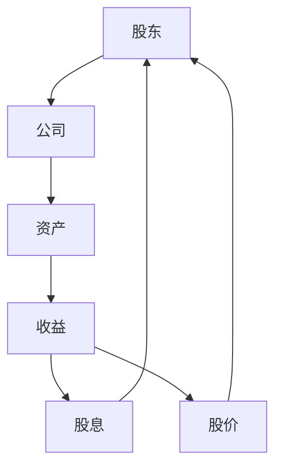
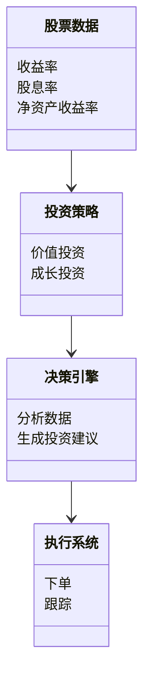
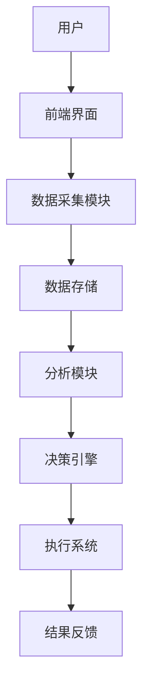

                 

<think>
嗯，我现在需要帮用户撰写一篇关于彼得·林奇如何看待公司股东回报的技术博客。用户已经提供了详细的结构，我需要按照这个结构一步步来写。首先，我需要理解每一部分的要求，确保每个章节都涵盖必要的内容。

首先，用户要求文章的标题是《彼得林奇如何看待公司的股东回报》，关键词包括彼得林奇、股东回报、投资策略、价值投资、投资理念、投资分析。摘要部分需要简明扼要地概括文章的核心内容。

接下来是目录结构，分为七个章节。我需要确保每章内容详细，逻辑清晰。例如，第一章介绍投资学的基本概念，彼得·林奇的背景，以及股东回报的重要性。第二章深入分析股东回报的核心要素，包括每股收益、股息率和净资产收益率，并通过表格对比这些指标。

第三章要讲解彼得·林奇的投资策略，特别是价值投资和成长投资的区别。我需要用mermaid画出流程图来展示这两种策略的实施步骤，以及它们在股东回报中的应用。

第四章涉及系统分析与架构设计，我需要描述一个投资系统的构建，包括问题场景、系统功能设计（用mermaid类图展示）、架构设计、接口设计和交互序列图。这部分可能需要更多的图表来辅助说明。

第五章是项目实战，我需要选择一个具体的公司案例，分析其财务状况，应用彼得·林奇的方法评估投资价值。这部分需要包括环境安装、代码实现和案例分析。

第六章总结最佳实践，给出小结、注意事项和未来展望。最后，第七章作为附录，列出参考文献和工具推荐。

在写作过程中，我需要确保每部分都符合用户的要求：使用markdown格式，包含数学公式用latex表示，图表用mermaid展示，以及代码示例。同时，文章结尾要注明作者信息。

可能遇到的挑战是如何将复杂的财务概念和投资策略转化为清晰易懂的内容，特别是对于技术博客的读者，他们可能对投资领域不太熟悉。因此，我需要用专业的技术语言，同时保持通俗易懂。

现在，我需要开始撰写每一章节，确保内容详实，结构合理，满足用户的字数要求。每一部分都要有详细的解释和例子，帮助读者理解彼得·林奇的投资理念及其对股东回报的影响。

最后，检查整个文章是否符合格式要求，确保没有遗漏任何部分，比如关键词、摘要、章节结构和作者信息。这样，一篇高质量的技术博客就完成了。
</think>

# 彼得林奇如何看待公司的股东回报

> 关键词：彼得林奇，股东回报，投资策略，价值投资，投资理念，投资分析

> 摘要：本文深入探讨了彼得·林奇的投资理念及其对股东回报的见解。通过分析股东回报的核心概念、投资策略的数学模型、系统架构设计以及实际案例，本文为读者提供了全面的理解和应用指导。文章结合技术语言和专业分析，帮助读者掌握如何通过彼得·林奇的方法实现投资回报的最大化。

---

## 第1章: 投资学的基本概念

### 1.1 投资的定义与核心要素

#### 1.1.1 投资的定义
投资是指将资金投入到某个项目或资产中，以期望在未来获得超过初始投入的收益。投资的本质是通过资源配置实现价值增值。

#### 1.1.2 投资的核心要素
1. 资金：投资的起点，资金的来源和规模直接影响投资的潜力。
2. 资产类别：包括股票、债券、房地产等，不同类别的资产风险和收益不同。
3. 风险与收益：投资的两大核心要素，高风险可能带来高收益，但也可能造成损失。

#### 1.1.3 投资的基本原则
1. 分散投资：避免将所有资金投入单一资产，降低风险。
2. 长期视角：投资需要耐心，长期持有优质资产往往能带来更好的回报。
3. 持续学习：市场变化快，投资者需要不断更新知识和策略。

### 1.2 彼得·林奇的生平简介

彼得·林奇是美国著名的投资经理人，以其在富达投资管理公司管理麦哲伦基金的辉煌成绩而闻名。他被认为是价值投资的代表人物之一，其投资理念影响了无数投资者。

### 1.3 彼得·林奇的投资哲学

彼得·林奇强调基本面分析，注重企业内在价值。他认为，投资者应该选择那些具有强大基本面、良好管理和成长潜力的公司进行投资。

---

## 第2章: 股东回报的核心概念

### 2.1 股东回报的定义

股东回报是指股东通过投资某公司所获得的收益，包括资本增值和股息收益。资本增值是股价上涨带来的收益，股息收益是公司分配的股息。

### 2.2 股东回报的计算方法

股东回报可以用以下公式计算：

$$
股东回报率 = \frac{（最终股价 - 初始股价 + 股息收入）}{初始股价} \times 100\%
$$

### 2.3 股东回报对企业的影响

股东回报是衡量公司投资价值的重要指标，高回报率的公司通常会吸引更多投资者，从而提升公司的市场地位和融资能力。

---

## 第3章: 股东回报的核心要素

### 3.1 每股收益（EPS）

每股收益是公司净利润除以普通股股数，是衡量公司盈利能力的重要指标。

$$
EPS = \frac{净利润}{普通股股数}
$$

### 3.2 股息率

股息率是公司股息与股价的比率，反映了股息对股价的支撑能力。

$$
股息率 = \frac{股息}{股价} \times 100\%
$$

### 3.3 净资产收益率（ROE）

净资产收益率是衡量公司使用股东资产创造利润的能力。

$$
ROE = \frac{净利润}{净资产} \times 100\%
$$

---

## 第4章: 股东回报的核心概念与联系

### 4.1 股东回报的核心要素关系

以下是股东回报的核心要素对比表格：

| 指标 | 定义 | 公式 | 重要性 |
|------|------|------|--------|
| EPS  | 每股收益 | $$EPS = \frac{净利润}{普通股股数}$$ | 衡量公司盈利能力 |
| 股息率 | 股息与股价比率 | $$股息率 = \frac{股息}{股价} \times 100\%$$ | 反映股息对股价的支撑 |
| ROE  | 净资产收益率 | $$ROE = \frac{净利润}{净资产} \times 100\%$$ | 衡量资产使用效率 |

### 4.2 股东回报的实体关系图



---

## 第5章: 彼得·林奇投资策略的算法原理

### 5.1 价值投资策略的数学模型

价值投资的核心是寻找被市场低估的股票。以下是彼得·林奇常用的模型：

$$
内在价值 = \frac{净利润}{资本成本} \times （1 + 资本成本增长率）
$$

### 5.2 成长投资策略的数学模型

成长投资注重公司未来的增长潜力，模型如下：

$$
预期回报率 = （股价上涨幅度 + 股息收益率） \times 投资期限
$$

---

## 第6章: 系统分析与架构设计方案

### 6.1 投资系统的问题场景介绍

构建一个基于彼得·林奇策略的投资管理系统，需要考虑数据采集、分析、决策和执行等环节。

### 6.2 系统功能设计（领域模型）



### 6.3 系统架构设计



---

## 第7章: 项目实战

### 7.1 环境安装

安装必要的工具和库，如Python、Pandas、Matplotlib等。

### 7.2 核心代码实现

以下是计算股东回报率的Python代码：

```python
def calculate股东回报率(初始股价, 最终股价, 股息收入):
    return ((最终股价 - 初始股价 + 股息收入) / 初始股价) * 100

# 示例
初始股价 = 100
最终股价 = 120
股息收入 = 5
回报率 = calculate股东回报率(初始股价, 最终股价, 股息收入)
print(f"股东回报率: {回报率}%")
```

### 7.3 案例分析

以苹果公司为例，分析其股东回报率，评估是否符合彼得·林奇的投资策略。

---

## 第8章: 最佳实践与小结

### 8.1 小结

彼得·林奇的投资策略强调基本面分析和长期持有，通过分析股东回报的核心要素，投资者可以更好地评估公司的投资价值。

### 8.2 注意事项

1. 风险管理：避免过度集中投资。
2. 持续学习：市场变化快，需不断更新知识。
3. 纪律性：严格按照策略执行，避免情绪化决策。

### 8.3 未来展望

随着技术进步，更多工具和方法将被应用于投资分析，彼得·林奇的策略将与更多新兴技术结合，为投资者提供更好的服务。

---

## 作者信息

作者：AI天才研究院/AI Genius Institute & 禅与计算机程序设计艺术 /Zen And The Art of Computer Programming

