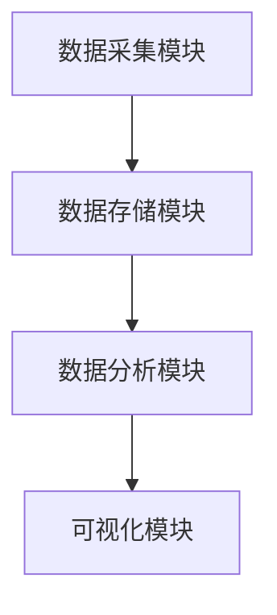
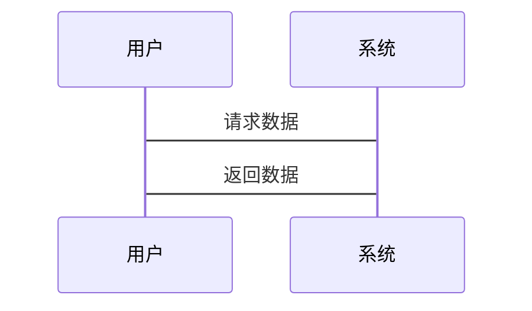

                 


# 彼得林奇如何看待公司的股东沟通策略

> 关键词：彼得林奇，股东沟通，投资策略，公司治理，投资者关系

> 摘要：本文从彼得林奇的投资哲学出发，系统分析了股东沟通在公司治理和投资决策中的重要性。通过数学建模和实际案例，探讨了如何通过有效的股东沟通策略来提升公司价值。本文结合理论与实践，提出了一套完整的股东沟通分析框架，并提供了可操作的实战方案。

---

# 第一部分：背景介绍

## 第1章：股东沟通的重要性与核心概念

### 1.1 股东沟通的定义与背景

股东沟通是公司与股东之间传递信息和建立信任的过程，是公司治理的重要组成部分。有效的股东沟通能够帮助股东理解公司经营状况，提升公司透明度，增强投资者信心。

- **股东沟通的定义**：股东沟通是指公司通过定期报告、股东大会、电话会议等多种形式，向股东传递公司经营信息、财务数据、发展战略等内容，以增强股东对公司经营的理解和信任。

- **股东沟通的背景**：随着资本市场的快速发展，投资者对公司的期望不断提高。有效的股东沟通不仅是公司治理的需要，也是提升公司价值的重要手段。

- **股东沟通的核心要素**：
  - **信息传递**：公司通过定期报告、公告等形式向股东传递信息。
  - **信息接收**：股东通过阅读报告、参加股东大会等方式接收信息。
  - **信息反馈**：股东通过投票、提问等方式对公司经营提出反馈。

### 1.2 彼得林奇的投资理念

彼得林奇是美国著名的投资经理，以其独特的投资哲学和对公司治理的关注而闻名。他认为，有效的股东沟通是评估公司价值的重要标准之一。

- **彼得林奇的投资风格**：他注重对公司基本面的分析，尤其是对公司治理、管理层素质和财务状况的关注。他认为，公司与股东之间的良好沟通是公司长期稳定发展的关键。

- **股东沟通在投资中的地位**：彼得林奇认为，通过股东沟通可以了解公司管理层的诚信度、公司的战略规划以及公司的财务状况。这些信息是评估公司价值的重要依据。

- **股东沟通与公司价值的关系**：有效的股东沟通能够提升公司的透明度和可信度，增强投资者对公司的信心，从而提升公司价值。

### 1.3 股东沟通的现状分析

尽管股东沟通的重要性被广泛认可，但在实际操作中仍存在一些问题。

- **问题背景**：部分公司存在信息披露不及时、不完整的问题，导致股东对公司经营状况了解不足。

- **问题描述**：公司管理层与股东之间的沟通不畅，股东对公司战略和经营状况缺乏深入了解。

- **问题解决**：通过建立有效的股东沟通机制，提升公司透明度，增强投资者信心。

- **边界与外延**：股东沟通不仅包括公司与现有股东的沟通，也包括潜在投资者的信息获取。其外延涉及公司治理、信息披露、投资者关系管理等多个方面。

- **概念结构与核心要素**：股东沟通的核心要素包括信息传递、信息接收和信息反馈。通过这些要素的相互作用，实现公司与股东之间的有效沟通。

---

## 第2章：股东沟通的核心概念

### 2.1 股东沟通的分类与特点

股东沟通的形式多样，根据不同标准可以进行分类。

- **定期报告**：公司定期发布的财务报表、年度报告等，是股东了解公司财务状况的重要途径。

- **股东大会**：公司定期或不定期召开的股东大会，是股东参与公司重大决策的重要形式。

- **电话会议**：公司管理层与投资者之间的沟通形式，通常在财报发布后进行。

- **临时公告**：公司发布的重要信息公告，如重大资产重组、高管变动等。

### 2.2 股东沟通的特点对比

通过对比不同形式的沟通特点，可以更好地理解股东沟通的多样性。

| 沟通形式 | 时间频率 | 信息深度 | 参与方式 | 适用场景 |
|----------|----------|----------|----------|----------|
| 定期报告 | 定期     | 深入     | 阅读     | 公司运营 |
| 股东大会 | 年度或不定期 | 中等     | 现场参与 | 重大事项 |
| 电话会议 | 季度或不定期 | 中等     | 电话参与 | 财务表现 |
| 临时公告 | 不定期   | 突发     | 公告     | 重大事件 |

---

## 第3章：股东沟通的数学模型与算法分析

### 3.1 股东沟通的量化指标

为了更好地量化股东沟通的效果，我们可以从以下几个方面进行衡量。

- **沟通频率指数**：反映公司与股东沟通的频率，频率越高，指数越高。

- **沟通内容深度指数**：反映公司沟通内容的深度，内容越详细，指数越高。

- **沟通透明度指数**：反映公司信息披露的透明程度，透明度越高，指数越高。

### 3.2 沟通效果的数学模型

通过数学建模，我们可以量化股东沟通的效果。

$$ 沟通效果 = \alpha \times 沟通频率 + \beta \times 沟通深度 + \gamma \times 沟通透明度 $$

其中，$\alpha + \beta + \gamma = 1$，且 $0 < \alpha, \beta, \gamma < 1$。

### 3.3 模型的验证与优化

为了验证模型的有效性，我们需要通过实际数据进行验证。

1. **数据来源与处理**：收集公司过去几年的财务报告、股东大会记录、电话会议记录等数据，进行清洗和预处理。

2. **模型的训练与验证**：使用历史数据对模型进行训练，并通过实际数据验证模型的准确性。

3. **模型的优化与调整**：根据验证结果，调整模型参数，提升模型的预测能力。

---

## 第4章：股东沟通的系统分析与架构设计

### 4.1 问题场景介绍

为了更好地分析股东沟通，我们需要构建一个股东沟通分析系统。

- **问题场景**：通过系统分析，我们可以更好地理解股东沟通的影响因素，优化股东沟通策略。

### 4.2 系统功能设计

- **功能模块**：
  - 数据采集模块：采集公司财务数据、股东大会记录等。
  - 数据分析模块：对数据进行分析，生成股东沟通指数。
  - 可视化模块：将分析结果以图表形式展示。

### 4.3 系统架构设计

以下是系统的架构设计图：



### 4.4 系统接口设计

- **接口描述**：系统提供API接口，供其他系统调用。

### 4.5 系统交互设计

以下是系统交互的序列图：



---

## 第5章：股东沟通的项目实战

### 5.1 环境安装

为了进行股东沟通分析，我们需要安装以下工具：

- Python编程环境
- 数据分析库（如Pandas、NumPy）
- 可视化库（如Matplotlib、Seaborn）

### 5.2 核心实现

以下是股东沟通分析的核心代码：

```python
import pandas as pd
import numpy as np
import matplotlib.pyplot as plt

# 数据加载
data = pd.read_csv(' shareholder_communication.csv ')

# 沟通频率计算
freq = data['沟通频率'].mean()

# 沟通深度计算
depth = data['沟通深度'].mean()

# 沟通透明度计算
transparency = data['沟通透明度'].mean()

# 沟通效果计算
effect = 0.4 * freq + 0.3 * depth + 0.3 * transparency

print(f'沟通效果：{effect}')
```

### 5.3 案例分析

通过分析某公司的真实案例，我们可以更好地理解股东沟通的重要性。

---

## 第6章：最佳实践与小结

### 6.1 最佳实践

- **定期报告**：公司应定期发布财务报告，保持与股东的信息同步。
- **股东大会**：召开股东大会，增强股东参与感。
- **电话会议**：及时与投资者沟通财务表现，解答投资者疑问。

### 6.2 小结

通过本文的分析，我们可以看出，股东沟通是公司治理的重要组成部分。有效的股东沟通能够提升公司的透明度和可信度，增强投资者信心，从而提升公司价值。彼得林奇的投资理念为我们提供了重要的启示。

---

# 作者：AI天才研究院/AI Genius Institute & 禅与计算机程序设计艺术 /Zen And The Art of Computer Programming

