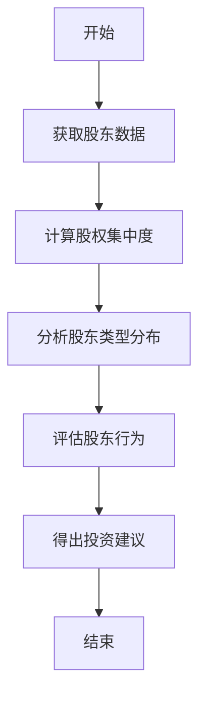
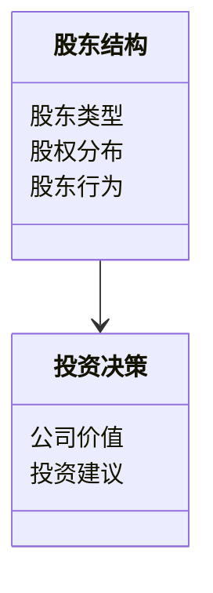
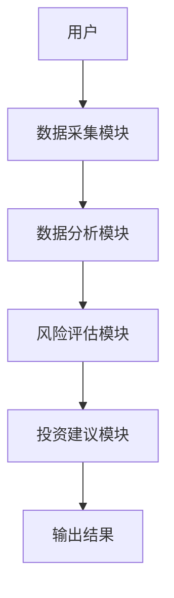

                 

<think>
好，我现在需要按照用户的指示来撰写一篇关于“彼得林奇如何看待公司的股东结构”的技术博客文章。首先，我需要理解彼得·林奇的背景和他看待股东结构的方法。

彼得·林奇是著名的投资经理，他以分析公司基本面和股东结构来评估投资价值。因此，这篇文章将重点探讨股东结构对投资决策的影响，以及如何通过分析股东结构来预测公司的发展前景。

接下来，我需要确定文章的结构。用户已经提供了一个详细的目录大纲，我需要按照这个大纲来组织内容。首先，是背景介绍，接着是核心概念与联系，然后是算法原理，系统分析，项目实战，以及最佳实践。

在背景介绍部分，我需要解释股东结构的定义、分类及其重要性。这部分要简单明了，让读者理解为什么股东结构是投资决策中的关键因素。

核心概念部分需要详细分析股东类型、股权分布和股东行为。我将通过表格和图表来对比不同类型的股东及其特点，帮助读者更好地理解。

算法原理部分，我需要解释如何通过股东结构来预测公司价值。这可能涉及到数学模型和公式，我会用mermaid流程图和Python代码来展示这些模型，确保读者能够理解这些算法的实现。

系统分析部分，我需要构建一个分析框架，可能包括领域模型和架构图，展示系统的各个部分如何交互。这有助于读者理解整个系统的运作流程。

项目实战部分，我需要选择一个具体案例，展示如何应用前面的理论进行分析。这部分将包括环境安装、代码实现、案例解读和结果分析，让读者能够实际操作并理解。

最后，最佳实践部分将总结关键点，提供投资建议和注意事项，帮助读者在实际操作中避免常见错误，并指导他们进一步学习。

在撰写过程中，我需要确保每个部分都详细且易于理解，使用专业但不晦涩的语言。同时，要注意逻辑的连贯性，确保每个章节之间有良好的衔接。

现在，我将开始按照这个大纲逐步撰写每个部分的内容，确保覆盖所有关键点，并且在每个小节中提供丰富的细节和具体的例子，帮助读者深入理解彼得·林奇的股东结构分析方法。
</think>

# 彼得林奇如何看待公司的股东结构

## 关键词：
- 彼得林奇, 股东结构, 投资分析, 股权分布, 公司治理

## 摘要：
本文从彼得·林奇的视角分析了公司股东结构的重要性及其对投资决策的影响。通过详细探讨股东类型、股权分布、股东行为等核心要素，结合数学模型和实际案例，揭示了如何通过股东结构分析预测公司价值和制定投资策略。文章最后总结了最佳实践和投资建议。

---

## 第一部分：股东结构的背景与重要性

### 第1章：股东结构的基本概念

#### 1.1 股东结构的定义与分类

**股东结构的定义**  
股东结构是指公司股东的构成及其在公司中的权益分布。股东可以是个人、机构或其他法律实体，他们通过持有公司股份对公司拥有所有权和控制权。

**股东结构的分类**  
1. **个人股东**：包括公司创始人、高管和员工。  
2. **机构股东**：包括基金公司、保险公司、银行等。  
3. **内部股东**：指公司内部员工或管理层持有的股份。  
4. **外部股东**：指公司外部的投资者或机构。  

#### 1.2 股东结构的重要性

**对公司治理的影响**  
股权集中度高的公司通常由少数人控制，可能导致管理决策僵化；而股权分散的公司则可能面临管理混乱的问题。

**对投资价值的影响**  
通过分析股东结构，投资者可以评估公司管理层的稳定性、公司的长期战略目标以及公司的财务健康状况。

**对公司发展战略的影响**  
股东结构决定了公司治理的决策权分配，进而影响公司的战略方向和运营效率。

#### 1.3 股东结构的演变

**传统股东结构的局限性**  
传统股东结构通常以少数大股东为主，容易导致权力过于集中，难以平衡各方利益。

**现代股东结构的多样化趋势**  
随着公司治理的完善，现代股东结构更加多元化，包括更多机构股东和个人投资者。

**数字化股东结构的未来发展**  
随着区块链等技术的发展，未来的股东结构将更加透明和高效，股东的权益管理将更加便捷。

---

## 第二部分：股东结构的核心要素与分析框架

### 第2章：股东结构的核心要素

#### 2.1 股东类型分析

**个人股东的特点与优势**  
个人股东通常是公司的创始人或高管，对公司的发展有更深刻的理解和更高的忠诚度。

**机构股东的特点与优势**  
机构股东通常注重长期投资，能够提供稳定的资金支持，并对公司治理提出更高的要求。

**内部股东与外部股东的对比**  
内部股东对公司内部信息掌握更多，但可能受到管理层的影响；外部股东则更加注重公司的公开信息和市场表现。

#### 2.2 股权分布分析

**股权集中度的定义与衡量**  
股权集中度是指公司前几名股东持有的股份比例。常用的衡量指标包括CR4（前四名股东的持股比例）和CR8（前八名股东的持股比例）。

**股权分散化的优势与劣势**  
股权分散化可以降低单一股东的风险，但也可能导致公司治理混乱，难以形成有效的决策机制。

**股权结构与公司控制权的关系**  
股权结构决定了公司控制权的分配。一般来说，持股比例超过50%的股东可以控制公司。

#### 2.3 股东行为分析

**股东的投票权与决策权**  
股东通过投票权参与公司重大决策，如董事会选举、重大投资决策等。

**股东的收益权与风险承担**  
股东根据持股比例分享公司利润，同时也承担相应的投资风险。

**股东的短期行为与长期行为**  
短期行为指股东为了短期利益频繁买卖股票，长期行为则注重公司长期发展和价值提升。

### 第3章：股东结构的分析框架

#### 3.1 股东结构的多维度分析

**股东类型与股权分布的结合分析**  
分析公司是否由机构股东主导，还是以个人股东为主，或者存在混合型股东结构。

**股东行为与公司治理的结合分析**  
评估股东是否积极参与公司治理，是否关注公司的长期发展。

**股东结构与公司业绩的结合分析**  
研究股东结构与公司财务表现之间的相关性，寻找潜在的投资机会。

#### 3.2 股东结构的量化分析

**股权集中度的量化指标**  
- CR4：前四名股东的持股比例。
- CR8：前八名股东的持股比例。

**股东行为的量化指标**  
- 投票率：股东参与股东大会的比例。
- 参与度：股东对董事会的影响力。

**股东结构与公司价值的量化关系**  
通过回归分析等方法，研究股东结构与公司市盈率、市净率等指标之间的关系。

---

## 第三部分：股东结构分析的数学模型与算法原理

### 第4章：股东结构分析的数学模型

#### 4.1 股东结构分析的基本模型

**股东结构权重分配模型**  
$$ \text{权重} = \frac{\text{某股东持股比例}}{\sum \text{所有股东持股比例}} $$

**股东行为预测模型**  
$$ P(\text{参与股东大会}) = a \times \text{持股比例} + b \times \text{股东类型} + c \times \text{历史参与率} $$

**股价影响模型**  
$$ \text{股价} = f(\text{股东结构}, \text{公司业绩}, \text{市场环境}) $$

#### 4.2 股东结构分析的高级模型

**多元回归模型**  
$$ \text{公司价值} = \beta_0 + \beta_1 \times \text{CR4} + \beta_2 \times \text{CR8} + \beta_3 \times \text{机构股东比例} + \epsilon $$

**面板数据分析模型**  
通过对不同公司和不同时间点的股东结构数据进行分析，研究股东结构对公司绩效的影响。

### 第5章：股东结构分析的算法实现

#### 5.1 股东结构分析的算法流程



#### 5.2 股东结构分析的Python实现

```python
import pandas as pd

# 示例数据
data = {
    '股东': ['股东A', '股东B', '股东C', '股东D'],
    '持股比例': [40, 30, 20, 10]
}

df = pd.DataFrame(data)

# 计算股权集中度CR4
cr4 = df['持股比例'].nlargest(4).sum()

print(f"CR4: {cr4}%")
```

---

## 第四部分：系统分析与架构设计方案

### 第6章：系统分析与架构设计方案

#### 6.1 问题场景介绍

**目标**  
构建一个基于股东结构分析的投资决策支持系统，帮助投资者快速评估公司价值。

**系统功能设计**  
- 数据采集：获取公司股东信息。
- 数据分析：计算股权集中度、股东类型分布等指标。
- 风险评估：预测公司潜在风险。
- 投资建议：生成个性化投资策略。

**领域模型**  


**系统架构设计**  


---

## 第五部分：项目实战

### 第7章：项目实战

#### 7.1 环境安装

**工具**  
- Python 3.8+
- Pandas、NumPy、Scikit-learn
- Mermaid、PlantUML

#### 7.2 核心实现

**股东结构分析代码**

```python
import pandas as pd

# 示例数据
data = {
    '股东': ['股东A', '股东B', '股东C', '股东D'],
    '持股比例': [40, 30, 20, 10]
}

df = pd.DataFrame(data)

# 计算股权集中度CR4
cr4 = df['持股比例'].nlargest(4).sum()

print(f"CR4: {cr4}%")

# 分析股东类型
institutional_shareholders = df[df['股东'].str.contains('B')]

print(f"机构股东数量: {len(institutional_shareholders)}")
```

**代码解读与分析**  
上述代码展示了如何从股东数据中提取机构股东数量，并计算股权集中度CR4。通过这些分析，投资者可以初步评估公司的股东结构健康性。

#### 7.3 案例分析

**案例公司**  
某科技公司，股东结构如下：
- 股东A：40%
- 股东B（机构）：30%
- 股东C：20%
- 股东D：10%

**分析结果**  
CR4为70%，机构股东占比为30%。较高的股权集中度表明公司由少数大股东控制，可能存在管理僵化风险。同时，机构股东的参与可能为公司带来更多的资源和管理经验。

---

## 第六部分：最佳实践与总结

### 第8章：最佳实践

#### 8.1 投资建议

**分散投资**  
避免将所有资金投入到股权高度集中的公司，以降低风险。

**关注机构股东**  
优先选择有较多机构股东的公司，这些股东通常更注重长期投资和公司治理。

**定期评估**  
定期审查持股公司的股东结构，确保其符合投资目标。

#### 8.2 注意事项

- **数据准确性**：确保股东数据的来源可靠。
- **动态调整**：公司股东结构可能会随时间变化，需定期更新分析。
- **综合分析**：结合公司财务状况、行业趋势等多方面因素进行投资决策。

#### 8.3 拓展阅读

- 彼得·林奇的《投资学基础》
- 公司治理相关书籍
- 股权结构与公司绩效的学术研究

---

## 作者：AI天才研究院/AI Genius Institute & 禅与计算机程序设计艺术/Zen And The Art of Computer Programming

---

**总结**  
通过本文的分析，读者可以深入了解彼得·林奇如何看待公司的股东结构，并通过实际案例和数学模型掌握如何在投资决策中应用这些分析。希望本文能为投资者提供有价值的见解和实用的工具。

