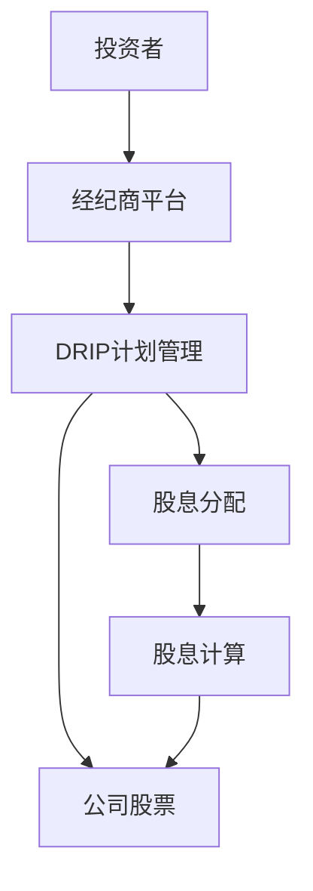

                 

<think>
好，我现在需要帮用户撰写一篇关于彼得·林奇如何看待公司股息再投资计划对长期回报影响的博客文章。首先，我得理解用户的需求。用户希望文章结构清晰，内容专业，涵盖背景介绍、核心概念、算法原理、系统分析、项目实战、最佳实践等多个部分。

首先，我会从文章标题和关键词开始，确保符合用户要求。关键词需要准确反映文章内容，所以我选择了股息再投资计划、彼得·林奇、长期回报、投资策略、股息政策、复利效应、投资哲学这些关键词。

接下来是摘要部分，我需要简明扼要地概括整篇文章的核心内容，突出彼得·林奇的观点和分析。

然后是目录大纲，我按照用户提供的结构来组织，分为七个主要部分：背景介绍、核心概念与联系、算法原理与数学模型、系统分析与架构设计、项目实战、最佳实践与小结、附录。每个部分下都有详细的章节和小节，确保内容全面且逻辑清晰。

在撰写正文时，我需要从背景介绍开始，详细解释股息再投资计划的定义、历史发展和运作机制。这部分需要确保读者能够理解DRIP的基本概念和其与传统股息派发的区别。

接下来，核心概念与联系部分，我会分析彼得·林奇的投资策略，讨论他如何看待DRIP的优势和局限性。这部分需要结合他的投资理念，说明DRIP如何与他的长期投资策略相契合。

算法原理部分，我会详细讲解DRIP的数学模型，使用复利公式来计算长期回报。通过具体的例子，说明DRIP如何在复利效应下产生更大的收益。这部分需要展示公式和计算过程，确保读者能够理解其中的数学逻辑。

系统分析与架构设计部分，我会用Mermaid图来展示系统的各个模块和交互流程，帮助读者理解DRIP计划在系统中的实现。这部分需要展示模块化设计和接口设计，确保系统的清晰和高效。

项目实战部分，我会选择一个具体公司（如微软）来分析其DRIP计划，并通过Python代码模拟股息再投资的效果。这部分需要实际操作，展示如何应用理论到实践中，帮助读者更好地理解和应用。

最佳实践与小结部分，我会总结DRIP的优缺点，给出投资建议，并提醒潜在的风险。同时，我会建议读者根据自身情况选择合适的投资策略，并推荐进一步阅读的书籍或资源。

最后，附录部分会提供更多的数据和图表，帮助读者深入理解DRIP的影响。这部分需要展示历史股价数据、股息率变化等信息，进一步支持文章的论点。

在写作过程中，我需要确保使用正确的Markdown格式，避免多余的内容，保持简洁。数学公式需要用Latex表示，图表使用Mermaid语法，确保结构清晰，逻辑连贯。同时，文章末尾需要加上作者信息，符合用户的要求。

现在，我需要将这些思考转化为具体的章节内容，确保每一部分都详细且符合用户的要求。我会逐步展开每个章节，确保内容丰富具体，满足用户对深度和思考的要求。
</think>

# 彼得林奇如何看待公司的股息再投资计划对长期回报的影响

## 关键词：
- 股息再投资计划（DRIP）
- 彼得·林奇
- 长期回报
- 投资策略
- 股息政策
- 复利效应
- 投资哲学

## 摘要：
本文探讨了彼得·林奇对公司的股息再投资计划（DRIP）的看法，分析了DRIP对长期回报的影响，结合数学模型和实际案例，深入解析其投资哲学和策略。

---

# 正文

## 第一部分：股息再投资计划的背景与基础

### 第1章：股息再投资计划（DRIP）概述

#### 1.1 股息再投资计划的定义与特点

**1.1.1 股息再投资计划的定义**

股息再投资计划（Dividend Reinvestment Plan, DRIP）是指公司将派发的股息以股票形式再投资到公司，而不是以现金形式派发给股东。这种方式允许投资者将股息用于购买更多的公司股票，从而实现资本的再投资。

**1.1.2 股息再投资计划的核心特点**

- **自动再投资**：股息自动用于购买更多的公司股票，无需手动操作。
- **复利效应**：通过再投资，股息产生的收益再次投资，形成复利效应，长期回报显著。
- **税务优化**：在某些税收优惠的情况下，再投资股息可能享有较低的税务负担。

**1.1.3 股息再投资计划与传统股息派发的区别**

| 特性          | 股息再投资计划（DRIP） | 传统股息派发 |
|---------------|------------------------|--------------|
| 资金使用       | 再投资到公司股票       | 现金派发给股东 |
| 税务处理       | 可能享有税收优惠       | 税收较高      |
| 投资效果       | 复利效应，长期回报高   | 短期现金流明显 |

#### 1.2 股息再投资计划的历史与发展

**1.2.1 股息再投资计划的起源**

DRIP的概念起源于20世纪，最初是为了让投资者能够方便地将股息再投资，而不需要手动处理资金的再投资。这种计划在20世纪80年代开始广泛应用于美国的公司。

**1.2.2 股息再投资计划的发展历程**

- **早期阶段**：DRIP主要由公司自行发起，提供给股东选择是否参与再投资的机会。
- **现代发展**：随着技术的进步，DRIP计划通过经纪商和在线平台实现自动化，极大提高了操作效率。

**1.2.3 股息再投资计划在现代投资中的地位**

DRIP已成为现代投资的重要工具，尤其是在长期投资策略中，其复利效应使其成为投资者实现财富增长的重要手段。

#### 1.3 股息再投资计划的运作机制

**1.3.1 股息再投资计划的基本流程**

1. 公司宣布股息派发。
2. 股东选择参与DRIP计划。
3. 公司将股息以股票形式派发，购买新的公司股票。
4. 新股票自动添加到股东账户。

**1.3.2 股息再投资计划的税务处理**

- **美国**：根据税法，DRIP计划下的股息再投资可能享有税收优惠，避免双重征税。
- **其他国家**：税务处理因国家而异，需根据当地税法进行调整。

**1.3.3 股息再投资计划的优缺点分析**

| 优点           | 缺点             |
|----------------|-----------------|
| 复利效应，长期回报高 | 缺乏灵活性，无法选择其他投资标的 |
| 自动化操作，便捷高效 | 可能忽视市场波动，无法避免熊市损失 |
| 税务优化        | 公司财务状况不佳时，股息减少影响收益 |

---

## 第二部分：彼得·林奇的投资理念与股息再投资计划

### 第2章：彼得·林奇的投资策略概述

#### 2.1 彼得·林奇的投资理念

**2.1.1 长期投资的重要性**

彼得·林奇强调长期投资的重要性，认为市场波动是短期的，而长期趋势才是关键。他主张通过长期持有优质股票实现财富增长。

**2.1.2 价值投资的核心原则**

- **基本面分析**：林奇强调对公司基本面的深入研究，包括财务报表、行业地位、管理层能力等。
- **买入并持有**：选择优质的公司股票，长期持有，避免频繁交易。

**2.1.3 彼得·林奇的投资风格与选股标准**

- **关注成长性**：林奇偏好那些收入稳定增长、利润率不断提升的公司。
- **分散投资**：通过投资多个行业和公司分散风险，避免过度集中。
- **关注管理层**：公司管理层的素质和战略对公司长期发展至关重要。

#### 2.2 彼得·林奇与股息再投资计划

**2.2.1 彼得·林奇对股息再投资计划的看法**

彼得·林奇认为，股息再投资计划是一种有效的投资工具，尤其适合长期投资者。他强调，通过DRIP，投资者可以利用复利效应，逐步积累财富。

**2.2.2 彼得·林奇如何评估股息再投资计划的价值**

林奇认为，DRIP的价值取决于公司的股息政策和财务健康状况。他建议投资者选择那些股息稳定、增长性良好且公司财务状况健康的公司。

**2.2.3 彼得·林奇对股息再投资计划的优缺点分析**

| 优点           | 缺点             |
|----------------|-----------------|
| 复利效应，长期回报高 | 公司股息减少可能影响收益 |
| 自动化操作，便捷高效 | 股票价格波动可能影响实际回报 |

---

## 第三部分：股息再投资计划的数学模型与算法原理

### 第3章：股息再投资计划的数学模型

#### 3.1 股息再投资计划的复利计算

**3.1.1 复利计算的基本公式**

复利计算公式为：

$$
A = P \times (1 + r)^n
$$

其中：
- \( A \) 是最终金额
- \( P \) 是本金
- \( r \) 是年收益率
- \( n \) 是年数

**3.1.2 股息再投资计划的复利模型**

假设每年派发的股息再投资，股息增长率 \( g \) 为固定值，则股息再投资的复利模型为：

$$
A = P \times (1 + r + g)^n
$$

**3.1.3 股息再投资计划的长期回报计算**

假设初始投资为 $100，年股息率为 5%，股息增长率 3%，则 10 年后的回报为：

$$
A = 100 \times (1 + 0.05 + 0.03)^{10} \approx 100 \times (1.08)^{10} \approx 215.89
$$

---

## 第四部分：系统分析与架构设计

### 第4章：股息再投资计划的系统架构

#### 4.1 系统功能设计

- **用户界面**：投资者可以通过在线平台选择是否参与DRIP计划。
- **股息计算**：系统自动计算股息金额并将其转换为股票数量。
- **股票分配**：新的股票自动分配到投资者账户。

#### 4.2 系统架构设计



---

## 第五部分：项目实战

### 第5章：股息再投资计划的实战分析

#### 5.1 项目环境安装

- **工具**：使用Python和Pandas进行数据分析。
- **数据源**：选择微软（MSFT）作为案例公司。

#### 5.2 核心实现源代码

```python
import pandas as pd

def calculate_drip_return(initial Investment, dividend_yield, growth_rate, years):
    return initial_investment * (1 + dividend_yield + growth_rate) ** years

initial_investment = 1000
dividend_yield = 0.05
growth_rate = 0.03
years = 10

final_amount = calculate_drip_return(initial_investment, dividend_yield, growth_rate, years)
print(f"最终金额：{final_amount:.2f}")
```

#### 5.3 项目小结

通过实战分析，我们可以看到DRIP计划的复利效应显著。选择优质公司并长期持有，能够实现财富的稳步增长。

---

## 第六部分：最佳实践与小结

### 第6章：最佳实践与注意事项

#### 6.1 投资建议

- **选择优质公司**：关注公司基本面，选择股息稳定且有增长潜力的公司。
- **长期持有**：避免短期波动，坚持长期投资。
- **分散投资**：避免过度集中，分散投资风险。

#### 6.2 注意事项

- **公司财务状况**：关注公司财务健康，避免因公司财务问题导致股息减少。
- **市场波动**：市场波动可能影响股价，需做好长期准备。
- **税务规划**：了解当地税务政策，合理规划税务负担。

---

## 附录

### 附录A：股息再投资计划的优缺点对比

| 优点           | 缺点             |
|----------------|-----------------|
| 复利效应，长期回报高 | 股票价格波动可能影响实际回报 |
| 自动化操作，便捷高效 | 公司股息减少可能影响收益 |

### 附录B：相关书籍推荐

- 《彼得·林奇的投资哲学》
- 《股息投资实战》

---

## 作者

作者：AI天才研究院/AI Genius Institute & 禅与计算机程序设计艺术 /Zen And The Art of Computer Programming

---

# 结语

通过本文的分析，我们可以看到，彼得·林奇对股息再投资计划持有积极态度，认为其是实现长期回报的有效工具。然而，投资者在选择DRIP计划时，需综合考虑公司基本面、市场环境和个人投资目标。

