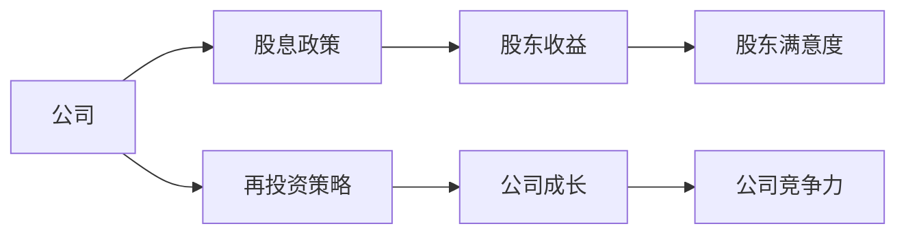
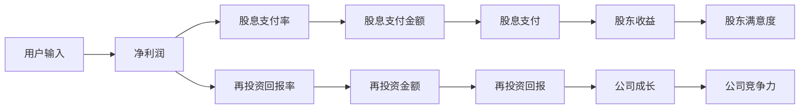

                 


# 彼得林奇如何看待公司的股息政策与再投资平衡

> 关键词：彼得·林奇，股息政策，再投资策略，投资平衡，公司财务，投资理念

> 摘要：本文将深入探讨彼得·林奇对公司的股息政策与再投资之间的平衡的看法。通过分析股息政策和再投资策略的核心概念、彼得·林奇的投资理念、股息政策与再投资的平衡策略、数学模型与算法分析，以及系统架构设计等方面，全面解析彼得·林奇如何在股息政策与再投资之间找到最佳平衡点，以实现投资收益的最大化。

---

# 第一部分: 股息政策与再投资的背景与基础

## # 第1章: 股息政策与再投资的背景介绍

### 1.1 股息政策的基本概念

#### 1.1.1 股息政策的定义
股息政策是指公司对其利润分配的策略，包括决定是否分配股息以及如何分配股息。股息政策的核心是平衡股东的当前收益与公司的未来增长需求。

#### 1.1.2 股息政策的类型与特点
股息政策主要有以下几种类型：
- **固定股息政策**：公司承诺每年支付固定金额的股息，通常适用于成熟且财务稳定的公司。
- **固定股息增长政策**：公司承诺每年以固定比例增长股息，适用于预期收益稳定的公司。
- **剩余股息政策**：公司仅在净利润中分配剩余部分作为股息，优先满足再投资需求。

#### 1.1.3 股息政策的核心要素与组成
- 股东权益：股东的当前收益与未来收益的平衡。
- 公司成长：公司未来的增长需求与再投资需求。
- 现金流：公司的现金流状况直接影响股息支付能力。

### 1.2 再投资策略的基本概念

#### 1.2.1 再投资的定义
再投资是指公司将部分利润用于再投资，以实现公司的扩张、技术创新、市场拓展等。再投资的核心目的是为了公司未来的增长。

#### 1.2.2 再投资的类型与特点
- **内部再投资**：公司将利润用于内部项目，如研发、设备升级等。
- **外部再投资**：公司通过并购、参股等方式进行外部扩张。
- **混合再投资**：结合内部与外部的再投资策略。

#### 1.2.3 再投资的核心要素与组成
- 项目选择：公司的再投资项目是否具有良好的增长潜力。
- 资金分配：公司如何分配利润用于再投资。
- 风险评估：再投资项目的潜在风险与收益平衡。

### 1.3 股息政策与再投资的联系与区别

#### 1.3.1 股息政策与再投资的关系
股息政策与再投资是公司利润分配的两个方面。股息政策关注当前股东的收益，再投资关注公司的未来发展。两者之间需要平衡，以实现股东的长期利益。

#### 1.3.2 股息政策与再投资的优缺点对比
- **股息政策的优点**：为股东提供稳定的现金流，增强股东信心。
- **股息政策的缺点**：可能限制公司的再投资能力，影响公司未来的增长。
- **再投资的优点**：促进公司未来的增长，提升公司的市场竞争力。
- **再投资的缺点**：可能减少股东的当前收益，影响股东的即时回报。

#### 1.3.3 股息政策与再投资的边界与外延
股息政策与再投资的边界在于公司利润的分配比例。当公司利润超过再投资需求时，可以考虑增加股息分配；当公司需要更多资金进行再投资时，应优先满足再投资需求。

---

## # 第2章: 彼得·林奇的投资理念与方法

### 2.1 彼得·林奇的背景与投资风格

#### 2.1.1 彼得·林奇的生平简介
彼得·林奇（Peter Lynch）是美国著名的投资经理，曾管理富达麦哲伦基金（Fidelity Magellan Fund），取得了卓越的投资业绩。他的投资风格以注重基本面分析、长期投资和多样化投资组合著称。

#### 2.1.2 彼得·林奇的投资哲学
彼得·林奇强调基本面分析，认为投资者应选择那些具有强大基本面、良好管理团队和持续增长潜力的公司。他反对短期交易，提倡长期投资。

#### 2.1.3 彼得·林奇的投资策略
- **多样化投资**：通过投资多种行业和公司，分散风险。
- **长期持有**：选择具有长期增长潜力的公司，长期持有。
- **基本面分析**：通过分析公司的财务报表、行业地位、管理团队等因素，选择优质公司。

### 2.2 彼得·林奇对股息政策的看法

#### 2.2.1 股息政策在投资中的重要性
彼得·林奇认为，股息政策是公司财务健康的重要指标之一。稳定的股息支付表明公司具有良好的盈利能力和现金流，能够为股东提供稳定的回报。

#### 2.2.2 彼得·林奇对高股息率股票的看法
彼得·林奇并不特别偏好高股息率股票。他认为，高股息率可能意味着公司缺乏再投资机会，或者公司盈利能力下降。因此，他更关注公司的整体增长潜力。

#### 2.2.3 股息政策与公司财务健康的关系
彼得·林奇认为，合理的股息政策能够反映公司的财务健康状况。公司应根据自身的盈利能力和现金流状况，制定合理的股息分配政策。

### 2.3 彼得·林奇对再投资策略的看法

#### 2.3.1 再投资在投资组合中的作用
彼得·林奇认为，再投资是公司增长的重要手段。公司通过再投资，可以扩大业务规模、提高市场竞争力，从而为股东创造更大的价值。

#### 2.3.2 彼得·林奇对再投资公司的偏好
彼得·林奇偏好那些能够有效利用再投资资金、具有强大增长潜力的公司。他认为，再投资的成功取决于公司的管理能力和市场机会。

#### 2.3.3 再投资与公司成长性的关系
彼得·林奇认为，再投资是公司成长性的关键因素。公司通过有效的再投资，可以实现业务扩张、技术创新和市场拓展，从而推动公司的持续增长。

---

## # 第3章: 股息政策与再投资的核心概念与联系

### 3.1 股息政策与再投资的核心概念

#### 3.1.1 股息政策的核心要素
- **股息支付率**：公司净利润中用于支付股息的比例。
- **股息增长率**：股息支付的年增长率。
- **股息支付稳定性**：公司股息支付的连续性和稳定性。

#### 3.1.2 再投资的核心要素
- **再投资规模**：公司用于再投资的金额。
- **再投资回报率**：再投资项目的投资回报率。
- **再投资风险**：再投资项目的风险程度。

#### 3.1.3 两者之间的相互作用
- **股息政策影响再投资能力**：过高的股息支付可能限制公司的再投资能力。
- **再投资影响股息能力**：过多的再投资可能导致公司无法支付股息。

### 3.2 股息政策与再投资的属性对比

| 属性                | 股息政策                          | 再投资策略                          |
|---------------------|-----------------------------------|-------------------------------------|
| 目标                | 提供股东当前收益                 | 促进公司未来增长                   |
| 资金来源            | 净利润中的一部分                 | 净利润中的一部分或外部融资         |
| 风险                | 股东的当前收益不稳定             | 再投资项目的成功具有不确定性       |
| 时间跨度            | 短期与长期结合                   | 长期                                |

### 3.3 股息政策与再投资的ER实体关系图



---

## # 第4章: 彼得·林奇视角下的股息政策与再投资平衡策略

### 4.1 股息政策与再投资的平衡原则

#### 4.1.1 平衡的核心理念
彼得·林奇认为，公司应根据自身的盈利能力和成长需求，在股息政策与再投资之间找到最佳平衡点。公司应优先满足再投资需求，同时为股东提供合理的股息回报。

#### 4.1.2 平衡的关键因素
- **公司盈利能力**：公司是否有足够的利润用于股息分配和再投资。
- **公司成长需求**：公司是否需要更多的资金用于再投资。
- **股东期望**：股东对股息回报的期望。

### 4.2 彼得·林奇的股息政策与再投资平衡方法

#### 4.2.1 基于公司盈利状况的平衡
彼得·林奇认为，公司应根据自身的盈利状况，在股息政策与再投资之间进行动态调整。当公司盈利较高时，可以适当增加股息支付；当公司盈利较低时，应优先满足再投资需求。

#### 4.2.2 基于公司成长需求的平衡
彼得·林奇强调，再投资是公司成长的关键。公司应优先满足再投资需求，以实现持续增长。当公司有充足的再投资资金时，可以考虑增加股息支付。

#### 4.2.3 基于股东期望的平衡
彼得·林奇认为，公司应关注股东的期望，合理分配股息与再投资资金。当股东对股息回报的期望较高时，公司应适当增加股息支付；当股东对增长潜力的期望较高时，公司应优先满足再投资需求。

### 4.3 股息政策与再投资的平衡策略

#### 4.3.1 动态平衡法
动态平衡法是指公司根据自身的盈利状况、成长需求和股东期望，动态调整股息政策与再投资策略。这种方法能够根据公司实际情况，灵活调整股息与再投资的比例。

#### 4.3.2 阶段平衡法
阶段平衡法是指公司根据所处的发展阶段，在股息政策与再投资之间进行平衡。例如，处于成长期的公司应优先满足再投资需求，而处于成熟期的公司可以适当增加股息支付。

#### 4.3.3 综合平衡法
综合平衡法是指公司从多个角度综合考虑股息政策与再投资的平衡，包括公司盈利能力、成长需求、股东期望等。这种方法能够全面考虑公司的实际情况，制定合理的股息与再投资策略。

---

## # 第5章: 数学模型与算法分析

### 5.1 股息政策与再投资的数学模型

#### 5.1.1 股息支付率模型
股息支付率 = 股息总额 / 净利润

#### 5.1.2 再投资回报率模型
再投资回报率 = （净利润 - 股息支付） / 再投资金额

#### 5.1.3 股息与再投资的平衡模型
股息支付率 + 再投资回报率 = 1

### 5.2 算法原理与实现

#### 5.2.1 算法原理
通过计算股息支付率和再投资回报率，确定股息与再投资的合理比例，实现两者的动态平衡。

#### 5.2.2 算法实现
```python
def calculate_dividend_policy_and_reinvestment(dividend_yield, reinvestment_return):
    total_profit = 100  # 假设净利润为100
    dividend_payment = total_profit * dividend_yield
    reinvestment = total_profit - dividend_payment
    reinvestment_return_rate = reinvestment_return / reinvestment
    return dividend_payment, reinvestment_return_rate

# 示例计算
dividend_yield = 0.3  # 股息支付率30%
reinvestment_return = 0.2  # 再投资回报率20%
dividend_payment, reinvestment_return_rate = calculate_dividend_policy_and_reinvestment(dividend_yield, reinvestment_return)
print(f"股息支付：{dividend_payment}, 再投资回报率：{reinvestment_return_rate}")
```

### 5.3 数学公式与分析

#### 5.3.1 股息支付率公式
$$ \text{股息支付率} = \frac{\text{股息总额}}{\text{净利润}} $$

#### 5.3.2 再投资回报率公式
$$ \text{再投资回报率} = \frac{\text{净利润} - \text{股息支付}}{\text{再投资金额}} $$

#### 5.3.3 股息与再投资的平衡公式
$$ \text{股息支付率} + \text{再投资回报率} = 1 $$

---

## # 第6章: 系统架构设计与实现

### 6.1 系统架构设计

#### 6.1.1 系统功能设计
- **数据输入**：输入公司的净利润、股息支付率和再投资回报率。
- **计算股息支付**：根据股息支付率计算股息支付金额。
- **计算再投资回报**：根据再投资回报率计算再投资回报金额。
- **平衡调整**：动态调整股息支付率和再投资回报率，实现两者的平衡。

#### 6.1.2 系统架构图


---

## # 第7章: 项目实战与案例分析

### 7.1 项目实战

#### 7.1.1 环境安装
- 安装Python和必要的库（如pandas、numpy）。

#### 7.1.2 核心实现源代码
```python
import pandas as pd
import numpy as np

def calculate_dividend_policy_and_reinvestment(dividend_yield, reinvestment_return):
    total_profit = 100  # 假设净利润为100
    dividend_payment = total_profit * dividend_yield
    reinvestment = total_profit - dividend_payment
    reinvestment_return_rate = reinvestment_return / reinvestment
    return dividend_payment, reinvestment_return_rate

# 示例数据
dividend_yields = [0.2, 0.3, 0.25]
reinvestment_returns = [0.15, 0.2, 0.18]

# 计算结果
results = []
for dy, rr in zip(dividend_yields, reinvestment_returns):
    dividend_payment, reinvestment_return_rate = calculate_dividend_policy_and_reinvestment(dy, rr)
    results.append((dy, rr, dividend_payment, reinvestment_return_rate))

# 输出结果
df = pd.DataFrame(results, columns=["股息支付率", "再投资回报率", "股息支付", "再投资回报率"])
print(df)
```

#### 7.1.3 代码应用解读与分析
通过上述代码，我们可以计算不同股息支付率和再投资回报率下的股息支付和再投资回报，帮助公司找到股息政策与再投资的平衡点。

### 7.2 实际案例分析

#### 7.2.1 案例选择
以可口可乐公司为例，分析其股息政策与再投资策略。

#### 7.2.2 数据分析
- 可口可乐公司的股息支付率约为70%。
- 公司通过再投资实现业务扩张，如并购和市场拓展。

#### 7.2.3 结果解读
可口可乐公司通过合理的股息政策与再投资策略，实现了股东的当前收益与公司的未来增长的平衡。

---

## # 第8章: 总结与展望

### 8.1 总结

彼得·林奇认为，公司应根据自身的盈利状况、成长需求和股东期望，在股息政策与再投资之间找到最佳平衡点。通过动态调整股息支付率和再投资回报率，实现股东的长期利益最大化。

### 8.2 最佳实践 tips

- **动态调整**：根据公司实际情况，动态调整股息政策与再投资策略。
- **关注基本面**：选择具有强大基本面和增长潜力的公司。
- **长期投资**：坚持长期投资，避免短期波动的影响。

### 8.3 展望

未来，随着市场环境的变化和公司需求的调整，股息政策与再投资的平衡策略将更加复杂。投资者需要根据市场变化和公司实际情况，灵活调整投资策略。

---

## # 作者：AI天才研究院/AI Genius Institute & 禅与计算机程序设计艺术 /Zen And The Art of Computer Programming

