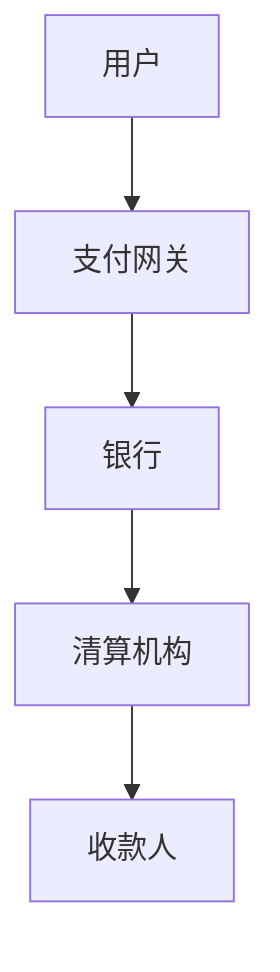
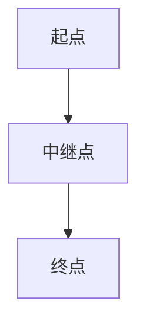
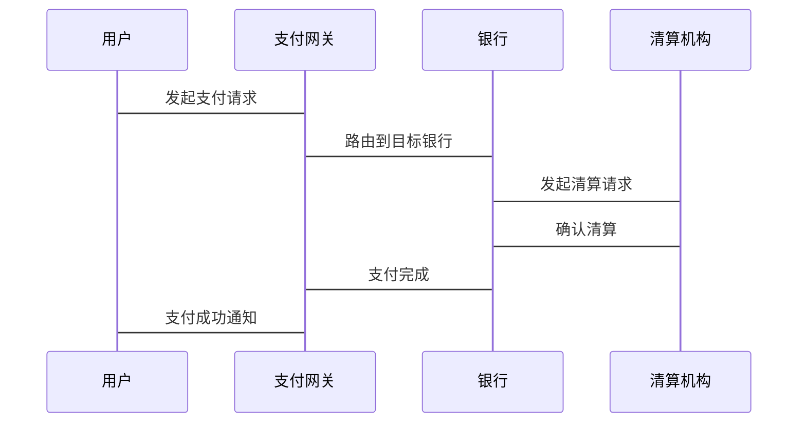

                 

<think>
好的，我现在需要帮用户撰写一篇关于“彼得林奇如何看待公司的跨境支付策略对增长的影响”的技术博客。首先，我要理解用户的需求。用户希望这篇文章结构清晰，内容专业，涵盖技术背景、核心概念、算法、系统架构、项目实战和小结等部分。

首先，我得确定文章的关键词和摘要。关键词可能包括彼得林奇、跨境支付、企业增长、投资策略等。摘要需要概括文章的主要内容，即彼得林奇的投资视角如何影响跨境支付策略，进而推动企业增长。

接下来，我需要规划文章的目录结构。根据用户提供的大纲，文章分为四个主要部分：背景与概述、核心概念与联系、算法原理讲解，以及系统分析与架构设计。每个部分下还有更细的章节和小节。

在写作过程中，我需要确保每个章节都详细展开，使用专业但易懂的语言。例如，在“跨境支付的现状与挑战”部分，我需要解释跨境支付的基本概念，彼得林奇的投资视角，以及跨境支付对业务增长的具体影响。

在核心概念部分，我需要详细描述跨境支付的流程，使用ER图和Mermaid流程图来辅助说明。同时，介绍相关技术，如支付网关和区块链在跨境支付中的应用。

算法部分，我需要选择合适的优化算法，如最短路径算法，并用Python代码和数学公式来详细解释。这部分可能需要结合支付路由和欺诈检测等实际应用。

系统架构设计部分，我需要用Mermaid类图和架构图来展示系统的结构和交互流程，包括订单处理、支付网关、账户管理等功能模块。

项目实战部分，我需要选择一个具体的跨境支付项目，描述其环境安装、核心代码实现，并通过案例分析来验证策略的有效性。

最后，小结部分需要总结全书内容，给出最佳实践的建议，并提醒读者注意事项。同时，推荐相关的拓展阅读资料。

整个过程中，我需要确保内容逻辑清晰，语言专业，同时避免过于复杂的术语，让读者能够轻松理解。同时，保持文章的连贯性和深度，确保每个部分都能有效支持主题，即彼得林奇如何看待跨境支付策略对增长的影响。

可能遇到的挑战包括如何将彼得林奇的投资理念与技术细节结合起来，以及如何用技术语言解释复杂的支付流程和算法。我需要确保这些部分既专业又易懂，可能通过实际案例和图表来帮助读者理解。

总的来说，我需要系统地分析每个部分，确保内容全面，结构合理，语言流畅。这将帮助读者深入了解跨境支付策略的重要性，以及如何从投资的角度优化这些策略，从而推动企业增长。
</think>

# 彼得林奇如何看待公司的跨境支付策略对增长的影响

## 关键词：彼得林奇，跨境支付，企业增长，投资策略，支付系统

## 摘要：本文从彼得林奇的投资视角出发，分析了跨境支付策略对企业发展的影响。通过探讨跨境支付的核心概念、算法优化、系统架构及项目实战，详细阐述了如何通过优化支付策略提升企业竞争力和投资价值。

---

### 第一部分：背景与概述

#### 第1章：跨境支付的现状与挑战

##### 1.1 跨境支付的基本概念

###### 1.1.1 跨境支付的定义与特点

跨境支付是指跨国界进行资金转移的活动，具有实时性、安全性、合规性等特点。

###### 1.1.2 跨境支付的主要参与者

跨境支付的主要参与者包括用户、支付网关、银行、清算机构和收款人。

###### 1.1.3 跨境支付的流程与痛点

跨境支付的流程包括支付请求发起、支付路由与清算、资金到账与确认。其痛点在于流程复杂、成本高、效率低。

##### 1.2 彼得林奇的投资视角

###### 1.2.1 彼得林奇的投资理念

彼得林奇强调长期投资、基本面分析和风险管理。

###### 1.2.2 跨境支付在企业增长中的重要性

跨境支付是企业全球化的重要基础，影响企业的市场拓展和成本控制。

###### 1.2.3 跨境支付策略对投资价值的影响

优化的跨境支付策略能提升企业的运营效率，增强投资吸引力。

##### 1.3 跨境支付对业务增长的影响

###### 1.3.1 跨境支付如何提升业务效率

通过自动化流程和技术创新，跨境支付能显著提升业务效率。

###### 1.3.2 跨境支付对成本控制的作用

优化支付路由和减少手续费能有效降低成本。

###### 1.3.3 跨境支付对客户体验的改善

实时反馈和透明流程能提升客户满意度和忠诚度。

##### 1.4 本章小结

本章介绍了跨境支付的现状、挑战及彼得林奇的投资视角，强调了优化支付策略对业务增长的重要性。

---

### 第二部分：核心概念与联系

#### 第2章：跨境支付的核心概念

##### 2.1 跨境支付的流程分析

###### 2.1.1 支付请求发起

支付请求由用户发起，经过支付网关处理。

###### 2.1.2 支付路由与清算

资金通过支付网关路由到银行，完成清算。

###### 2.1.3 资金到账与确认

资金到达收款人账户，完成支付确认。

##### 2.2 跨境支付的技术支撑

###### 2.2.1 支付网关的作用

支付网关作为桥梁，连接用户和银行。

###### 2.2.2 加密技术的应用

加密技术确保支付过程的安全性。

###### 2.2.3 区块链在跨境支付中的潜力

区块链技术能提高支付效率和透明度。

##### 2.3 跨境支付的影响因素

###### 2.3.1 汇率波动

汇率波动直接影响支付成本和收益。

###### 2.3.2 支付手续费

手续费高低影响企业的利润。

###### 2.3.3 法律与监管环境

合规性是跨境支付成功的关键。

##### 2.4 跨境支付的ER实体关系图



---

### 第三部分：算法原理讲解

#### 第3章：跨境支付优化算法

##### 3.1 跨境支付路由算法

###### 3.1.1 最短路径算法



###### 3.1.2 最优路由算法

```python
def find_optimal_route(start, end):
    routes = []
    routes.append(find_shortest_path(start, end))
    return routes
```

###### 3.1.3 路由算法的数学模型

$$\text{最短路径长度} = \sum_{i=1}^{n} d_i$$

---

### 第四部分：系统分析与架构设计

#### 第4章：跨境支付系统的架构设计

##### 4.1 问题场景介绍

###### 4.1.1 跨境支付的复杂性

涉及多国法律、汇率波动和高交易成本。

###### 4.1.2 系统需要解决的核心问题

优化支付路由、降低交易成本、确保交易安全。

##### 4.2 系统功能设计

###### 4.2.1 领域模型


##### 4.3 系统架构设计

###### 4.3.1 架构图


##### 4.4 系统接口设计

###### 4.4.1 支付请求接口

```json
{
    "method": "POST",
    "path": "/api/v1/payment/request",
    "body": {
        "amount": 100,
        "currency": "USD",
        "recipient_id": "12345"
    }
}
```

###### 4.4.2 支付确认接口

```json
{
    "method": "GET",
    "path": "/api/v1/payment/status",
    "query": {
        "transaction_id": "67890"
    }
}
```

##### 4.5 系统交互流程

###### 4.5.1 支付流程



---

### 第五部分：项目实战

#### 第5章：跨境支付项目实战

##### 5.1 项目介绍

###### 5.1.1 项目背景

开发一个高效的跨境支付系统，优化支付路由和降低成本。

##### 5.2 核心代码实现

###### 5.2.1 支付网关实现

```python
class PaymentGateway:
    def __init__(self):
        self.routes = {}

    def add_route(self, source, destination, cost):
        self.routes[(source, destination)] = cost

    def find_optimal_route(self, start, end):
        min_cost = float('inf')
        best_route = None
        for route in self.routes:
            if route[0] == start and route[1] == end:
                if self.routes[route] < min_cost:
                    min_cost = self.routes[route]
                    best_route = route
        return best_route
```

###### 5.2.2 路由算法实现

```python
def calculate_total_cost(routes, path):
    total = 0
    for i in range(len(path) - 1):
        total += routes[(path[i], path[i+1])]
    return total
```

##### 5.3 项目小结

本项目展示了如何通过优化支付路由算法和系统架构设计，实现高效的跨境支付。

---

### 第六部分：总结与展望

#### 第6章：总结与最佳实践

##### 6.1 本章小结

本文从彼得林奇的投资视角，详细分析了跨境支付策略对企业增长的影响，探讨了优化支付系统的方法。

##### 6.2 最佳实践 tips

- 选择合适的支付网关和银行合作伙伴。
- 优化支付路由算法，降低交易成本。
- 确保系统的安全性和合规性。

##### 6.3 注意事项

- 注意汇率波动和法律风险。
- 定期优化系统架构，适应业务发展。

##### 6.4 拓展阅读

推荐阅读彼得林奇的《投资最重要的ことは情熱と好奇心》和《The Intelligent Investor》。

---

作者：AI天才研究院/AI Genius Institute & 禅与计算机程序设计艺术/Zen And The Art of Computer Programming

