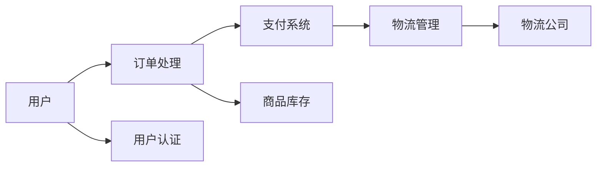

                 


# 彼得林奇如何看待公司的跨境电商策略

## 关键词：彼得·林奇、跨境电商、投资策略、风险管理、市场分析、技术应用、企业战略

## 摘要：本文从投资视角分析跨境电商策略，探讨彼得·林奇的投资理念如何应用于跨境电商战略。通过分析跨境电商模式、风险管理、技术应用和市场分析，提出优化策略和未来展望。

---

### 第一部分: 背景与核心概念

### 第1章: 跨境电商的基本概念与背景

#### 1.1 跨境电商的定义与发展现状
- **1.1.1 跨境电商的定义**：跨境电商是通过互联网进行跨-border的交易，包括B2B、B2C和C2C模式，涵盖产品销售、支付、物流等环节。
- **1.1.2 跨境电商的发展历程**：从早期的传统贸易到互联网时代的兴起，跨境电商经历了技术驱动和全球化加速的阶段。
- **1.1.3 跨境电商的现状与趋势**：全球市场规模持续扩大，技术进步和政策支持推动其快速发展。

#### 1.2 跨境电商的核心要素与模式
- **1.2.1 跨境电商的主要模式**：B2B、B2C和C2C模式的特点与应用场景。
- **1.2.2 跨境电商的核心要素**：支付、物流、产品、用户、技术、政策、风险管理。
- **1.2.3 跨境电商的边界与外延**：与传统贸易的区别，技术驱动的扩展。

#### 1.3 跨境电商对传统贸易的影响
- **1.3.1 跨境电商对传统贸易的冲击**：降低中间成本，改变供应链。
- **1.3.2 跨境电商带来的机遇**：新兴市场和小型企业崛起。
- **1.3.3 跨境电商的挑战与应对**：技术、政策、信任问题。

#### 1.4 本章小结
跨境电商改变了全球贸易格局，理解其模式和影响是制定策略的基础。

---

### 第2章: 跨境电商模式的对比与分析

#### 2.1 跨境电商的主要模式
- B2B：企业对企业，如阿里巴巴。
- B2C：企业对消费者，如亚马逊。
- C2C：消费者对消费者，如 eBay。

#### 2.2 跨境电商模式的优缺点对比
| 模式 | 优点 | 缺点 |
|------|------|------|
| B2B  | 规模大、效率高 | 进入门槛高 |
| B2C  | 直接接触消费者 | 竞争激烈 |
| C2C  | 多样化 | 管理复杂 |

#### 2.3 跨境电商模式的ER实体关系图
```mermaid
erDiagram
    customer[顾客] {
        id : number
        name : string
        email : string
    }
    seller[卖家] {
        id : number
        name : string
        email : string
    }
    product[产品] {
        id : number
        name : string
        price : number
    }
    order[订单] {
        id : number
        customer_id : number
        seller_id : number
        product_id : number
        quantity : number
        date : date
    }
    payment[支付] {
        id : number
        order_id : number
        payment_method : string
        amount : number
        date : date
    }
    logistics[物流] {
        id : number
        order_id : number
        carrier : string
        status : string
        tracking_number : string
    }
    connection {
        customer -> order : places
        seller -> order : sells
        product -> order : includes
        order -> payment : requires
        order -> logistics : requires
    }
```

---

### 第三部分: 核心概念与联系

### 第3章: 跨境电商的核心概念与联系

#### 3.1 跨境电商的核心概念
- 全球化、互联网技术、支付与物流。

#### 3.2 跨境电商模式的联系
- B2B、B2C和C2C模式的联系与区别。

#### 3.3 成功案例分析
- 亚马逊和阿里巴巴的模式分析。

---

### 第四部分: 算法原理与技术应用

### 第4章: 跨境电商的算法与技术应用

#### 4.1 数据驱动的跨境电商策略
- 用户行为分析：通过数据挖掘预测购买行为。
- 市场趋势预测：使用时间序列分析预测需求。

#### 4.2 算法原理
```python
import pandas as pd
from sklearn.linear_model import LinearRegression

# 示例数据
data = {
    'month': [1, 2, 3, 4, 5],
    'sales': [100, 150, 200, 250, 300]
}
df = pd.DataFrame(data)

# 创建模型
model = LinearRegression()
model.fit(df[['month']], df['sales'])

# 预测未来销售
future_months = [[6], [7], [8]]
predicted_sales = model.predict(future_months)
print(predicted_sales)
```

#### 4.3 技术应用
- AI推荐系统、区块链供应链管理。

---

### 第五部分: 数学模型与预测分析

### 第5章: 跨境电商的数学模型与预测分析

#### 5.1 需求预测模型
$$ \text{需求} = \beta_0 + \beta_1 \times \text{价格} + \beta_2 \times \text{广告支出} $$

#### 5.2 库存管理优化
- 使用线性回归模型优化库存。

---

### 第六部分: 系统分析与架构设计

### 第6章: 跨境电商系统的架构与设计

#### 6.1 系统功能设计
- 用户模块：注册、登录。
- 商品模块：上架、管理。
- 订单模块：生成、处理。

#### 6.2 系统架构设计


---

### 第七部分: 项目实战

### 第7章: 跨境电商项目的实战分析

#### 7.1 环境安装
- 安装Python、Django框架。

#### 7.2 核心代码实现
```python
from django.shortcuts import render, redirect
from .models import Product, Order

def product_list(request):
    products = Product.objects.all()
    return render(request, 'product_list.html', {'products': products})

def add_to_cart(request, product_id):
    product = Product.objects.get(id=product_id)
    order = Order.objects.create(user=request.user, product=product)
    return redirect('cart')
```

#### 7.3 案例分析
- 分析某跨境电商平台的订单处理流程，优化支付和物流模块。

---

### 第八部分: 最佳实践与总结

### 第8章: 跨境电商策略的最佳实践

#### 8.1 投资视角的应用
- 风险管理：彼得·林奇的风险控制策略。
- 技术应用：数据分析和人工智能优化。

#### 8.2 本章小结
从投资视角优化跨境电商策略，结合技术手段提升竞争力。

#### 8.3 注意事项
- 数据隐私、物流延迟、政策变化。

#### 8.4 拓展阅读
- 推荐书籍：《彼得·林奇的成功投资》。

---

### 作者：AI天才研究院 & 禅与计算机程序设计艺术

---

这篇博客系统地分析了跨境电商的策略，结合彼得·林奇的投资理念，提供了深入的技术和商业见解。希望对读者在跨境电商领域有所帮助。

