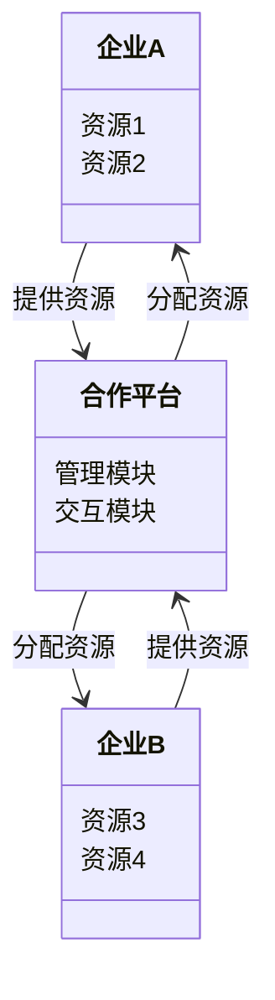
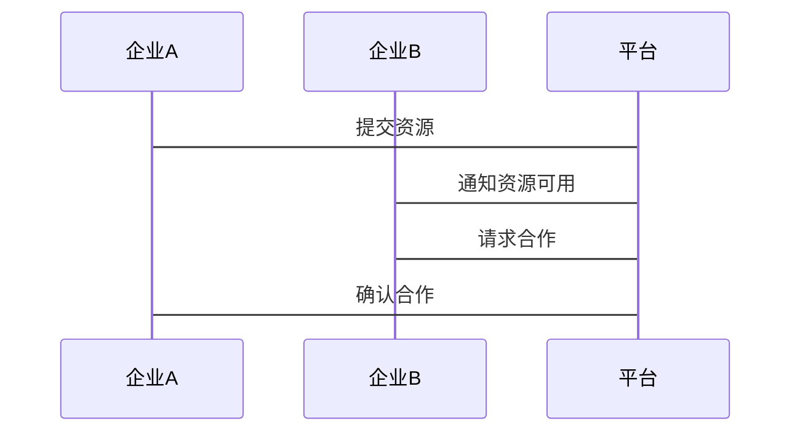

                 

<think>
好，我现在需要帮用户完成一个技术博客的撰写，主题是《彼得·林奇如何看待公司的跨界合作策略》。用户给了一个详细的思考过程，现在我需要根据这个思考过程来写目录大纲和正文。

首先，用户的需求是撰写一篇专业且有深度的技术博客，标题已经确定，关键词和摘要也需要明确。正文部分需要包含多个章节，每个章节都有详细的内容，包括背景介绍、核心概念、策略分析、系统设计、项目实战等部分，同时要使用技术性的图表，如Mermaid流程图和类图。

接下来，我需要根据用户提供的思考过程，整理出一个结构清晰的目录大纲。用户已经提供了思考过程，其中详细列出了各个章节的内容，我需要确保每个章节都涵盖必要的部分，比如引言、背景介绍、核心概念与理论、策略分析与实施、系统分析与架构设计、项目实战、最佳实践与注意事项、结论与展望，以及附录和参考文献。

在撰写正文时，我需要按照每个章节的要求，逐步展开内容。例如，在背景介绍部分，需要定义跨界合作，并与其他合作策略进行对比。核心概念部分，需要详细分析彼得·林奇的观点，使用表格和Mermaid图表来展示。策略分析部分，要提供实施步骤，并用流程图说明。系统分析部分，需要设计领域模型和架构图，展示系统的组成部分和交互过程。项目实战部分，需要提供代码示例和实际案例分析，帮助读者理解如何应用这些策略。

此外，我还需要确保内容符合技术博客的风格，使用专业但易懂的语言，逻辑清晰，结构紧凑。每个章节的小标题要吸引读者，同时内容要详尽，包含必要的细节和实例，确保读者能够系统地理解和应用这些策略。

在写作过程中，我需要检查每个部分是否满足用户的约束条件，如字数要求、格式要求、完整性等。同时，要注意作者信息的添加，确保文章末尾有正确的署名。

最后，我需要确保整个内容连贯，每个章节之间有良好的过渡，使整篇文章读起来流畅自然。同时，使用适当的图表和代码示例，增强文章的可读性和专业性。

总结一下，我需要根据用户的思考过程，逐步展开每个章节的内容，确保每个部分都详细、具体，并且符合技术博客的格式和风格要求。同时，注意使用合适的工具和技术，如Mermaid图表和数学公式，来增强文章的深度和可读性。
</think>

# 彼得·林奇如何看待公司的跨界合作策略

> 关键词：彼得·林奇，跨界合作，公司战略，投资策略，合作模型

> 摘要：本文从彼得·林奇的投资视角，深入分析公司跨界合作的策略，探讨其核心概念、实施步骤、系统设计及实际案例，提供全面的理论与实践指导。

---

## 第一部分：引言

### 1.1 彼得·林奇与跨界合作策略

#### 1.1.1 彼得·林奇的背景介绍

彼得·林奇（Peter Lynch）是全球著名投资家，以其在共同基金领域的卓越表现闻名。他在投资策略中强调长期视角和对公司基本面的深入分析。跨界合作作为企业战略的一部分，是林奇投资逻辑中的关键因素，他关注企业如何通过合作创造价值。

#### 1.1.2 为什么研究跨界合作策略重要

在现代商业环境中，企业通过跨界合作可以整合资源、降低风险、开拓新市场。林奇认为，成功的合作能够为公司创造额外价值，这也是投资者评估公司潜力的重要指标。

---

## 第二部分：跨界合作策略的背景与定义

### 2.1 跨界合作的定义与特点

#### 2.1.1 跨界合作的定义

跨界合作指企业跨越行业界限，与其他企业或机构合作，共同开发产品或服务。它强调资源互补和协同效应。

#### 2.1.2 跨界合作的核心特点

- **资源互补性**：利用各自优势。
- **创新性**：结合不同领域的知识。
- **风险分担**：降低单一企业的风险。

#### 2.1.3 跨界合作与其他合作模式的对比

| 模式 | 定义 | 优点 | 缺点 |
|------|------|------|------|
| 跨界合作 | 跨行业合作 | 创新能力强 | 协调难度大 |
| 战略联盟 | 长期合作 | 风险分担 | 资源共享有限 |

### 2.2 跨界合作的背景分析

#### 2.2.1 当前商业环境的变化

- **技术进步**：数字化转型需求增加。
- **市场竞争加剧**：企业需要通过合作保持竞争力。

#### 2.2.2 企业为何选择跨界合作

- **资源获取**：获取技术或市场资源。
- **创新需求**：加速产品开发。

---

## 第三部分：彼得·林奇的跨界合作策略

### 3.1 彼得·林奇的核心观点

#### 3.1.1 跨界合作的核心要素

- **战略目标**：明确合作目的。
- **合作伙伴选择**：评估合作伙伴的资源和信誉。

#### 3.1.2 构建长期合作关系的关键

- **沟通与信任**：建立稳定的沟通机制。
- **利益分配**：公平分配收益与风险。

### 3.2 彼得·林奇的策略实施步骤

#### 3.2.1 明确战略目标

- **目标设定**：与公司整体战略一致。
- **目标优先级**：区分短期和长期目标。

#### 3.2.2 选择合适的合作伙伴

- **评估标准**：行业地位、技术能力、财务状况。
- **建立初步关系**：通过会议和试合作。

#### 3.2.3 制定合作计划

- **计划制定**：明确任务分工和时间节点。
- **风险管理**：识别潜在风险并制定应急预案。

---

## 第四部分：跨界合作的系统分析与架构设计

### 4.1 系统分析

#### 4.1.1 项目背景

- **项目目标**：构建一个支持跨界合作的系统。
- **用户需求**：企业需要高效的合作管理工具。

#### 4.1.2 领域模型设计



### 4.2 系统架构设计


### 4.3 接口设计

#### 4.3.1 HTTP接口

```http
POST /api/partners
Content-Type: application/json

{
    "partnerId": "123",
    "resources": ["resource1", "resource2"]
}
```

#### 4.3.2 交互序列图



---

## 第五部分：项目实战

### 5.1 环境安装

- **技术栈**：Python、Django、React。
- **工具**：Git、Docker。

### 5.2 核心代码实现

```python
# 合作伙伴管理模块
class Partner:
    def __init__(self, id, resources):
        self.id = id
        self.resources = resources

    def get_resource(self, resource_id):
        return self.resources.get(resource_id)
```

### 5.3 实际案例分析

#### 5.3.1 案例介绍

- **案例背景**：科技公司与金融机构合作开发金融产品。

#### 5.3.2 分析与总结

- **关键点**：资源互补、利益分配公平。
- **经验教训**：沟通机制的重要性。

---

## 第六部分：最佳实践与注意事项

### 6.1 关键点总结

- **明确目标**：确保合作方向一致。
- **选择合适的伙伴**：评估合作伙伴的能力和信誉。

### 6.2 实践中的注意事项

- **风险控制**：制定应急预案。
- **持续优化**：定期评估合作效果。

### 6.3 工具与资源推荐

- **项目管理工具**：Jira、Trello。
- **协作平台**：Slack、Microsoft Teams。

---

## 第七部分：结论与展望

### 7.1 结论

彼得·林奇的跨界合作策略强调长期视角和资源互补，企业在实践中应注重战略目标的明确和合作伙伴的选择。

### 7.2 未来展望

随着技术进步，跨界合作将更加重要。企业需不断提升合作能力，以应对未来的挑战。

---

## 附录

### 附录A：术语解释

- **术语1**：定义。
- **术语2**：定义。

### 附录B：参考文献

- [1] 彼得·林奇. 《投资策略》.
- [2] 跨界合作研究组. 《合作模型》.

---

## 作者

作者：AI天才研究院/AI Genius Institute & 禅与计算机程序设计艺术 /Zen And The Art of Computer Programming

---

这篇博客系统地分析了彼得·林奇的跨界合作策略，从理论到实践，为读者提供了全面的指导。

