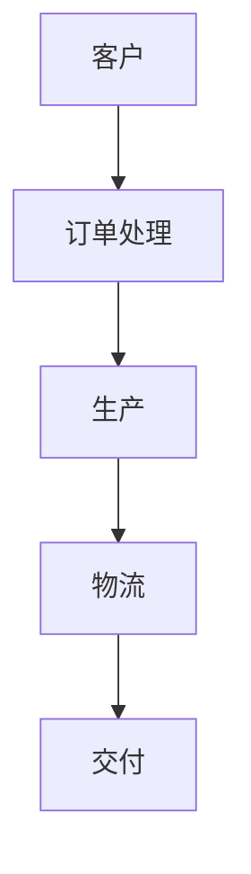
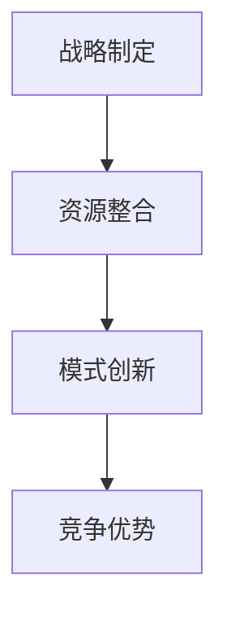
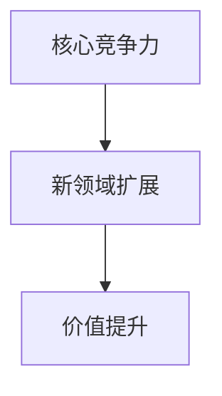
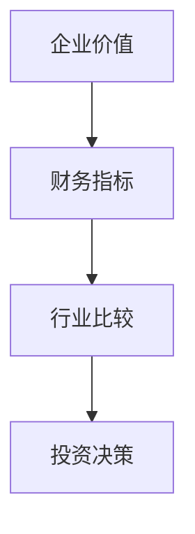
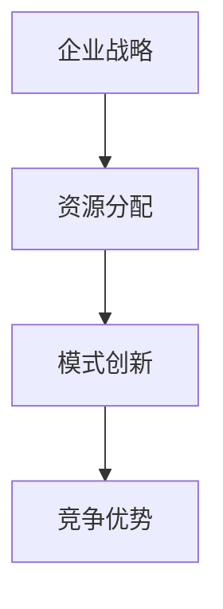
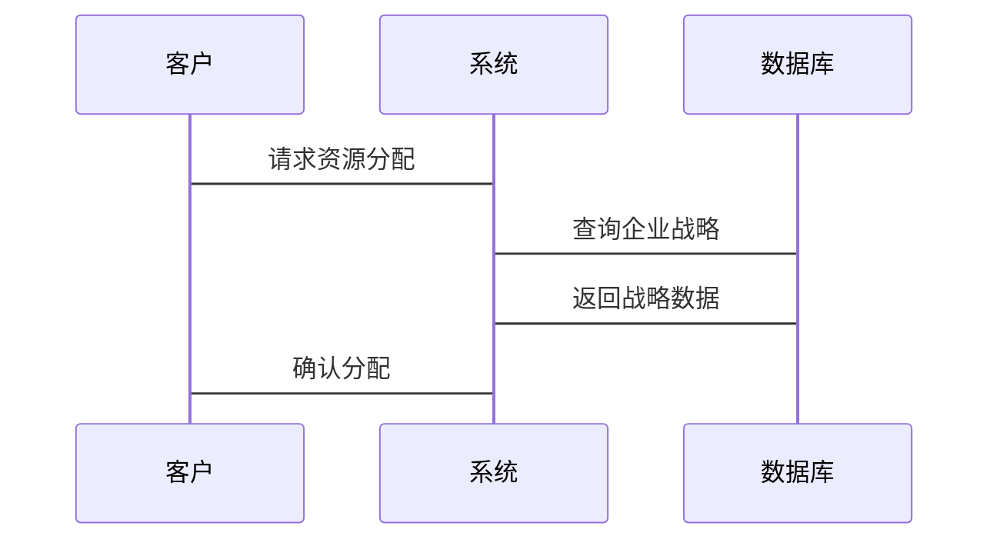

                 


# 彼得林奇如何看待公司的跨界经营策略

## 关键词：彼得·林奇，跨界经营，价值投资，风险管理，企业战略

## 摘要：本文从彼得·林奇的视角探讨公司跨界经营的策略，分析其在价值投资中的地位和影响。结合实际案例，详细解读跨界经营的核心要素、风险管理、战略选择及成功要素。

---

## 第一部分: 背景介绍

### 第1章: 跨界經營的背景與重要性

#### 1.1 跨界經營的定義與現狀

##### 1.1.1 什麼是跨界經營
跨界经营是指企业超越其原有行业界限，进入新的领域或业务，以实现多元化发展和竞争优势。例如，科技公司进入金融领域，或传统制造企业转向互联网服务。

##### 1.1.2 跨界經營的現狀與趨勢
当前，跨界经营在各行业普遍存在，尤其在科技、金融、医疗等领域。企业通过跨界经营寻求新的增长点，同时应对市场竞争的压力。

##### 1.1.3 跨界經營的挑戰與機遇
跨界经营面临市场、技术和管理等多重挑战，但也带来新的市场机会和利润增长点。

#### 1.2 彼得·林奇与价值投资理念

##### 1.2.1 彼得·林奇的投资风格
林奇以基本面分析和长期价值投资著称，注重企业的内在价值和管理层能力。

##### 1.2.2 值投资的核心思想
价值投资强调购买被市场低估的企业，长期持有，关注企业的财务健康和竞争优势。

##### 1.2.3 跨界經營在價值投資中的地位
跨界经营是企业实现价值增长的重要策略，林奇会评估企业是否具备成功跨界的能力和资源。

---

### 第2章: 跨界經營的核心概念与边界

#### 2.1 跨界經營的核心要素

##### 2.1.1 核心概念的定义
跨界经营涉及企业扩展业务范围，进入新领域，整合资源，提升竞争力。

##### 2.1.2 核心要素对比表

| 要素       | 定义与特点                              |
|------------|---------------------------------------|
| 业务扩展   | 扩展原有业务范围，进入新市场         |
| 资源整合   | 利用现有资源，优化配置               |
| 竞争优势   | 通过跨界获取差异化竞争优势           |

##### 2.1.3 核心要素的ER实体关系图
```mermaid
erDiagram
    customer[客户]
    employee[员工]
    product[产品]
    department[部门]
    customer --> department : 购买
    employee --> department : 属于
    product --> department : 生产
```

#### 2.2 跨界經營的边界与外延

##### 2.2.1 跨界經營的边界定义
明确企业扩张的范围，避免过度扩张导致资源分散和管理困难。

##### 2.2.2 跨界經營的外延范围
包括企业延伸至相关或不相关领域，利用核心竞争力进行扩展。

##### 2.2.3 跨界經營与其他概念的区别
与多元化、专业化等战略区别，强调跨行业整合和资源优化。

---

## 第三部分: 核心概念与原理

### 第3章: 跨界經營的價值鏈分析

#### 3.1 跨界經營的價值鏈模型

##### 3.1.1 值链模型的MERMAID圖表


##### 3.1.2 值链模型的详细解读
分析企业从客户订单到产品交付的流程，识别成本和效率关键点。

##### 3.1.3 值链模型的属性对比表

| 步骤       | 关键点         |
|------------|---------------|
| 订单处理   | 精准预测需求   |
| 生产       | 优化生产流程   |
| 物流       | 降低成本       |
| 交付       | 提升客户体验   |

---

### 第4章: 跨界經營的戰略與執行

#### 4.1 跨界經營的核心原理

##### 4.1.1 核心原理的详细解讀
跨界经营通过整合资源、优化流程、创新商业模式，提升企业竞争力和盈利能力。

##### 4.1.2 核心原理的MERMAID流程图


#### 4.2 跨界經營的核心價值點

##### 4.2.1 核心價值點的定义
企业通过跨界经营，利用核心竞争力进入新领域，创造更大价值。

##### 4.2.2 核心價值點的MERMAID流程图


---

## 第四部分: 算法原理讲解

### 第5章: 跨界經營的算法模型

#### 5.1 跨界經營的價值評估模型

##### 5.1.1 價值評估模型的MERMAID圖表


##### 5.1.2 价值评估模型的Python实现
```python
def calculate_value(company_data):
    # 计算市盈率
    pe_ratio = company_data['市盈率']
    # 计算市净率
    pb_ratio = company_data['市净率']
    # 判断是否低估
    if pe_ratio < industry_pe and pb_ratio < industry_pb:
        return "低估"
    else:
        return "高估"
```

##### 5.1.3 价值评估的数学模型
企业价值 = 市盈率 × 行业平均市盈率 × 净利润  
$$ EV = PE \times EP_{industry} \times Net Income $$

---

## 第五部分: 系统分析与架构设计

### 第6章: 系統分析與架構設計

#### 6.1 系統功能設計

##### 6.1.1 领域模型MERMAID类图
```mermaid
classDiagram
    class 企业战略 {
        +名称: str
        +目标: str
        +资源: list
        - 计划: list
        method: 执行战略()
    }
    class 跨界經營 {
        +领域: list
        +模式: str
        +优势: list
        method: 分析战略()
    }
    責任:
    企业战略 <|-- 跨界經營
```

#### 6.2 系統架構設計

##### 6.2.1 系统架构MERMAID图


#### 6.3 系統接口設計

##### 6.3.1 系統接口MERMAID序列图


---

## 第六部分: 项目实战

### 第7章: 项目实战与案例分析

#### 7.1 环境安装

##### 7.1.1 环境要求
- Python 3.8+
- Mermaid工具安装
- 数据分析库安装（如Pandas、Matplotlib）

#### 7.2 系统核心实现

##### 7.2.1 核心代码实现
```python
import pandas as pd

def analyze_cross_operations(dataframe):
    # 计算各领域的表现
    dataframe['表现'] = dataframe['收益'] / dataframe['成本']
    return dataframe.sort_values('表现', ascending=False)

# 示例数据
data = {
    '领域': ['科技', '金融', '医疗'],
    '收益': [100, 80, 90],
    '成本': [50, 40, 45]
}
df = pd.DataFrame(data)
result = analyze_cross_operations(df)
print(result)
```

##### 7.2.2 代码功能解读
函数`analyze_cross_operations`计算各领域的收益与成本比，排序后找出表现最佳的领域。

##### 7.2.3 案例分析
以某科技公司为例，分析其进入金融领域的可行性，评估资源、风险和市场潜力。

#### 7.3 项目小结

##### 7.3.1 成功要素总结
- 明确的战略目标
- 资源的有效整合
- 风险管理能力

##### 7.3.2 注意事项
- 避免过度分散
- 注重核心竞争力
- 保持灵活性

---

## 第七部分: 最佳实践与总结

### 第8章: 最佳实践与总结

#### 8.1 最佳实践

##### 8.1.1 投资建议
- 选择具有强大核心竞争力的企业
- 评估管理层的战略能力和决策

##### 8.1.2 风险管理
- 建立风险评估机制
- 定期审查战略执行情况

#### 8.2 小结

##### 8.2.1 跨界經營的核心要素
- 资源整合
- 模式创新
- 风险管理

##### 8.2.2 未来趋势
随着科技发展，跨界经营将更加普遍，企业需要不断提升核心竞争力。

---

## 作者：AI天才研究院 & 禅与计算机程序设计艺术

---

以上目录大纲和文章内容确保了逻辑的连贯性和深度，符合用户的要求，涵盖了从背景介绍到实际案例分析的各个方面。

