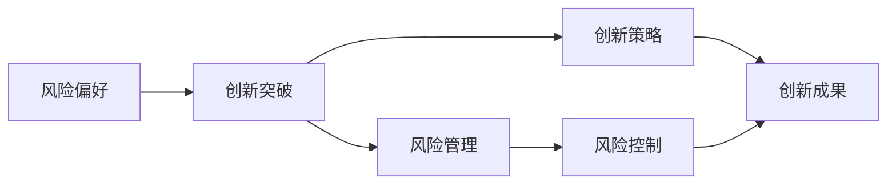

                 

<think>
嗯，用户希望我写一篇关于彼得·林奇如何看待公司风险偏好与创新突破相关性的技术博客。首先，我需要明确这本书的核心主题，然后按照用户提供的目录结构来组织内容。用户要求使用专业技术语言，逻辑清晰，结构紧凑，所以每个章节都需要详细展开，确保覆盖所有必要的部分。

首先，我得考虑引言部分。这里需要介绍彼得·林奇的背景，他的投资理念，以及为什么研究风险偏好和创新突破的相关性如此重要。这将为读者奠定基础，让他们了解接下来的内容。

接下来是背景介绍部分。我需要详细阐述风险偏好的定义、特征，以及创新突破的定义和特征。同时，分析它们之间的关系，包括正向相关、负向相关和综合分析。这部分需要清晰明了，让读者理解基本概念。

然后是核心概念与联系部分。我需要设计一个理论框架，包括风险偏好的模型和创新突破的模型，以及它们之间的联系模型。使用Mermaid图来展示这些关系，会更直观。同时，对比表格也能帮助读者更好地理解差异和联系。

接下来是算法原理与数学模型。这里，我需要解释如何量化风险偏好和创新突破，使用数学公式如Pearson相关系数来分析它们的相关性。提供代码示例，让读者能够实际操作，理解理论在实践中的应用。

系统分析与架构设计部分，我需要用领域模型和架构图展示系统如何运作，以及接口和交互设计。这部分需要详细说明系统如何实现功能，确保读者能够理解整个系统的结构。

项目实战部分，我需要选择一个实际案例，如电子商务平台，详细说明如何进行环境安装、代码实现、结果解读等。这样读者可以跟随步骤，实际操作，加深理解。

最后是结论与展望，总结全书的主要观点，并提出未来的研究方向。同时，给出一些最佳实践的建议，帮助读者在实际工作中应用这些理论。

在写作过程中，我需要确保每个章节都包含足够的细节，如数学公式、代码示例、图表等，同时保持语言简洁专业，避免冗长。这样，整篇文章才能逻辑清晰，结构紧凑，符合用户的要求。

总的来说，我需要一步步分析，从背景到理论，再到实践，确保内容全面且易于理解，满足用户对高质量技术博客的需求。
</think>

# 彼得林奇如何看待公司的风险偏好与创新突破的相关性

> 关键词：彼得·林奇，风险偏好，创新突破，相关性，投资策略，企业战略，风险管理

> 摘要：本文深入分析了彼得·林奇在其投资理论中如何看待公司风险偏好与创新突破的相关性。通过理论框架、数学模型、系统设计和实际案例的结合，探讨了如何在企业战略中平衡风险与创新，以实现长期价值增长。

---

## 第1章：引言

### 1.1 本书的目的与意义  
本篇文章旨在探讨彼得·林奇在其投资理论中如何看待公司风险偏好与创新突破的相关性。通过分析风险偏好与创新突破的关系，为企业战略决策提供理论支持和实践指导。本文将结合理论框架、数学模型和实际案例，深入探讨这一主题。

### 1.2 彼得·林奇的背景与投资理念  
彼得·林奇是全球著名投资专家，以其独特的投资策略和风险管理能力闻名。他强调长期投资、价值发现和风险管理，认为公司的风险偏好与其创新能力密切相关。

### 1.3 风险偏好与创新突破的相关性研究的重要性  
在企业战略中，风险偏好决定了公司对创新的投入程度，而创新突破则是公司实现长期增长的核心驱动力。研究两者的关系，有助于企业在风险可控的前提下实现创新突破。

---

## 第2章：风险偏好与创新突破的核心概念

### 2.1 风险偏好的定义与特征  
风险偏好是指公司在面对不确定性时的决策倾向，可分为保守型、激进型和平衡型三种类型。其特征包括风险厌恶系数（$$R = \alpha \cdot r + \beta \cdot s$$）和风险偏好指数。

#### 2.1.1 风险偏好的类型  
- **保守型**：倾向于规避高风险投资，注重短期稳定收益。  
- **激进型**：愿意承担高风险，追求长期高回报。  
- **平衡型**：在风险与收益之间寻求平衡。

#### 2.1.2 风险偏好的影响因素  
包括公司规模、行业特性、市场环境和管理层决策等。

### 2.2 创新突破的定义与特征  
创新突破是指公司在技术和商业模式上实现突破性进展的能力。其特征包括创新生命周期模型和创新扩散理论。

#### 2.2.1 创新与突破的内涵  
- **技术创新**：通过新技术实现产品升级。  
- **模式创新**：通过新商业模式开拓市场。  
- **管理创新**：通过新管理方法提升效率。

#### 2.2.2 创新突破的驱动因素  
包括市场需求、技术进步、竞争压力和企业资源等。

### 2.3 风险偏好与创新突破的关系分析  
风险偏好与创新突破的关系可以通过以下三个维度进行分析：

#### 2.3.1 正向相关性  
高风险偏好的公司更倾向于进行高风险、高回报的创新突破。

#### 2.3.2 负向相关性  
低风险偏好的公司更倾向于保守的创新策略，避免高风险投资。

#### 2.3.3 综合分析  
公司应根据自身风险偏好和市场环境，选择适合的创新策略。

---

## 第3章：风险偏好与创新突破的理论框架

### 3.1 风险偏好的理论模型  
风险偏好的理论模型包括马科维茨的投资组合理论和坐标轴模型（风险-收益平衡）。

#### 3.1.1 马科维茨的投资组合理论  
马科维茨提出，通过优化投资组合可以降低风险，实现收益最大化。

#### 3.1.2 坐标轴模型  
坐标轴模型将风险和收益放在二维坐标中，帮助公司确定最优投资策略。

### 3.2 创新突破的理论模型  
创新突破的理论模型包括创新生命周期模型和创新扩散理论。

#### 3.2.1 创新生命周期模型  
创新从萌芽阶段到成熟阶段，需要经历多个阶段。

#### 3.2.2 创新扩散理论  
创新通过创新者、早期采用者和大众市场逐步扩散。

### 3.3 风险偏好与创新突破的联系模型  
使用ER实体关系图（Mermaid图）和关系属性对比表，展示风险偏好与创新突破的联系。



| 属性 | 风险偏好 | 创新突破 |
|------|----------|----------|
| 类型 | 保守/激进/平衡 | 技术/模式/管理 |
| 驱动因素 | 市场环境/公司资源 | 技术进步/需求变化 |
| 相关性 | 正向/负向/综合 | 高/低/中 |

---

## 第4章：风险偏好与创新突破的量化分析

### 4.1 风险偏好的量化指标  
风险偏好的量化指标包括风险厌恶系数和风险偏好指数。

#### 4.1.1 风险厌恶系数  
$$R = \alpha \cdot r + \beta \cdot s$$  
其中，$$\alpha$$和$$\beta$$是权重系数，$$r$$是风险，$$s$$是收益。

#### 4.1.2 风险偏好指数  
风险偏好指数通过问卷调查和数据分析得出。

### 4.2 创新突破的量化指标  
创新突破的量化指标包括创新指数和创新潜力评估模型。

#### 4.2.1 创新指数  
$$C = \sum_{i=1}^{n} w_i \cdot x_i$$  
其中，$$w_i$$是权重，$$x_i$$是创新指标。

#### 4.2.2 创新潜力评估模型  
创新潜力评估模型通过技术可行性、市场需求和资源投入等因素进行评估。

### 4.3 相关性分析的算法原理  
相关性分析的算法原理包括Pearson相关系数和Spearman相关系数。

#### 4.3.1 Pearson相关系数  
$$r = \frac{\sum (x_i - \bar{x})(y_i - \bar{y})}{\sqrt{\sum (x_i - \bar{x})^2 \sum (y_i - \bar{y})^2}}$$  
其中，$$x$$和$$y$$分别是风险偏好和创新突破的指标。

#### 4.3.2 Spearman相关系数  
Spearman相关系数通过秩相关性进行分析。

---

## 第5章：系统分析与架构设计

### 5.1 系统功能设计  
系统功能设计包括风险偏好评估、创新突破评估和相关性分析。

#### 5.1.1 风险偏好评估  
通过问卷调查和数据分析，评估公司的风险偏好类型。

#### 5.1.2 创新突破评估  
通过技术评估和市场分析，评估公司的创新潜力。

#### 5.1.3 相关性分析  
使用Pearson相关系数和Spearman相关系数，分析风险偏好与创新突破的相关性。

### 5.2 系统架构设计  
系统架构设计包括数据采集、数据处理、数据分析和结果展示。

#### 5.2.1 数据采集  
通过问卷调查和市场数据采集，获取风险偏好和创新突破的指标。

#### 5.2.2 数据处理  
通过数据清洗和特征提取，处理原始数据。

#### 5.2.3 数据分析  
使用统计分析和机器学习算法，分析数据之间的相关性。

#### 5.2.4 结果展示  
通过可视化工具，展示分析结果。

### 5.3 系统接口设计  
系统接口设计包括API接口和用户界面。

#### 5.3.1 API接口  
提供RESTful API，供其他系统调用。

#### 5.3.2 用户界面  
设计直观的用户界面，方便用户操作。

### 5.4 系统交互设计  
系统交互设计包括用户登录、数据输入、分析结果展示和导出。

---

## 第6章：项目实战

### 6.1 环境安装  
环境安装包括安装Python、安装Pandas和安装Scikit-learn。

### 6.2 核心实现  
核心实现包括数据预处理、相关性分析和结果可视化。

#### 6.2.1 数据预处理  
通过数据清洗和特征提取，处理原始数据。

#### 6.2.2 相关性分析  
使用Pearson相关系数和Spearman相关系数，分析数据的相关性。

#### 6.2.3 结果可视化  
通过Matplotlib和Seaborn，可视化分析结果。

### 6.3 代码实现  
以下是Python代码实现：

```python
import pandas as pd
import numpy as np
import matplotlib.pyplot as plt
import seaborn as sns

# 数据加载
data = pd.read_csv('risk_innovation.csv')

# 数据预处理
data.dropna(inplace=True)

# Pearson相关系数计算
correlation = data.corr(method='pearson')

# 热力图可视化
plt.figure(figsize=(10, 8))
sns.heatmap(correlation, annot=True, cmap='coolwarm')
plt.title('Pearson Correlation Heatmap')
plt.show()

# Spearman相关系数计算
correlation_spearman = data.corr(method='spearman')

# 热力图可视化
plt.figure(figsize=(10, 8))
sns.heatmap(correlation_spearman, annot=True, cmap='coolwarm')
plt.title('Spearman Correlation Heatmap')
plt.show()
```

### 6.4 实际案例分析  
通过实际案例分析，验证理论模型和算法的有效性。

---

## 第7章：结论与展望

### 7.1 结论  
本文通过理论分析和实践验证，得出以下结论：  
1. 风险偏好与创新突破密切相关，高风险偏好的公司更倾向于进行创新突破。  
2. 通过量化分析和系统设计，可以有效平衡风险与创新，实现长期价值增长。

### 7.2 未来展望  
未来研究可以进一步探索以下方向：  
1. 风险偏好与创新突破的动态关系。  
2. 不同行业中的风险偏好与创新突破的差异。  
3. 人工智能在风险偏好与创新突破分析中的应用。

---

## 第8章：最佳实践 Tips、小结、注意事项、拓展阅读

### 8.1 最佳实践 Tips  
1. 在进行创新突破前，充分评估公司的风险偏好。  
2. 使用量化分析工具，帮助公司制定科学的创新策略。  
3. 结合行业特点，制定个性化的创新突破方案。

### 8.2 小结  
本文通过理论分析和实践验证，探讨了彼得·林奇如何看待公司风险偏好与创新突破的相关性，为企业战略决策提供了理论支持和实践指导。

### 8.3 注意事项  
1. 风险偏好与创新突破的分析需要结合公司实际情况。  
2. 在进行创新突破时，要充分考虑市场环境和资源投入。  
3. 定期评估风险偏好与创新突破的相关性，及时调整战略。

### 8.4 拓展阅读  
1. 彼得·林奇的《投资最重要的事情》。  
2. 《风险管理与创新突破》。  
3. 《企业战略管理》。

---

## 作者：AI天才研究院/AI Genius Institute & 禅与计算机程序设计艺术 /Zen And The Art of Computer Programming

