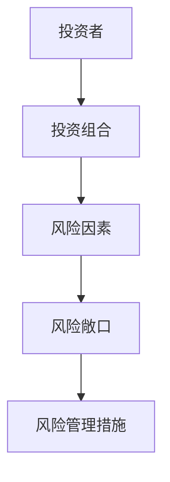
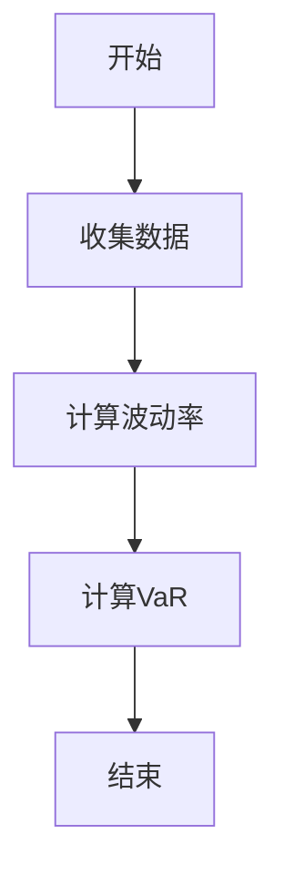
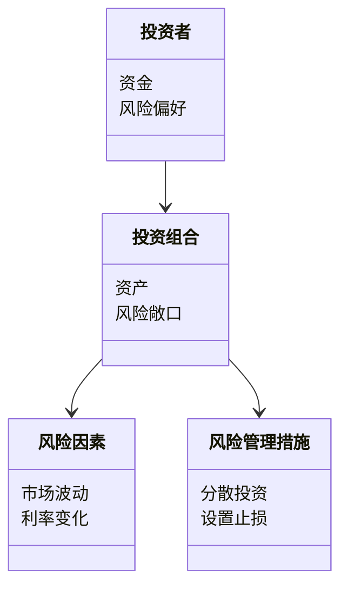
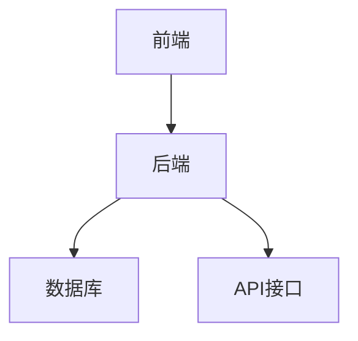
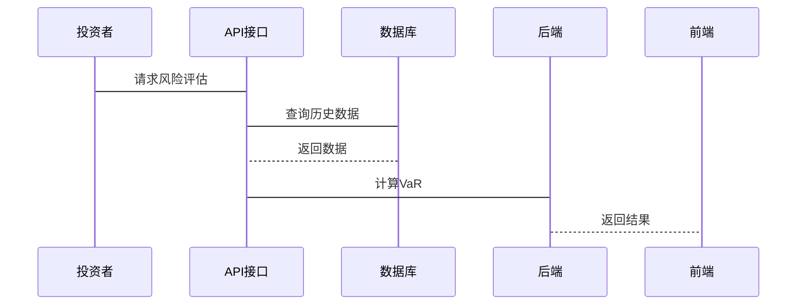

                 

<think>
好，我需要帮助用户撰写一篇关于“彼得·林奇如何看待公司的风险管理”的技术博客文章。首先，我需要理解用户的具体要求。用户提供了一个详细的目录大纲，要求按照这个结构撰写文章，并且每个部分都要详细展开。

首先，文章标题和关键词部分需要明确。标题已经给出，关键词部分应该包含与风险管理相关的术语，如风险管理、彼得·林奇、投资策略等。摘要部分需要简洁地概述文章的核心内容。

接下来，按照目录大纲，文章分为七个章节。每个章节都需要详细展开。第一章是背景介绍，需要解释风险管理的基本概念，彼得·林奇的背景和他的风险管理理念。这里需要确保内容准确，引用彼得·林奇的理论，并说明他的风险管理方法在投资中的应用。

第二章讨论风险管理的核心概念与联系，需要分析风险的类型、量化方法，并与其他相关概念进行对比。这部分需要使用概念属性对比表格和ER实体关系图来辅助说明。我需要使用Mermaid语法来绘制这些图表，并确保它们清晰易懂。

第三章是算法原理讲解，重点介绍风险管理中的具体算法，如VaR（在险价值）的计算方法。这部分需要结合Python代码示例，展示如何实现这些算法。同时，数学公式需要使用LaTeX格式，并正确嵌入到文中。

第四章涉及系统分析与架构设计，需要从系统功能设计、架构设计、接口设计和交互流程等方面进行详细分析。同样，这部分需要使用Mermaid语法绘制类图、架构图和序列图，确保系统的结构和交互过程一目了然。

第五章是项目实战，通过实际案例展示如何应用风险管理的方法。需要包括环境安装、核心代码实现、案例分析等内容，并给出代码解读和实际案例的详细分析。

最后，第六章总结最佳实践，提供小结、注意事项和拓展阅读建议，帮助读者巩固所学内容。同时，文章末尾需要标注作者信息。

在撰写过程中，我需要确保每个部分都符合用户的要求：使用markdown格式，字数在10000到12000字之间，每个章节内容丰富具体，详细讲解核心概念，并使用图表和代码示例增强理解。

现在，我将按照目录大纲，逐步完成每个部分的内容，确保逻辑清晰，结构紧凑，语言专业且易懂。
</think>

# 彼得·林奇如何看待公司的风险管理

## 关键词：风险管理、彼得·林奇、投资策略、VaR、风险评估、系统架构

## 摘要：  
本文从彼得·林奇的视角探讨了公司风险管理的核心理念、方法和实践。通过分析风险管理的基本概念、算法原理、系统架构及实际案例，为读者提供深入的理解和实用的指导。文章结合理论与实践，详细阐述了如何将风险管理应用于投资决策，并通过图表和代码示例，帮助读者掌握风险管理的关键技术。

---

## 第一部分: 风险管理的核心概念与背景

### 第1章: 风险管理的基本概念与背景

#### 1.1 风险管理的基本概念
##### 1.1.1 风险的定义与分类
风险是指在投资或决策过程中，由于不确定性因素导致的损失或收益波动的可能性。常见的风险类型包括市场风险、流动性风险、信用风险和操作风险。

##### 1.1.2 风险管理的目标与意义
风险管理的目标是通过识别、评估和控制风险，降低潜在损失，确保投资目标的实现。其意义在于保护资本、提高决策的可靠性并增强投资者信心。

##### 1.1.3 风险管理的边界与外延
风险管理的边界包括投资组合的范围、时间跨度和市场环境。外延则涉及法律、税务和监管等多个方面。

#### 1.2 彼得·林奇的背景与风险管理理念
##### 1.2.1 彼得·林奇的生平简介
彼得·林奇是富达投资的传奇经理人，以其卓越的投资业绩和风险管理能力闻名。他强调长期投资和深入研究，注重风险控制。

##### 1.2.2 彼得·林奇的风险管理哲学
林奇认为风险管理是投资决策的核心，强调分散投资、定期评估和及时调整。他主张通过多样化投资来降低特定资产的风险。

##### 1.2.3 风险管理在投资中的重要性
风险管理直接关系到投资组合的稳定性和收益的可持续性。有效的风险管理能帮助投资者在市场波动中保持稳健。

---

### 第2章: 风险管理的核心概念与联系

#### 2.1 风险管理的核心原理
##### 2.1.1 风险的识别与评估
通过数据分析和市场研究，识别可能影响投资的风险因素，并评估其影响程度。

##### 2.1.2 风险的量化与度量
使用VaR（在险价值）等指标量化风险，评估投资组合在特定置信水平下的潜在损失。

##### 2.1.3 风险的控制与应对策略
制定应对策略，如调整投资组合、设置止损点或增加分散投资。

#### 2.2 核心概念对比分析
##### 2.2.1 风险与收益的对比分析
高风险通常意味着高收益，但并非所有高风险投资都能带来高回报。

##### 2.2.2 风险管理与投资策略的关系
风险管理是投资策略的重要组成部分，决定了投资组合的结构和调整方向。

##### 2.2.3 风险的内部与外部因素对比
内部风险如操作失误，外部风险如市场波动，两者均需综合考虑。

#### 2.3 实体关系图


---

### 第3章: 风险管理的算法原理

#### 3.1 风险管理算法概述
##### 3.1.1 风险评估算法
通过历史数据和统计模型评估投资组合的风险。

##### 3.1.2 风险量化算法
使用VaR或CVaR等指标量化潜在损失。

##### 3.1.3 风险控制算法
制定策略以应对不同风险级别。

#### 3.2 风险评估算法流程图


#### 3.3 Python代码实现
```python
import numpy as np

def calculate_variance(risks):
    return np.var(risks)

def calculate_VaR(risks, alpha=0.05):
    sorted_risks = sorted(risks)
    var = sorted_risks[int(len(risks) * alpha)]
    return var

# 示例数据
risks = [0.01, 0.02, 0.03, 0.04, 0.05]
var = calculate_VaR(risks)
print(f"VaR at {alpha}%: {var}")
```

---

### 第4章: 系统分析与架构设计

#### 4.1 系统分析
##### 4.1.1 风险管理系统的功能需求
包括风险识别、评估、量化和控制。

##### 4.1.2 风险管理系统的性能需求
要求高实时性和准确性。

##### 4.1.3 风险管理系统的边界与外部因素
考虑市场环境、法律法规等外部因素。

#### 4.2 系统架构设计
##### 4.2.1 领域模型


##### 4.2.2 系统架构


##### 4.2.3 接口与交互


---

## 第五部分: 项目实战

### 第5章: 项目实战

#### 5.1 环境安装
安装Python、NumPy和Matplotlib等库。

#### 5.2 核心代码实现
实现风险评估和VaR计算的代码。

#### 5.3 案例分析
分析一个具体的投资组合，展示如何应用风险管理策略。

#### 5.4 代码解读与分析
详细解释代码的功能和实现细节。

---

## 第六部分: 最佳实践

### 第6章: 最佳实践

#### 6.1 小结
总结风险管理的核心要点和应用方法。

#### 6.2 注意事项
提醒读者注意风险量化中的假设和数据质量的重要性。

#### 6.3 拓展阅读
推荐相关书籍和资源，供读者深入学习。

---

## 作者：AI天才研究院/AI Genius Institute & 禅与计算机程序设计艺术/Zen And The Art of Computer Programming

