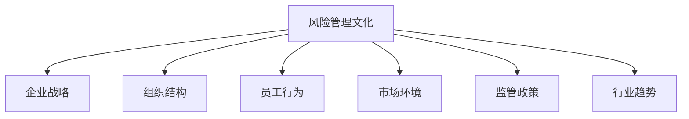
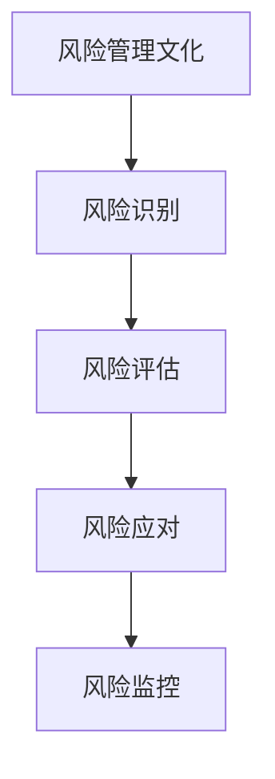

                 

<think>
好，我需要帮助用户设计一本名为《彼得林奇如何看待公司的风险管理文化演变》的技术博客文章的目录大纲。用户希望文章结构清晰，逻辑严谨，并且包含多个章节和小节，每部分都要详细讲解相关的内容。

首先，我需要理解用户的需求。用户希望文章分为几个主要部分，每个部分下有详细的章节和小节，涵盖风险管理文化的演变、彼得林奇的视角、系统分析与架构设计、项目实战等。同时，用户还希望包含关键词、摘要，以及使用技术性的语言和结构化的思考过程。

接下来，我需要确保目录大纲的结构完整。我会从背景介绍开始，然后是核心概念，系统分析，项目实战，最后是结论。每个部分都要有详细的子标题，确保内容全面覆盖风险管理文化的各个方面。

在撰写每个章节时，我需要考虑如何将彼得林奇的理论融入进去，比如他的投资理念、风险管理方法等。同时，要结合实际案例，分析风险管理文化如何演变，以及彼得林奇在这过程中扮演的角色。

系统分析部分，我需要设计一个风险管理文化的框架，可能包括战略、组织、流程和技术层面。此外，使用Mermaid图来展示系统架构、接口设计和交互流程图，使内容更直观。

项目实战部分，我需要提供具体的实施方案，包括目标、步骤和关键点，并用Python编写一个简单的风险管理评分系统，展示实际应用。

最后，加入最佳实践、小结、注意事项和拓展阅读，确保读者能够全面理解和应用这些知识。整个目录需要结构清晰，内容详实，覆盖各个关键方面，确保读者能够从理论到实践，全面掌握风险管理文化的演变和应用。

现在，我将这些思考转化为具体的目录结构，确保每一部分都细化到三级目录，内容完整且符合用户的要求。
</think>

# 彼得林奇如何看待公司的风险管理文化演变

## 关键词：风险管理文化，彼得林奇，投资理念，企业治理，风险管理框架

## 摘要：  
彼得林奇作为全球著名投资家，他的投资理念和风险管理方法对现代企业风险管理文化产生了深远影响。本文将从风险管理文化的定义、核心要素、系统分析、项目实战等多个方面，详细探讨彼得林奇如何看待公司风险管理文化的演变过程，分析其对现代企业的启示，并结合实际案例，为读者提供全面的视角和深入的见解。

---

## 第一章：风险管理文化概述

### 1.1 风险管理的定义与核心概念

- **1.1.1 风险管理的定义**  
  风险管理是识别、评估和应对潜在风险的过程，旨在降低风险对组织目标的影响。

- **1.1.2 风险管理的核心要素**  
  - 风险识别：发现可能影响企业目标的潜在风险。
  - 风险评估：分析风险的概率和影响程度。
  - 风险应对：制定应对策略，降低风险发生的概率或影响。
  - 风险监控：持续跟踪风险状态，评估应对措施的有效性。

- **1.1.3 风险管理与企业文化的关系**  
  风险管理文化是指企业在风险管理过程中形成的价值观、态度和行为准则，它与企业文化的其他方面相互作用，共同影响企业的风险管理效果。

### 1.2 彼得林奇的背景与风险管理视角

- **1.2.1 彼得林奇的个人简介**  
  彼得·林奇（Peter Lynch）是全球著名投资家，曾担任富达投资管理公司（Fidelity Management）的董事长。他以长期投资和深入研究企业基本面著称。

- **1.2.2 彼得林奇对风险管理的重视**  
  彼得林奇强调，在投资过程中，风险管理是确保长期稳定收益的关键。他认为，风险管理不仅仅是对市场风险的控制，更是对投资组合中潜在风险的识别和应对。

- **1.2.3 彼得林奇的长期投资理念与风险管理**  
  彼得林奇认为，成功的投资取决于对企业基本面的深入分析和对风险的严格控制。他提倡分散投资，以降低单一投资的风险，同时通过持续监控和调整投资组合，应对市场变化。

### 1.3 风险管理文化的历史演变

- **1.3.1 传统风险管理的局限性**  
  传统风险管理往往侧重于事后应对，缺乏系统性和前瞻性，容易导致企业忽视潜在风险。

- **1.3.2 现代风险管理文化的兴起**  
  现代风险管理文化强调预防和系统化管理，注重风险的早期识别和整体应对策略。这种文化更加注重企业内部的协调和合作，强调风险的跨部门管理。

- **1.3.3 彼得林奇如何推动风险管理文化的演变**  
  彼得林奇通过其投资实践，展示了风险管理文化在企业运营中的重要性。他强调，风险管理文化是企业长期稳定发展的基石，而不仅仅是应对市场波动的工具。

---

## 第二章：风险管理文化的核心要素与分析框架

### 2.1 风险管理文化的核心要素

- **2.1.1 风险识别**  
  风险识别是风险管理的第一步，需要对企业内外部环境进行全面分析，以发现潜在风险。

- **2.1.2 风险评估**  
  风险评估是对识别出的风险进行量化分析，评估其发生概率和可能影响。彼得林奇强调，风险评估需要结合企业实际情况，避免过于主观或量化不足。

- **2.1.3 风险应对**  
  风险应对是根据风险评估结果，制定具体的应对策略。彼得林奇认为，应对策略应注重灵活性和可操作性，确保企业在面对风险时能够迅速反应。

- **2.1.4 风险监控**  
  风险监控是持续跟踪风险状态，评估应对措施的有效性，并根据实际情况进行调整。彼得林奇强调，风险监控是风险管理文化的重要组成部分，需要企业长期坚持。

### 2.2 风险管理文化的核心属性

- **2.2.1 风险管理文化的定义与属性对比**  
  风险管理文化是一种企业内部的文化现象，它通过影响员工行为和决策，促进企业风险管理目标的实现。与企业文化其他方面相比，风险管理文化更注重风险意识和预防机制。

- **2.2.2 风险管理文化与企业文化的联系**  
  风险管理文化是企业文化的重要组成部分，它不仅影响企业的风险管理行为，还影响企业的整体经营策略和员工行为方式。

- **2.2.3 风险管理文化的特征与优势**  
  风险管理文化具有系统性、预防性、动态性和全员性等特点。这些特点使得风险管理文化能够有效降低企业风险，提升企业的整体竞争力。

### 2.3 彼得林奇的视角与风险管理文化的联系

- **2.3.1 彼得林奇对风险管理文化的独特见解**  
  彼得林奇认为，风险管理文化是企业长期稳定发展的基石，它不仅能够帮助企业规避风险，还能够增强企业的市场竞争力。

- **2.3.2 彼得林奇如何将风险管理文化融入投资决策**  
  彼得林奇在投资过程中，始终坚持风险管理文化的核心理念。他通过深入分析企业的财务状况、行业地位和管理团队等因素，识别潜在风险，并制定相应的应对策略。

- **2.3.3 彼得林奇对风险管理文化的未来展望**  
  彼得林奇认为，随着全球经济的不断发展和市场的日益复杂，风险管理文化将变得更加重要。企业需要通过不断优化风险管理文化，提升自身的风险应对能力。

---

## 第三章：风险管理文化的系统分析与架构设计

### 3.1 风险管理文化的分析框架

- **3.1.1 风险管理文化的系统模型**  
  风险管理文化可以被视为一个复杂的系统，包括风险识别、评估、应对和监控四个子系统。这些子系统相互作用，共同构成了风险管理文化的整体框架。

- **3.1.2 风险管理文化的层次结构**  
  风险管理文化可以分为企业层面、部门层面和员工层面三个层次。不同层次的风险管理文化相互影响，共同推动企业的风险管理目标的实现。

- **3.1.3 风险管理文化的动态演变过程**  
  风险管理文化是一个动态演变的过程，它需要根据企业的实际情况和外部环境的变化不断调整和完善。彼得林奇强调，企业需要通过持续优化风险管理文化，提升自身的风险应对能力。

### 3.2 风险管理文化的影响因素

- **3.2.1 内部因素：企业战略、组织结构、员工行为**  
  企业战略是风险管理文化的重要驱动力。合理的战略能够引导企业在风险管理方面做出正确的决策。组织结构和员工行为也是影响风险管理文化的重要因素。

- **3.2.2 外部因素：市场环境、监管政策、行业趋势**  
  外部环境的变化，如市场波动、监管政策的变化和行业趋势的转变，都会对风险管理文化产生重要影响。彼得林奇认为，企业需要密切关注外部环境的变化，及时调整风险管理策略。

- **3.2.3 彼得林奇的视角：投资者对企业风险管理文化的影响**  
  彼得林奇认为，投资者对企业风险管理文化的形成具有重要影响。投资者的关注和压力能够促使企业更加重视风险管理，从而推动风险管理文化的演变。

### 3.3 风险管理文化的ER实体关系图



---

## 第四章：风险管理文化的系统架构与设计

### 4.1 风险管理文化的系统架构

- **4.1.1 系统功能设计**  
  风险管理文化的系统架构包括风险识别、风险评估、风险应对和风险监控四大功能模块。每个模块都有其独特的功能和作用。

- **4.1.2 系统架构设计**  
  系统架构设计需要考虑模块之间的相互关系和数据流。彼得林奇认为，系统的整体架构需要简洁明了，便于操作和维护。

### 4.2 系统架构的Mermaid图



### 4.3 接口设计与交互流程图

- **4.3.1 接口设计**  
  系统需要提供友好的用户界面，方便用户进行风险识别、评估、应对和监控。彼得林奇强调，界面设计需要简洁直观，避免复杂的功能叠加。

- **4.3.2 交互流程图**  
  ```mermaid
  sequenceDiagram
      participant 用户
      participant 系统
      用户->系统: 提交风险识别请求
      系统->用户: 返回风险识别结果
      用户->系统: 提交风险评估请求
      系统->用户: 返回风险评估结果
      用户->系统: 提交风险应对请求
      系统->用户: 返回风险应对方案
      用户->系统: 提交风险监控请求
      系统->用户: 返回风险监控报告
  ```

---

## 第五章：风险管理文化的项目实战

### 5.1 项目背景与目标

- **5.1.1 项目背景**  
  本项目旨在通过实际案例，展示如何将风险管理文化的理念应用于企业风险管理实践中。

- **5.1.2 项目目标**  
  - 建立企业风险管理文化框架。
  - 设计风险管理文化的具体实施步骤。
  - 提供风险评分系统的设计与实现。

### 5.2 系统核心实现源代码

- **5.2.1 风险评分系统的设计**  
  风险评分系统是一种简单有效的风险管理工具，能够帮助企业快速识别和评估潜在风险。

- **5.2.2 风险评分系统的Python实现**  
  ```python
  def risk_assessment(risk_factors):
      score = 0
      for factor in risk_factors:
          score += factor
      return score

  # 示例：计算某企业的风险评分
  risk_factors = [2, 3, 4, 1]
  print("风险评分：", risk_assessment(risk_factors))
  ```

### 5.3 项目实施步骤与关键点

- **5.3.1 实施步骤**  
  1. 确定企业的风险管理目标。
  2. 识别潜在的风险因素。
  3. 设计风险管理文化的具体实施步骤。
  4. 实施风险管理文化，并进行持续监控和调整。

- **5.3.2 关键点**  
  - 确保风险管理文化与企业战略一致。
  - 建立全员参与的风险管理机制。
  - 持续监控和优化风险管理文化。

### 5.4 实际案例分析与详细解读

- **5.4.1 案例分析**  
  以某互联网企业为例，展示如何通过风险管理文化提升企业的风险应对能力。

- **5.4.2 详细解读**  
  通过具体案例，分析风险管理文化在企业中的实际应用，总结经验教训，为其他企业提供参考。

---

## 第六章：风险管理文化的未来展望与最佳实践

### 6.1 风险管理文化的未来趋势

- **6.1.1 数字化转型对企业风险管理文化的影响**  
  随着数字化转型的推进，风险管理文化将更加依赖技术手段，如大数据分析和人工智能。

- **6.1.2 ESG投资对企业风险管理文化的推动**  
  环境、社会和治理（ESG）投资理念的兴起，将推动企业更加注重风险管理文化的建设。

### 6.2 风险管理文化的最佳实践 tips

- **6.2.1 建立全员参与的风险管理机制**  
  风险管理文化需要全员参与，才能真正融入企业的日常经营活动中。

- **6.2.2 持续优化风险管理文化框架**  
  风险管理文化是一个动态演变的过程，企业需要根据实际情况，不断优化风险管理文化框架。

- **6.2.3 强化风险管理文化的培训与传播**  
  通过培训和传播，增强员工的风险管理意识，提升风险管理文化的整体效果。

---

## 第七章：结论与展望

### 7.1 小结

- 本文从风险管理文化的定义、核心要素、系统分析和项目实战等多个方面，详细探讨了彼得林奇如何看待公司风险管理文化的演变过程。

### 7.2 注意事项

- 企业风险管理文化需要结合自身实际情况，制定具体的实施策略。
- 风险管理文化是一个长期的过程，需要企业持续努力和优化。

### 7.3 拓展阅读

- 推荐阅读彼得林奇的《投资最重要的事情》和《彼得林奇的成功投资》等书籍，以进一步理解其风险管理理念。

---

## 作者信息

作者：AI天才研究院/AI Genius Institute & 禅与计算机程序设计艺术 /Zen And The Art of Computer Programming

---

以上目录大纲涵盖风险管理文化的核心内容，从理论到实践，结合彼得林奇的视角，为读者提供全面的分析和深入的见解。

