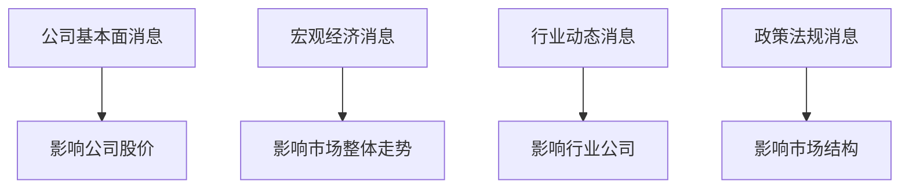
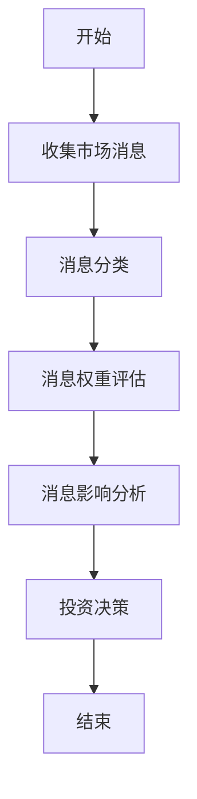
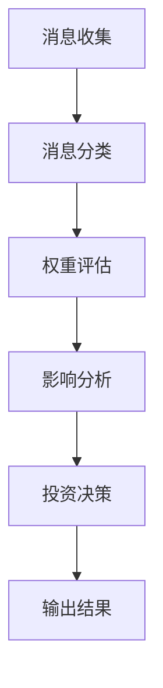

                 


# 彼得林奇如何看待市场消息

## 关键词：彼得林奇、市场消息、投资分析、股票策略、风险管理

## 摘要：本文深入探讨了彼得林奇如何分析市场消息，并结合其投资理念，详细讲解了市场消息的分类、分析模型、系统架构设计以及实际案例。文章通过详细的理论分析和实际操作指导，帮助读者理解并应用彼得林奇的市场消息分析方法，提升投资决策能力。

---

## 第一部分：彼得林奇投资理念与市场消息分析基础

### 第1章：彼得林奇与市场消息分析概述

#### 1.1 彼得林奇的背景与投资理念

##### 1.1.1 彼得林奇的生平简介

彼得·林奇（Peter Lynch）是美国著名的投资经理人，曾任富达投资集团麦哲伦基金的经理。他以其卓越的投资业绩和独特的投资理念闻名，被誉为“股票投资专家”。林奇的投资策略注重基本面分析和长期价值，他善于通过分析公司财务数据、行业趋势和宏观经济环境来寻找投资机会。

##### 1.1.2 彼得林奇的投资哲学

彼得林奇的投资哲学的核心在于“坚持基本面分析，寻找那些具有持续增长潜力的公司”。他认为，市场消息是投资者决策的重要依据，但必须结合公司的基本面进行综合分析。林奇强调，投资者应该关注那些能够反映公司真实价值的消息，而不是被短期市场波动所迷惑。

##### 1.1.3 彼得林奇对市场消息的的独特见解

林奇认为，市场消息是投资决策的重要依据，但需要通过系统的分析方法来筛选和评估。他强调，市场消息的好坏并不决定公司的长期价值，而是反映了市场对公司的认知和预期。因此，投资者需要结合公司基本面和市场消息进行综合分析。

#### 1.2 市场消息分析的核心概念

##### 1.2.1 市场消息的定义与分类

市场消息是指在股票市场上，影响公司价值或市场走势的各种信息，包括公司公告、行业动态、宏观经济数据、政策法规等。市场消息可以分为以下几类：

1. **公司基本面消息**：包括公司财务报告、高管变动、产品发布、收购兼并等。
2. **宏观经济消息**：包括GDP增长、利率变动、通货膨胀、就业数据等。
3. **行业动态消息**：包括行业政策、技术进步、市场竞争状况等。
4. **政策法规消息**：包括政府出台的经济政策、法律法规变化等。

##### 1.2.2 市场消息对投资者决策的影响

市场消息对投资者决策的影响是多方面的。积极的消息（如公司盈利增长、新产品发布）通常会推高股价，而消极的消息（如业绩下滑、政策限制）则会压低股价。然而，市场消息的影响程度因消息类型和公司具体情况而异。投资者需要根据消息的性质和公司的基本面来判断其影响。

##### 1.2.3 彼得林奇对市场消息的筛选标准

林奇认为，并非所有的市场消息都具有同等的重要性。他强调，投资者应该关注那些能够反映公司长期价值的消息，而不是被短期市场波动所迷惑。他提出了以下筛选标准：

1. **消息的来源和可靠性**：优先选择来自公司公告、权威媒体的消息，避免轻信小道消息。
2. **消息的影响力和相关性**：根据消息对公司的实际影响程度进行筛选，避免被无关消息干扰。
3. **消息的时间敏感性**：关注最新的市场消息，同时结合历史数据进行分析。

#### 1.3 本章小结

本章主要介绍了彼得林奇的背景及其投资理念，重点阐述了市场消息分析的核心概念，包括市场消息的分类、对投资者决策的影响以及林奇的筛选标准。这些内容为后续章节的深入分析奠定了基础。

---

## 第2章：市场消息的分类与特征分析

### 2.1 市场消息的分类

#### 2.1.1 公司基本面消息

公司基本面消息是指与公司经营状况直接相关的消息，包括财务报告、高管变动、产品发布等。这些消息能够直接反映公司的财务状况和经营能力，是投资者分析公司价值的重要依据。

##### 案例分析：某公司发布季度财报，显示净利润增长10%。

#### 2.1.2 宏观经济消息

宏观经济消息是指影响整个经济环境的消息，包括GDP增长、利率变动、通货膨胀等。这些消息通常会影响市场的整体走势，对投资者的决策具有重要影响。

##### 案例分析：央行宣布降低基准利率，可能推高股市整体走势。

#### 2.1.3 行业动态消息

行业动态消息是指影响特定行业或市场的消息，包括行业政策、技术进步、市场竞争状况等。这些消息通常对行业内公司的股价产生直接影响。

##### 案例分析：政府出台新能源汽车补贴政策，利好新能源行业。

#### 2.1.4 政策法规消息

政策法规消息是指政府出台的经济政策和法律法规，包括税收政策、行业监管、贸易政策等。这些消息通常会对市场产生深远影响，尤其是在特定行业。

##### 案例分析：监管机构加强金融行业监管，可能影响银行股的走势。

### 2.2 不同类型市场消息的特征对比

#### 2.2.1 表格对比：不同类型市场消息的特征分析

| 消息类型       | 主要影响 | 信息来源 | 时间敏感性 | 影响范围 |
|----------------|----------|-----------|-------------|----------|
| 公司基本面消息 | 公司价值 | 公司公告  | 高           | 特定公司 |
| 宏观经济消息   | 市场整体 | 官方数据  | 中           | 整个市场 |
| 行业动态消息   | 行业公司 | 行业报告  | 中           | 特定行业 |
| 政策法规消息   | 市场结构 | 政府公告  | 高           | 特定行业或市场 |

#### 2.2.2 图表分析：消息类型与投资影响的关系



### 2.3 彼得林奇对市场消息的权重排序

#### 2.3.1 核心权重分析：基本面消息的重要性

彼得林奇认为，公司基本面消息是最重要的市场消息类型。他强调，公司的财务状况和经营能力是决定股价的长期因素。因此，他在分析市场消息时，首先关注公司基本面消息。

#### 2.3.2 边缘权重分析：宏观经济消息的间接影响

虽然宏观经济消息对市场整体走势有重要影响，但其对特定公司的影响是间接的。林奇认为，宏观经济消息是次要的分析因素，除非出现重大经济变动，否则不会单独据此调整投资策略。

---

## 第3章：彼得林奇市场消息分析模型

### 3.1 模型概述

#### 3.1.1 模型的核心思想

彼得林奇市场消息分析模型的核心思想是，通过系统地分析市场消息，结合公司基本面和行业趋势，评估消息对股价的影响，并据此制定投资策略。该模型强调消息的权重排序和综合分析。

#### 3.1.2 模型的输入与输出

**输入**：市场消息数据（包括公司基本面消息、宏观经济消息、行业动态消息、政策法规消息）。

**输出**：消息对股价的综合影响评估，投资决策建议。

#### 3.1.3 模型的适用场景

适用于股票投资分析，特别是当市场消息对公司股价有潜在影响时，帮助投资者做出理性决策。

### 3.2 模型的算法原理

#### 3.2.1 算法流程图



#### 3.2.2 算法实现代码示例

```python
def peter_lynch_model(market_messages):
    classified_messages = classify_messages(market_messages)
    message_weights = assess_weights(classified_messages)
    impact_assessment = analyze_impact(message_weights)
    investment_decision = decide_investment(impact_assessment)
    return investment_decision

def classify_messages(messages):
    # 分类市场消息
    categories = {'公司基本面': 0, '宏观经济': 0, '行业动态': 0, '政策法规': 0}
    for msg in messages:
        if msg['type'] == '公司基本面':
            categories['公司基本面'] += 1
        elif msg['type'] == '宏观经济':
            categories['宏观经济'] += 1
        elif msg['type'] == '行业动态':
            categories['行业动态'] += 1
        elif msg['type'] == '政策法规':
            categories['政策法规'] += 1
    return categories

def assess_weights(categories):
    # 评估消息权重
    weights = {}
    total = sum(categories.values())
    for key, value in categories.items():
        weights[key] = value / total
    return weights

def analyze_impact(weights):
    # 分析消息影响
    impact = {}
    for key, weight in weights.items():
        if key == '公司基本面':
            impact['高'] = weight
        elif key == '宏观经济':
            impact['中'] = weight
        elif key == '行业动态':
            impact['中'] = weight
        elif key == '政策法规':
            impact['高'] = weight
    return impact

def decide_investment(impact):
    # 投资决策
    decision = '买入'
    for key, level in impact.items():
        if level > 0.6:
            decision = '卖出'
            break
    return decision
```

#### 3.2.3 数学模型与公式

##### 影响度计算公式

$$ 影响度 = \sum_{i=1}^{n} (w_i \times m_i) $$

其中，$w_i$ 是第 $i$ 类消息的权重，$m_i$ 是第 $i$ 类消息的影响值（高=1，中=0.5，低=0.2）。

##### 权重计算公式

$$ 权重 = \frac{历史影响频率}{总消息数量} $$

---

## 第4章：系统架构设计与实现

### 4.1 系统功能设计

#### 4.1.1 系统模块划分

1. **消息收集模块**：从多个数据源收集市场消息。
2. **消息分类模块**：将收集到的消息按照类型进行分类。
3. **权重评估模块**：根据消息类型和历史数据评估消息权重。
4. **影响分析模块**：分析消息对股价的影响，并生成投资建议。
5. **决策输出模块**：根据分析结果输出投资决策。

#### 4.1.2 系统功能流程图



### 4.2 系统架构设计

#### 4.2.1 系统架构图


#### 4.2.2 系统接口设计

- **输入接口**：接收市场消息数据，格式为JSON或数据库格式。
- **输出接口**：输出投资决策建议，格式为文本或JSON。

#### 4.2.3 系统交互流程图


### 4.3 项目实战

#### 4.3.1 环境安装

- **Python环境**：安装Python 3.8及以上版本。
- **开发工具**：安装PyCharm或VS Code。
- **依赖库**：安装pandas、numpy、scikit-learn等库。

#### 4.3.2 核心代码实现

```python
import pandas as pd

def main():
    # 从数据库读取市场消息
    messages = pd.read_csv('market_messages.csv')
    classified_messages = classify_messages(messages)
    message_weights = assess_weights(classified_messages)
    impact_assessment = analyze_impact(message_weights)
    investment_decision = decide_investment(impact_assessment)
    print(f"投资决策：{investment_decision}")

if __name__ == "__main__":
    main()
```

#### 4.3.3 实际案例分析

**案例分析：**

假设某公司发布了一份季度财报，显示净利润增长10%，同时政府宣布将对该行业进行政策扶持。根据彼得林奇的市场消息分析模型，我们可以将这些消息分类为公司基本面消息和政策法规消息，分别赋予它们高权重。经过分析，这些消息对股价的综合影响较大，因此模型建议买入该股票。

---

## 第5章：最佳实践与小结

### 5.1 最佳实践

- **持续学习**：市场环境不断变化，投资者需要持续关注市场动态，学习新的分析方法。
- **分散投资**：不要将所有资金投入到单一股票或行业中，分散投资可以降低风险。
- **长期视角**：避免被短期市场波动所迷惑，关注公司的长期价值。

### 5.2 小结

彼得林奇的市场消息分析方法为我们提供了一个系统化的分析框架，帮助投资者在复杂的市场环境中做出理性的决策。通过分类市场消息、评估消息权重、分析消息影响，投资者可以更好地把握市场动向，制定有效的投资策略。

### 5.3 注意事项

- **消息的可靠性**：确保消息来源可靠，避免被虚假信息误导。
- **模型的局限性**：彼得林奇的模型适用于大多数情况，但在极端市场环境下可能需要调整。
- **风险管理**：投资者应合理控制投资风险，避免过度杠杆或盲目跟风。

### 5.4 拓展阅读

- **《彼得林奇的投资哲学》**：深入理解彼得林奇的投资理念。
- **《股票投资实战》**：学习更多股票投资技巧和策略。
- **《市场消息分析与应用》**：掌握市场消息分析的更多方法和工具。

---

## 作者

**作者：AI天才研究院/AI Genius Institute & 禅与计算机程序设计艺术/Zen And The Art of Computer Programming**

---

以上是《彼得林奇如何看待市场消息》的技术博客文章的完整目录大纲和部分内容示例。通过这一结构化和详细的分析，读者可以系统地了解彼得林奇的市场消息分析方法，并在实际投资中加以应用。

