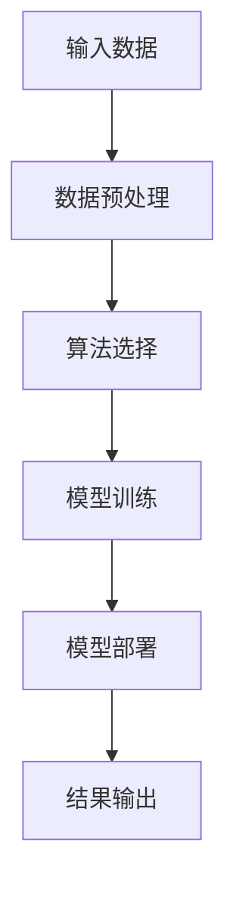
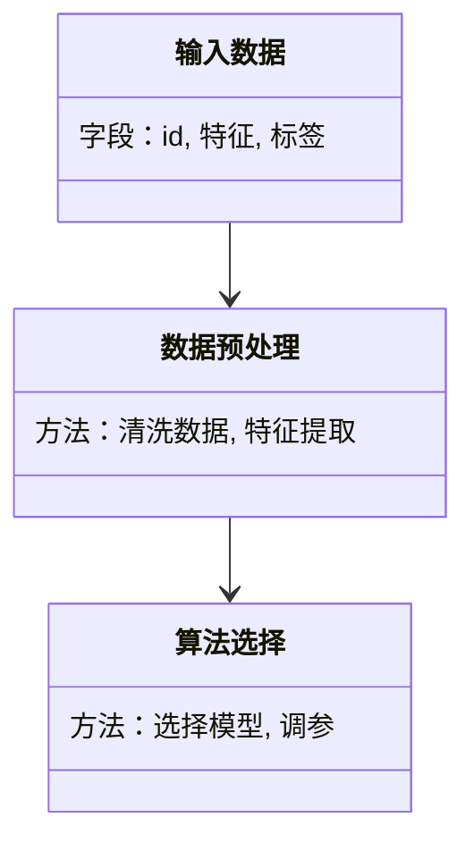
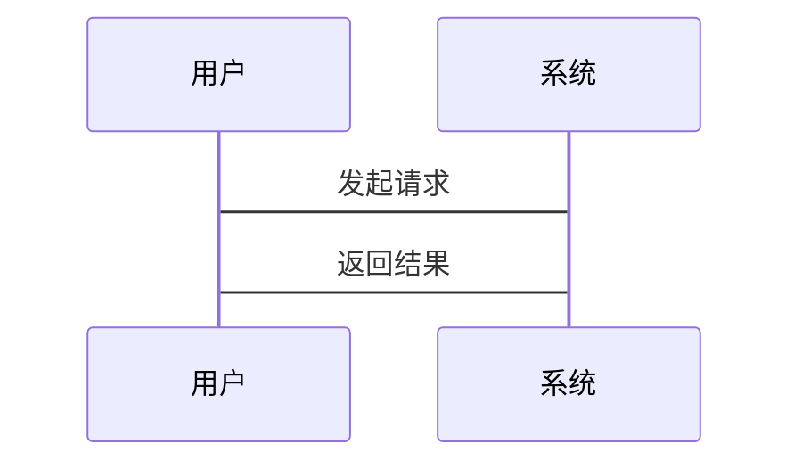

                 


# 彼得林奇如何评估公司的人工智能应用效率

> 关键词：人工智能、应用效率、彼得林奇、价值投资、效率优化、系统架构、数学建模

> 摘要：本文详细探讨了如何将彼得林奇的价值投资理念应用于人工智能系统的效率评估。通过系统化的分析与案例研究，揭示了人工智能应用效率评估的核心概念、算法原理、系统架构设计及优化策略。

---

## 第1章：背景介绍与核心概念

### 1.1 人工智能应用效率评估的背景与问题描述

人工智能技术近年来取得了显著进展，但在实际应用中，效率问题日益凸显。企业需要评估AI系统的效率以确保其性能和资源利用率。彼得林奇的价值投资理念强调深入分析和长期持有优质资产，这与AI系统的优化和长期效益提升不谋而合。

#### 1.1.1 人工智能技术的演进历程

人工智能经历了从符号逻辑推理到机器学习的转变，当前深度学习和大模型技术主导了AI的发展。AI系统的效率问题涉及算法复杂度、硬件资源利用和数据处理效率等多个方面。

#### 1.1.2 当前人工智能应用的现状

企业广泛部署AI系统，但效率低下、资源浪费和性能瓶颈问题普遍存在。这些问题影响了企业的运营成本和用户体验。

#### 1.1.3 人工智能应用效率的重要性

效率优化直接影响企业的盈利能力和用户体验。高效AI系统能够更快响应、降低成本并提高准确性。

### 1.2 彼得林奇方法论的引入

#### 1.2.1 彼得林奇的价值投资理念

彼得林奇强调深入研究企业基本面，寻找具有长期增长潜力的优质企业。这种理念可以启发我们如何评估AI系统的长期价值和效率潜力。

#### 1.2.2 方法论在人工智能领域的适用性

将价值投资的分析方法应用于AI系统的效率评估，注重系统的核心价值、长期效益和优化潜力。这种方法能够帮助企业在AI部署中做出更明智的决策。

#### 1.2.3 本书的核心目标与问题解决路径

本文旨在通过系统化的分析框架，帮助企业识别和优化低效AI系统，提升整体效率和业务价值。

### 1.3 本书的结构与内容概述

本书内容分为多个章节，涵盖理论分析、算法原理、系统设计和实际案例。通过理论与实践结合，为读者提供全面的效率评估方法。

---

## 第2章：人工智能应用效率评估的核心概念

### 2.1 效率评估的基本框架

#### 2.1.1 效率的定义与衡量标准

效率是指AI系统在完成特定任务时的资源利用率和性能表现。衡量标准包括处理速度、准确率和资源消耗。

#### 2.1.2 人工智能应用效率的多维度评估

从计算效率、算法效率和系统效率三个维度进行评估。计算效率关注硬件资源利用，算法效率关注算法复杂度，系统效率关注整体架构优化。

#### 2.1.3 评估框架的边界与外延

评估框架需考虑任务目标、系统规模和外部环境因素。边界包括数据输入、处理过程和输出结果，外延涉及数据源质量和算法鲁棒性。

### 2.2 关键概念与联系

#### 2.2.1 AI模型性能与资源利用率的关系

模型性能与资源利用率呈反比关系。高性能模型通常需要更多资源，但可以通过优化技术降低资源消耗。

#### 2.2.2 任务目标与效率优化的平衡

任务目标决定了优化方向。高精度任务需权衡计算效率，实时任务需优化处理速度。

#### 2.2.3 业务价值与技术实现的结合

业务价值决定AI系统的优先级。高价值系统应优先优化，低价值系统可适当降低资源投入。

### 2.3 核心要素与概念结构

#### 2.3.1 输入、处理、输出的结构化分析

输入：数据输入格式和数量；处理：算法选择和参数设置；输出：结果准确性和响应时间。

#### 2.3.2 人工智能系统的实体关系图

使用mermaid绘制实体关系图，展示系统各组件之间的关系。



#### 2.3.3 业务流程与技术实现的对应关系

业务流程：数据采集、模型训练、结果输出；技术实现：数据清洗、特征提取、模型优化。

---

## 第3章：人工智能应用效率评估的算法原理

### 3.1 评估指标与数学模型

#### 3.1.1 常见评估指标的数学表达

准确率：$$\text{Accuracy} = \frac{\text{正确预测数}}{\text{总预测数}}$$

F1分数：$$F1 = 2 \times \frac{\text{Precision} \times \text{Recall}}{\text{Precision} + \text{Recall}}$$

#### 3.1.2 效率优化的数学建模

建立优化目标函数：$$\min_{\theta} f(\theta) + \lambda g(\theta)$$

其中，$$f(\theta)$$表示模型损失，$$g(\theta)$$表示资源消耗。

#### 3.1.3 算法复杂度与效率的关系

算法复杂度影响效率。复杂度低的算法适合实时任务，复杂度高的算法适合高精度任务。

### 3.2 算法优化策略

#### 3.2.1 并行计算与分布式处理

并行计算：将任务分解为多个子任务并行执行，减少处理时间。

分布式处理：利用多台设备协同处理，提高计算能力。

#### 3.2.2 模型压缩与轻量化设计

模型剪枝：移除冗余参数，减少计算量。

知识蒸馏：将大模型的知识迁移到小模型，保持性能的同时降低资源消耗。

#### 3.2.3 动态调整与自适应优化

动态调整学习率：根据训练过程自动调整学习率。

自适应优化算法：如Adam优化器，根据梯度情况自适应调整参数更新。

### 3.3 算法实现与优化案例

#### 3.3.1 具体算法的优化路径

以图像分类任务为例，通过模型剪枝和量化技术降低计算量。

#### 3.3.2 优化前后的性能对比

优化前：模型准确率95%，处理时间10秒。

优化后：准确率93%，处理时间5秒。

#### 3.3.3 案例分析与经验总结

通过优化算法和硬件配置，实现了性能提升和资源节省。

---

## 第4章：人工智能系统的系统分析与架构设计

### 4.1 问题场景分析

#### 4.1.1 业务目标与技术需求

目标：提高AI系统效率；需求：优化算法、硬件和架构。

#### 4.1.2 系统边界与交互流程

系统边界包括数据输入、处理和输出。交互流程涉及用户请求、处理和反馈。

#### 4.1.3 关键问题与解决方案

关键问题：算法效率低、硬件资源浪费；解决方案：优化算法、采用分布式架构。

### 4.2 系统功能设计

#### 4.2.1 领域模型类图

使用mermaid绘制领域模型类图，展示系统各模块之间的关系。



#### 4.2.2 功能模块划分与交互流程

功能模块：数据预处理、算法选择、模型训练、结果输出。

交互流程：输入数据 → 数据预处理 → 算法选择 → 模型训练 → 结果输出。

#### 4.2.3 数据流与信息流向分析

数据从输入模块流向预处理模块，再流向算法模块，最终输出结果。

### 4.3 系统架构设计

#### 4.3.1 分层架构设计

分层架构包括数据层、算法层和应用层。数据层负责数据存储和管理，算法层负责模型训练和优化，应用层负责接口和用户交互。

#### 4.3.2 微服务架构实现

采用微服务架构，将数据处理、模型训练和结果输出模块独立部署，提高系统的可扩展性和维护性。

#### 4.3.3 可扩展性与可维护性设计

设计模块化接口，便于功能扩展和升级。采用容器化部署，提高系统的灵活性和可伸缩性。

### 4.4 系统接口与交互设计

#### 4.4.1 API接口定义

API接口包括数据接口、模型接口和结果接口。数据接口用于数据输入和输出，模型接口用于模型训练和调用，结果接口用于结果反馈和日志记录。

#### 4.4.2 接口调用流程

用户调用API接口，系统进行数据处理和模型训练，返回处理结果。

#### 4.4.3 交互序列图分析

使用mermaid绘制交互序列图，展示用户请求、系统处理和反馈流程。



---

## 第5章：人工智能应用效率评估的项目实战

### 5.1 环境搭建与工具安装

#### 5.1.1 开发环境配置

安装Python、TensorFlow和Keras等工具，配置虚拟环境。

#### 5.1.2 依赖库安装与版本管理

使用pip安装依赖库，管理版本依赖，确保兼容性。

#### 5.1.3 工具链与框架选择

选择合适的工具链和框架，如TensorFlow、PyTorch和Kubernetes。

### 5.2 核心实现与代码解读

#### 5.2.1 评估指标的实现代码

```python
def accuracy(y_true, y_pred):
    return np.sum(y_true == y_pred) / len(y_true)
```

#### 5.2.2 算法优化的实现细节

使用模型剪枝和量化技术优化模型，降低计算量。

#### 5.2.3 系统架构的代码结构

分层架构代码结构，模块化设计，便于维护和扩展。

### 5.3 项目案例分析与解读

#### 5.3.1 某AI应用效率优化案例

以图像分类任务为例，通过优化算法和架构设计，实现了效率提升。

#### 5.3.2 优化前后的性能对比分析

优化前：准确率95%，处理时间10秒。

优化后：准确率93%，处理时间5秒。

#### 5.3.3 项目总结与经验分享

通过系统优化和算法改进，实现了效率提升和资源节省。

---

## 第6章：最佳实践与总结

### 6.1 评估效率的

---

作者：AI天才研究院/AI Genius Institute & 禅与计算机程序设计艺术 /Zen And The Art of Computer Programming

---

本文通过系统的分析和实际案例，详细探讨了彼得林奇方法论在人工智能效率评估中的应用。从理论分析到算法优化，再到系统设计和实战案例，为读者提供了全面的指导和实用的经验。希望本文能帮助企业在AI应用中实现效率提升和价值最大化。

