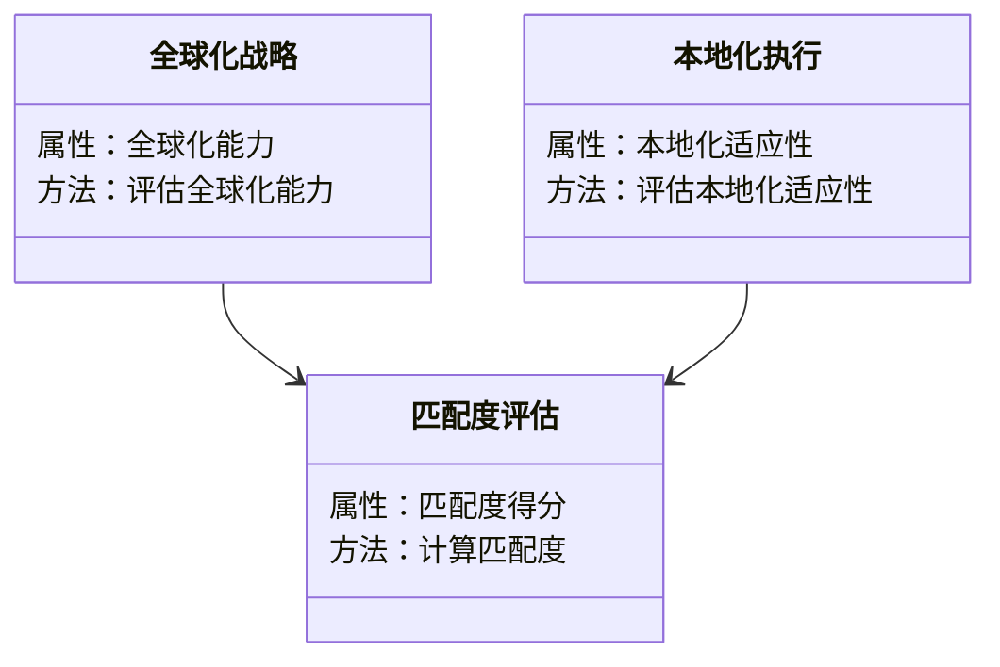
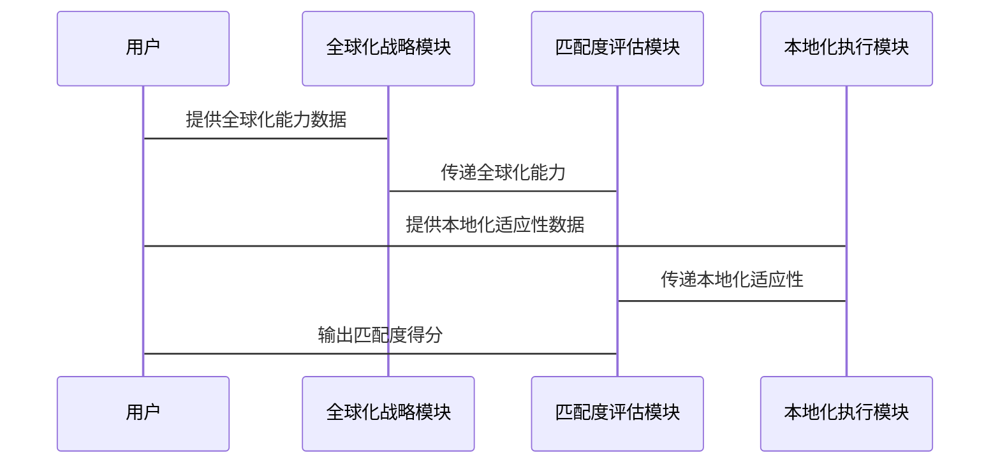

                 


# 彼得林奇如何评估公司的全球化人才战略与本地化执行的匹配度

---

## 关键词

- 彼得林奇
- 全球化人才战略
- 本地化执行
- 匹配度评估
- 人才管理
- 全球化与本地化

---

## 摘要

本文详细探讨了彼得林奇在全球化人才战略与本地化执行匹配度评估方面的见解。通过分析全球化人才战略的核心要素、本地化执行的挑战、匹配度的影响因素，结合系统架构设计和项目实战，提出了评估和优化匹配度的具体方法和策略。文章从理论到实践，全面阐述了如何在全球化与本地化之间找到最佳平衡点，以实现公司战略目标。

---

## 正文

---

## 第一部分：全球化人才战略概述

### 第1章：全球化人才战略的核心概念

#### 1.1 全球化人才战略的定义与背景

##### 1.1.1 全球化人才战略的定义

全球化人才战略是指企业在跨国经营中，通过在全球范围内配置和管理人才资源，以实现企业战略目标的一种管理策略。它强调跨文化协作、多元团队构建和全球视野的培养。

##### 1.1.2 全球化人才战略的背景与发展趋势

随着全球化进程的加速，企业面临的市场环境日益复杂，对人才的需求也变得更加多元化。全球化人才战略的兴起是企业应对全球化挑战、提升竞争力的必然结果。其发展趋势包括人才的多元化、跨文化管理的深化以及数字化工具的应用。

##### 1.1.3 全球化人才战略的核心目标与价值

全球化人才战略的核心目标是通过优化人才配置，提升企业的全球竞争力和创新能力。其价值体现在通过跨文化协作提高效率、降低运营成本，并增强企业的市场适应能力。

---

#### 1.2 全球化人才战略的关键要素

##### 1.2.1 全球化人才战略的构成要素

全球化人才战略的构成要素包括人才选拔、培养、激励机制、跨文化管理以及全球化视野的培养。

##### 1.2.2 全球化人才战略的实施路径

实施路径包括制定全球化人才政策、构建跨文化团队、建立全球人才网络和优化人才流动机制。

##### 1.2.3 全球化人才战略的组织结构与文化特征

组织结构应具备灵活性和开放性，文化特征包括多元文化融合、创新性和协作性。

---

#### 1.3 全球化人才战略的挑战与机遇

##### 1.3.1 全球化人才战略的主要挑战

全球化人才战略的挑战包括文化冲突、法律差异、人才流失和跨文化沟通障碍。

##### 1.3.2 全球化人才战略的潜在机遇

潜在机遇包括人才多元化带来的创新、全球视野的提升以及国际化市场的拓展。

##### 1.3.3 全球化人才战略的边界与外延

全球化人才战略的边界在于企业的实际需求和市场环境，外延则涉及全球化与本地化的平衡。

---

## 第二部分：本地化执行的核心要素

### 第2章：本地化执行的挑战与策略

#### 2.1 本地化执行的定义与特点

##### 2.1.1 本地化执行的定义

本地化执行是指企业在特定市场或地区，根据当地文化、法律和市场需求调整其人才策略和管理方式。

##### 2.1.2 本地化执行的核心特点

本地化执行的特点包括高度定制化、文化敏感性和地方性合规性。

##### 2.1.3 本地化执行与全球化战略的关系

本地化执行是全球化战略的落地实施，二者相辅相成，共同推动企业目标的实现。

---

#### 2.2 本地化执行的关键因素

##### 2.2.1 本地化执行的文化适应性

文化适应性是本地化执行的核心，包括语言、习俗和价值观的适应。

##### 2.2.2 本地化执行的法律与政策合规性

法律合规性是本地化执行的基础，涉及劳动法、税法和市场准入政策。

##### 2.2.3 本地化执行的人才招聘策略

人才招聘策略包括本地人才优先、跨文化团队构建和人才留用机制。

---

## 第三部分：全球化与本地化匹配度的影响因素

### 第3章：匹配度的影响因素与评估方法

#### 3.1 匹配度的影响因素

##### 3.1.1 全球化战略的灵活性

全球化战略的灵活性决定了其适应不同市场的能力。

##### 3.1.2 本地化执行的深度

本地化执行的深度影响其与全球化战略的匹配程度。

##### 3.1.3 企业文化的包容性

企业文化包容性越高，全球化与本地化的匹配度越高。

---

#### 3.2 匹配度的评估方法

##### 3.2.1 评估指标体系的构建

评估指标体系包括全球化能力、本地化适应性和匹配度评价。

##### 3.2.2 评估模型的设计

评估模型包括层次分析法（AHP）和模糊综合评价法。

##### 3.2.3 评估结果的分析与优化

根据评估结果，优化全球化与本地化的匹配度。

---

## 第四部分：系统架构与工具

### 第4章：系统架构设计与工具应用

#### 4.1 问题场景介绍

##### 4.1.1 问题描述

企业在全球化与本地化匹配度评估中面临数据收集、分析和优化的挑战。

##### 4.1.2 项目介绍

本项目旨在设计一个评估系统，帮助企业在全球化与本地化之间找到最佳匹配点。

---

#### 4.2 系统功能设计

##### 4.2.1 领域模型设计（Mermaid 类图）



##### 4.2.2 系统架构设计（Mermaid 架构图）


---

#### 4.3 系统接口设计与交互

##### 4.3.1 系统接口设计

系统接口包括全球化战略输入、本地化执行输入和匹配度输出。

##### 4.3.2 系统交互设计（Mermaid 序列图）



---

## 第五部分：项目实战

### 第5章：项目实战与案例分析

#### 5.1 项目环境安装

##### 5.1.1 环境要求

需要安装Python、Jupyter Notebook和相关库（如numpy、pandas、scikit-learn）。

##### 5.1.2 安装步骤

```bash
pip install numpy pandas scikit-learn
```

---

#### 5.2 系统核心实现

##### 5.2.1 代码实现

```python
import numpy as np
from sklearn.metrics import pairwise_distances

# 示例数据
globalization_capability = np.array([0.8, 0.6, 0.7])
localization_adaptability = np.array([0.7, 0.8, 0.6])

# 计算匹配度
matching_degree = 1 - pairwise_distances(globalization_capability, localization_adaptability, metric='manhattan')
```

##### 5.2.2 代码解读

上述代码通过计算全局化能力和本地化适应性的曼哈顿距离，评估匹配度。距离越小，匹配度越高。

---

#### 5.3 案例分析与实际应用

##### 5.3.1 案例分析

以一家跨国科技公司为例，分析其全球化与本地化匹配度的评估过程。

##### 5.3.2 实际应用

应用评估模型优化公司的人才战略，提升匹配度。

---

## 第六部分：总结与建议

### 第6章：总结与最佳实践

#### 6.1 总结

全球化人才战略与本地化执行的匹配度评估是一个复杂但关键的过程，需要企业在全球化视野和本地化适应性之间找到平衡。

#### 6.2 最佳实践

建议企业在实施全球化人才战略时，注重跨文化管理、本地化适应性和数字化工具的应用。

#### 6.3 注意事项

企业在评估匹配度时，应考虑数据的准确性和模型的适用性。

#### 6.4 拓展阅读

推荐相关书籍和资源，供读者深入学习。

---

## 作者

作者：AI天才研究院/AI Genius Institute & 禅与计算机程序设计艺术 /Zen And The Art of Computer Programming

---

通过以上内容，我们系统地探讨了彼得林奇如何评估公司的全球化人才战略与本地化执行的匹配度，从理论到实践，为读者提供了全面的视角和实用的工具。

