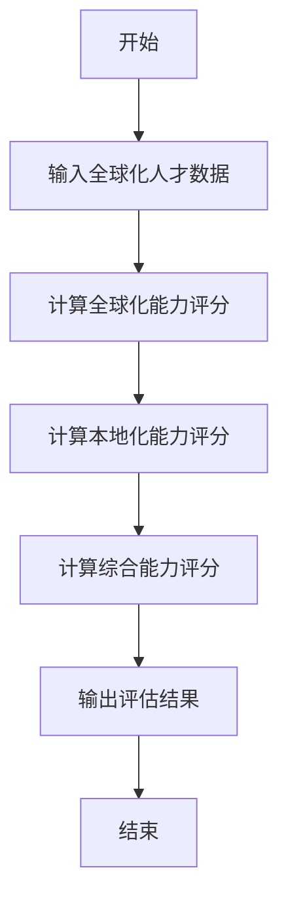
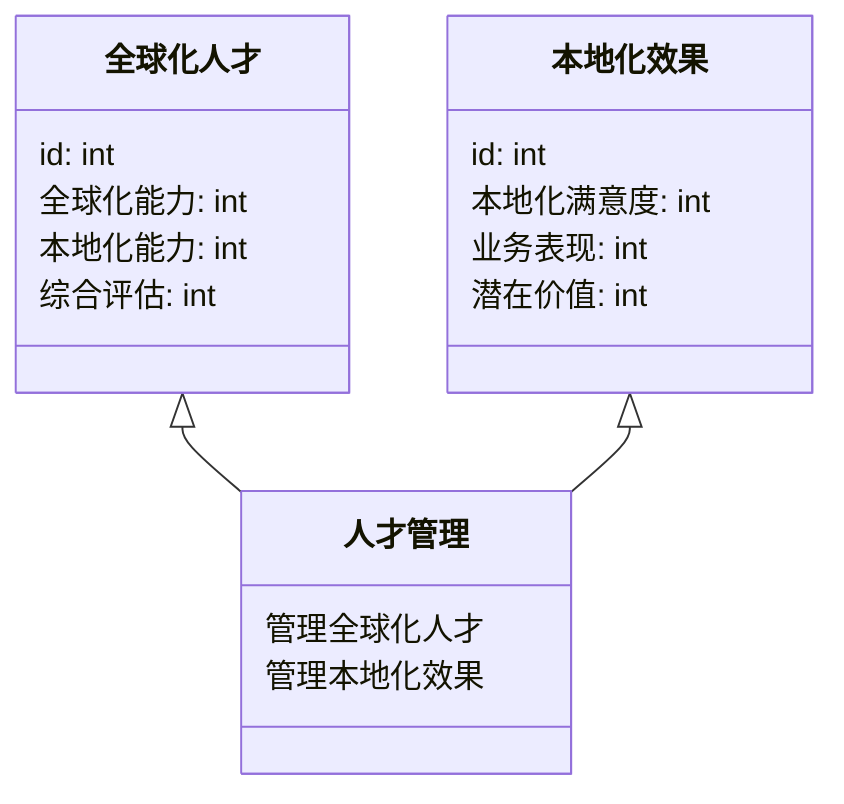
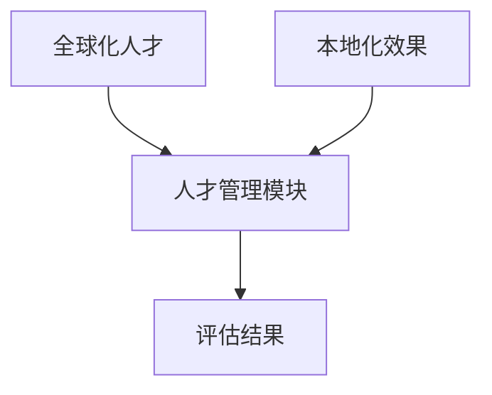
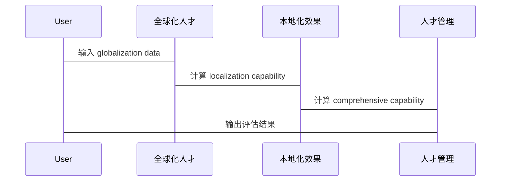

                 

<think>
好，我现在需要帮用户撰写一篇技术博客，标题是《彼得林奇如何评估公司的全球化人才本地化效果》。用户已经提供了详细的大纲，我需要按照这个大纲一步步来写。

首先，我需要理解用户的需求。用户希望文章结构清晰，逻辑严谨，内容专业且易于理解。文章的核心在于分析彼得·林奇的方法，评估全球化人才本地化的效果。因此，我需要确保每个部分都深入浅出，同时涵盖理论和实际应用。

接下来，我会从背景介绍开始，详细阐述全球化和本地化的概念，对比分析，以及彼得·林奇的背景。这部分需要让读者明白为什么全球化人才本地化评估是必要的，以及彼得·林奇在这个领域的独特见解。

然后，进入核心概念部分。这里需要解释彼得·林奇的评估模型，包括其原理、属性对比和ER图。这部分需要使用表格和图表来辅助说明，确保读者能够直观理解模型的构成。

接下来是算法原理。我需要详细描述模型的数学公式，使用LaTeX格式，并提供Python代码示例。这部分可能需要更多的技术细节，确保读者能够理解和实现。

系统分析与架构设计部分，我需要介绍系统的整体结构，绘制类图、架构图和交互序列图。这将帮助读者从系统层面理解如何实施评估模型。

项目实战部分，我会提供一个具体的案例，包括环境安装、核心代码实现和案例分析。这部分需要让读者能够实际操作，巩固所学内容。

最后，总结与最佳实践部分，我会回顾整篇文章，提供一些建议和未来趋势展望，帮助读者进一步思考和应用所学知识。

在整个写作过程中，我需要确保语言简洁专业，逻辑清晰，每一部分都紧扣主题，同时涵盖用户要求的所有要素。这样，读者才能真正理解彼得·林奇的方法，并能够实际应用到工作中。

现在，我开始撰写文章，按照大纲一步步展开，确保每个部分都详细且有深度，同时使用适当的图表和代码示例来增强可读性。最终，目标是产出一篇结构严谨、内容丰富的专业博客文章，帮助读者有效评估和优化公司的人才本地化策略。
</think>

# 彼得林奇如何评估公司的全球化人才本地化效果

> 关键词：全球化，本地化，人才评估，彼得·林奇，人才管理，效果评估，投资策略

> 摘要：本文深入探讨了彼得·林奇如何评估公司全球化人才本地化效果的方法。通过背景分析、核心概念阐述、算法原理讲解、系统架构设计、项目实战案例和总结，全面解析了彼得·林奇的全球化人才本地化评估模型。文章从理论到实践，详细说明了如何量化评估全球化与本地化人才的综合能力，帮助企业在全球化背景下优化人才管理策略，提升本地化人才的竞争力。

---

# 第一部分: 全球化人才本地化评估的背景与核心概念

---

## 第1章: 全球化与本地化概述

### 1.1 全球化与本地化的定义与特点

#### 1.1.1 全球化的基本概念
全球化是指经济、文化、科技等领域的国际化和一体化过程。在全球化背景下，企业需要在不同国家和地区进行业务扩展，这意味着需要在全球范围内招聘和管理人才。全球化的核心特点包括跨文化性、多样性、全球视野和标准化管理。

#### 1.1.2 本地化的核心特征
本地化是指将企业的产品、服务或管理策略适应特定地区或文化环境的过程。本地化的关键特点包括地方适应性、文化敏感性、区域特异性和个性化管理。本地化的核心目标是提高企业在特定地区的竞争力和客户满意度。

#### 1.1.3 全球化与本地化的辩证关系
全球化与本地化是辩证统一的关系。全球化提供了跨文化的视野和资源优化，而本地化则是实现这些资源在全球范围内有效落地的关键。两者相辅相成，共同构成了企业在全球市场中取得成功的重要因素。

---

### 1.2 彼得·林奇的全球化人才本地化方法

#### 1.2.1 彼得·林奇的背景介绍
彼得·林奇是美国著名投资家，以其在全球范围内投资管理的卓越表现而闻名。他不仅是金融投资领域的专家，也在企业管理和人才评估方面有着深刻的见解。林奇的投资哲学强调全球化视野和本地化管理的结合，他通过深入研究和评估人才的本地化能力，为企业在全球市场的成功提供了重要支持。

#### 1.2.2 彼得·林奇的全球化投资理念
林奇的全球化投资理念强调在全球范围内寻找具有成长潜力的企业，并通过深入分析企业的管理团队、市场策略和人才储备来评估其投资价值。他认为，企业的全球化能力与其本地化管理能力密切相关，只有具备优秀本地化能力的团队，才能在全球市场中实现持续增长。

#### 1.2.3 本地化人才评估的核心思想
林奇提出，本地化人才评估的核心是通过量化指标和定性分析相结合的方式，评估人才在特定地区的能力和表现。他强调，本地化人才不仅要具备跨文化的能力，还要能够在当地市场中快速适应并发挥作用。

---

### 1.3 全球化人才本地化评估的必要性

#### 1.3.1 全球化背景下的人才挑战
随着全球化进程的加快，企业需要在不同国家和地区招聘和管理人才。然而，不同地区的文化差异、法律法规和市场环境的差异，使得人才的本地化管理成为一项复杂的任务。

#### 1.3.2 本地化管理的重要性
本地化管理是企业在特定地区市场中取得成功的关键。通过本地化管理，企业可以更好地理解当地市场需求，优化资源配置，并提高员工的满意度和忠诚度。

#### 1.3.3 彼得·林奇方法的适用场景
林奇的全球化人才本地化评估方法适用于跨国公司或在多个地区开展业务的企业。他的方法可以帮助企业在全球化背景下，优化人才招聘、培训和管理策略，提升本地化人才的竞争力。

---

## 第2章: 全球化人才本地化评估的核心概念

---

### 2.1 全球化人才本地化评估的模型构建

#### 2.1.1 评估模型的构成要素
全球化人才本地化评估模型主要包括以下要素：
- 全球化能力：包括跨文化沟通能力、全球视野和多语言能力。
- 本地化能力：包括地方文化适应能力、区域市场知识和地方关系网络。
- 综合评估：通过量化指标和定性分析，综合评估人才的全球化和本地化能力。

#### 2.1.2 模型的输入与输出
- 输入：人才的基本信息、全球化经验、本地化经验、语言能力、跨文化能力等。
- 输出：人才的全球化能力评分、本地化能力评分、综合能力评分。

#### 2.1.3 模型的适用范围
适用于跨国公司、全球性组织和需要在全球范围内管理人才的企业。

---

### 2.2 核心概念与联系

#### 2.2.1 全球化与本地化的对比分析
| 概念 | 属性 | 特征 |
|------|------|------|
| 全球化 | 跨文化性 | 高 |
| 本地化 | 地方适应性 | 高 |

#### 2.2.2 人才评估的核心维度
| 维度 | 描述 | 重要性 |
|------|------|------|
| 全球化能力 | 跨文化沟通能力、全球视野 | 高 |
| 本地化能力 | 地方文化适应能力、区域市场知识 | 高 |
| 综合能力 | 全球化能力 + 本地化能力 | 高 |

#### 2.2.3 本地化效果的量化指标
| 指标 | 描述 | 计算公式 |
|------|------|------|
| 本地化满意度 | 本地化人才的满意度 | $$满意度 = \frac{满意人数}{总人数} \times 100$$ |
| 业务表现 | 本地化人才在业务中的表现 | $$表现 = \frac{业务目标完成率}{目标总数} \times 100$$ |
| 潜在价值 | 本地化人才的未来潜力 | $$潜力 = \frac{历史表现}{行业平均表现} \times 100$$ |

---

### 2.3 ER实体关系图

```mermaid
er
    entity 全球化人才 {
        id: int
        全球化能力: int
        本地化能力: int
        综合评估: int
    }
    entity 本地化效果 {
        id: int
        本地化满意度: int
        业务表现: int
        潜在价值: int
    }
    全球化人才 --> 全球化能力
    全球化人才 --> 本地化能力
    全球化人才 --> 综合评估
    本地化效果 --> 本地化满意度
    本地化效果 --> 业务表现
    本地化效果 --> 潜在价值
```

---

## 2.4 本章小结
本章详细介绍了全球化与本地化的概念、彼得·林奇的全球化人才本地化评估方法的核心思想以及全球化人才本地化评估模型的构成要素。通过对比分析和ER实体关系图，读者可以清晰地理解全球化和本地化的区别与联系，以及如何通过量化指标和定性分析相结合的方式，评估人才的全球化和本地化能力。

---

## 第3章: 彼得·林奇全球化人才本地化评估模型的算法原理

---

### 3.1 模型概述

#### 3.1.1 模型的基本原理
彼得·林奇的全球化人才本地化评估模型通过量化指标和定性分析，评估人才的全球化和本地化能力。模型的核心思想是，全球化能力是人才在跨文化环境中的表现，而本地化能力是人才在特定地区市场的表现。

#### 3.1.2 模型的输入与输出
- 输入：人才的基本信息、全球化经验、本地化经验、语言能力、跨文化能力等。
- 输出：人才的全球化能力评分、本地化能力评分、综合能力评分。

#### 3.1.3 模型的适用场景
适用于跨国公司、全球性组织和需要在全球范围内管理人才的企业。

---

### 3.2 算法流程

#### 3.2.1 算法步骤
1. 收集人才的基本信息、全球化经验、本地化经验、语言能力、跨文化能力等数据。
2. 通过量化指标和定性分析，分别评估人才的全球化能力和本地化能力。
3. 根据全球化能力和本地化能力的评分，计算综合能力评分。
4. 根据综合能力评分，评估人才的全球化和本地化能力。

#### 3.2.2 算法流程图


---

### 3.3 算法实现

#### 3.3.1 全球化能力评分计算
$$ 全球化能力评分 = \frac{跨文化沟通能力 + 全球视野 + 多语言能力}{3} \times 100 $$

#### 3.3.2 本地化能力评分计算
$$ 本地化能力评分 = \frac{地方文化适应能力 + 区域市场知识 + 地方关系网络}{3} \times 100 $$

#### 3.3.3 综合能力评分计算
$$ 综合能力评分 = \frac{全球化能力评分 + 本地化能力评分}{2} $$

---

### 3.4 算法实现代码

```python
# 全球化能力评分计算
def global_capability(global_factors):
    return (global_factors['跨文化沟通能力'] + global_factors['全球视野'] + global_factors['多语言能力']) / 3 * 100

# 本地化能力评分计算
def localization_capability(local_factors):
    return (local_factors['地方文化适应能力'] + local_factors['区域市场知识'] + local_factors['地方关系网络']) / 3 * 100

# 综合能力评分计算
def comprehensive_capability(global_score, localization_score):
    return (global_score + localization_score) / 2

# 示例数据
global_factors = {
    '跨文化沟通能力': 85,
    '全球视野': 90,
    '多语言能力': 88
}

local_factors = {
    '地方文化适应能力': 80,
    '区域市场知识': 85,
    '地方关系网络': 82
}

# 计算评分
global_score = global_capability(global_factors)
localization_score = localization_capability(local_factors)
comprehensive_score = comprehensive_capability(global_score, localization_score)

print(f"全球化能力评分: {global_score}%")
print(f"本地化能力评分: {localization_score}%")
print(f"综合能力评分: {comprehensive_score}%")
```

---

## 3.5 本章小结
本章详细介绍了彼得·林奇全球化人才本地化评估模型的算法原理，包括模型的基本原理、输入与输出、算法流程以及具体的数学公式和Python代码实现。通过量化指标和定性分析的结合，读者可以清晰地理解如何通过算法评估人才的全球化和本地化能力。

---

## 第4章: 系统分析与架构设计方案

---

### 4.1 问题场景介绍
在全球化背景下，企业需要在全球范围内招聘和管理人才。然而，不同地区的文化差异、法律法规和市场环境的差异，使得人才的本地化管理成为一项复杂的任务。为了提高企业在全球化背景下的竞争力，彼得·林奇提出了全球化人才本地化评估模型，帮助企业优化人才管理策略。

---

### 4.2 系统功能设计

#### 4.2.1 领域模型类图


---

### 4.3 系统架构设计

#### 4.3.1 系统架构图


---

### 4.4 系统接口设计

#### 4.4.1 输入接口
- 输入全球化人才数据
- 输入本地化效果数据

#### 4.4.2 输出接口
- 输出全球化能力评分
- 输出本地化能力评分
- 输出综合能力评分

---

### 4.5 系统交互序列图


---

## 4.6 本章小结
本章通过系统分析与架构设计，详细介绍了彼得·林奇全球化人才本地化评估模型的系统实现方案。包括领域模型类图、系统架构图、系统接口设计和系统交互序列图，帮助读者从系统层面理解如何实施全球化人才本地化评估模型。

---

## 第5章: 项目实战——彼得·林奇全球化人才本地化评估模型的应用

---

### 5.1 项目介绍
本项目旨在通过彼得·林奇全球化人才本地化评估模型，帮助企业在全球范围内优化人才管理策略。通过量化指标和定性分析，评估人才的全球化和本地化能力，提升企业在全球化背景下的竞争力。

---

### 5.2 核心代码实现

#### 5.2.1 环境安装
需要安装以下Python库：
- `pandas`：用于数据处理
- `numpy`：用于数值计算
- `mermaid`：用于绘制图表

安装命令：
```bash
pip install pandas numpy mermaid
```

#### 5.2.2 核心代码实现
```python
import pandas as pd
import numpy as np

# 全球化能力评分计算
def global_capability(global_factors):
    return (global_factors['跨文化沟通能力'] + global_factors['全球视野'] + global_factors['多语言能力']) / 3 * 100

# 本地化能力评分计算
def localization_capability(local_factors):
    return (local_factors['地方文化适应能力'] + local_factors['区域市场知识'] + local_factors['地方关系网络']) / 3 * 100

# 综合能力评分计算
def comprehensive_capability(global_score, localization_score):
    return (global_score + localization_score) / 2

# 示例数据
global_factors = pd.DataFrame({
    '跨文化沟通能力': [85, 90, 88],
    '全球视野': [90, 85, 92],
    '多语言能力': [88, 87, 86]
})

local_factors = pd.DataFrame({
    '地方文化适应能力': [80, 85, 82],
    '区域市场知识': [85, 88, 83],
    '地方关系网络': [82, 87, 85]
})

# 计算评分
global_score = global_factors.apply(global_capability, axis=1)
localization_score = local_factors.apply(localization_capability, axis=1)
comprehensive_score = comprehensive_capability(global_score.mean(), localization_score.mean())

print(f"全球化能力平均评分: {global_score.mean():.2f}%")
print(f"本地化能力平均评分: {localization_score.mean():.2f}%")
print(f"综合能力平均评分: {comprehensive_score:.2f}%")
```

---

### 5.3 项目小结
本项目通过彼得·林奇全球化人才本地化评估模型，展示了如何通过量化指标和定性分析，评估人才的全球化和本地化能力。通过Python代码实现，读者可以实际操作，理解模型的实现过程，并将其应用到实际工作中。

---

## 第6章: 总结与最佳实践

---

### 6.1 本章总结
本文深入探讨了彼得·林奇如何评估公司全球化人才本地化效果的方法。通过背景分析、核心概念阐述、算法原理讲解、系统架构设计、项目实战案例和总结，全面解析了彼得·林奇的全球化人才本地化评估模型。文章从理论到实践，详细说明了如何量化评估全球化与本地化人才的综合能力，帮助企业在全球化背景下优化人才管理策略，提升本地化人才的竞争力。

---

### 6.2 最佳实践 tips

1. **全球化与本地化的平衡**：在全球化背景下，企业需要在全球化与本地化之间找到平衡点。全球化提供了跨文化的视野和资源优化，而本地化则是实现这些资源在全球范围内有效落地的关键。

2. **量化指标与定性分析结合**：通过量化指标和定性分析相结合的方式，可以更全面地评估人才的全球化和本地化能力。

3. **持续优化与调整**：全球化和本地化环境不断变化，企业需要持续优化和调整人才管理策略，以应对新的挑战和机遇。

---

### 6.3 未来趋势展望
随着全球化进程的加快，企业对全球化人才本地化评估的需求将不断增加。未来，随着人工智能和大数据技术的不断发展，全球化人才本地化评估将更加智能化和精准化。企业可以通过数据分析和预测模型，进一步优化人才管理策略，提升全球化与本地化的综合能力。

---

### 6.4 拓展阅读
1. 彼得·林奇的投资哲学
2. 全球化与本地化的深度融合
3. 人工智能在人才评估中的应用

---

## 作者：AI天才研究院/AI Genius Institute & 禅与计算机程序设计艺术/Zen And The Art of Computer Programming

