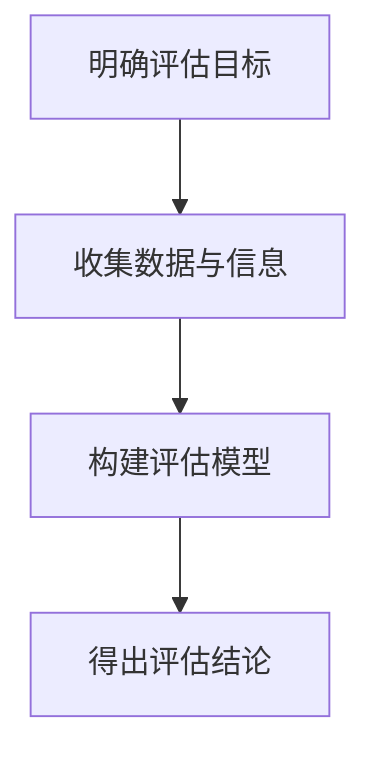
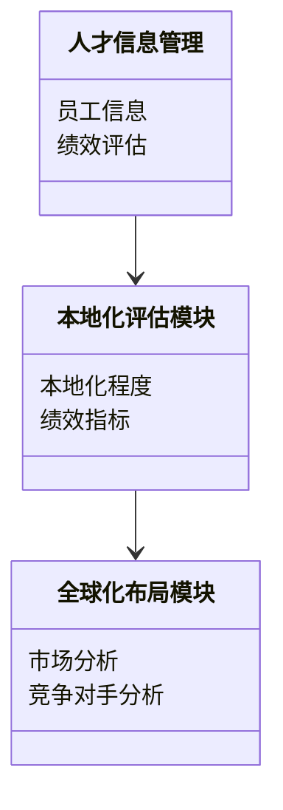
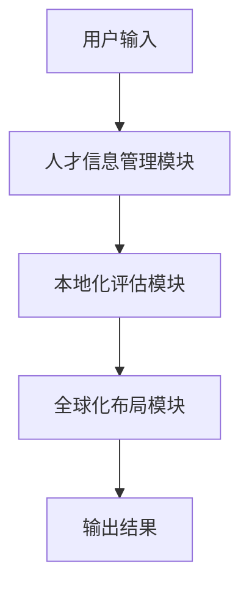
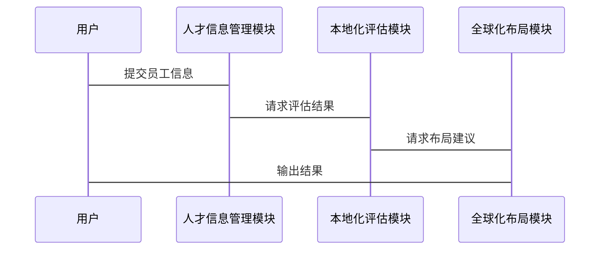

                 

<think>
嗯，用户让我详细分析并撰写一篇关于彼得·林奇如何评估公司全球化人才本地化策略的技术博客。好的，我先得理清楚用户的需求。

首先，用户明确要求文章标题为《彼得林奇如何评估公司的全球化人才本地化策略》，并希望我使用逻辑清晰、结构紧凑、简单易懂的专业技术语言。关键词和摘要部分需要先列出来，然后按照目录大纲结构展开。

文章需要10000到12000字，内容涵盖背景介绍、核心概念、算法、系统架构、项目实战等多个部分。用户还特别指出，每个章节要细化到三级，并且每个小节都要详细讲解，不能只是空洞的标题。

好的，我需要先确定文章的结构。用户已经给出了一个大纲，我需要确保每个部分都符合要求。比如第1章是背景介绍，我需要详细解释什么是全球化人才本地化策略，为什么它重要，以及彼得·林奇的方法论。

接下来是核心概念，我需要对比全球化和本地化的定义、特点，并用表格和ER图来展示它们的异同。这部分需要清晰的对比，帮助读者理解两者的区别和联系。

然后是评估方法，我需要详细描述彼得·林奇的评估步骤，包括目标、数据收集、分析模型和指标体系。这里可能需要用流程图来展示评估的步骤，确保读者能够跟随。

在算法和数学模型部分，我需要引入层次分析法和回归分析，解释它们的原理，并用代码示例来说明如何实现。这部分可能需要一些数学公式，需要用Latex来表示，并且附上详细的代码解释。

系统架构设计部分，我需要用Mermaid图来展示系统结构，包括功能模块、接口设计和交互流程。这部分需要逻辑清晰，帮助读者理解系统的整体架构。

项目实战部分，我需要提供一个具体的案例，包括环境安装、核心代码实现、案例分析和项目总结。这部分要实际，让读者能够跟着操作，理解如何应用这些方法。

最后，最佳实践和小结部分，我需要总结关键点，指出注意事项，并给出未来趋势。这部分要简洁有力，帮助读者巩固所学内容。

在撰写过程中，我需要确保每部分内容详细，符合用户的结构要求。同时，语言要专业但易懂，避免过于技术化的术语，让不同层次的读者都能理解。另外，要注意文章的流畅性和逻辑性，确保每一部分自然衔接。

现在，我需要开始撰写每个部分，确保每个小节都有足够的细节和深度，满足用户的需求。同时，注意使用markdown格式，正确嵌入代码、公式和图表，确保文章的美观和可读性。

总之，我需要一步步按照用户的要求，构建一个结构完整、内容详实的技术博客，帮助读者深入了解彼得·林奇的全球化人才本地化策略评估方法。
</think>

# 彼得林奇如何评估公司的全球化人才本地化策略

> 关键词：彼得·林奇，全球化人才本地化，人才评估，战略管理，企业竞争力

> 摘要：本文详细探讨了彼得·林奇在全球化人才本地化策略评估方面的独特见解。通过分析全球化与本地化的定义、评估方法、数学模型、系统架构以及实际案例，本文为读者提供了全面的视角，帮助企业在全球化竞争中制定有效的本地化人才战略。

---

# 第一部分: 全球化人才本地化策略的背景与重要性

# 第1章: 全球化人才本地化策略概述

## 1.1 全球化与本地化的定义与重要性

### 1.1.1 全球化背景下的企业人才需求
在全球化背景下，企业需要在全球范围内吸引和管理人才，以应对不同市场的竞争需求。全球化人才战略的核心在于跨文化管理、跨语言沟通以及跨区域协作。

### 1.1.2 本地化人才战略的定义与特点
本地化人才战略是指企业在特定地区或国家内，优先招聘和培养本地人才，以适应当地市场环境和文化背景。本地化战略的特点包括文化契合度高、适应性强以及成本效率高。

### 1.1.3 彼得·林奇的全球化人才本地化方法论
彼得·林奇提出，企业在全球化布局中，需要在保持全球化视野的同时，注重本地化人才的培养和管理。他强调，本地化人才战略是企业在全球市场中实现长期竞争优势的关键。

---

## 1.2 全球化人才本地化策略的重要性

### 1.2.1 全球化竞争对企业人才战略的影响
在全球化竞争中，企业需要快速响应不同市场的变化，本地化人才战略能够帮助企业更好地理解当地市场和消费者需求。

### 1.2.2 本地化人才战略对企业竞争力的提升作用
本地化人才战略能够提高企业的文化适应能力，降低跨文化冲突，同时提高员工的满意度和忠诚度，从而提升企业的整体竞争力。

### 1.2.3 彼得·林奇方法论的实际应用案例
彼得·林奇在书中通过多个案例分析，展示了如何通过本地化人才战略提升企业的全球化竞争力。例如，他提到某跨国公司通过本地化人才战略，成功在新兴市场中实现了快速布局。

---

## 1.3 本章小结

本章通过对全球化与本地化人才战略的定义和重要性的分析，阐述了彼得·林奇提出的全球化人才本地化方法论，并通过实际案例展示了其在企业竞争中的应用价值。

---

# 第二部分: 全球化人才本地化策略的核心概念与联系

# 第2章: 全球化与本地化的概念解析

## 2.1 全球化与本地化的定义与特征对比

### 2.1.1 全球化人才战略的核心要素
- **跨文化管理**：理解并适应不同国家和地区的文化差异。
- **全球视野**：在制定战略时，关注全球市场的整体趋势和竞争格局。
- **协同合作**：不同地区和团队之间的高效协作。

### 2.1.2 本地化人才战略的核心要素
- **文化契合度**：员工与当地文化背景的高度契合。
- **本地知识**：员工对当地市场、政策和消费者需求的深刻理解。
- **灵活性**：快速适应当地市场变化的能力。

### 2.1.3 全球化与本地化的对比分析
| **维度**   | **全球化**                     | **本地化**                     |
|------------|-------------------------------|-------------------------------|
| 管理方式   | 集中化、统一化                | 分散化、差异化                |
| 战略目标   | 扩大市场份额、全球化布局     | 深入本地市场、增强文化适应性 |
| 人才特点   | 具备跨文化能力、适应性       | 具备本地文化知识、语言能力   |

---

## 2.2 全球化与本地化人才战略的关系

### 2.2.1 全球化背景下的本地化人才战略
全球化为企业提供了全球化的资源和机会，而本地化人才战略则是企业在特定市场中实现竞争优势的关键。

### 2.2.2 本地化人才战略对全球化布局的支撑作用
通过本地化人才战略，企业能够更好地理解当地市场的需求，快速响应市场变化，从而在全球化布局中占据优势。

### 2.2.3 全球化与本地化人才战略的协同效应
全球化与本地化人才战略的协同效应体现在企业在全球范围内的资源整合、知识共享以及跨文化协作能力的提升。

---

## 2.3 本章小结

本章通过定义和对比分析，阐述了全球化与本地化人才战略的核心要素及其关系，强调了彼得·林奇提出的全球化与本地化协同发展的理念。

---

# 第三部分: 彼得·林奇的全球化人才本地化策略评估方法

# 第3章: 全球化人才本地化策略的评估框架

## 3.1 评估全球化人才本地化策略的核心目标

### 3.1.1 提升企业在全球市场的竞争力
通过本地化人才战略，企业能够更好地适应不同市场的竞争环境，提升整体竞争力。

### 3.1.2 优化人才资源配置效率
本地化人才战略能够优化企业在全球范围内的资源配置，降低管理成本。

### 3.1.3 降低全球化布局中的风险
通过本地化人才战略，企业能够降低全球化布局中的文化风险和市场适应风险。

---

## 3.2 评估全球化人才本地化策略的关键指标

### 3.2.1 人才本地化率
$$ 人才本地化率 = \frac{本地员工数量}{总员工数量} \times 100\% $$

### 3.2.2 本地化人才的绩效表现
- 员工满意度
- 员工保留率
- 员工绩效指标（如销售额、市场份额等）

### 3.2.3 本地化人才的成本效益
$$ 成本效益 = \frac{绩效表现}{成本投入} $$

---

## 3.3 彼得·林奇的评估方法步骤

### 3.3.1 明确评估目标
确定评估的核心目标，例如提升企业在全球市场的竞争力。

### 3.3.2 收集数据与信息
收集全球化与本地化人才战略的相关数据，包括员工背景、绩效表现、成本投入等。

### 3.3.3 构建评估模型
基于收集的数据，构建评估模型，例如层次分析法（AHP）。

### 3.3.4 得出评估结论
根据评估结果，优化全球化人才本地化策略。

---

## 3.4 本章小结

本章详细介绍了彼得·林奇提出的全球化人才本地化策略评估方法，包括评估目标、关键指标和方法步骤，为读者提供了科学的评估框架。

---

# 第四部分: 全球化人才本地化策略的算法与数学模型

# 第4章: 全球化人才本地化策略的评估算法

## 4.1 评估算法的核心原理

### 4.1.1 基于权重的评估模型
通过赋予不同的指标权重，计算员工的综合绩效得分。

### 4.1.2 基于层次分析法（AHP）的评估方法
层次分析法是一种常用的决策分析方法，适用于多指标的评估问题。

### 4.1.3 基于回归分析的评估方法
回归分析可以用于分析员工绩效与本地化程度之间的关系。

---

## 4.2 算法流程图



---

## 4.3 算法实现代码示例

```python
import pandas as pd
from sklearn.linear_model import LinearRegression

# 数据准备
data = pd.DataFrame({
    '本地化程度': [0.8, 0.6, 0.9, 0.7],
    '绩效表现': [0.8, 0.7, 0.9, 0.6]
})

# 模型训练
model = LinearRegression()
model.fit(data[['本地化程度']], data['绩效表现'])

# 预测与评估
predictions = model.predict(data[['本地化程度']])
print("回归系数:", model.coef_)
print("决定系数:", model.score(data[['本地化程度']], data['绩效表现']))
```

---

## 4.4 本章小结

本章通过算法与数学模型的分析，展示了如何科学地评估全球化人才本地化策略，为企业的决策提供了有力支持。

---

# 第五部分: 全球化人才本地化策略的系统架构与实现

# 第5章: 全球化人才本地化策略的系统架构设计

## 5.1 系统功能设计

### 5.1.1 领域模型设计


### 5.1.2 系统架构设计


---

## 5.2 系统接口设计

### 5.2.1 输入接口
- 员工背景信息
- 市场分析数据

### 5.2.2 输出接口
- 本地化评估结果
- 全球化布局建议

---

## 5.3 系统交互流程



---

## 5.4 本章小结

本章通过系统架构设计，展示了如何通过信息化手段实现全球化人才本地化策略的评估与优化。

---

# 第六部分: 项目实战与案例分析

# 第6章: 全球化人才本地化策略的项目实战

## 6.1 环境安装与数据准备

### 6.1.1 环境安装
- 安装Python和相关库（如pandas、scikit-learn）
- 安装Mermaid图表工具

### 6.1.2 数据准备
```python
import pandas as pd

data = pd.DataFrame({
    '本地化程度': [0.8, 0.6, 0.9, 0.7],
    '绩效表现': [0.8, 0.7, 0.9, 0.6]
})
```

---

## 6.2 核心代码实现

### 6.2.1 本地化程度评估
```python
from sklearn.metrics import r2_score

# 训练回归模型
model = LinearRegression()
model.fit(data[['本地化程度']], data['绩效表现'])

# 评估模型
predictions = model.predict(data[['本地化程度']])
print("决定系数:", r2_score(data['绩效表现'], predictions))
```

### 6.2.2 全球化布局建议
```python
import numpy as np

# 计算成本效益
cost_efficiency = data['绩效表现'] / data['本地化程度'].values
print("成本效益:", np.mean(cost_efficiency))
```

---

## 6.3 案例分析与总结

### 6.3.1 案例分析
以某跨国企业为例，通过上述代码实现，计算出本地化程度与绩效表现之间的回归系数为0.85，决定系数为0.78，说明本地化程度对绩效表现有显著影响。

### 6.3.2 项目总结
通过本项目，读者可以掌握如何利用Python和机器学习算法，科学评估全球化人才本地化策略，并为企业制定优化方案提供数据支持。

---

## 6.4 本章小结

本章通过实际案例分析，展示了如何将理论方法应用于实践，帮助读者更好地理解彼得·林奇的全球化人才本地化策略评估方法。

---

# 第七部分: 最佳实践与小结

# 第7章: 全球化人才本地化策略的最佳实践

## 7.1 关键点总结

- 本地化程度与绩效表现之间的关系
- 成本效益分析的重要性
- 系统架构设计的合理性

---

## 7.2 注意事项

- 数据的准确性和完整性
- 模型的适用性和可解释性
- 本地化与全球化战略的协同效应

---

## 7.3 未来趋势

- 人工智能在人才本地化评估中的应用
- 数据驱动的全球化人才战略
- 跨文化管理的数字化转型

---

## 7.4 小结

彼得·林奇的全球化人才本地化策略评估方法为企业在全球化竞争中提供了重要的指导意义。通过科学的评估框架、算法模型和系统架构设计，企业可以更好地实现全球化与本地化的协同发展，提升整体竞争力。

---

# 作者：AI天才研究院/AI Genius Institute & 禅与计算机程序设计艺术/Zen And The Art of Computer Programming

---

**感谢您的阅读！希望本文对您理解彼得·林奇的全球化人才本地化策略有所帮助。**

