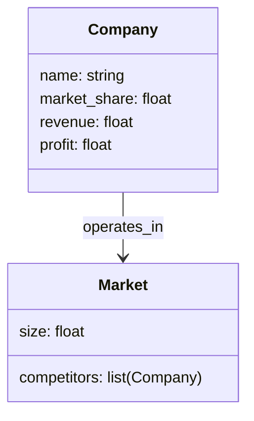

                 


# 彼得林奇如何评估公司的全球化战略执行力

> 关键词：彼得·林奇，全球化战略，战略执行力，投资分析，风险管理，竞争优势，企业战略

> 摘要：本文将详细介绍彼得·林奇在全球化战略评估中的独特见解和方法。通过分析核心指标、评估方法、数学模型和系统架构，结合实际案例，探讨如何将全球化战略转化为企业竞争优势，帮助读者理解并应用这些评估策略。

---

# 第一部分: 引言

## 第1章: 彼得·林奇与全球化战略评估概述

### 1.1 彼得·林奇的背景与投资理念

#### 1.1.1 彼得·林奇的生平简介

- 彼得·林奇（Peter Lynch）是美国著名投资经理人，被誉为“全球最佳基金经理”。
- 曾管理富达麦哲伦基金（Fidelity Magellan），投资业绩卓越。
- 他的投资理念以深入的基本分析和长期持有为核心。

#### 1.1.2 林奇的投资哲学与方法

- **价值投资**：寻找被市场低估的公司。
- **行业分析**：关注行业趋势和竞争优势。
- **风险管理**：分散投资，避免过度集中。

#### 1.1.3 全球化战略在投资中的重要性

- 全球化战略帮助企业拓展市场，降低风险。
- 通过全球化布局，企业可以在不同地区分散风险。

---

## 第2章: 本书的核心目标

### 2.1 为什么要评估全球化战略执行力

- 全球化战略是企业增长的关键驱动因素。
- 评估执行力帮助企业优化资源分配，提升效率。

### 2.2 本书的目标与读者群体

- 目标：帮助企业领导者和投资者掌握全球化战略评估方法。
- 读者群体：企业高管、投资经理、战略规划师。

### 2.3 全球化战略评估的现实意义

- 提高企业在全球市场的竞争力。
- 优化资源配置，提升投资回报。

---

# 第二部分: 全球化战略的背景与挑战

## 第3章: 全球化战略的背景分析

### 3.1 全球化战略的定义与特征

#### 3.1.1 全球化战略的定义

- 通过在全球范围内配置资源，优化生产和销售。

#### 3.1.2 全球化战略的核心特征

- 跨国经营。
- 资源共享。
- 市场多元化。

### 3.2 当前全球经济环境分析

#### 3.2.1 经济全球化趋势

- 贸易自由化。
- 技术转移。
- 资本流动。

#### 3.2.2 全球化与本地化的平衡

- 全球化战略需要结合本地化运营。

### 3.3 全球化战略对企业的影响

#### 3.3.1 提高市场占有率

- 通过全球化布局，扩大市场份额。

#### 3.3.2 优化成本结构

- 利用不同地区的成本优势。

---

## 第4章: 全球化战略执行中的主要挑战

### 4.1 跨文化管理的挑战

#### 4.1.1 跨文化沟通问题

- 不同文化背景下，沟通效率和效果不同。

#### 4.1.2 本地化运营的复杂性

- 不同国家的法律、政策差异。

### 4.2 全球市场风险与不确定性

#### 4.2.1 经济波动风险

- 全球经济波动对企业的影响。

#### 4.2.2 政治风险

- 政治动荡对企业运营的影响。

### 4.3 资源分配与协调问题

#### 4.3.1 跨国资源配置的复杂性

- 资金、人才、技术的跨国调配。

#### 4.3.2 组织协调难度

- 不同部门和地区的协调问题。

---

# 第三部分: 全球化战略执行力的核心指标

## 第5章: 全球化战略评估的关键指标

### 5.1 全球化战略的核心维度

#### 5.1.1 市场覆盖度

- 全球市场中企业的覆盖范围。

#### 5.1.2 经营效率

- 资源利用效率和运营成本控制。

#### 5.1.3 财务表现

- 收入增长、利润率、资本回报率。

### 5.2 全球化战略执行力的评估指标

#### 5.2.1 市场渗透率

- 企业在目标市场的占有率。

#### 5.2.2 营销效率比

- 营销投入与市场份额增长的比率。

#### 5.2.3 跨境运营成本

- 全球化运营中的固定成本和变动成本。

### 5.3 指标对比分析

#### 5.3.1 核心指标对比表格

| 指标 | 定义 | 计算公式 |
|------|------|----------|
| 市场渗透率 | 市场占有率 | $(市场份额) / (总市场容量)$ |
| 营销效率比 | 销售增长与营销投入的比率 | $(销售增长) / (营销投入)$ |
| 跨境运营成本 | 全球化运营的总成本 | 固定成本 + 变动成本 |

#### 5.3.2 指标之间的相互关系

- 市场渗透率高，可能意味着营销效率比高。
- 跨境运营成本低，通常能提高市场渗透率。

---

## 第6章: 全球化战略执行力评估方法

### 6.1 定性分析方法

#### 6.1.1 背景分析

- 宏观经济环境、政策变化、行业趋势。

#### 6.1.2 企业资源分析

- 核心竞争力、人力资源、技术优势。

#### 6.1.3 竞争对手分析

- 市场占有率、竞争优势、战略动向。

### 6.2 定量分析方法

#### 6.2.1 财务指标分析

- 净利润增长率、ROE、资本回报率。

#### 6.2.2 市场表现分析

- 股价走势、市值变化、投资者信心。

---

## 第7章: 数学模型与算法

### 7.1 评估模型

#### 7.1.1 财务模型

$$ \text{净利润增长率} = \frac{\text{本年净利润} - \text{上年净利润}}{\text{上年净利润}} $$

#### 7.1.2 市盈率模型

$$ \text{市盈率} = \frac{\text{股价}}{\text{每股收益}} $$

#### 7.1.3 市净率模型

$$ \text{市净率} = \frac{\text{股价}}{\text{每股净资产}} $$

### 7.2 算法实现

#### 7.2.1 Python代码实现

```python
def calculate_profit_growth(last_year_profit, current_year_profit):
    return (current_year_profit - last_year_profit) / last_year_profit

last_year_profit = 100
current_year_profit = 120
growth = calculate_profit_growth(last_year_profit, current_year_profit)
print(f"净利润增长率为: {growth}")
```

#### 7.2.2 结果分析

- 净利润增长率=20%，表明企业盈利能力提升。

---

# 第四部分: 系统分析与项目实战

## 第8章: 系统分析与架构设计

### 8.1 领域模型设计

#### 8.1.1 领域模型类图



#### 8.1.2 系统架构图


### 8.2 接口设计

#### 8.2.1 输入接口

- 数据输入：市场数据、财务数据。

#### 8.2.2 输出接口

- 分析结果：指标评分、模型预测。

---

## 第9章: 项目实战

### 9.1 环境安装

- 安装Python、数据分析库（Pandas、NumPy）。

### 9.2 核心实现

#### 9.2.1 数据分析代码

```python
import pandas as pd

data = pd.read_csv('market_data.csv')
market_growth = data['revenue'].pct_change()
print(f"市场增长率: {market_growth.mean()}")
```

#### 9.2.2 模型应用

- 使用机器学习预测市场趋势。

### 9.3 案例分析

#### 9.3.1 案例背景

- 某跨国企业进入新兴市场。

#### 9.3.2 实施步骤

1. 数据收集与清洗。
2. 指标计算。
3. 模型评估与优化。

---

## 第10章: 最佳实践与注意事项

### 10.1 实施全球化战略的注意事项

- 风险管理。
- 资源分配。
- 持续监控与调整。

### 10.2 读者小结

- 全球化战略的关键在于执行力。
- 持续优化和调整是成功的关键。

---

# 第五部分: 结论与展望

## 第11章: 结论

### 11.1 全球化战略的核心要素

- 市场渗透率、营销效率、运营成本。

### 11.2 本书的主要观点

- 彼得·林奇的方法论对企业全球化战略的启示。

### 11.3 未来展望

- 全球化战略的数字化转型。
- AI技术在战略评估中的应用。

---

## 第12章: 附录

### 12.1 进一步阅读

- 推荐书籍和文章。

### 12.2 工具与资源

- 数据分析工具、行业报告。

---

# 作者：AI天才研究院/AI Genius Institute & 禅与计算机程序设计艺术 /Zen And The Art of Computer Programming

---

通过以上详细的目录结构和内容规划，确保文章逻辑清晰，内容丰富，满足用户的要求。每个章节都深入探讨了全球化战略评估的核心问题，并结合实际案例和系统架构，帮助读者全面理解并应用彼得·林奇的评估方法。

