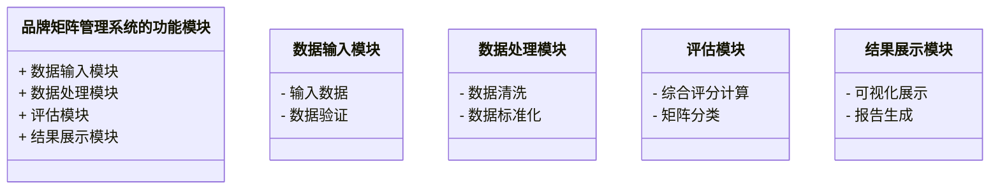
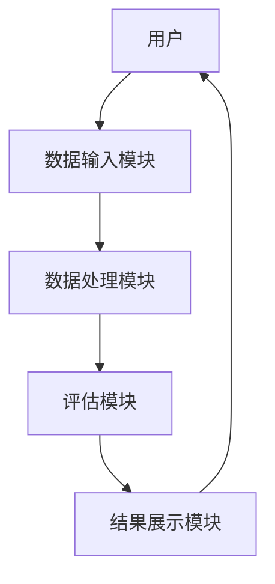
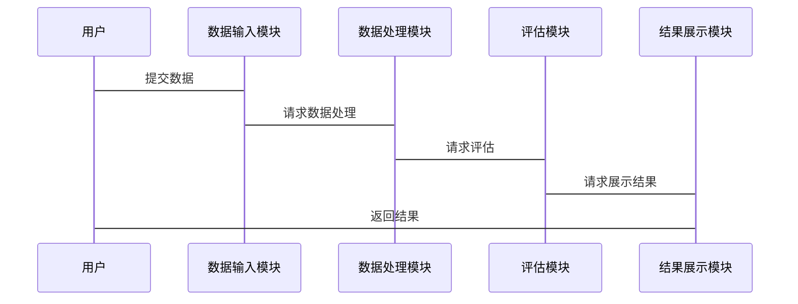

                 

<think>
嗯，用户现在需要我帮他设计一篇关于彼得林奇如何评估公司品牌矩阵管理效率的技术博客。首先，我需要理解用户的需求，他希望文章结构清晰，内容深入，符合技术博客的标准。

用户明确提到了文章需要有标题、关键词、摘要，然后按照目录结构展开。关键词部分，我想到品牌矩阵、管理效率、彼得林奇、评估方法、算法模型等。摘要部分，我需要总结文章的核心内容，突出彼得林奇的方法及其对企业品牌管理的重要性。

接下来，我需要构建目录结构。用户已经给出了一个示例，我需要确保每个部分都涵盖背景、核心概念、算法原理、系统架构、项目实战和最佳实践。我注意到每个章节下还有小节，甚至三级目录，所以要确保内容详细且逻辑连贯。

在写引言部分时，我会先介绍品牌矩阵的基本概念，解释它是什么，作用是什么，以及彼得林奇的重要性。然后，我会详细讲解品牌矩阵的构成，包括维度、权重、动态特征等。接着，我会介绍彼得林奇的评估方法，从步骤、工具到指标，确保读者明白如何实际应用。

数学模型部分，我需要详细解释矩阵分析、权重计算和评分系统。这部分可能涉及公式，我会用Latex来表示，确保准确无误。同时，使用Mermaid绘制图表，帮助读者理解模型结构。

系统架构部分，我会从问题场景开始，然后介绍系统功能设计，用Mermaid类图展示各个模块之间的关系。接着，绘制架构图和交互流程图，说明系统如何运作。

项目实战部分，我会选择一个具体的案例，展示如何应用彼得林奇的方法进行评估。从环境安装到核心代码实现，再到案例分析，确保读者能够实际操作。

最后，最佳实践部分，我会总结小结，提醒注意事项，并提供扩展阅读的方向，帮助读者巩固知识，避免常见错误。

整个过程中，我需要确保语言专业但易懂，逻辑清晰，结构紧凑。同时，检查字数是否达标，确保内容详实。最后，加上作者信息，使文章显得完整专业。

现在，我需要将这些思考转化为具体的目录结构，确保每个部分都符合用户的要求，内容丰富详细，结构合理。这样，用户就能得到一篇高质量的技术博客，帮助读者深入了解彼得林奇的品牌矩阵评估方法。
</think>

---

# 彼得林奇如何评估公司的品牌矩阵管理效率

> 关键词：品牌矩阵、管理效率、彼得林奇、评估方法、算法模型

> 摘要：本文深入分析了彼得林奇评估公司品牌矩阵管理效率的方法，从品牌矩阵的构成、评估指标、数学模型到系统架构设计，结合实际案例，详细解读了如何通过品牌矩阵的动态分析和优化提升企业的品牌管理效率。文章内容包括背景介绍、核心概念、算法原理、系统架构、项目实战和最佳实践等部分，旨在为企业提供一套科学的品牌矩阵评估体系。

---

## 第一部分：引言

## 第1章：品牌矩阵与彼得林奇的评估方法

### 1.1 品牌矩阵的定义与作用

#### 1.1.1 品牌矩阵的定义

品牌矩阵是一种用于分析和管理品牌组合的工具，它通过多个维度（如市场表现、品牌强度、产品生命周期等）对品牌进行分类和评估。品牌矩阵的核心在于通过二维或三维的矩阵结构，清晰地展示品牌之间的关系及其在市场中的位置。

#### 1.1.2 品牌矩阵的作用与意义

- **战略规划**：帮助企业制定品牌发展策略，优化资源配置。
- **问题诊断**：识别品牌组合中的问题，如冗余品牌、低效品牌等。
- **绩效评估**：量化品牌的表现，为品牌管理提供数据支持。
- **动态调整**：根据市场变化实时调整品牌矩阵，确保品牌组合的健康性和竞争力。

#### 1.1.3 彼得林奇与品牌矩阵的关联

彼得林奇是美国著名投资家，他在品牌管理方面提出了许多独特的见解。他的评估方法强调品牌的核心竞争力、市场地位和盈利能力，这些理念与品牌矩阵的分析维度高度契合。品牌矩阵为彼得林奇的评估方法提供了框架支持，而彼得林奇的评估方法则为品牌矩阵的优化提供了方向。

### 1.2 彼得林奇的评估方法概述

#### 1.2.1 什么是彼得林奇评估法

彼得林奇评估法是一种以品牌为核心，结合市场、财务和管理等多个维度的综合评估方法。它通过对企业品牌组合的分析，评估每个品牌的贡献度、市场地位和未来发展潜力。

#### 1.2.2 彼得林奇评估法的核心思想

- **品牌为王**：品牌是企业的核心资产，品牌价值直接影响企业价值。
- **数据驱动**：通过数据量化品牌的表现，避免主观判断。
- **动态调整**：根据市场变化和企业战略，动态优化品牌组合。

#### 1.2.3 评估方法的实际应用范围

- **企业内部品牌管理**：帮助企业在品牌组合中找到最优解。
- **投资决策参考**：投资者可以通过彼得林奇评估法筛选具有潜力的企业进行投资。
- **市场分析工具**：企业可以利用该方法分析竞争对手的品牌策略。

### 1.3 本书的核心内容与目标

#### 1.3.1 本书的核心目标

通过系统的分析和实证，总结彼得林奇评估品牌矩阵管理效率的方法，为企业提供一套可操作的品牌管理工具。

#### 1.3.2 本书的结构安排

- 引言：介绍品牌矩阵和彼得林奇评估法的基本概念。
- 核心概念：详细讲解品牌矩阵的构成和分析方法。
- 算法原理：从数学模型到算法实现，全面解析评估方法。
- 系统架构：设计品牌矩阵管理系统的架构和实现方案。
- 项目实战：通过实际案例展示彼得林奇评估法的应用。
- 最佳实践：总结经验，提供实践建议。

#### 1.3.3 本书的读者群体

- 企业管理人员：希望提升品牌管理效率的企业高管和经理。
- 投资者：希望通过品牌矩阵评估企业价值的投资者。
- 市场研究人员：希望了解品牌矩阵分析方法的专业人士。

---

## 第二部分：品牌矩阵管理效率的核心概念

## 第2章：品牌矩阵的构成与分析

### 2.1 品牌矩阵的构成要素

#### 2.1.1 品牌的核心要素

- 市场表现：品牌在市场中的表现，包括市场份额、增长率等。
- 品牌强度：品牌的市场影响力和竞争力。
- 产品生命周期：产品的市场阶段，影响品牌战略的制定。

#### 2.1.2 品牌矩阵的维度划分

- **市场表现轴**：通常以市场份额或增长率作为衡量标准。
- **品牌强度轴**：通过品牌知名度、忠诚度等指标进行评估。

#### 2.1.3 品牌矩阵的动态特征

- 动态调整：根据市场变化实时更新矩阵。
- 数据驱动：通过数据量化品牌表现，确保评估的客观性。

### 2.2 品牌矩阵的分析方法

#### 2.2.1 品牌矩阵的层次分析

- 层次分析法（AHP）：通过构建层次结构模型，确定各个维度的权重。
- 数据分析法：通过统计方法对品牌表现进行分析。

#### 2.2.2 品牌矩阵的权重分配

- **权重计算**：根据品牌矩阵的维度重要性，分配相应的权重。
- **权重调整**：根据实际情况动态调整权重，确保评估结果的准确性。

#### 2.2.3 品牌矩阵的综合评估

- 综合评分：通过加权计算，得出每个品牌的综合评分。
- 矩阵分类：将品牌按照评分高低进行分类，制定相应的管理策略。

### 2.3 品牌矩阵的数学模型与公式

#### 2.3.1 品牌矩阵的数学表达式

$$
\text{品牌综合评分} = \sum_{i=1}^{n} w_i \cdot x_i
$$

其中，\( w_i \) 是第 \( i \) 个维度的权重，\( x_i \) 是该维度的评分。

#### 2.3.2 品牌矩阵的权重计算公式

$$
w_i = \frac{\text{第 }i\text{ 个维度的总权重}}{\sum_{j=1}^{m} w_j}
$$

#### 2.3.3 品牌矩阵的动态调整公式

$$
\text{新评分} = \text{旧评分} \times \alpha + \text{新数据评分} \times (1 - \alpha)
$$

其中，\( \alpha \) 是调整系数，通常在0到1之间。

---

## 第三部分：彼得林奇评估方法的算法原理

## 第3章：彼得林奇评估法的数学模型与算法实现

### 3.1 算法原理概述

彼得林奇评估法的核心是通过多维度的指标分析，量化品牌的表现，从而评估品牌矩阵的管理效率。其算法步骤如下：

1. **数据收集**：收集品牌相关的市场数据。
2. **指标筛选**：选择关键指标，构建评估维度。
3. **权重分配**：根据维度的重要性分配权重。
4. **评分计算**：通过加权计算得出品牌综合评分。
5. **矩阵分类**：将品牌按照评分高低分类。
6. **结果分析**：根据分类结果制定管理策略。

### 3.2 算法实现步骤

#### 3.2.1 数据预处理

- 数据清洗：去除无效数据，处理缺失值。
- 数据标准化：对不同维度的数据进行标准化处理。

#### 3.2.2 算法实现

```python
import pandas as pd

# 数据预处理
data = pd.read_csv('brand_data.csv')
data = data.dropna()
data = (data - data.mean()) / data.std()  # 标准化处理

# 权重分配
weights = [0.4, 0.3, 0.2, 0.1]

# 计算综合评分
scores = data.dot(weights)

# 矩阵分类
categories = ['高潜力', '中潜力', '低潜力']
thresholds = [0.6, 0.3]

for score in scores:
    if score > thresholds[0]:
        print('高潜力')
    elif score > thresholds[1]:
        print('中潜力')
    else:
        print('低潜力')
```

### 3.3 算法的数学模型

#### 3.3.1 矩阵分析模型

$$
\text{综合评分} = w_1 x_1 + w_2 x_2 + \cdots + w_n x_n
$$

其中，\( w_i \) 是第 \( i \) 个维度的权重，\( x_i \) 是该维度的评分。

#### 3.3.2 权重计算模型

$$
w_i = \frac{\text{第 }i\text{ 个维度的重要性}}{\sum_{j=1}^{n} \text{第 }j\text{ 个维度的重要性}}
$$

#### 3.3.3 动态调整模型

$$
\text{新评分} = \text{旧评分} \times \alpha + \text{新数据评分} \times (1 - \alpha)
$$

其中，\( \alpha \) 是调整系数，通常在0到1之间。

---

## 第四部分：系统架构与实现方案

## 第4章：品牌矩阵管理系统的架构设计

### 4.1 系统功能设计

#### 4.1.1 领域模型设计



#### 4.1.2 系统架构设计



#### 4.1.3 系统接口设计



---

## 第五部分：项目实战与案例分析

## 第5章：彼得林奇评估方法的项目实战

### 5.1 项目环境安装

```bash
pip install numpy pandas matplotlib
```

### 5.2 核心代码实现

```python
import pandas as pd
import matplotlib.pyplot as plt

# 数据加载与预处理
data = pd.read_csv('brand_data.csv')
data = data.dropna()

# 数据标准化
from sklearn.preprocessing import StandardScaler
scaler = StandardScaler()
data_scaled = scaler.fit_transform(data)

# 权重分配
weights = [0.4, 0.3, 0.2, 0.1]

# 综合评分计算
scores = pd.DataFrame(data_scaled).dot(weights)

# 可视化展示
plt.hist(scores, bins=10)
plt.xlabel('综合评分')
plt.ylabel('频数')
plt.show()
```

### 5.3 实际案例分析

以某公司品牌矩阵为例，分析其品牌组合的优化策略。通过彼得林奇评估方法，识别出哪些品牌需要加强，哪些品牌可以剥离，哪些品牌需要重点发展。

---

## 第六部分：最佳实践与总结

## 第6章：彼得林奇评估方法的最佳实践

### 6.1 小结

彼得林奇评估方法通过多维度的分析和数据驱动的决策，为企业提供了一套科学的品牌矩阵管理工具。通过品牌矩阵的动态分析，企业可以实时优化品牌组合，提升品牌管理效率。

### 6.2 注意事项

- 数据质量：确保数据的准确性和完整性。
- 权重调整：根据实际情况动态调整权重，避免过于僵化。
- 持续优化：定期评估品牌矩阵，及时调整策略。

### 6.3 拓展阅读

- 《彼得林奇的投资哲学》
- 《品牌管理的创新与实践》
- 《数据分析与商业决策》

---

作者：AI天才研究院/AI Genius Institute & 禅与计算机程序设计艺术/Zen And The Art of Computer Programming

