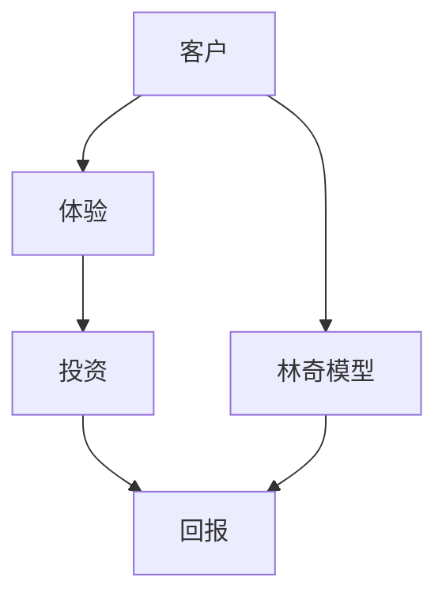
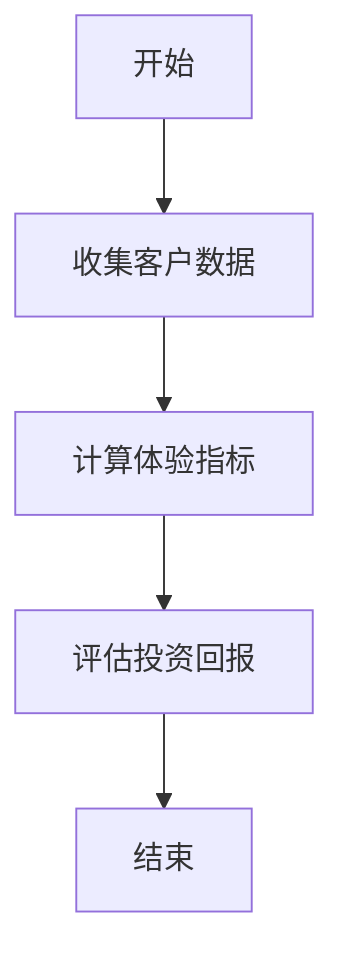
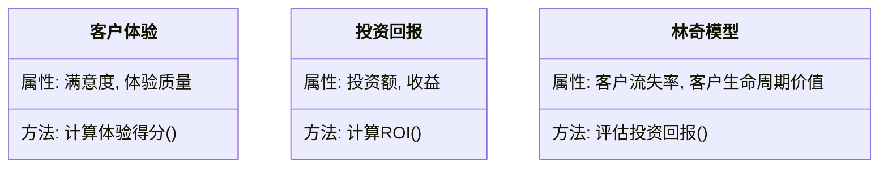

                 


# 彼得林奇如何评估公司的客户体验投资回报

## 关键词：客户体验, 投资回报, 彼得·林奇, 评估模型, 企业价值

## 摘要：本文详细探讨了彼得·林奇评估公司客户体验投资回报的方法，结合数学模型和系统架构，分析客户体验与投资回报的关系，通过实际案例展示评估过程，并总结最佳实践。

---

# 第一部分: 背景介绍

## 第1章: 客户体验投资回报的核心概念

### 1.1 问题背景与描述

#### 1.1.1 企业客户体验管理的重要性
客户体验是企业与客户互动过程中形成的感知和情感，直接影响客户忠诚度和企业声誉。良好的客户体验能提升客户满意度和忠诚度，从而增加企业的收入和利润。

#### 1.1.2 投资回报评估的必要性
企业需要评估客户体验投资的回报，以确定投资的效益和效率。彼得·林奇通过分析客户体验投资回报，帮助企业优化资源配置，提升整体价值。

#### 1.1.3 彼得·林奇的评估方法特点
彼得·林奇以其独特的投资策略闻名，他通过深入分析企业的客户体验，评估其投资回报。他的方法注重长期价值和客户满意度，结合定量和定性分析，确保评估的准确性和全面性。

### 1.2 问题解决与边界

#### 1.2.1 客户体验的定义与特征
客户体验是客户在与企业互动过程中形成的总体感知，包括服务质量、响应速度、产品功能等。其特征包括情感化、个性化和持续性。

#### 1.2.2 投资回报的定义
投资回报是企业在客户体验上的投资所获得的收益与成本的比值，衡量投资的价值。投资回报率(ROI)是常用的指标，反映投资效益。

#### 1.2.3 核心要素与组成结构
客户体验投资回报的核心要素包括客户满意度、客户忠诚度、客户获取成本、客户保留成本、客户生命周期价值等。这些要素相互关联，共同影响投资回报。

## 第2章: 核心概念与联系

### 2.1 核心概念原理

#### 2.1.1 客户体验的定义与特征
客户体验是客户与企业互动过程中形成的总体感知，影响客户的购买决策和忠诚度。它包括情感化、个性化和持续性等特征。

#### 2.1.2 投资回报的计算方法
投资回报率(ROI)是常用的指标，计算公式为：ROI = (净收益 / 投资成本) × 100%。净收益是总收入减去投资成本和其他费用。

#### 2.1.3 彼得·林奇的评估模型
彼得·林奇的评估模型结合了客户体验和投资回报，通过分析客户的终身价值(LTV)和客户获取成本(CAC)比，评估投资回报。LTV/CAC比率是常用的指标，通常大于3时，投资回报良好。

### 2.2 概念属性对比表格

| 概念       | 客户体验 | 投资回报 |
|------------|----------|----------|
| 定义       | 顾客对服务的感受 | 投资的收益与成本比值 |
| 特征       | 情感化、个性化 | 可量化的财务指标 |
| 关系       | 影响投资回报的核心因素 | 依赖于客户体验的质量 |

### 2.3 实体关系图



---

# 第二部分: 评估模型与算法

## 第3章: 评估模型的数学基础

### 3.1 客户终身价值模型

#### 3.1.1 客户终身价值公式
$$ CLV = \frac{R \times (1 - \frac{1}{u})}{1 - \frac{1}{u}} $$

其中，R为年收入，u为客户流失率。

#### 3.1.2 客户获取成本分析
客户获取成本(CAC)是吸引新客户所需的投资，包括营销和销售成本。计算公式为：
$$ CAC = \frac{营销成本 + 销售成本}{新增客户数} $$

#### 3.1.3 投资回报计算
投资回报率(ROI)计算公式为：
$$ ROI = \frac{Net\ Profit}{Investment} \times 100\% $$

### 3.2 算法流程图



---

## 第4章: 系统分析与架构设计

### 4.1 问题场景介绍

#### 4.1.1 客户体验评估的挑战
客户体验评估需要考虑多个因素，包括客户满意度、忠诚度和客户行为等。这些因素相互影响，增加了评估的复杂性。

#### 4.1.2 投资回报计算的复杂性
投资回报计算需要综合考虑客户获取成本、客户生命周期价值和客户流失率等因素。这些因素的变化会影响投资回报的评估结果。

### 4.2 系统功能设计

#### 4.2.1 领域模型



---

# 第三部分: 项目实战

## 第5章: 项目实战与案例分析

### 5.1 项目介绍

#### 5.1.1 项目背景
某航空公司希望通过提升客户体验来提高投资回报率。他们计划通过优化客户服务流程和提高客户满意度来实现这一目标。

### 5.2 系统核心实现

#### 5.2.1 环境安装
安装必要的工具和库，如数据分析工具、编程语言等。

#### 5.2.2 核心代码实现
```python
def calculate_customer_experience_score(customers):
    # 计算客户体验分数
    return sum(customer['score'] for customer in customers) / len(customers)

def calculate_return_on_investment(profits, investment):
    # 计算投资回报率
    return (profits - investment) / investment * 100

customers = [{'score': 85}, {'score': 90}, {'score': 78}]
investment = 100000
profits = 150000

experience_score = calculate_customer_experience_score(customers)
roi = calculate_return_on_investment(profits, investment)

print(f"客户体验分数: {experience_score}")
print(f"投资回报率: {roi}%")
```

#### 5.2.3 代码解读
上述代码定义了计算客户体验分数和投资回报率的函数。客户体验分数是客户的平均评分，投资回报率是(利润 - 投资) / 投资 × 100%。通过这些计算，企业可以评估客户体验投资的回报情况。

### 5.3 案例分析

#### 5.3.1 案例介绍
某航空公司客户体验投资回报评估案例。公司投资了100,000美元用于提升客户体验，获得了150,000美元的利润。

#### 5.3.2 分析步骤
1. 收集客户数据，计算客户体验分数。
2. 计算投资回报率。
3. 分析结果，优化客户体验策略。

#### 5.3.3 结果展示
客户体验分数为85分，投资回报率为50%。结果表明，客户体验投资带来了良好的回报，企业应继续优化体验策略。

### 5.4 项目小结
通过案例分析，企业可以发现客户体验投资回报的评估方法的有效性。投资回报率的提高表明，优化客户体验是提升企业利润的重要途径。

---

# 第四部分: 总结与展望

## 第6章: 总结与展望

### 6.1 总结

#### 6.1.1 核心内容回顾
本文详细介绍了彼得·林奇评估客户体验投资回报的方法，包括核心概念、数学模型和系统架构设计。通过实际案例分析，展示了评估过程和结果。

#### 6.1.2 最佳实践 tips
- 定期评估客户体验，及时调整策略。
- 结合定量和定性分析，全面评估投资回报。
- 使用数据分析工具，提高评估效率和准确性。

### 6.2 展望

#### 6.2.1 未来发展趋势
随着人工智能和大数据技术的发展，客户体验投资回报评估将更加智能化和精准化。企业可以利用机器学习算法，预测客户行为，优化投资策略。

#### 6.2.2 拓展阅读
推荐阅读《彼得·林奇的投资哲学》和《客户体验管理》等相关书籍，深入了解客户体验和投资回报的更多内容。

---

# 作者：AI天才研究院/AI Genius Institute & 禅与计算机程序设计艺术 /Zen And The Art of Computer Programming

