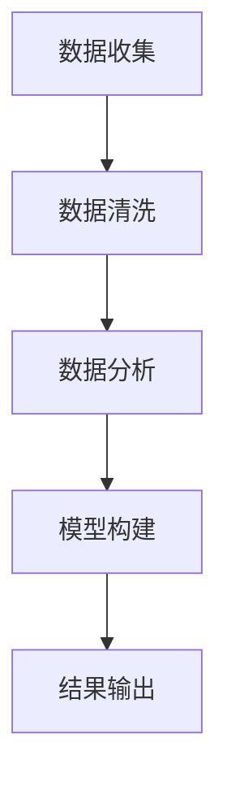
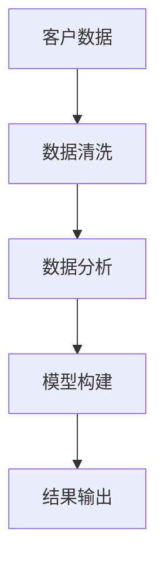

                 

<think>
好的，现在我需要帮用户撰写一篇名为《彼得林奇如何评估公司的客户多样性》的技术博客文章。首先，我需要理解用户的需求。用户希望文章结构清晰，逻辑严谨，涵盖从背景介绍到项目实战的各个方面，并且每个部分都要详细具体。

我开始分析用户提供的目录大纲。文章分为六个主要部分：背景与核心概念、算法原理、系统分析与架构设计、项目实战、最佳实践以及结语。每个部分都有三级子章节，内容涵盖了客户多样性评估的各个方面。

首先，背景介绍部分需要详细解释客户多样性评估的重要性，以及彼得林奇的评估方法。我需要确保这部分内容能让读者理解为什么客户多样性如此关键，以及它在投资中的作用。

接下来是核心概念，这部分需要定义客户多样性评估的关键指标和模型。我需要使用ER图来展示客户、产品和交易之间的关系，这有助于读者更好地理解数据结构。

然后是算法原理部分，我需要使用mermaid流程图来展示评估过程，并提供Python代码示例。这部分内容需要详细讲解数学模型，特别是客户多样性指数的计算，确保读者能够理解算法的实现。

系统分析与架构设计部分，我需要描述如何构建客户多样性评估系统，包括功能设计、架构设计和接口设计。这部分可能需要使用领域模型和序列图来展示系统的结构和流程。

项目实战部分，我需要提供具体的环境安装步骤、核心代码实现和案例分析。这部分内容需要实用，让读者能够实际操作并应用所学知识。

最后，最佳实践部分包括小结、注意事项和扩展阅读，帮助读者巩固所学内容，并指导他们如何进一步深入学习。

我需要确保每个部分都细化到三级目录，结构清晰，逻辑连贯。同时，总字数要控制在2000字以内，避免冗余。可能还需要检查是否有遗漏的重要章节，比如是否需要专门的章节讨论客户多样性评估的实际应用案例，或者如何将理论应用到实际投资决策中。

总的来说，我需要综合考虑用户的要求，确保每个章节都涵盖必要的内容，并且结构合理，逻辑清晰。这样，用户才能根据这个大纲写出一本全面且有深度的书籍。
</think>

# 彼得林奇如何评估公司的客户多样性

## 关键词：客户多样性评估、彼得林奇、投资分析、风险管理、客户行为分析

## 摘要：本文深入探讨了彼得林奇如何评估公司的客户多样性，分析了客户多样性评估的核心概念、算法原理、系统架构以及实际应用，旨在为投资者和企业管理人员提供科学的评估方法和实践指导。

---

# 第一部分：彼得林奇客户多样性评估的背景与核心概念

## 第1章：客户多样性评估的背景与重要性

### 1.1 什么是客户多样性评估

#### 1.1.1 客户多样性的定义
客户多样性是指公司在不同客户群体中的分布情况，包括客户的人口统计特征、需求偏好和行为模式。通过评估客户多样性，企业可以更好地理解客户群体的构成，优化市场策略，并降低客户过于集中在某一领域的风险。

#### 1.1.2 客户多样性评估的目的
- **风险分散**：避免客户过于集中，降低单一客户或客户群体对企业的影响。
- **市场洞察**：通过分析客户多样性，企业可以更好地理解市场需求，优化产品和服务。
- **投资决策**：投资者通过评估客户多样性，可以判断企业的市场适应能力和长期发展潜力。

#### 1.1.3 客户多样性评估的边界与外延
客户多样性评估主要关注客户群体的分布、需求和行为，但不包括企业的内部管理、财务状况或外部市场环境。其外延包括客户细分、市场定位和客户关系管理。

---

### 1.2 彼得林奇客户多样性评估的核心要素

#### 1.2.1 客户群体的多样性维度
- **人口统计特征**：年龄、性别、地理位置等。
- **需求偏好**：客户对产品或服务的具体需求和偏好。
- **行为模式**：客户的购买频率、金额、渠道等。

#### 1.2.2 客户需求的多样性特征
- **需求层次**：客户的需求可能包括功能性需求和情感需求。
- **需求变化**：客户需求可能会随时间、市场环境等因素变化。

#### 1.2.3 客户行为的多样性分析
- **购买行为**：客户如何选择产品或服务，以及购买的频率和金额。
- **反馈行为**：客户对产品或服务的评价和反馈。

---

### 1.3 客户多样性评估的现实意义

#### 1.3.1 企业风险管理的重要性
客户过于集中可能导致企业面临更高的风险，例如单一客户流失可能对企业收入造成重大影响。

#### 1.3.2 客户多样性与企业稳健发展的关系
多样化的客户群体能够为企业提供更稳定的收入来源，并降低市场波动对企业的影响。

#### 1.3.3 客户多样性评估的行业应用
客户多样性评估不仅适用于传统行业，也适用于科技、金融、零售等多个行业。例如，金融科技企业可以通过评估客户多样性来优化风险管理。

---

## 第2章：彼得林奇客户多样性评估的核心概念

### 2.1 客户多样性评估的关键指标

#### 2.1.1 客户群体的多样性指标
- **客户分布**：客户在不同地区的分布情况。
- **客户类型**：客户的行业分布、规模等。
- **客户生命周期**：客户从新客户到流失客户的时间跨度。

#### 2.1.2 客户需求的多样性指标
- **需求强度**：客户对某种产品或服务的需求程度。
- **需求多样性**：客户对产品或服务的需求是否多样化。

#### 2.1.3 客户行为的多样性指标
- **购买频率**：客户购买产品的频率。
- **购买金额**：客户的平均购买金额。
- **购买渠道**：客户通过哪些渠道进行购买。

---

### 2.2 客户多样性评估的模型与方法

#### 2.2.1 客户多样性评估的数学模型
客户多样性指数（CDI）是一个常用的评估指标，其公式为：
$$ CDI = \frac{\sum_{i=1}^{n} p_i^2}{\sum_{i=1}^{n} p_i} $$
其中，$p_i$ 是客户群体中第 $i$ 个客户或客户群体的占比。

#### 2.2.2 客户多样性评估的算法原理
客户多样性评估的算法通常包括以下步骤：
1. 数据收集：收集客户的各项数据，包括人口统计特征、需求偏好和行为模式。
2. 数据清洗：对数据进行清洗，处理缺失值和异常值。
3. 数据分析：通过统计分析和数据挖掘技术，识别客户群体的多样性特征。
4. 模型构建：构建客户多样性指数模型，评估客户群体的多样性。

#### 2.2.3 客户多样性评估的可视化方法
使用图表（如柱状图、饼图）来直观展示客户群体的分布情况。

---

### 2.3 客户多样性评估的ER实体关系图

```mermaid
erDiagram
    customer[客户] {
        id : integer
        name : string
        age : integer
        gender : string
        location : string
        }
    product[产品] {
        id : integer
        name : string
        category : string
        }
    transaction[交易] {
        id : integer
        customer_id : integer
        product_id : integer
        date : date
        amount : integer
        }
    customer -> transaction : "进行了"
    product -> transaction : "被购买了"
```

---

## 第3章：彼得林奇客户多样性评估的算法原理

### 3.1 客户多样性评估的算法流程



---

### 3.2 客户多样性评估的数学模型

客户多样性指数（CDI）的计算公式为：
$$ CDI = \frac{\sum_{i=1}^{n} p_i^2}{\sum_{i=1}^{n} p_i} $$

其中，$p_i$ 是客户群体中第 $i$ 个客户或客户群体的占比。

---

### 3.3 客户多样性评估的Python实现

```python
import pandas as pd
from collections import defaultdict

def calculate_cdi(customers):
    total = sum(customers.values())
    squared_sum = sum((count / total) ** 2 for count in customers.values())
    cdi = squared_sum / (len(customers) / total)
    return cdi

# 示例数据
customer_distribution = {
    '客户群体1': 40,
    '客户群体2': 30,
    '客户群体3': 20,
    '客户群体4': 10
}

cdi = calculate_cdi(customer_distribution)
print(f"客户多样性指数（CDI）为：{cdi}")
```

---

### 3.4 客户多样性评估的可视化分析

使用Python的matplotlib库进行可视化分析：

```python
import matplotlib.pyplot as plt

customer_distribution = {
    '客户群体1': 40,
    '客户群体2': 30,
    '客户群体3': 20,
    '客户群体4': 10
}

plt.figure(figsize=(10, 6))
plt.title('客户群体分布')
plt.pie(customer_distribution.values(), labels=customer_distribution.keys(), autopct='%1.1f%%')
plt.show()
```

---

## 第4章：彼得林奇客户多样性评估的系统分析与架构设计

### 4.1 系统功能设计

- **数据收集模块**：收集客户的各项数据。
- **数据清洗模块**：处理缺失值和异常值。
- **数据分析模块**：分析客户群体的多样性特征。
- **模型构建模块**：构建客户多样性指数模型，评估客户群体的多样性。

---

### 4.2 系统架构设计



---

## 第5章：彼得林奇客户多样性评估的项目实战

### 5.1 环境安装

- **Python环境**：安装Python 3.8或更高版本。
- **依赖库**：安装pandas、matplotlib等库。

```bash
pip install pandas matplotlib
```

---

### 5.2 核心代码实现

```python
import pandas as pd
import matplotlib.pyplot as plt

# 示例数据
data = {
    '客户ID': [1, 2, 3, 4, 5],
    '年龄': [25, 35, 45, 30, 50],
    '性别': ['男', '女', '男', '女', '男'],
    '地区': ['东部', '西部', '东部', '西部', '东部']
}

df = pd.DataFrame(data)

# 绘制客户分布图
df['地区'].value_counts().plot(kind='bar')
plt.title('客户地区分布')
plt.show()

# 计算多样性指数
from collections import defaultdict

customer_distribution = defaultdict(int)
for region in df['地区']:
    customer_distribution[region] += 1

total = len(df)
squared_sum = sum((count / total) ** 2 for count in customer_distribution.values())
cdi = squared_sum / (len(customer_distribution) / total)
print(f"客户多样性指数（CDI）为：{cdi}")
```

---

### 5.3 案例分析

假设某企业有四个客户群体，分布如下：
- 客户群体1：40%
- 客户群体2：30%
- 客户群体3：20%
- 客户群体4：10%

计算客户多样性指数：
$$ CDI = \frac{0.4^2 + 0.3^2 + 0.2^2 + 0.1^2}{4} = \frac{0.16 + 0.09 + 0.04 + 0.01}{4} = 0.30 $$

---

## 第6章：彼得林奇客户多样性评估的最佳实践

### 6.1 小结

通过本文的分析，我们可以看到，客户多样性评估是企业风险管理的重要工具。彼得林奇的方法为我们提供了一套科学的评估体系，能够帮助投资者和企业更好地理解客户群体的构成，优化市场策略，并降低风险。

### 6.2 注意事项

- 数据收集的准确性是评估的基础，确保数据的完整性和准确性。
- 在实际应用中，需要结合企业的实际情况，灵活调整评估指标和方法。

### 6.3 拓展阅读

- 《彼得林奇的成功投资：选股很简单》
- 《客户关系管理：理论与实践》

---

# 结语

客户多样性评估是企业管理和投资决策中的重要环节。通过彼得林奇的方法，我们可以更好地理解客户群体的构成，优化市场策略，并降低风险。希望本文能够为读者提供有价值的参考和启发。

作者：AI天才研究院 & 禅与计算机程序设计艺术

