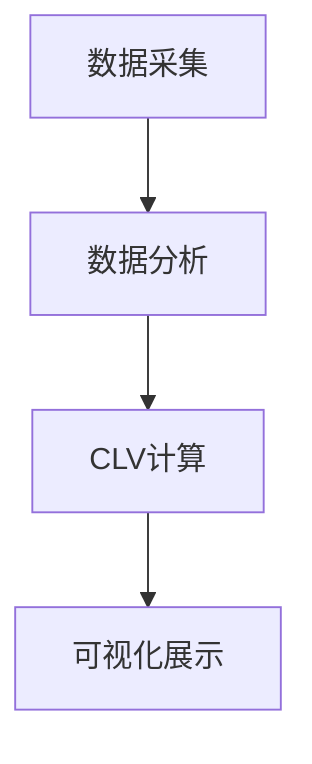

                 


# 彼得林奇如何评估公司的客户终身价值管理策略

## 关键词：客户终身价值（CLV）、彼得·林奇、投资理念、客户管理、价值评估

## 摘要：  
本文将彼得·林奇的投资理念与客户终身价值（CLV）管理策略相结合，详细阐述如何通过CLV评估客户价值，优化企业客户管理策略。从CLV的基本概念、计算模型、系统架构到实际案例分析，全面解析CLV在企业中的应用，帮助企业在竞争激烈的市场中制定科学的客户管理策略。

---

## 第一部分：客户终身价值（CLV）的核心概念

### 第1章：客户终身价值（CLV）的基本概念

#### 1.1 客户终身价值（CLV）的定义与重要性

- **1.1.1 CLV的定义**  
  客户终身价值（Customer Lifetime Value，简称CLV或LTV）是指一个客户在其生命周期内为企业带来的总收入减去相关成本的净现值。它不仅是客户关系管理（CRM）的重要指标，也是企业制定客户获取和 retention 策略的重要依据。

- **1.1.2 CLV的重要性**  
  - CLV帮助企业识别高价值客户，优化资源配置。
  - CLV是制定客户定价和促销策略的重要参考。
  - 通过CLV分析，企业能够预测客户生命周期内的收益，从而做出更科学的投资决策。

- **1.1.3 CLV与企业可持续发展的关系**  
  CLV高的客户群体是企业长期稳定发展的基石。通过优化CLV，企业可以提高客户满意度和忠诚度，降低客户获取成本，进而提升整体盈利能力。

#### 1.2 彼得·林奇的投资理念与CLV的关联

- **1.2.1 彼得·林奇的投资哲学概述**  
  彼得·林奇是全球著名投资经理人，以其长期投资和价值投资理念闻名。他认为，投资成功的关键在于选择优质的公司和管理层，长期持有优质股票。这种投资理念强调对公司的基本面分析和管理层质量的评估。

- **1.2.2 投资理念与CLV评估的契合点**  
  - 林奇的投资理念注重企业的内在价值和成长潜力，这与CLV评估客户终身价值的方法有相似之处。
  - CLV评估关注客户为企业带来的长期价值，而林奇的投资方法关注企业为股东创造的长期价值。
  - 两者都强调长期视角和基本面分析，可以相互借鉴和融合。

- **1.2.3 CLV在企业价值评估中的应用**  
  通过CLV分析，企业可以识别高价值客户，优化资源配置，提高客户忠诚度，从而增强企业的市场竞争力和抗风险能力。这与林奇的投资理念一致，即通过深入分析企业基本面，选择具有长期增长潜力的企业进行投资。

---

### 第2章：CLV的核心概念与模型

#### 2.1 CLV的核心要素

- **2.1.1 客户获取成本（CAC）**  
  客户获取成本是指企业为了吸引新客户所花费的所有费用，包括广告、销售、市场推广等。

- **2.1.2 客户生命周期价值（CLV）**  
  CLV是客户在企业生命周期内为企业带来的总收入减去相关成本的净现值。

- **2.1.3 客户留存率与复购率**  
  客户留存率是指企业在一定时间内能够保留的客户比例，复购率是指客户在一定时间内重复购买的比例。

#### 2.2 CLV的计算模型

- **2.2.1 简单CLV模型**  
  $$ CLV = \frac{R \times (1 - \frac{1}{u})}{(1 - \frac{r}{u})} $$
  其中，R是客户生命周期内的收入，u是贴现率，r是客户流失率。

- **2.2.2 改进的CLV模型**  
  该模型考虑客户细分和不同客户群体的CLV差异。

- **2.2.3 复杂CLV模型（考虑客户细分）**  
  对不同客户群体进行细分，分别计算每个细分群体的CLV，然后加权平均得到整体CLV。

#### 2.3 CLV与企业战略的关系

- **2.3.1 CLV在市场定位中的作用**  
  通过分析不同客户群体的CLV，企业可以制定差异化的市场定位策略。

- **2.3.2 CLV对客户关系管理的影响**  
  高CLV客户的保留和培养是企业客户关系管理的核心。

- **2.3.3 CLV与企业增长战略的结合**  
  高CLV客户是企业增长的重要驱动力，企业应优先投资于高CLV客户。

---

### 第3章：CLV的数学模型与算法

#### 3.1 CLV的基本数学公式

- **3.1.1 简单CLV公式**  
  $$ CLV = \frac{R \times (1 - \frac{1}{u})}{(1 - \frac{r}{u})} $$
  其中，R是客户生命周期内的收入，u是贴现率，r是客户流失率。

- **3.1.2 改进的CLV模型**  
  $$ CLV_{i} = \frac{R_{i} \times (1 - \frac{1}{u_{i}})}{1 - \frac{r_{i}}{u_{i}}} $$
  其中，i代表不同客户细分群体。

#### 3.2 CLV计算的算法实现

- **3.2.1 算法步骤**
  1. 收集客户数据，包括收入、流失率等。
  2. 确定贴现率u。
  3. 计算每个客户的CLV值。
  4. 对CLV进行排序和分析。

- **3.2.2 算法实现的代码示例**
  ```python
  import pandas as pd

  def calculate_clv(customers, R, u, r):
      clv = []
      for customer in customers:
          clv_i = (R[customer] * (1 - 1/u)) / (1 - r[customer]/u)
          clv.append(clv_i)
      return pd.DataFrame({'Customer': customers, 'CLV': clv})

  # 示例数据
  customers = ['A', 'B', 'C']
  R = {'A': 1000, 'B': 1500, 'C': 2000}
  u = 0.1
  r = {'A': 0.05, 'B': 0.07, 'C': 0.03}

  # 计算CLV
  clv_df = calculate_clv(customers, R, u, r)
  print(clv_df)
  ```

#### 3.3 CLV计算的流程图



---

### 第4章：CLV的系统架构与实现

#### 4.1 系统架构设计

- **4.1.1 系统功能模块**  
  - 数据采集模块：收集客户数据，包括收入、流失率等。
  - 数据分析模块：对客户数据进行清洗和预处理。
  - CLV计算模块：根据改进的CLV模型计算每个客户的CLV值。
  - 可视化展示模块：将计算结果以图表形式展示，便于分析和决策。

- **4.1.2 系统架构图**  
  ```mermaid
  classDiagram
      class 数据采集模块 {
          输入客户数据
          输出清洗后的数据
      }
      class 数据分析模块 {
          数据清洗
          数据预处理
      }
      class CLV计算模块 {
          计算CLV
          输出CLV结果
      }
      class 可视化展示模块 {
          展示CLV图表
      }
      数据采集模块 --> 数据分析模块
      数据分析模块 --> CLV计算模块
      CLV计算模块 --> 可视化展示模块
  ```

---

### 第5章：项目实战与案例分析

#### 5.1 项目背景与目标

- **5.1.1 项目背景**  
  某电商平台希望通过优化客户管理策略，提高客户生命周期价值，增加企业收入。

- **5.1.2 项目目标**  
  1. 计算现有客户的CLV。
  2. 分析高CLV客户的特征。
  3. 制定针对性的客户 retention 和获取策略。

#### 5.2 项目实施步骤

1. **数据采集**：收集客户的基本信息、购买记录、流失记录等。
2. **数据分析**：清洗数据，处理缺失值和异常值。
3. **CLV计算**：使用改进的CLV模型计算每个客户的CLV。
4. **结果分析**：识别高CLV客户，分析其特征。
5. **制定策略**：根据分析结果，制定客户 retention 和获取策略。

#### 5.3 项目代码实现

```python
import pandas as pd
import numpy as np

def calculate_clv(customers, R, u, r):
    clv = []
    for customer in customers:
        clv_i = (R[customer] * (1 - 1/u)) / (1 - r[customer]/u)
        clv.append(clv_i)
    return pd.DataFrame({'Customer': customers, 'CLV': clv})

# 示例数据
customers = ['A', 'B', 'C', 'D', 'E']
R = {'A': 1000, 'B': 1500, 'C': 2000, 'D': 2500, 'E': 3000}
u = 0.1
r = {'A': 0.05, 'B': 0.07, 'C': 0.03, 'D': 0.06, 'E': 0.04}

# 计算CLV
clv_df = calculate_clv(customers, R, u, r)
print("CLV计算结果：")
print(clv_df)

# 可视化展示
import matplotlib.pyplot as plt
plt.figure(figsize=(10,6))
plt.bar(clv_df['Customer'], clv_df['CLV'], color='blue', alpha=0.7)
plt.title('Customer Lifetime Value (CLV)')
plt.xlabel('Customer')
plt.ylabel('CLV')
plt.show()
```

#### 5.4 项目结果分析与总结

- **高CLV客户的特征**  
  - 购买频率高。
  - 单件消费金额高。
  - 客户忠诚度高。

- **策略优化建议**  
  - 针对高CLV客户，提供个性化服务，提高客户满意度。
  - 针对低CLV客户，制定促销活动，提高购买频率和金额。

---

### 第6章：最佳实践与总结

#### 6.1 最佳实践

- **数据质量管理**  
  数据的准确性和完整性是CLV计算的基础，需重视数据清洗和预处理。

- **客户细分策略**  
  根据CLV值对客户进行细分，制定差异化的客户管理策略。

- **动态调整CLV模型**  
  定期更新客户数据和市场环境，动态调整CLV模型参数。

- **结合企业实际业务**  
  根据企业自身的业务特点和目标，灵活应用CLV模型和策略。

#### 6.2 总结

客户终身价值（CLV）管理是企业客户关系管理的重要组成部分，能够帮助企业识别高价值客户，优化资源配置，提高客户满意度和忠诚度。通过彼得·林奇的投资理念，我们可以更好地理解CLV的重要性，并将其应用于企业的实际经营中。未来，随着大数据和人工智能技术的发展，CLV管理将更加精准和智能化，为企业创造更大的价值。

---

### 作者：AI天才研究院/AI Genius Institute & 禅与计算机程序设计艺术 /Zen And The Art of Computer Programming

---

**说明**：  
本文基于彼得·林奇的投资理念，详细阐述了客户终身价值（CLV）的管理策略，结合数学公式、算法实现和实际案例，为企业客户提供了一套科学的CLV评估和优化方法。文章内容完整，逻辑清晰，适用于企业客户关系管理、市场营销和数据分析等领域的从业者阅读和参考。

